# pandas — 표로 생각하기

> 데이터 분석 라이브러리 pandas 를 처음부터 익히는 교재다.
> 파이썬 기본 문법과 넘파이를 한 번 본 사람을 대상으로 한다.

---

## 0장. 이 교재를 읽는 방법

### 0.1 무엇이 필요한가

파이썬과 pandas 가 설치된 환경이면 된다. Jupyter Notebook 이나 Google Colab 을 쓰면 가장 편하다.

이 교재의 모든 코드는 아래 버전에서 **실제로 실행해 출력을 확인한 것**이다.

| | 버전 |
|:---|:---|
| pandas | 3.0.5 |
| numpy | 2.5.1 |
| python | 3.13.12 |
| matplotlib | 3.11.1 |
| seaborn | 0.13.2 |

pandas 는 2.x 에서 3.0 으로 넘어오며 동작이 여럿 바뀌었다. 인터넷에서 찾은 옛 코드가
이 교재와 다르게 동작하면 **부록**을 먼저 보라. 바뀐 것들을 표로 정리해 두었다.

### 0.2 실습 데이터

교재는 다음 파일을 쓴다. 코드는 파일이 **현재 폴더에 있다고** 가정한다.

| 파일 | 내용 | 크기 |
|:---|:---|:---|
| `train.csv` | 타이타닉 승객 명단 | 891행 × 12열 |
| `test.csv` | 타이타닉 (생존 여부 없음) | 418행 × 11열 |
| `gender_submission.csv` | 타이타닉 제출 예시 | 418행 × 2열 |
| `ramen-ratings.csv` | 라면 평점 | 2,580행 × 7열 |
| `abalone.csv` | 전복 측정치 | 4,177행 × 8열 |
| `housing.data` | 주택 가격 (헤더 없음) | 506행 × 14열 |
| `lab_earthquake.csv` | 지진 관측 기록 (USGS) | 467행 × 22열 |
| `seoul_temp_day.csv` | 서울 일별 기온 (기상청) — 2부 | 42,397행 × 5열 |
| `busan_rain_day.csv` | 부산 일별 강수량 (기상청) — 2부 | 43,100행 × 3열 |
| `seoul_temp.csv` | 서울 연별 기온 (기상청) — 2부 | 112행 × 5열 |
| `korea_pop.csv` | 시도별 연령별 인구 (행정안전부) — 2부 | 18행 × 310열 |
| `titanic-synthetic.csv` | 타이타닉 합성본 — `train.csv` 가 없을 때 연습 문제용. 사이트 `data/` 에서 받는다 | 891행 × 12열 |

### 0.3 표 출력 설정 — 먼저 이걸 실행하라

pandas 는 표가 화면보다 넓으면 컬럼을 `...` 로 줄여서 보여 준다. 그러면 교재의 출력과
여러분의 출력이 달라 보인다. **아래 세 줄을 맨 처음에 한 번 실행하면** 교재와 같은 표가 나온다.

```python
import pandas as pd

pd.set_option('display.max_columns', 30)   # 컬럼을 ... 로 줄이지 않는다
pd.set_option('display.width', 200)        # 한 줄에 넓게 펼친다
pd.set_option('display.max_colwidth', 40)  # 긴 문자열은 40자에서 줄인다
```

> 이 설정은 보기 방식만 바꾼다. 데이터나 계산 결과는 전혀 달라지지 않는다.
> 실무에서도 노트북 첫 칸에 이런 설정을 두는 것이 보통이다.

### 0.4 코드 블록에 붙은 표시

| 표시 | 뜻 |
|:---|:---|
| (없음) | 정상 코드. 그대로 실행하면 된다 |
| `# ✗` | **에러나 경고가 나는 코드.** 무엇이 잘못됐는지 보기 위해 일부러 실었다 |
| `# ⚠` | **에러도 경고도 없는데 결과가 의도와 다른 코드.** 가장 위험한 종류다 |

`# ⚠` 를 특히 조심해서 읽어라. 프로그램이 멈춰 주면 고칠 수 있지만, 조용히 틀린 답을
내놓으면 틀린 줄도 모르고 넘어간다.

---
## 목차

- **1부. pandas**
- **1장. pandas 는 무엇을 해결하는가**
  - 1.1 리스트로 표를 다루면 무엇이 불편한가
  - 1.2 넘파이 배열로 올라가면 해결되는 것
  - 1.3 그래도 안 되는 것 — 표 데이터의 세 가지 문제
  - 1.4 Series 와 DataFrame — 인덱스를 가진 표
  - 1.5 흔한 실수 — Series 는 ndarray 를 상속하지 않는다
- **2장. 데이터를 불러오고 첫눈에 파악하기**
  - 2.1 문제 제기 — 우리가 손에 쥔 것은 파일이다
  - 2.2 read_csv — 파일을 DataFrame 으로
  - 2.3 head 와 tail — 처음 몇 줄, 마지막 몇 줄
  - 2.4 shape, columns, index, dtypes — 열지 않고 형태 파악하기
  - 2.5 info() — 데이터 건강검진표
  - 2.6 describe() — 숫자 열의 요약 통계
  - 2.7 value_counts() — 범주형 열의 값 분포
  - 2.8 흔한 실수 — 집계 전에 범주를 눈으로 확인한다
- **3장. Series — 인덱스를 가진 1차원**
  - 3.1 이게 없으면 무엇이 불편한가
  - 3.2 Series 란 무엇인가
  - 3.3 Series 생성
  - 3.4 값만 꺼내기 — `.values`, `.to_numpy()`, `.index`
  - 3.5 인덱스로 읽고 쓰기
  - 3.6 인덱스는 불변이다
  - 3.7 Series 의 이름 — `.name`
  - 3.8 흔한 실수
- **4장. DataFrame — 여러 Series 의 집합**
  - 4.1 이게 없으면 무엇이 불편한가
  - 4.2 DataFrame 이란 무엇인가
  - 4.3 DataFrame 생성 — 네 가지 경로
  - 4.4 DataFrame ↔ ndarray · list · dict
  - 4.5 구조를 보여 주는 속성들 — `.columns`, `.index`, `.dtypes`, `.T`
  - 4.6 컬럼 추가
  - 4.7 컬럼·행 삭제 — `del`, `drop`, `inplace`
  - 4.8 인덱스 리셋과 컬럼 이름 바꾸기 — `reset_index`, `rename`
  - 4.9 흔한 실수
- **5장. loc 와 iloc: 라벨과 위치**
  - 5.1 문제 제기 — 같은 숫자 2가 다른 행을 가리킨다
  - 5.2 `[]` 연산자의 세 가지 의미
  - 5.3 iloc — 위치로
  - 5.4 loc — 라벨로
  - 5.5 불린 인덱싱
  - 5.6 흔한 실수
- **6장. 인덱스 정렬 — 연산은 인덱스로 짝짓는다**
  - 6.1 문제 제기 — 넘파이는 위치, pandas 는 인덱스
  - 6.2 합집합과 NaN
  - 6.3 인덱스가 같으면 정렬하지 않는다
  - 6.4 중복 인덱스가 행을 늘린다
  - 6.5 DataFrame 의 정렬 — 인덱스와 컬럼 둘 다
  - 6.6 Series + DataFrame — 브로드캐스팅
  - 6.7 흔한 실수
- **7장. 뷰와 복사, 그리고 Copy-on-Write**
  - 7.1 문제 제기 — 왜 내가 고친 게 반영되지 않는가
  - 7.2 세 개를 분리한다 — 뷰 · 복사 · Copy-on-Write
  - 7.3 연쇄 할당
  - 7.4 바른 형태 — `.loc` 한 번에
  - 7.5 `.copy()` 를 언제 명시하는가
  - 7.6 `drop` 은 복사본을 반환한다
  - 7.7 흔한 실수 + 판단 규칙
- **8장. 결측 데이터**
  - 8.1 문제 제기 — 결측이 있으면 평균이 조용히 달라진다
  - 8.2 결측을 찾는다 — `isna` / `isnull` / `.sum()`
  - 8.3 채운다 — `fillna`
  - 8.4 ★★ `fillna('0')` — 한 글자가 컬럼을 망친다
  - 8.5 버린다 — `dropna`
  - 8.6 흔한 실수
- **9장. 값 바꾸기와 타입 변환**
  - 9.1 문제 제기 — `Stars` 컬럼이 왜 숫자가 아닌가
  - 9.2 `replace`
  - 9.3 `pd.to_numeric` 과 `astype`
  - 9.4 dtype이 올라가는 규칙
  - 9.5 `map`과 `apply`
  - 9.6 ★ 범주 정규화 — 실제 데이터는 더럽다
  - 9.7 흔한 실수
- **10장. 정렬과 집계**
  - 10.1 문제 제기 — 눈으로 세면 891행을 다 봐야 한다
  - 10.2 `sort_values` — 정렬해도 인덱스는 값을 따라간다
  - 10.3 집계 함수들
  - 10.4 `describe()` — 각 줄이 무슨 뜻인가
  - 10.5 상관계수 — ★ 여기서 실행이 멈춘다
  - 10.6 흔한 실수
- **11장. groupby — split · apply · combine**
  - 11.1 문제 제기 — 등급이 늘어나면 마스크도 늘어난다
  - 11.2 세 단계를 눈으로 본다 — split → apply → combine
  - 11.3 집계 붙이기
  - 11.4 여러 키로 묶기
  - 11.5 `agg` — 컬럼마다 다른 집계
  - 11.6 ★ 없어지지 않은 것들
  - 11.7 흔한 실수
- **12장. 표를 합치기 — concat 과 merge**
  - 12.1 문제 제기 — 두 표를 어떻게 하나로 보는가
  - 12.2 `concat` — 세로로 쌓기
  - 12.3 `merge` — 키로 잇기
  - 12.4 ★ 키가 중복이면 행이 늘어난다
  - 12.5 흔한 실수
- **13장. 노트북이 거짓말할 때 — 실행 순서와 상태**
  - 13.1 문제 제기 — 어제 되던 게 오늘 안 된다
  - 13.2 실행 카운트를 읽는 법
  - 13.3 사라진 셀의 유령
  - 13.4 클래스와 인스턴스를 혼동하면
  - 13.5 오타가 만든 유령 컬럼
  - 13.6 dtype이 무너진 채로 계속 간 경우
  - 13.7 습관 — 노트북을 믿을 수 있게 만드는 방법
- **14장. 종합 실습 — 지진 데이터부터 머신러닝까지**
  - 14.1 들어가며
  - 14.2 데이터를 불러온다 — `read_csv` (2장)
  - 14.3 첫눈에 파악한다 — `head`, `info`, 결측 열 찾기 (2장, 8장)
  - 14.4 통계로 요약한다 — `describe()` (2장, 10장)
  - 14.5 정렬로 top 10을 찾는다 — `sort_values` (10장)
  - 14.6 `place`에서 국가/주를 뽑는다 — `map`과 `.str` (9장)
  - 14.7 지진이 많은 나라 상위 5개 — `value_counts` (10장, 11장)
  - 14.8 강도 6 이상을 추출하고 그려 본다 (5장, matplotlib)
  - 14.9 여기서 한 걸음 더
  - 14.10 pandas에서 머신러닝으로 — `X`와 `y` 나누기 (4장, 5장)
  - 14.11 학습하고 평가한다 — `train_test_split`, `LinearRegression`, `score`
  - 14.12 평가 지표 이해하기 — R²는 무엇을 재는가
  - 14.13 ★ 모델에 넣기 전에 반드시 확인할 것 세 가지
  - 14.14 마무리 — 14장까지 배운 것을 한 장으로
- **연습 문제. 타이타닉에서 원하는 것만 꺼내기**
  - 기본
  - 중급
  - 심화
- **2부. 데이터 시각화**
- **V1장. 문자열과 날짜 — 파일을 쓸 수 있게 만들기**
  - V1.1 문제 제기 — 읽자마자 날짜로 바꾸면 에러가 난다
  - V1.2 읽자마자 `head` · `tail` · `info`로 낯선 파일 살피기
  - V1.3 `.str` — 문자열 열의 도구상자
  - V1.4 빈 행 걸러내기 — 마스크 `!= ''`
  - V1.5 `pd.to_datetime`과 `.dt`
  - V1.6 ⚠ 문자열 연도 — 우연히 맞는 비교
  - V1.7 ✗ 숫자로 바꾼 뒤 같은 칸을 다시 돌리면
  - V1.8 결측 채우기 — 지금 쓰는 방법
  - V1.9 ✗ `df['평균기온'].fillna(0, inplace=True)`
  - V1.10 해마다 몇 날이 있나
  - V1.11 기온차 상위 5
  - V1.12 흔한 실수
- **V2장. 넓은 표와 긴 표 — melt 와 pivot_table**
  - V2.1 문제 제기 — 이름이 있는데도 못 찾는다
  - V2.2 310열짜리 표 — 무엇이 무엇인가
  - V2.3 ⚠ `thousands`를 빼면
  - V2.4 행정구역 청소 — 시도 이름 뽑기
  - V2.5 위치로 고르기 vs 이름으로 고르기
  - V2.6 넓은 표 → 긴 표: `melt`
  - V2.7 왜 긴 표인가
  - V2.8 긴 표 → 넓은 표: `pivot_table`
  - V2.9 ✗ `pivot`과 중복
  - V2.10 흔한 실수
- **V3장. matplotlib — 그림의 구조**
  - V3.1 문제 제기 — 표로는 안 보이는 것
  - V3.2 한글이 깨지지 않게 — 글꼴 두 줄
  - V3.3 그래프 다섯 가지 — 무엇을 보여 주려고 고르는가
  - V3.4 파이는 언제 쓰나
  - V3.5 그림의 해부도 — `Figure`와 `Axes`
  - V3.6 ⚠ `plt.figure()`를 두 번 부르면 그림이 두 장 생긴다
  - V3.7 `plt.figure(3, ...)`의 `3`은 무엇인가
  - V3.8 `fig, ax = plt.subplots()` — 그림과 축을 한 번에 이름으로 잡기
  - V3.9 점이 몇 개면 곡선인가
  - V3.10 ✗ 점 크기에 음수가 섞이면
  - V3.11 pandas에서 바로 그리기 — `df.plot()`
  - V3.12 그림을 저장한다 — `savefig`
  - V3.13 흔한 실수
- **V4장. seaborn — 요약해서 그리기**
  - V4.1 문제 제기 — seaborn은 표를 받는다
  - V4.2 ★ barplot — 막대 하나 뒤의 행들
  - V4.3 신뢰구간 옵션의 이름이 바뀌었다 — `ci` → `errorbar`
  - V4.4 셀 것인가 나눌 것인가 — `countplot`과 `histplot`
  - V4.5 `histplot`의 `bins`
  - V4.6 분포를 곡선으로 — `kdeplot`, `rugplot`
  - V4.7 상자그림 읽기 — box · violin · strip
  - V4.8 `lineplot`과 미리 집계하기
  - V4.9 관계를 본다 — `scatterplot`
  - V4.10 `heatmap` — 상관계수를 색으로
  - V4.11 `pairplot` — 한 번에 훑어보기
  - V4.12 흔한 실수
- **V5장. 그래프가 거짓말할 때**
  - V5.1 문제 제기 — 무엇을 보여줄 것인가가 모양을 정한다
  - V5.2 막대는 0에서 시작한다
  - V5.3 축은 하나 — 이중 y축 금지
  - V5.4 색은 뜻이 있을 때만
  - V5.5 ★ 결측이 만드는 계곡
  - V5.6 그림이 이상하면 데이터를 의심한다
  - V5.7 피라미드의 음수 눈금
  - V5.8 점검표
  - V5.9 흔한 실수
- **V6장. EDA 실습 — 부산 강수량 118년**
  - V6.1 문제 제기 — 63.8%가 비어 있는 자료
  - V6.2 ① 불러오기·기본 확인
  - V6.3 ② ★ 결측은 무엇인가
  - V6.4 ③ 단일 변수 살펴보기 — 비 온 날의 분포
  - V6.5 ④ 시계열과 그룹으로 요약하기
  - V6.6 ⑤ 시각화 — seaborn으로 다시 그리기
  - V6.7 ⑥ 통찰 정리
  - V6.8 흔한 실수
- **부록. 원본에서 바로잡은 점**
  - A. 사실을 바로잡은 것
  - B. 버전이 달라진 것
  - C. 여전히 동작하는 것 — 없어졌다고 오해하기 쉬운 것
  - 2부 · 데이터 시각화에서 바로잡은 것
  - 이 교재를 만들 때 쓴 버전
- **연습 문제 정답 — 타이타닉에서 꺼내기**
  - 이 문제에서 가져갈 것

---
<!-- 1부 표지 -->
## 1부. pandas

표를 읽고, 고르고, 고치고, 묶고, 합친다. 1장부터 14장까지다.

---

## 1장. pandas 는 무엇을 해결하는가

> 리스트와 넘파이 배열로 표 데이터를 다뤄 보고, 어디서 막히는지 확인한 뒤 Series 와 DataFrame 이 그 막힌 지점을 어떻게 여는지 첫눈에 살펴본다.

### 1.1 리스트로 표를 다루면 무엇이 불편한가

파이썬 리스트 두 개를 더해 보자.

```python
a = [1, 2, 3]
b = [4, 5, 6]
print(a + b)
# [1, 2, 3, 4, 5, 6]
```

`[1,2,3,4,5,6]` 이 나온다. 원소끼리 더한 `[5,7,9]` 를 기대했다면 틀렸다. 리스트의 `+` 는
"더하기"가 아니라 "이어붙이기"다. 리스트는 애초에 숫자 벡터가 아니라 **아무 것이나 담는 상자의
줄**이기 때문에, `+` 도 산술 연산이 아니라 줄을 이어 붙이는 연산으로 정의되어 있다.

학급 성적표처럼 행과 열로 된 데이터를 리스트의 리스트로 표현하면 이 문제가 그대로 따라온다.
"모든 학생의 점수에 5점을 더하라" 같은, 표를 다룰 때 가장 흔한 연산조차 반복문 없이는 할 수 없다.

```text
리스트:  [1,2,3] + [4,5,6]  ->  [1, 2, 3, 4, 5, 6]      이어붙이기

배열:    [1,2,3] + [4,5,6]  ->  [5, 7, 9]               자리별 덧셈
```

### 1.2 넘파이 배열로 올라가면 해결되는 것

같은 두 리스트를 넘파이(numpy) 배열로 바꾸고 다시 더한다.

```python
import numpy as np

A = np.array(a)
B = np.array(b)
print(A + B)
# [5 7 9]
print(type(A))
# <class 'numpy.ndarray'>
```

`[5 7 9]` — 이제 원소별 덧셈이다. 넘파이 배열은 "숫자 벡터"로 설계되어 있어서 `+`, `-`, `*` 가
전부 자리별 산술 연산으로 동작한다. 표 데이터를 다루는 첫 번째 장벽은 이렇게 넘는다.

### 1.3 그래도 안 되는 것 — 표 데이터의 세 가지 문제

넘파이 배열은 벡터 연산을 해결했지만, "표"가 요구하는 것 중 아직 안 되는 것이 셋 남는다.

**(1) 열마다 타입이 다른 표**

이름(문자열), 나이(정수), 키(실수)가 섞인 표를 하나의 넘파이 배열에 담아 보자.

```python
table = np.array([
    ['김민준', 32, 183.0],
    ['이서연', 24, 173.0],
])
print(table)
print(table.dtype)
```

```text
[['김민준' '32' '183.0']
 ['이서연' '24' '173.0']]
<U32
```

넘파이 배열은 **원소 전체가 하나의 dtype 을 공유해야 한다.** 문자열과 숫자가 섞이면 숫자 쪽이
문자열로 끌려간다. `32` 와 `183.0` 은 더 이상 계산할 수 있는 숫자가 아니라 글자 `'32'`,
`'183.0'` 이 되어 버렸다. 표는 열마다 타입이 다른 것이 정상인데, 배열은 그것을 표현할 수 없다.

```text
이름       나이    키
김민준     32     183.0
이서연     24     173.0
           │  하나의 numpy 배열에 담으면
           ▼
[['김민준' '32' '183.0']     <- 전부 문자열(<U32)이 되었다
 ['이서연' '24' '173.0']]        32, 183.0 은 더 이상 숫자가 아니다
```

**(2) 이름으로 열 찾기**

방금 만든 `table` 에서 "나이" 열을 이름으로 꺼내 보자.

```python
# ✗ 배열에는 열 이름이 없다
table['나이']
```

```text
IndexError: only integers, slices (`:`), ellipsis (`...`), numpy.newaxis (`None`)
and integer or boolean arrays are valid indices
```

넘파이 배열의 열은 이름이 아니라 **위치(0번, 1번, 2번…)** 로만 접근한다. "몇 번째 열"은 기억하기
어렵고, 열 순서가 바뀌면 코드가 조용히 엉뚱한 열을 가리키게 된다.

**(3) 결측값**

나이 데이터 중 하나가 비어 있다고 하자.

```python
ages = np.array([27, 19, np.nan, 31])
print(ages)
print(ages.dtype)
```

```text
[27. 19. nan 31.]
float64
```

정수만 있던 나이 배열(`dtype: int64`)에 빈 값 하나를 넣었을 뿐인데 배열 전체가 실수(`float64`)로
바뀐다.[^1] 넘파이의 `NaN` 은 실수에만 있는 값이기 때문이다. 그런데 이름처럼 문자열인 열은
`NaN` 조차 쓸 수 없다. 문자열 배열에 빈 값(`None`)을 넣으면 dtype 이 `object` 로 떨어져서,
더 이상 빠른 벡터 연산의 이점을 누릴 수 없다.[^1]

이 세 가지 — **열마다 다른 타입, 이름으로 열 찾기, 결측값** — 가 이 장에서 넘파이가 못 넘은
장벽이고, pandas 가 정확히 이 자리를 메우려고 만들어진 라이브러리다.

[^1]: 이 결과는 `python -X utf8` 로 직접 실행해 확인했다. `np.array([1, None, 3])` 도 함께
확인하면 `dtype: object` 가 된다.

### 1.4 Series 와 DataFrame — 인덱스를 가진 표

pandas 는 두 가지 자료구조를 준다.

- **Series** — 1차원. 값의 줄 하나에 **인덱스(index)** 라는 이름표가 각 원소에 붙는다.
- **DataFrame** — 2차원. 여러 개의 Series 를 열로 모은 표이고, 열마다 다른 dtype 을 가질 수
  있다.

```python
import pandas as pd

s = pd.Series([32, 24, 38, 40], index=['김민준', '이서연', '박도윤', '최하은'])
print(s)
```

```text
김민준    32
이서연    24
박도윤    38
최하은    40
dtype: int64
```

```python
print(s['이서연'])
# 24
```

번호가 아니라 **이름으로 원소를 꺼냈다.** 1.3 의 두 번째 문제(이름으로 열/원소 찾기)가 바로
여기서 풀린다. DataFrame 은 이런 Series 를 열로 여러 개 모은 것이다.

```python
df = pd.DataFrame({
    '이름': ['김민준', '이서연', '박도윤', '최하은'],
    '나이': [32, 24, 38, 40],
})
print(df)
print(df.index)
```

```text
    이름  나이
0  김민준  32
1  이서연  24
2  박도윤  38
3  최하은  40
RangeIndex(start=0, stop=4, step=1)
```

`이름` 열은 문자열, `나이` 열은 정수다. 열마다 dtype 이 다르다 — 1.3 의 첫 번째 문제가 풀렸다.
행에도 `df.index` 라는 이름표가 있다(여기서는 0,1,2,3 을 자동으로 붙인 `RangeIndex`).
Series 와 DataFrame을 자세히 뜯어보는 것은 3장과 4장의 몫이다. 여기서는 "인덱스를 가진
자료구조"라는 것만 기억한다.

### 1.5 흔한 실수 — Series 는 ndarray 를 상속하지 않는다

원본 강의자료는 세 곳에서 "Series 는 columns vector 를 표현하는 object, numpy.ndarray 의
자식클래스로 ndarray 에 몇 가지 기능이 추가된 것"이라고 설명한다. **이 설명은 틀렸다.**

```python
import numpy as np
import pandas as pd

print(issubclass(pd.Series, np.ndarray))
```

```text
False
```

`Series` 의 상속 계보(`__mro__`)를 보면 `ndarray` 는 아예 등장하지 않는다.

```python
print(pd.Series.__mro__)
```

```text
(<class 'pandas.Series'>, <class 'pandas.core.base.IndexOpsMixin'>, <class 'pandas.core.arraylike.OpsMixin'>, <class 'pandas.core.generic.NDFrame'>, <class 'pandas.core.base.PandasObject'>, <class 'pandas.core.accessor.DirNamesMixin'>, <class 'pandas.core.indexing.IndexingMixin'>, <class 'object'>)
```

`pd.Index` 도 마찬가지다.

```python
print(issubclass(pd.Index, np.ndarray))
# False
```

Series 는 ndarray 를 **상속하지 않는다. 내부에 담고 있을 뿐이다.** 이런 관계를 상속과
구분해 **합성(composition)**[^2]이라고 부른다. 그래서 진짜 넘파이 배열이 필요하면 꺼내야 한다.

```python
print(type(s.values))
print(type(s.to_numpy()))
```

```text
<class 'numpy.ndarray'>
<class 'numpy.ndarray'>
```

이 구분이 중요한 이유는, "상속"이라고 믿으면 "넘파이에서 되던 연산이 왜 pandas 에서는 다르게
동작하지" 를 설명할 방법이 없기 때문이다. 예컨대 인덱스가 있는 두 Series 를 더하면 위치가 아니라
**인덱스 이름**을 기준으로 짝을 짓는다(6장). 이건 ndarray 의 동작이 아니라 Series 가 인덱스를
따로 들고 있어서 가능한, 합성 구조 고유의 동작이다.

[^2]: 한 클래스가 다른 클래스를 물려받는 것이 상속이고, 한 클래스가 다른 객체를 부품처럼
    "가지고" 있는 것이 합성이다. Series 는 ndarray 를 상속한 하위 호환 배열이 아니라,
    ndarray 와 인덱스를 함께 담은 별개의 자료구조다.

### 확인 문제

**문제 1-1.** `a = [1,2,3]`, `b = [4,5,6]` 일 때 `a + b` 와 `np.array(a) + np.array(b)` 의
결과가 다른 이유는 무엇인가?

<details><summary>답</summary>

리스트의 `+` 는 두 시퀀스를 이어붙이는 연산이라 `[1,2,3,4,5,6]` 이 된다. 넘파이 배열의 `+` 는
원소별 산술 연산으로 재정의되어 있어서 `[5,7,9]` 가 된다. 같은 기호라도 타입에 따라 다른 연산이
호출된 것뿐이다.

</details>

**문제 1-2.** 이름(문자열), 나이(정수), 키(실수)가 섞인 표를 하나의 numpy 배열에 넣으면 `32`,
`183.0` 같은 숫자들이 `'32'`, `'183.0'` 이라는 문자열로 바뀐다. 왜 이런 일이 일어나는가?

<details><summary>답</summary>

numpy 배열은 원소 전체가 하나의 dtype 을 공유해야 한다. 문자열과 숫자를 함께 담을 수 있는
공통 타입은 문자열뿐이므로, 숫자 쪽이 문자열로 강제 변환(형변환)된다. 표는 열마다 타입이
달라야 하는데, 배열 하나로는 그것을 표현할 수 없다.

</details>

**문제 1-3.** `issubclass(pd.Series, np.ndarray)` 의 결과는 무엇이며, "Series 는
numpy.ndarray 의 자식클래스다" 라는 설명이 왜 틀렸는가?

<details><summary>답</summary>

`False` 다. Series 는 ndarray 를 상속하지 않고 내부에 ndarray 와 인덱스를 함께 담고 있다
(합성). 그래서 순수한 넘파이 배열이 필요하면 `.values` 나 `.to_numpy()` 로 따로 꺼내야
한다. 상속이라고 믿으면, Series 끼리의 연산이 인덱스를 기준으로 동작하는(위치가 아니라
이름으로 짝짓는) 이유를 설명할 수 없다.

</details>

### 🧪 실습실

> 웹앱 1장에서 **리스트 · 배열 · Series 비교기**를 직접 조작해 보라. 같은 데이터에
> `+` 를 눌러 보면 리스트는 이어붙이고, 배열은 자리별로 더하고, Series 는 인덱스 이름으로
> 짝을 지어 더하는 것을 한 화면에서 비교할 수 있다.

---

## 2장. 데이터를 불러오고 첫눈에 파악하기

> `read_csv` 로 파일을 불러오고, `head`·`shape`·`info`·`describe`·`value_counts` 로
> 데이터를 열어 보지 않고도 첫인상을 파악하는 법을 익힌다.

### 2.1 문제 제기 — 우리가 손에 쥔 것은 파일이다

지금까지는 코드 안에서 직접 만든 작은 표만 다뤘다. 실제로는 데이터가 `.csv` 파일로 온다.
엑셀처럼 열어서 눈으로 훑어볼 수도 있지만, 행이 수백~수만 개면 그 방법은 통하지 않는다.
pandas 는 파일을 읽어 DataFrame 으로 만드는 함수와, 그 DataFrame 을 열지 않고도 요약해서
보여주는 함수들을 함께 제공한다. 이 장에서는 그 두 가지를 다룬다.

이 장부터는 캐글(Kaggle)의 타이타닉 생존자 데이터 `train.csv` 를 기본 예제로 쓴다. 승객
891명의 정보 12개 열(생존 여부, 좌석 등급, 이름, 성별, 나이 등)이 들어 있다.

### 2.2 read_csv — 파일을 DataFrame 으로

```python
import pandas as pd

t = pd.read_csv('train.csv')
t.shape
# (891, 12)
```

`read_csv` 는 쉼표(,)로 구분된 파일을 읽는다는 뜻의 이름이지만, 구분자가 쉼표가 아니어도
`sep` 인자로 지정하면 똑같이 읽는다. `housing.data` 파일은 쉼표 대신 개수가 일정하지 않은
공백으로 열을 나눈다.

```python
h = pd.read_csv('housing.data', sep=r'\s+', header=None)
h.shape
# (506, 14)
```

두 가지를 눈여겨봐야 한다.

**(1) `sep` 에 정규식(regular expression)을 쓸 때는 `r'\s+'` 처럼 raw 문자열로 적는다.**

```python
# ✗ SyntaxWarning: invalid escape sequence '\s'  (그래도 실행은 된다)
h = pd.read_csv('housing.data', sep='\s+', header=None)
```

`'\s+'` 의 `\s` 는 파이썬 문자열 자체의 이스케이프 시퀀스로 정의된 것이 아니라서 경고가 뜬다.
지금은 경고로 끝나지만, 파이썬은 이런 처리되지 않은 이스케이프 시퀀스를 앞으로 에러로 바꿀
예정이라고 공지하고 있다. `r'\s+'` 처럼 raw 문자열로 쓰면 `\` 를 있는 그대로 넘겨서 경고가
나지 않는다.

**(2) `header=None` 을 빠뜨리면 첫 번째 데이터 행이 열 이름으로 흡수된다.**

`housing.data` 는 열 이름이 아예 없는 파일이다. `header=None` 없이 읽으면 pandas 는 첫 줄을
당연히 헤더라고 가정한다.

```python
# ⚠ 에러도 경고도 없다. 그런데 첫 데이터 행이 컬럼명이 되어 행이 하나 사라진다
h_wrong = pd.read_csv('housing.data', sep=r'\s+')
h_wrong.shape
# (505, 14)
```

원래 506행이어야 할 데이터가 505행으로 줄었다. 첫 행 `0.00632 18.00 2.310 ...` 이 통째로
열 이름이 되어 버렸기 때문이다. `header=None` 을 주면 pandas 가 열 이름을 만들지 않고
0, 1, 2, … 라는 정수 이름을 붙인다.

```python
h = pd.read_csv('housing.data', sep=r'\s+', header=None)
h.shape
# (506, 14)
```

### 2.3 head 와 tail — 처음 몇 줄, 마지막 몇 줄

```python
t.head()
```

```text
   PassengerId  Survived  Pclass                                     Name     Sex   Age  SibSp  Parch            Ticket     Fare Cabin Embarked
0            1         0       3                  Braund, Mr. Owen Harris    male  22.0      1      0         A/5 21171   7.2500   NaN        S
1            2         1       1  Cumings, Mrs. John Bradley (Florence...  female  38.0      1      0          PC 17599  71.2833   C85        C
2            3         1       3                   Heikkinen, Miss. Laina  female  26.0      0      0  STON/O2. 3101282   7.9250   NaN        S
3            4         1       1  Futrelle, Mrs. Jacques Heath (Lily M...  female  35.0      1      0            113803  53.1000  C123        S
4            5         0       3                 Allen, Mr. William Henry    male  35.0      0      0            373450   8.0500   NaN        S
```

인자를 주지 않으면 5행이 기본이다. 숫자를 넣으면 그만큼 가져온다.

```python
t.head(3)   # 앞 3행만
```

```python
t.tail(3)   # 뒤 3행만
```

### 2.4 shape, columns, index, dtypes — 열지 않고 형태 파악하기

```python
t.shape
# (891, 12)
```

```python
t.columns
```

```text
Index(['PassengerId', 'Survived', 'Pclass', 'Name', 'Sex', 'Age', 'SibSp',
       'Parch', 'Ticket', 'Fare', 'Cabin', 'Embarked'],
      dtype='str')
```

```python
t.index
# RangeIndex(start=0, stop=891, step=1)
```

```python
t.dtypes
```

```text
PassengerId      int64
Survived         int64
Pclass           int64
Name               str
Sex                str
Age            float64
SibSp            int64
Parch            int64
Ticket             str
Fare           float64
Cabin              str
Embarked           str
dtype: object
```

`shape` 는 (행, 열) 튜플, `columns` 와 `index` 는 각각 열과 행에 붙은 이름표(둘 다 pandas 의
`Index` 객체), `dtypes` 는 열마다의 자료형을 보여 준다. 문자열 열(`Name`, `Sex`, `Ticket`,
`Cabin`, `Embarked`)의 dtype 이 `str` 로 나오는 것을 기억해 둔다. 다음 절의 `info()` 에서
같은 이야기가 한 번 더 나온다.

### 2.5 info() — 데이터 건강검진표

```python
t.info()
```

```text
<class 'pandas.DataFrame'>
RangeIndex: 891 entries, 0 to 890
Data columns (total 12 columns):
 #   Column       Non-Null Count  Dtype  
---  ------       --------------  -----  
 0   PassengerId  891 non-null    int64  
 1   Survived     891 non-null    int64  
 2   Pclass       891 non-null    int64  
 3   Name         891 non-null    str    
 4   Sex          891 non-null    str    
 5   Age          714 non-null    float64
 6   SibSp        891 non-null    int64  
 7   Parch        891 non-null    int64  
 8   Ticket       891 non-null    str    
 9   Fare         891 non-null    float64
 10  Cabin        204 non-null    str    
 11  Embarked     889 non-null    str    
dtypes: float64(2), int64(5), str(5)
memory usage: 83.7 KB
```

한 번에 세 가지를 확인할 수 있다. 열의 개수와 이름, 결측값이 아닌(non-null) 개수(`Age` 는
714개뿐이니 177개가 비어 있고, `Cabin` 은 204개뿐이니 687개가 비어 있다), 그리고 열마다의
dtype. 문자열 열이 `str` 로 표시된 것과 맨 아래 `memory usage` 뒤에 `+` 가 붙지 않은 것을
눈여겨보자. 이 교재를 쓰는 시점(pandas 3.0)의 실제 출력이다. 오래된 자료를 검색해서 따라 하면
`dtype: object` 나 `memory usage: 83.7+ KB` 처럼 다르게 나온 화면을 보게 되는데, 그건 더
오래된 pandas 버전의 출력이지 지금 우리 화면이 잘못된 것이 아니다.

### 2.6 describe() — 숫자 열의 요약 통계

```python
t.describe()
```

```text
       PassengerId    Survived      Pclass         Age       SibSp       Parch        Fare
count   891.000000  891.000000  891.000000  714.000000  891.000000  891.000000  891.000000
mean    446.000000    0.383838    2.308642   29.699118    0.523008    0.381594   32.204208
std     257.353842    0.486592    0.836071   14.526497    1.102743    0.806057   49.693429
min       1.000000    0.000000    1.000000    0.420000    0.000000    0.000000    0.000000
25%     223.500000    0.000000    2.000000   20.125000    0.000000    0.000000    7.910400
50%     446.000000    0.000000    3.000000   28.000000    0.000000    0.000000   14.454200
75%     668.500000    1.000000    3.000000   38.000000    1.000000    0.000000   31.000000
max     891.000000    1.000000    3.000000   80.000000    8.000000    6.000000  512.329200
```

`describe()` 는 기본으로 **숫자 열만** 골라 개수·평균·표준편차·사분위수를 보여 준다. `Name`,
`Sex` 같은 문자열 열은 평균을 낼 수 없으니 조용히 빠진다. 문자열 열까지 함께 보고 싶으면
`include='all'` 을 준다.

```python
t.describe(include='all')
```

```text
        PassengerId    Survived      Pclass                     Name   Sex         Age       SibSp       Parch  Ticket        Fare Cabin Embarked
count    891.000000  891.000000  891.000000                      891   891  714.000000  891.000000  891.000000     891  891.000000   204      889
unique          NaN         NaN         NaN                      891     2         NaN         NaN         NaN     681         NaN   147        3
top             NaN         NaN         NaN  Braund, Mr. Owen Harris  male         NaN         NaN         NaN  347082         NaN    G6        S
freq            NaN         NaN         NaN                        1   577         NaN         NaN         NaN       7         NaN     4      644
mean     446.000000    0.383838    2.308642                      NaN   NaN   29.699118    0.523008    0.381594     NaN   32.204208   NaN      NaN
std      257.353842    0.486592    0.836071                      NaN   NaN   14.526497    1.102743    0.806057     NaN   49.693429   NaN      NaN
min        1.000000    0.000000    1.000000                      NaN   NaN    0.420000    0.000000    0.000000     NaN    0.000000   NaN      NaN
25%      223.500000    0.000000    2.000000                      NaN   NaN   20.125000    0.000000    0.000000     NaN    7.910400   NaN      NaN
50%      446.000000    0.000000    3.000000                      NaN   NaN   28.000000    0.000000    0.000000     NaN   14.454200   NaN      NaN
75%      668.500000    1.000000    3.000000                      NaN   NaN   38.000000    1.000000    0.000000     NaN   31.000000   NaN      NaN
max      891.000000    1.000000    3.000000                      NaN   NaN   80.000000    8.000000    6.000000     NaN  512.329200   NaN      NaN
```

문자열 열에는 `unique`(고유값 개수), `top`(가장 많이 나온 값), `freq`(그 값의 개수)가 추가되고,
숫자 통계 자리에는 `NaN` 이 채워진다. 숫자 열에는 반대로 `unique`/`top`/`freq` 자리가
`NaN` 이다. 같은 표 안에서 두 종류의 통계가 서로의 빈칸을 채우는 모양이다.

**괄호를 빼먹지 않는다.** `describe` 는 메서드다. 괄호 없이 쓰면 통계표가 아니라
"이 메서드를 가리키는 객체"가 나온다.

```python
# ⚠ 에러도 경고도 없다. 괄호를 빼면 메서드 객체가 나온다. 통계표가 아니다
t.describe
```

```text
<bound method NDFrame.describe of      PassengerId  Survived  Pclass                                     Name     Sex   Age  SibSp  Parch            Ticket     Fare Cabin Embarked
0              1         0       3                  Braund, Mr. Owen Harris    male  22.0      1      0         A/5 21171   7.2500   NaN        S
1              2         1       1  Cumings, Mrs. John Bradley (Florence...  female  38.0      1      0          PC 17599  71.2833   C85        C
2              3         1       3                   Heikkinen, Miss. Laina  female  26.0      0      0  STON/O2. 3101282   7.9250   NaN        S
3              4         1       1  Futrelle, Mrs. Jacques Heath (Lily M...  female  35.0      1      0            113803  53.1000  C123        S
4              5         0       3                 Allen, Mr. William Henry    male  35.0      0      0            373450   8.0500   NaN        S
..           ...       ...     ...                                      ...     ...   ...    ...    ...               ...      ...   ...      ...
886          887         0       2                    Montvila, Rev. Juozas    male  27.0      0      0            211536  13.0000   NaN        S
887          888         1       1             Graham, Miss. Margaret Edith  female  19.0      0      0            112053  30.0000   B42        S
888          889         0       3  Johnston, Miss. Catherine Helen "Car...  female   NaN      1      2        W./C. 6607  23.4500   NaN        S
889          890         1       1                    Behr, Mr. Karl Howell    male  26.0      0      0            111369  30.0000  C148        C
890          891         0       3                      Dooley, Mr. Patrick    male  32.0      0      0            370376   7.7500   NaN        Q

[891 rows x 12 columns]>
```

이 실수가 특히 위험한 이유는, 노트북을 순서대로 실행하지 않으면 **화면에는 이전에 괄호를
붙여 실행했던 통계표가 그대로 남아 있을 수 있기 때문이다.** 지금 이 셀의 코드(괄호 없음)가
그 출력을 만든 게 아닌데도, 학생은 괄호가 없어도 되는 줄 알고 넘어간다. 노트북의 출력은
**지금 이 셀의 코드가 아니라 지금까지의 실행 순서가 만든 결과**라는 것을 기억해 둔다. 이
문제는 13장에서 노트북 하나를 통째로 파헤치며 다시 다룬다.

### 2.7 value_counts() — 범주형 열의 값 분포

```python
t['Pclass'].value_counts()
```

```text
Pclass
3    491
1    216
2    184
Name: count, dtype: int64
```

좌석 등급(`Pclass`)이 3등석 491명, 1등석 216명, 2등석 184명이라는 것을 한 줄로 알 수 있다.
결과의 첫 줄 `Pclass` 는 원래 열 이름이 인덱스의 이름으로 옮겨 붙은 것이고, `Name: count`
는 세어 나온 값의 이름이다.

`value_counts()` 는 기본으로 결측값을 세지 않는다(`dropna=True`). 결측값도 개수에 포함하고
싶으면 `dropna=False` 를 준다.

```python
t['Embarked'].value_counts()
```

```text
Embarked
S    644
C    168
Q     77
Name: count, dtype: int64
```

```python
t['Embarked'].value_counts(dropna=False)
```

```text
Embarked
S      644
C      168
Q       77
NaN      2
Name: count, dtype: int64
```

`Embarked` 에 결측값이 2개 있다는 것이 `dropna=False` 를 줬을 때만 드러난다. 기본값만 보고
"결측값이 없다"고 판단하면 안 된다.

`value_counts()` 결과를 표(DataFrame)로 바꾸고 싶으면 `reset_index()` 를 붙인다.

```python
t['Pclass'].value_counts().reset_index()
```

```text
   Pclass  count
0       3    491
1       1    216
2       2    184
```

열 이름이 `Pclass` 와 `count` 두 개짜리 표가 된다. 참고로 오래된 자료에는 이 결과를
`rename(columns={'index':'Pclass', 'Pclass':'Pclass_count'})` 처럼 `index` 라는 열 이름을
바꾸는 코드가 나오는데, 지금 pandas 는 그 열 이름을 애초에 `index` 가 아니라 원래 열 이름
그대로(`Pclass`) 붙이므로 그 코드는 바꿀 열을 찾지 못해 아무 일도 하지 않는다. 필요한 이름
바꾸기는 `rename(columns={'count': '건수'})` 처럼 실제로 존재하는 열 이름을 대상으로 한다.

### 2.8 흔한 실수 — 집계 전에 범주를 눈으로 확인한다

라면 평가 데이터 `ramen-ratings.csv` 의 `Country` 열로 나라별 개수를 세 보자.

```python
ramen = pd.read_csv('ramen-ratings.csv')
ramen['Country'].value_counts()['USA']
# 323
```

323건이 미국산 라면이다. 그런데 같은 열을 자세히 보면 `'United States'` 라는 값도 따로
1건 존재한다.

```python
ramen['Country'].nunique()
# 38
```

```python
vc = ramen['Country'].value_counts()
vc.loc[['USA', 'United States']]
```

```text
Country
USA              323
United States      1
Name: count, dtype: int64
```

같은 나라가 두 이름으로 입력되어 있다. `Country` 로 그룹을 지어 나라별 통계를 내면
`United States` 는 딱 1건짜리 나라로 잡히고, 진짜 미국 데이터 324건(323+1)은 두 조각으로
쪼개진다. 어느 쪽도 사람이 보기엔 뻔한 실수지만, 코드는 `'USA'` 와 `'United States'` 를
전혀 다른 값으로 취급한다.

**집계를 하기 전에 `value_counts()` 로 범주를 먼저 눈으로 확인하는 습관**이 여기서 나온다.
숫자를 믿기 전에, 그 숫자를 만든 범주의 이름부터 믿을 수 있는지 본다. 실제로 값을 통일하려면
`replace()` 로 `'United States'` 를 `'USA'` 로 바꾸면 되는데, 그 방법은 9장에서 다룬다.

문자열이 섞인 열로 상관계수(`corr()`)를 구하면 무슨 일이 벌어지는지도 잠깐 예고해 둔다.
숫자가 아닌 열이 하나라도 섞여 있으면 `corr()` 는 조용히 그 열을 무시하는 게 아니라
**에러를 내며 멈춘다.** 이유와 해결법은 10장에서 다룬다.

### 확인 문제

**문제 2-1.** `housing.data` 를 `header=None` 없이 읽으면 shape 가 `(506, 14)` 가 아니라
`(505, 14)` 로 나온다. 왜 행이 하나 줄어드는가?

<details><summary>답</summary>

`housing.data` 는 열 이름이 없는 파일인데, `header=None` 을 주지 않으면 pandas 는 첫 번째
줄을 열 이름이라고 가정하고 데이터에서 떼어낸다. 그 결과 원래 506행이던 데이터가 505행으로
줄고, 첫 데이터 행의 값들(`0.00632`, `18.00`, …)이 엉뚱하게 열 이름이 되어 버린다.

</details>

**문제 2-2.** `sep='\s+'` 와 `sep=r'\s+'` 는 실행 결과(읽어 온 데이터)는 같은데, 왜 굳이
`r` 을 붙여 쓰라고 하는가?

<details><summary>답</summary>

`'\s+'` 의 `\s` 는 파이썬 문자열이 알아듣는 이스케이프 시퀀스가 아니라서 `SyntaxWarning:
invalid escape sequence` 경고가 뜬다. 지금은 경고로 끝나 데이터는 똑같이 읽히지만,
파이썬은 이런 처리되지 않은 이스케이프 시퀀스를 앞으로 에러로 승격할 예정이라고 공지했다.
`r'\s+'` 처럼 raw 문자열로 쓰면 `\` 를 그대로 넘겨 경고 없이 같은 결과를 얻는다.

</details>

**문제 2-3.** `t.describe` 를 괄호 없이 실행하면 무엇이 나오는가? 노트북에서 이 실수가
특히 발견하기 어려운 이유는 무엇인가?

<details><summary>답</summary>

통계표가 아니라 `<bound method NDFrame.describe of ...>` 라는, "이 메서드를 가리키고
있다"는 뜻의 객체가 출력된다. `describe` 는 함수(메서드)이므로 반드시 `()` 를 붙여 호출해야
실행되기 때문이다. 노트북에서 위험한 이유는, 셀을 실행 순서 없이 여러 번 오가며 작업하다 보면
예전에 괄호를 붙여 실행했던 통계표가 화면에 그대로 남아 있을 수 있어서다. 지금 코드(괄호 없음)가
그 표를 만든 게 아닌데도 마치 정상 동작한 것처럼 보인다.

</details>

**문제 2-4.** `ramen-ratings.csv` 의 `Country` 열을 확인 없이 바로 그룹으로 묶어 나라별
통계를 내면 어떤 문제가 생기는가?

<details><summary>답</summary>

`'USA'`(323건)와 `'United States'`(1건)가 서로 다른 값으로 남아 있어서, 같은 나라의
데이터가 두 그룹으로 쪼개진다. 미국 데이터의 실제 개수는 324건인데 통계상으로는 323건짜리
나라와 1건짜리 나라가 따로 존재하는 것처럼 나온다. 집계 전에 `value_counts()` 로 범주값을
눈으로 확인해야 이런 중복을 잡아낼 수 있다.

</details>

### 🧪 실습실

> 웹앱 2장에서 **데이터 첫인상 대시보드**를 직접 조작해 보라. `train.csv` 를 불러와
> `head`/`info`/`describe`/`value_counts` 버튼을 눌러 보면서, 결측값 개수와 dtype 이
> 화면 어디에서 나오는지 실제 계산으로 확인할 수 있다.

---

## 3장. Series — 인덱스를 가진 1차원

> 이 장을 읽으면 값 배열과 인덱스가 어떻게 Series 안에 붙어 다니는지 이해하고, 리스트·
> 딕셔너리에서 Series 를 만들고 인덱스로 읽고 쓸 수 있게 된다.

### 3.1 이게 없으면 무엇이 불편한가

학생 세 명의 이름과 점수를 넘파이 배열 두 개로 저장하고, 점수 순으로 정렬해 보자.

```python
import numpy as np

names = np.array(['민준', '서연', '도윤'])
scores = np.array([88, 92, 79])
order = np.argsort(scores)
print(scores[order])
print(names[order])
```

```text
[79 88 92]
['도윤' '민준' '서연']
```

되긴 된다. 그런데 배열이 세 개, 네 개로 늘어나면 이 순서를 **손으로 매번 맞춰야 한다.**
하나라도 빠뜨리면 이름과 점수가 어긋난 채로 계산이 끝까지 돈다 — 에러조차 나지 않는다.
`scores`, `names` 가 같은 순서로 움직인다는 보장이 코드 어디에도 없기 때문이다.

pandas 의 Series 는 값과 이름표를 **하나의 객체 안에** 묶어 이 문제를 없앤다.

### 3.2 Series 란 무엇인가

Series 는 **값 배열(values) 하나 + 인덱스(index) 하나**로 이루어진 1차원 자료구조다.

```text
Series
  index   values
    a       1.0
    b       2.0
    c       3.0
    d       4.0
```

값과 인덱스는 항상 같은 길이로 나란히 움직인다. 행을 정렬하거나 필터링해도 어느 값이
어느 인덱스에 붙어 있었는지는 깨지지 않는다. 3.1 의 문제가 바로 이렇게 해결된다.

### 3.3 Series 생성

리스트에서 만들면 인덱스는 0부터 자동으로 매겨진다. `index=` 를 주면 그 라벨을 쓴다.

```python
import pandas as pd

list_data = [1, 2, 3, 4, 5]
ex_series = pd.Series(list_data)
print(ex_series)

list_index = ['a', 'b', 'c', 'd', 'e']
ex2_series = pd.Series(list_data, index=list_index)
print(ex2_series)
```

```text
0    1
1    2
2    3
3    4
4    5
dtype: int64
a    1
b    2
c    3
d    4
e    5
dtype: int64
```

딕셔너리에서 만들면 키가 인덱스, 값이 데이터가 된다. `dtype=` 으로 저장 타입을 지정할 수 있다.

```python
dict_data = {'a': 1, 'b': 2, 'c': 3, 'd': 4}
ex3_series = pd.Series(dict_data, dtype=float)
ex3_series
```

```text
a    1.0
b    2.0
c    3.0
d    4.0
dtype: float64
```

`dtype=float` 을 주지 않았다면 정수 그대로 `int64` 로 저장되었을 것이다. 저장 타입을 미리
정해 두면 나중에 이 Series 에 소수를 대입해도 타입이 갑자기 바뀌는 일이 없다(9장에서 다시 본다).

### 3.4 값만 꺼내기 — `.values`, `.to_numpy()`, `.index`

Series 는 넘파이 배열을 **상속하지 않는다.** 안에 배열을 담고 있을 뿐이다(합성).

```python
print(issubclass(pd.Series, np.ndarray))
print([c.__name__ for c in pd.Series.__mro__])
```

```text
False
['Series', 'IndexOpsMixin', 'OpsMixin', 'NDFrame', 'PandasObject', 'DirNamesMixin', 'IndexingMixin', 'object']
```

상속 계통 어디에도 `ndarray` 가 없다. Series 가 `ndarray` 를 상속했다면 넘파이가 배열에
대해 하는 모든 일을 그대로 물려받았을 것이다. 실제로는 그렇지 않다. Series 안에 든
넘파이 배열을 쓰려면 `.values` 나 `.to_numpy()` 로 명시적으로 꺼내야 한다.

```python
print(ex3_series.values)
print(ex3_series.to_numpy())
print(ex3_series.index)
```

```text
[1. 2. 3. 4.]
[1. 2. 3. 4.]
Index(['a', 'b', 'c', 'd'], dtype='str')
```

지금은 `.values` 와 `.to_numpy()` 의 결과가 같다. `.to_numpy()` 가 더 나중에 추가된, 의도가
분명한 이름이라 새 코드에서는 이쪽을 권장한다. `.values` 는 예전 코드에 많이 남아 있어서
알아는 둔다. `.index` 의 결과는 배열이 아니라 `Index` 객체다.

### 3.5 인덱스로 읽고 쓰기

라벨로 값을 읽고 쓴다. 위치가 아니라 라벨이 기준이라는 점이 중요하다.

```python
print(ex3_series['a'])
ex3_series['a'] = 10.0
ex3_series
```

```text
1.0
a    10.0
b     2.0
c     3.0
d     4.0
dtype: float64
```

두 Series 를 더하거나 비교할 때는 이 인덱스가 짝짓기 기준이 된다. 그 이야기는 6장에서 한다.

### 3.6 인덱스는 불변이다

값은 인덱스를 통해 얼마든지 바꿀 수 있지만, **인덱스 자체는 한번 만들어지면 바꿀 수 없다.**

```python
indexes = ex3_series.index
# ✗ Index 는 원소 대입을 지원하지 않는다
indexes[0] = 5
```

```text
TypeError: Index does not support mutable operations
```

이상하게 보일 수 있지만, 인덱스는 여러 Series 나 DataFrame 이 동시에 참조하는
"이름표 대장"이다. 몰래 라벨을 바꾸면 같이 쓰는 다른 객체가 전부 영향을 받으므로
pandas 가 원천적으로 막아 둔 것이다. 바꾸려면 `rename()` 으로 **새 객체**를 만든다.

### 3.7 Series 의 이름 — `.name`

직접 만든 Series 는 이름이 없다. DataFrame 에서 컬럼 하나를 꺼내면 그 컬럼 이름이 자동으로
Series 의 이름이 된다.

```python
t = pd.read_csv('train.csv')
fare = t['Fare']
print(pd.Series([1, 2, 3]).name)
print(fare.name)
```

```text
None
Fare
```

`print(fare)` 를 하면 맨 아래 `Name: Fare` 로 표시되는 이유가 이것이다.

### 3.8 흔한 실수

- **`.values` 뒤에 괄호를 붙인다.** `.values` 는 속성(property)이지 메서드가 아니다.
  `ex3_series.values()` 는 `TypeError: 'numpy.ndarray' object is not callable` 로 끝난다.
- **인덱스에 직접 대입하려 한다.** `TypeError` 로 막힌다(3.6). 라벨을 바꾸려면 `rename()` 을 쓴다.
- **Series 가 ndarray 를 상속한 것으로 착각한다.** 넘파이 함수에 `.values` 없이 Series 를
  바로 넣어도 되는 경우가 많아 착각하기 쉽지만, 안 되는 경우가 반드시 나온다(6장의 인덱스
  정렬). 상속이 아니라 합성이라는 걸 기억해 두면 당황하지 않는다.

### 확인 문제

**문제 3-1.** 다음 코드를 실행하면 몇 번째 줄에서 에러가 나는가?

```python
# ✗ 둘 중 한 줄에서 에러가 난다
s = pd.Series([10, 20, 30], index=['x', 'y', 'z'])
s['y'] = 99          # (1)
s.index[0] = 'w'      # (2)
```

<details><summary>답</summary>

(2)에서 `TypeError: Index does not support mutable operations` 가 난다. (1)은 값을 바꾸는
것이라 문제없다. Series 의 값은 가변이지만 인덱스는 불변이다.

</details>

**문제 3-2.** `pd.Series([1,2,3]).values` 와 `pd.Series([1,2,3]).to_numpy()` 는 둘 다
`numpy.ndarray` 를 돌려준다. 그런데 "Series 는 numpy.ndarray 의 자식 클래스다"라는 말이
왜 틀렸는가?

<details><summary>답</summary>

`issubclass(pd.Series, np.ndarray)` 는 `False` 다. Series 는 ndarray 를 상속하는 것이 아니라
내부에 ndarray 를 **담고 있을 뿐**이다(합성). 그래서 `.values` 나 `.to_numpy()` 로
명시적으로 꺼내야 한다 — 상속이었다면 이 변환 과정 자체가 필요 없었을 것이다.

</details>

### 🧪 실습실
> 웹앱 3장에서 Series 조립기를 직접 만져 보라. 리스트와 인덱스를 각각 바꿔 보면서
> 값 배열과 인덱스가 항상 같은 길이로 붙어 다니는 것을 확인할 수 있다.

---

## 4장. DataFrame — 여러 Series 의 집합

> 이 장을 읽으면 DataFrame 이 인덱스를 공유하는 여러 Series 의 묶음이라는 것을 이해하고,
> 표를 만들고, 컬럼을 넣고 빼고, 다른 자료형으로 바꿔 쓸 수 있게 된다.

### 4.1 이게 없으면 무엇이 불편한가

학생 네 명의 성, 이름, 나이를 Series 세 개로 각각 들고 있다고 하자.

```python
성 = pd.Series(['김', '이', '박', '최'])
이름 = pd.Series(['민준', '서연', '도윤', '하은'])
나이 = pd.Series([16, 17, 16, 17])
```

이 세 Series 는 우연히 같은 인덱스(0,1,2,3)를 쓰고 있어서 지금은 괜찮다. 하지만 이 중
하나만 정렬하거나 필터링하면 나머지와 어긋난다 — 3.1 의 문제가 Series 여러 개로 다시
나타난 것이다. DataFrame 은 이 Series 들을 **하나의 인덱스 아래** 묶어 같이 움직이게 한다.

### 4.2 DataFrame 이란 무엇인가

DataFrame 은 **같은 인덱스를 공유하는 여러 Series 의 집합**이다. 컬럼 하나하나가
Series 이고, 컬럼마다 dtype 이 달라도 된다.

```text
DataFrame = 같은 index 를 공유하는 여러 Series

        성    이름   나이    학교
   0    김    민준    16    가온고     <- index (모든 컬럼이 공유)
   1    이    서연    17    나래고
   2    박    도윤    16    다솜고
   3    최    하은    17    라온고
        ↑     ↑      ↑      ↑
       str    str   int64   str    <- 컬럼마다 dtype 이 다를 수 있다
```

### 4.3 DataFrame 생성 — 네 가지 경로

**딕셔너리에서.** 키가 컬럼명, 값이 그 컬럼의 데이터가 된다.

```python
raw_data = {'성': ['김', '이', '박', '최'],
            '이름': ['민준', '서연', '도윤', '하은'],
            '나이': [16, 17, 16, 17],
            '학교': ['가온고', '나래고', '다솜고', '라온고']}
df = pd.DataFrame(raw_data)
df
```

```text
   성  이름  나이   학교
0  김  민준  16  가온고
1  이  서연  17  나래고
2  박  도윤  16  다솜고
3  최  하은  17  라온고
```

`columns=` 로 그중 일부만 뽑아 쓸 수 있다. 반대로 **딕셔너리에 없는 이름을 넣으면 그
컬럼은 통째로 `NaN` 이 된다.** 에러가 나지 않으므로 오타를 냈을 때 알아채기 어렵다.

`index=` 로 행 인덱스도 따로 지정할 수 있다.

```python
team = pd.DataFrame(raw_data, columns=['이름', '학교'])
print(team)

grade = pd.DataFrame(raw_data, columns=['성', '이름', '나이', '학교', '성적'])
print(grade)

df_idx = pd.DataFrame(raw_data, index=['one', 'two', 'three', 'four'])
print(df_idx)
```

```text
   이름   학교
0  민준  가온고
1  서연  나래고
2  도윤  다솜고
3  하은  라온고
   성  이름  나이   학교   성적
0  김  민준  16  가온고  NaN
1  이  서연  17  나래고  NaN
2  박  도윤  16  다솜고  NaN
3  최  하은  17  라온고  NaN
       성  이름  나이   학교
one    김  민준  16  가온고
two    이  서연  17  나래고
three  박  도윤  16  다솜고
four   최  하은  17  라온고
```

**2차원 리스트에서, 또는 ndarray 에서.** 둘 다 같은 결과를 낸다. 1차원 리스트라면 컬럼이
하나뿐인 표가 된다.

```python
import numpy as np

col_name1 = ['col1']
list1 = [1, 2, 3]
print(pd.DataFrame(list1, columns=col_name1))

col_name2 = ['col1', 'col2', 'col3']
list2 = [[1, 2, 3], [11, 12, 13]]
array2 = np.array(list2)
df_list2 = pd.DataFrame(list2, columns=col_name2)
df_array2 = pd.DataFrame(array2, columns=col_name2)
print(df_list2)
```

```text
   col1
0     1
1     2
2     3
   col1  col2  col3
0     1     2     3
1    11    12    13
```

### 4.4 DataFrame ↔ ndarray · list · dict

아래 예제에서는 딕셔너리를 담을 변수 이름을 `col_dict` 로 썼다. 왜 `dict` 라고 쓰면 안
되는지는 4.9 에서 바로 확인한다.

```python
col_dict = {'col1': [1, 11], 'col2': [2, 22], 'col3': [3, 33]}
df_dict = pd.DataFrame(col_dict)
df_dict
```

```text
   col1  col2  col3
0     1     2     3
1    11    22    33
```

`.values` 로 ndarray, `.values.tolist()` 로 파이썬 리스트를 얻는다. `.to_dict()` 는
`{컬럼명: {행인덱스: 값}}` 형태, `.to_dict('list')` 는 `{컬럼명: [값...]}` 형태를 준다.
어느 쪽을 쓸지는 이후에 그 결과를 어떻게 쓸지에 달렸다.

```python
print(df_dict.values)
print(df_dict.values.tolist())
print(df_dict.to_dict())
print(df_dict.to_dict('list'))
```

```text
[[ 1  2  3]
 [11 22 33]]
[[1, 2, 3], [11, 22, 33]]
{'col1': {0: 1, 1: 11}, 'col2': {0: 2, 1: 22}, 'col3': {0: 3, 1: 33}}
{'col1': [1, 11], 'col2': [2, 22], 'col3': [3, 33]}
```

### 4.5 구조를 보여 주는 속성들 — `.columns`, `.index`, `.dtypes`, `.T`

`df` (4.3 의 학생 표)로 돌아가서 구조를 확인한다. `.dtypes` 는 컬럼마다 dtype 이 다를 수
있다는 것을 그대로 보여 준다.

```python
print(df.columns)
print(df.index)
print(df.dtypes)
```

```text
Index(['성', '이름', '나이', '학교'], dtype='str')
RangeIndex(start=0, stop=4, step=1)
성       str
이름      str
나이    int64
학교      str
dtype: object
```

`.T` 는 행과 열을 뒤바꾼다. 뒤바꾸기 전 `int64` 였던 `나이` 컬럼도, 뒤바꾼 뒤에는 문자열과
한 행에 같이 들어가야 하니 모든 행(옛 컬럼)이 `object` 가 된다. `.values` 를 DataFrame
전체에 쓸 때도 같은 이유로 `object` 배열이 된다. 컬럼 하나만 꺼내면 그 dtype 이 유지된다(3.4).

```python
print(df.T)
print(df.values)
```

```text
      0    1    2    3
성     김    이    박    최
이름   민준   서연   도윤   하은
나이   16   17   16   17
학교  가온고  나래고  다솜고  라온고
[['김' '민준' 16 '가온고']
 ['이' '서연' 17 '나래고']
 ['박' '도윤' 16 '다솜고']
 ['최' '하은' 17 '라온고']]
```

### 4.6 컬럼 추가

`df['새컬럼'] = 값` 이면 끝이다. 스칼라를 주면 모든 행에 같은 값이 채워진다. 다른 컬럼을
계산해서 만드는 경우가 더 흔하다 — 타이타닉의 형제자매·배우자 수(`SibSp`)와 부모·자녀 수
(`Parch`)에 본인 1명을 더하면 가족 인원이 된다.

```python
df['재학'] = True
print(df)

t['Family_No'] = t['SibSp'] + t['Parch'] + 1
print(t[['SibSp', 'Parch', 'Family_No']].head(3))
```

```text
   성  이름  나이   학교    재학
0  김  민준  16  가온고  True
1  이  서연  17  나래고  True
2  박  도윤  16  다솜고  True
3  최  하은  17  라온고  True
   SibSp  Parch  Family_No
0      1      0          2
1      1      0          2
2      0      0          1
```

### 4.7 컬럼·행 삭제 — `del`, `drop`, `inplace`

`del` 은 원본을 바로 지운다. 되돌릴 수 없다. `drop(axis=1)` 은 다르다 — `drop()` 은
**새 DataFrame(복사본)을 반환**하고, 원본은 건드리지 않는다.

```python
df2 = df.copy()
del df2['재학']
print(df2)

d = df.drop('학교', axis=1)
print(d)
print(df)
```

```text
   성  이름  나이   학교
0  김  민준  16  가온고
1  이  서연  17  나래고
2  박  도윤  16  다솜고
3  최  하은  17  라온고
   성  이름  나이    재학
0  김  민준  16  True
1  이  서연  17  True
2  박  도윤  16  True
3  최  하은  17  True
   성  이름  나이   학교    재학
0  김  민준  16  가온고  True
1  이  서연  17  나래고  True
2  박  도윤  16  다솜고  True
3  최  하은  17  라온고  True
```

`d` 에 값을 써넣어도 `df` 는 전혀 바뀌지 않는다. `np.shares_memory` 로 확인하면 쓰기가 끝난
뒤 두 컬럼은 메모리를 공유하지 않는다.

```python
d.loc[0, '나이'] = 999
print(df.loc[0, '나이'])
print(np.shares_memory(df['나이'].to_numpy(), d['나이'].to_numpy()))
```

```text
16
False
```

★ **정정**: 원본 강의 자료는 "`drop` 은 가상으로만 삭제(view 에서만 삭제)하고 실제로
삭제하지는 않는다"라고 적었다. 틀렸다. pandas 에서 **"view(뷰)"는 메모리 공유를 뜻하는
별개 용어**다. `drop()` 은 뷰가 아니라 **복사본**을 반환하기 때문에 `d` 를 고쳐도 `df` 가
안전하다. 이 복사가 정확히 언제 일어나는지는 Copy-on-Write 를 다루는 7장에서 본다.

행을 지울 때는 `axis=0` 이다(기본값). 지금까지의 `drop()` 은 전부 결과만 반환하고 원본은
그대로 두었다. 원본을 바꾸려면 `inplace=True` 를 준다 — 이때 **반환값은 `None` 이다.**

```python
print(df.drop(0, axis=0))

df3 = df.copy()
result = df3.drop('학교', axis=1, inplace=True)
print(result)
print(df3)
```

```text
   성  이름  나이   학교    재학
1  이  서연  17  나래고  True
2  박  도윤  16  다솜고  True
3  최  하은  17  라온고  True
None
   성  이름  나이    재학
0  김  민준  16  True
1  이  서연  17  True
2  박  도윤  16  True
3  최  하은  17  True
```

`result` 를 다시 쓰려고 `df3 = df3.drop(..., inplace=True)` 처럼 대입하면 `df3` 에 `None`
이 들어간다. `inplace=True` 를 쓸 거면 대입하지 않는다.

### 4.8 인덱스 리셋과 컬럼 이름 바꾸기 — `reset_index`, `rename`

`value_counts()` 의 결과는 값 자체가 인덱스로, 개수가 값으로 들어간 Series 다. 인덱스에
들어 있는 등급 값을 컬럼으로 끄집어내려면 `reset_index()` 를 쓴다.

```python
print(t['Pclass'].value_counts())

vc_reset = t['Pclass'].value_counts().reset_index()
vc_reset
```

```text
Pclass
3    491
1    216
2    184
Name: count, dtype: int64
   Pclass  count
0       3    491
1       1    216
2       2    184
```

★ **정정**: 원본 자료는 이 결과의 컬럼이 `['index', 'Pclass']` 로 나온다고 적고, 이어서
`rename(columns={'index':'Pclass', 'Pclass':'Pclass_count'})` 로 이름을 바꾼다. 지금은
`reset_index()` 가 컬럼 이름을 `['Pclass', 'count']` 로 직접 만들어 주므로 `'index'` 라는
컬럼이 아예 없다. 그 rename 을 지금 그대로 실행하면 무슨 일이 벌어질까.

```python
# ⚠ 에러도 경고도 없다. 그런데 등급 라벨이 든 컬럼 이름이 'Pclass_count' 로 바뀐다
vc_reset.rename(columns={'index': 'Pclass', 'Pclass': 'Pclass_count'})
```

```text
   Pclass_count  count
0             3    491
1             1    216
2             2    184
```

에러도 경고도 없다. `'index':'Pclass'` 는 그런 컬럼이 없어 조용히 무시되지만,
`'Pclass':'Pclass_count'` 는 **컬럼이 실제로 있으므로 그대로 실행되어** `Pclass` 가
`Pclass_count` 로 바뀐다. "아무 일도 안 일어난다"가 아니라 **의도와 다른 일이 조용히
일어난다** — 에러가 없다는 점에서 더 위험하다. 컬럼 이름을 바꾸려면 실제 이름을 보고 지정한다.

```python
vc_reset.rename(columns={'count': '건수'})
```

```text
   Pclass   건수
0       3  491
1       1  216
2       2  184
```

### 4.9 흔한 실수

★ **정정**: 딕셔너리를 만들 때 변수 이름을 `dict` 라고 지으면 안 된다. `dict` 는 파이썬
내장 타입 이름이다. 변수로 덮어쓰는 순간 그 이름으로는 더 이상 내장 `dict()` 를 쓸 수 없다.

```python
# ✗ 내장 이름을 덮어쓴다
dict = {'col1': [1, 11], 'col2': [2, 22]}
pd.DataFrame(dict)          # 이 줄까지는 아무 문제 없다
dict(a=1)                    # 여기서 터진다
```

```text
TypeError: 'dict' object is not callable
```

`DataFrame` 을 만드는 줄까지는 멀쩡히 돈다. `pd.DataFrame(...)` 은 딕셔너리만 받으면
그만이기 때문이다. 문제는 한참 뒤, 코드 어디선가 `dict(...)` 로 새 딕셔너리를 만들려는
순간 터진다. 원인과 에러 지점이 멀리 떨어져 있어 찾기 번거롭다. `col_dict` 처럼 내장
이름과 겹치지 않는 이름을 쓴다.

- **`columns=` 오타로 없는 컬럼을 넣으면 `NaN` 컬럼이 조용히 생긴다**(4.3). 에러가 아니므로
  `df.columns` 로 한 번 확인하는 습관을 들인다.
- **`drop()` 결과를 원본에 다시 대입하지 않으면 아무것도 안 바뀐 것처럼 보인다.**
  `df.drop('col', axis=1)` 한 줄만 실행하고 `df` 를 다시 보면 그대로다. `df = df.drop(...)`
  으로 받거나 `inplace=True` 를 써야 한다.

### 확인 문제

**문제 4-1.** 다음 두 줄을 실행한 뒤 `df` 에는 `'b'` 컬럼이 남아 있는가?

```python
df = pd.DataFrame({'a': [1, 2], 'b': [3, 4]})
df.drop('b', axis=1)
```

<details><summary>답</summary>

남아 있다. `drop()` 은 결과를 반환할 뿐 원본을 바꾸지 않는다. 반환값을 변수에 받지 않았으니
그 결과는 만들어졌다가 버려졌다. `df` 를 실제로 바꾸려면 `df = df.drop('b', axis=1)` 로
다시 대입하거나 `inplace=True` 를 줘야 한다.

</details>

**문제 4-2.** `t['Pclass'].value_counts().reset_index()` 의 컬럼 이름은 무엇이고,
`rename(columns={'index':'Pclass', 'Pclass':'Pclass_count'})` 를 이어 붙이면 어떻게 되는가?

<details><summary>답</summary>

컬럼은 `['Pclass', 'count']` 다(pandas 3.0 기준). `'index':'Pclass'` 는 무시되지만
`'Pclass':'Pclass_count'` 는 실제 컬럼이라 그대로 적용되어, 결과는 의도와 다른
`['Pclass_count', 'count']` 가 된다. 에러가 없다는 게 이 문제를 알아채기 어렵게 만든다.

</details>

### 🧪 실습실
> 웹앱 4장에서 DataFrame 빌더로 딕셔너리·리스트·ndarray 각각에서 표를 만들어 보고,
> drop 시뮬레이터로 `d = df.drop(...)` 이후 `d` 에만 값을 써 보라. 원본 `df` 가 그대로인 것과,
> 그 복사가 언제 일어나는지는 7장에서 더 자세히 확인한다.

---

## 5장. loc 와 iloc: 라벨과 위치

> DataFrame 의 행에는 좌표가 두 개 있다. 몇 번째 줄인가(위치)와 이름표가 무엇인가(라벨). `iloc` 는 위치를 보고 `loc` 는 라벨을 본다. 이 둘을 헷갈리면 같은 숫자 `2` 를 썼는데 전혀 다른 행이 나오는 사고가 난다. 이 장을 읽고 나면 그 사고가 왜 나는지, 그리고 어떻게 피하는지 안다.

### 5.1 문제 제기 — 같은 숫자 2가 다른 행을 가리킨다

DataFrame 을 만들 때 인덱스를 직접 지정할 수 있다. 순서와 상관없는 숫자를 인덱스로 줘 보자.

```python
import pandas as pd

raw_data = {'성': ['김', '이', '박', '최'],
            '이름': ['민준', '서연', '도윤', '하은'],
            '나이': [27, 19, 32, 31],
            '팀': ['탐구반', '실험반', '토론반', '발표반']}
temp = pd.DataFrame(raw_data, index=[55, 56, 1, 2])
temp
```

```text
    성  이름  나이    팀
55  김  민준  27  탐구반
56  이  서연  19  실험반
1   박  도윤  32  토론반
2   최  하은  31  발표반
```

인덱스가 `55, 56, 1, 2` 순서로 들어갔다. 정렬되지 않았고, 위에서부터 세는 순서와도 다르다.
이 상태에서 `temp.iloc[2]` 와 `temp.loc[2]` 를 각각 실행해 보자.

```python
temp.iloc[2]
```

```text
성       박
이름     도윤
나이     32
팀     토론반
Name: 1, dtype: object
```

```python
temp.loc[2]
```

```text
성       최
이름     하은
나이     31
팀     발표반
Name: 2, dtype: object
```

두 결과가 다르다. `iloc[2]` 는 **위에서 세 번째 줄**(테이블에서 세 번째 자리, 위치 번호 2)을 가져왔다.
그 줄의 인덱스 라벨은 우연히 `1` 이다. `loc[2]` 는 **인덱스 라벨이 `2` 인 줄**을 찾아서 가져왔다.
그 줄은 테이블의 맨 마지막(위치 번호 3)에 있다. 숫자 `2` 를 썼다는 사실은 같은데, 하나는 "몇 번째냐" 로
읽었고 하나는 "이름표가 뭐냐" 로 읽었다. 결과가 다른 게 당연하다.

```text
        위치   라벨   이름
         0      55   민준   ← temp.iloc[0]
         1      56   서연
         2       1   도윤   ← temp.iloc[2] 가 가리키는 행 (위치 번호로 센 세 번째 줄)
         3       2   하은   ← temp.loc[2]  가 가리키는 행 (라벨이 2인 줄)
```

`iloc` 의 `i` 는 integer(정수, 위치)를 뜻한다. `loc` 는 location 이지만 실제로는 라벨(label)로 찾는다.
이 장 전체는 이 구분 하나를 다양한 상황에서 반복해서 확인하는 내용이다.

### 5.2 `[]` 연산자의 세 가지 의미

`iloc`/`loc` 를 보기 전에 먼저 짚어야 할 게 있다. 대괄호 `df[...]` 자체가 안에 무엇을 넣느냐에 따라
완전히 다른 일을 한다는 점이다. 열 이름 하나를 넣으면 그 열을 Series 로 꺼내 오고, 열 이름을 리스트로
감싸면 DataFrame 으로 꺼내 온다. 정수 슬라이스(slicing)를 넣으면 행을 자르고, 불린(boolean) 값의
배열을 넣으면 조건에 맞는 행만 남긴다. 같은 괄호인데 넣는 내용에 따라 컬럼 선택이 되기도, 행 선택이
되기도 한다 — 이게 `[]` 가 헷갈리는 근본 원인이다.

타이타닉 데이터(`train.csv`)로 하나씩 확인한다. `Name` 처럼 긴 문자열은 표를 넓게 만드므로,
`display.max_colwidth` 옵션으로 컬럼 폭을 20자로 줄여 표를 읽기 좋게 만든다.

```python
pd.set_option('display.max_colwidth', 20)
t = pd.read_csv('train.csv')

t['Name'].head(3)
```

```text
0    Braund, Mr. Owen...
1    Cumings, Mrs. Jo...
2    Heikkinen, Miss....
Name: Name, dtype: str
```

열 이름 하나를 문자열로 넣으면 그 열이 Series 로 나온다.

```python
type(t['Name']), t['Name'].shape
# (<class 'pandas.Series'>, (891,))
```

이번에는 같은 열을 **리스트로 감싸서** 넣어 보자. `t['Name']` 과 `t[['Name']]` 은 대괄호 개수가
다르다는 것 말고는 비슷해 보이지만, 반환되는 타입이 다르다.

```python
type(t[['Name']]), t[['Name']].shape
# (<class 'pandas.DataFrame'>, (891, 1))
```

`t['Name']` 은 shape `(891,)` 인 1차원 Series, `t[['Name']]` 은 shape `(891, 1)` 인 2차원
DataFrame 이다. 열이 하나뿐이어도 리스트로 감쌌다는 사실이 타입을 바꾼다. 열을 두 개 이상 리스트에
담으면 당연히 여러 컬럼짜리 DataFrame 이 나온다(`t[['Name', 'Age']].shape` 는 `(891, 2)`).

정수 슬라이스를 넣으면 행을 자른다. 컬럼이 12개라 표가 넓으니, 보기 편하게 몇 개만 골라서 확인한다.

```python
t[['Pclass', 'Name', 'Age']][0:2]
```

```text
   Pclass                 Name   Age
0       3  Braund, Mr. Owen...  22.0
1       1  Cumings, Mrs. Jo...  38.0
```

불린 배열을 넣으면 조건에 맞는 행만 남는다.

```python
t[t['Pclass'] == 3][['Pclass', 'Name', 'Age']].head(3)
```

```text
   Pclass                 Name   Age
0       3  Braund, Mr. Owen...  22.0
2       3  Heikkinen, Miss....  26.0
4       3  Allen, Mr. Willi...  35.0
```

그런데 정수를 **슬라이스가 아니라 그냥 값 하나로** 넣으면 어떻게 될까.

```python
# ✗ KeyError: 0
t[0]
```

`t[0:2]` 는 되는데 `t[0]` 은 안 된다. 이상해 보이지만 원리는 같다. `[]` 는 안의 값이 슬라이스
(`0:2` 처럼 콜론이 있는 형태)면 행으로 해석하고, 슬라이스가 아닌 값이면 컬럼 이름으로 해석한다.
`0` 은 슬라이스가 아니니 컬럼 이름 취급을 받았고, `train.csv` 에는 `0` 이라는 이름의 컬럼이 없으니
`KeyError` 가 났다. **같은 대괄호가 안에 든 것의 형태에 따라 완전히 다른 규칙을 적용한다** — 이 사실을
모르면 "슬라이스는 되는데 왜 숫자 하나는 안 되지" 를 설명할 수 없다.

### 5.3 iloc — 위치로

`iloc` 는 오직 정수 위치만 받는다. 행이든 열이든 "몇 번째"로만 말해야 한다.
새 예제로 확인한다.

```python
data = {'Name': ['Chulmin', 'Eunkyung', 'Jinwoong', 'Soobeom'],
        'Year': [2011, 2016, 2015, 2015],
        'Gender': ['Male', 'Female', 'Male', 'Male']}
data_df = pd.DataFrame(data, index=['one', 'two', 'three', 'four'])
data_df
```

```text
           Name  Year  Gender
one     Chulmin  2011    Male
two    Eunkyung  2016  Female
three  Jinwoong  2015    Male
four    Soobeom  2015    Male
```

인덱스가 문자열이라 `loc` 와 `iloc` 의 차이가 더 뚜렷하게 보인다. `iloc[행위치, 열위치]` 형태로 쓴다.

```python
print(data_df.iloc[0, 0])
print(data_df.iloc[1, 0])
```

```text
Chulmin
Eunkyung
```

정수 리스트로 여러 개를 고를 수도 있고, 슬라이스로 범위를 자를 수도 있다.

```python
data_df.iloc[0:2, [0, 1]]
```

```text
         Name  Year
one   Chulmin  2011
two  Eunkyung  2016
```

**슬라이스는 파이썬 리스트 슬라이싱과 똑같이 끝이 제외된다.** `0:2` 는 위치 `0, 1` 두 개만
가리키고 위치 `2`(`three` 행)는 들어오지 않는다. 파이썬의 `lst[0:2]` 가 세 번째 원소를 빼는
것과 같은 규칙이다.

음수 인덱스도 파이썬과 같은 규칙으로 동작한다. `-1` 은 마지막 열이고, `:-1` 은 마지막 열을 제외한
나머지다.

```python
print(data_df.iloc[:, -1])
print()
print(data_df.iloc[:, :-1])
```

```text
one        Male
two      Female
three      Male
four       Male
Name: Gender, dtype: str

           Name  Year
one     Chulmin  2011
two    Eunkyung  2016
three  Jinwoong  2015
four    Soobeom  2015
```

`iloc` 에 라벨을 섞어 쓰면 어떻게 될까. 다음 세 가지는 모두 실제로 에러가 난다. 직접 실행해서
얻은 메시지를 그대로 옮긴다.

```python
# ✗ ValueError: 위치 인덱싱 자리에 문자열 열 이름을 넣었다
data_df.iloc[0, 'Name']
```

```text
ValueError: Location based indexing can only have [integer, integer slice (START point is INCLUDED, END point is EXCLUDED), listlike of integers, boolean array] types
```

```python
# ✗ ValueError: 위치 인덱싱 자리에 문자열 라벨을 넣었다 (메시지는 위와 동일)
data_df.iloc['one', 0]
```

에러 메시지가 친절하게 무엇을 넣어야 하는지 알려 준다. `iloc` 는 정수, 정수 슬라이스, 정수
리스트, 불린 배열만 받는다. 그런데 마지막 항목 "불린 배열"은 조건이 있다 — `iloc` 자체는
Series 로 만든 조건식을 행 선택자로 받지 못한다.

```python
# ✗ ValueError: iloc 는 조건식(Series)을 그대로 받지 못한다
data_df.iloc[data_df.Year >= 2014]
```

```text
ValueError: iLocation based boolean indexing cannot use an indexable as a mask
```

정리하면 `iloc` 는 위치 기반이라 "이 열이 무슨 이름인지", "이 조건이 참인지"는 전혀 모른다.
오직 몇 번째인지만 안다.

### 5.4 loc — 라벨로

`loc` 는 인덱스와 컬럼의 **이름표**로 찾는다. 위치는 전혀 상관하지 않는다.

```python
print(data_df.loc['one', 'Name'])
print(data_df.loc['three', 'Name'])
```

```text
Chulmin
Jinwoong
```

라벨을 리스트로 주면 여러 개를 고른다.

```python
data_df.loc['one':'three', ['Name', 'Year']]
```

```text
           Name  Year
one     Chulmin  2011
two    Eunkyung  2016
three  Jinwoong  2015
```

여기서 `iloc` 와 결정적으로 다른 규칙이 나온다. **`loc` 의 라벨 슬라이스는 끝이 포함된다.**
`'one':'three'` 라고 쓰면 `three` 까지 나온다. `iloc` 의 `0:2` 가 위치 2를 뺐던 것과 반대다.

```text
data_df 의 라벨:     one      two      three     four

loc['one':'three']  →  one 부터 three 까지 전부 포함  →  3개 행
iloc[0:2]            →  위치 0, 1만 (2는 제외)         →  2개 행

같은 자리를 가리키려는 의도였어도, 슬라이스 표기법의 "끝" 이 다른 뜻이다.
```

`loc` 는 행과 열 양쪽에 라벨 슬라이스를 동시에 쓸 수 있다.

```python
data_df.loc['one':'three', 'Name':'Gender']
```

```text
           Name  Year  Gender
one     Chulmin  2011    Male
two    Eunkyung  2016  Female
three  Jinwoong  2015    Male
```

`'Name':'Gender'` 는 컬럼 순서상 `Name` 부터 `Gender` 까지, 즉 세 컬럼 전부를 뜻한다. 컬럼에도
라벨 슬라이스를 쓸 수 있다는 게 `iloc` 에는 없는 `loc` 만의 표현력이다.

`loc` 에 정수를 라벨인 척 넣으면 에러가 난다. `data_df` 의 인덱스는 문자열이므로 정수 `0` 은
라벨로 존재하지 않는다.

```python
# ✗ KeyError: 0 은 이 인덱스에 없는 라벨이다
data_df.loc[0, 'Name']
```

마지막으로 `iloc` 와 대비되는 지점 하나. **`loc` 는 불린 인덱싱을 그대로 받는다.**

```python
data_df.loc[data_df.Year >= 2014]
```

```text
           Name  Year  Gender
two    Eunkyung  2016  Female
three  Jinwoong  2015    Male
four    Soobeom  2015    Male
```

5.3 절에서 `iloc[data_df.Year >= 2014]` 는 에러가 났다. 같은 조건식을 `loc` 에 넣으면 된다.
`loc` 는 "라벨로 찾는다" 는 원래 규칙에 더해 "조건도 받아 준다" 는 예외가 하나 있는 셈이다.
이 비대칭 — `iloc` 는 안 되고 `loc` 는 되는 것 — 을 기억해 두면 다음 절의 불린 인덱싱을
`loc` 와 섞어 쓸 때 헷갈리지 않는다.

### 5.5 불린 인덱싱

조건 하나로 걸러내는 건 5.2 절에서 이미 봤다. 이제 조건을 여러 개 겹치는 경우를 본다.
파이썬의 `and`/`or` 대신 `&`(and)/`|`(or) 를 쓴다. `and`/`or` 는 참/거짓이 하나씩인 값끼리
비교하는 연산자라서, 891개의 참/거짓이 들어 있는 Series 에는 쓸 수 없다.

조건을 괄호로 감싸지 않으면 에러가 난다. 파이썬에서 `&` 가 비교 연산자(`>`, `==`)보다
우선순위가 높기 때문에, 괄호 없이 쓰면 원하는 것과 다른 순서로 묶여 계산된다.

```python
# ✗ ValueError: 괄호 없이 & 로 조건을 이으면 엉뚱하게 묶인다
t[t['Age'] > 60 & t['Pclass'] == 1]
```

```text
ValueError: The truth value of a Series is ambiguous. Use a.empty, a.bool(), a.item(), a.any() or a.all()
```

`60 & t['Pclass']` 가 먼저 계산되고 그 다음 `>`, `==` 비교로 이어지면서 Series 를 참/거짓
하나로 접어야 하는 상황이 생겨 에러가 난다. **조건 하나하나를 괄호로 감싸면** 의도한 순서로
계산된다.

```python
t[(t['Age'] > 60) & (t['Pclass'] == 1) & (t['Sex'] == 'female')][['Name', 'Age', 'Pclass', 'Sex']]
```

```text
                    Name   Age  Pclass     Sex
275  Andrews, Miss. K...  63.0       1  female
829  Stone, Mrs. Geor...  62.0       1  female
```

조건이 길어지면 한 줄에 다 쓰기보다 변수로 나누는 게 읽기 좋다.

```python
cond1 = t['Age'] > 60
cond2 = t['Pclass'] == 1
cond3 = t['Sex'] == 'female'
t[cond1 & cond2 & cond3][['Name', 'Age', 'Pclass', 'Sex']].equals(
    t[(t['Age'] > 60) & (t['Pclass'] == 1) & (t['Sex'] == 'female')][['Name', 'Age', 'Pclass', 'Sex']]
)
```

```text
True
```

조건을 변수로 나누어 써도 결과는 완전히 같다. 두 조건(60세 초과, 1등석, 여성)을 만족하는
승객은 두 명뿐이다.

이제 `[]` 로 거른 결과와 `loc` 로 거른 결과를 비교해 보자.

```python
t[t['Age'] > 60][['Name', 'Age']].head(3)
```

```text
                   Name   Age
33  Wheadon, Mr. Edw...  66.0
54  Ostby, Mr. Engel...  65.0
96  Goldschmidt, Mr....  71.0
```

```python
t.loc[t['Age'] > 60, ['Name', 'Age']].head(3)
```

```text
                   Name   Age
33  Wheadon, Mr. Edw...  66.0
54  Ostby, Mr. Engel...  65.0
96  Goldschmidt, Mr....  71.0
```

두 결과가 완전히 같다(`.equals()` 로 확인해도 `True`). `t[조건][열]` 로 두 번 괄호를 거는 것과
`t.loc[조건, 열]` 로 한 번에 쓰는 것이, **읽을 때는** 같은 값을 준다. 그런데 **쓸 때는** 이야기가
다르다. `df[조건][열] = 값` 처럼 대괄호를 두 번 거는 형태로 값을 바꾸려고 하면, 앞에서 만들어진
결과가 원본과 다른 객체라서 값이 원본에 반영되지 않는다. 왜 그런지는 7장(뷰와 복사)에서 원본과
사본이 메모리를 어떻게 공유하는지 다루면서 설명한다. 여기서는 증상만 기억해 두자. **읽을 때 같다고
쓸 때도 같다고 믿으면 안 된다.**

### 5.6 흔한 실수

**① `loc` 를 두 번 이어 쓰면 읽기는 되고 쓰기는 안 된다.**

5.1 절의 `temp` 로 돌아가자. `temp.loc[2]` 로 라벨이 `2` 인 행을 가져온 다음, 거기서 다시
`['이름']` 으로 값을 꺼내면 읽기는 잘 된다.

```python
temp.loc[2]['이름']
# '하은'
```

그런데 같은 방식으로 값을 **바꾸려** 하면 아무 일도 일어나지 않는다.

```python
# ✗ 경고만 뜨고 값은 그대로다
temp.loc[2]['이름'] = 'XXX'
```

```text
ChainedAssignmentError: A value is being set on a copy of a DataFrame or Series through chained assignment.
Such chained assignment never works to update the original DataFrame or Series, because the intermediate object on which we are setting values always behaves as a copy (due to Copy-on-Write).

Try using '.loc[row_indexer, col_indexer] = value' instead, to perform the assignment in a single step.
```

이름이 `ChainedAssignmentError` 라서 예외처럼 보이지만 **경고(warning)다. 코드는 끝까지 실행되고
멈추지 않는다.** 다시 확인해 보면 값이 그대로다.

```python
temp.loc[2]['이름']
# '하은' — 그대로다
```

여전히 `'하은'` 이다. `'XXX'` 로 바뀌지 않았다. 방금 대입문이 실행되는 동안 에러 메시지가 떴는데도
말이다. **읽기가 되니까 쓰기도 될 거라고 믿게 되는 지점이 바로 이 함정의 정체다.** 예외로 멈춰
주면 오히려 안전하다 — 코드가 죽었으니 학생이 알아챈다. 이건 경고만 찍고 넘어가므로, 출력만 보고
"됐다"고 믿기 쉽다.

원인은 `temp.loc[2]` 가 이미 원본과 분리된 새 객체를 만들어 낸다는 데 있다(pandas 는 이 동작을
Copy-on-Write 라고 부른다. 자세한 설명은 7장). 그 분리된 객체의 `['이름']` 자리에 값을 넣어 봤자
원본 `temp` 에는 닿지 않는다. **해결책은 하나다. 행과 열을 대괄호 하나에 함께 써서 한 번에
지정한다.**

```python
temp.loc[2, '이름'] = 'XXX'
temp.loc[2, '이름']
# 'XXX'
```

이번에는 실제로 바뀌었다. `temp.loc[행, 열]` 처럼 **대괄호를 한 번만 쓰고, 그 안에서 행과 열을
콤마로 같이 지정하면** pandas 가 "원본의 정확히 이 자리에 값을 넣어라" 라고 이해한다. `loc` 를 두
번 거는 순간 중간 결과가 생기고, 그 중간 결과에 아무리 값을 넣어도 원본은 모른다.

**② `df[0]` 은 에러인데 `df[0:2]` 는 된다.**

5.2 절에서 본 것과 같은 이야기다. 슬라이스냐 아니냐에 따라 `[]` 가 행으로 볼지 컬럼 이름으로
볼지 완전히 달라진다. 두 코드를 나란히 놓고 다시 확인해 두자.

```python
t[0:2].shape     # (2, 12) — 행 슬라이싱은 된다
```

```python
# ✗ KeyError: 0
t[0]             # 컬럼 이름 0을 찾다가 실패
```

**③ 인덱스가 기본값(RangeIndex)일 때는 `loc` 와 `iloc` 가 우연히 같은 결과를 준다.**

`train.csv` 를 방금 읽어 온 `t` 는 인덱스가 `0, 1, 2, …` 순서로 위치와 라벨이 우연히 같다.
이 상태에서는 `loc` 와 `iloc` 를 섞어 써도 결과가 같아서, 둘의 차이를 실감하기 어렵다.

```python
t.iloc[3]['Name'] == t.loc[3, 'Name']
# True
```

문제는 **이 우연이 깨지는 순간**이다. 필터링을 하거나 행을 지우면 인덱스가 더 이상 `0, 1, 2, …`
순서로 이어지지 않는다. 그런데도 라벨이 여전히 정수라서, 코드만 보면 여전히 `loc` 를 써도 되는
것처럼 보인다. 60세를 초과하는 승객만 걸러 보자.

```python
old = t[t['Age'] > 60]
old.index.tolist()
```

```text
[33, 54, 96, 116, 170, 252, 275, 280, 326, 438, 456, 483, 493, 545, 555, 570, 625, 630, 672, 745, 829, 851]
```

라벨이 `33, 54, 96, …` 으로 듬성듬성하다. 위에서 몇 번째 줄인지(위치)와 원래 인덱스 번호(라벨)가
더 이상 같지 않다. 이 상태에서 `old.iloc[0]` 과 `old.loc[0]` 을 비교하면 진짜 차이가 드러난다.

```python
old.iloc[0]['Name']    # 'Wheadon, Mr. Edward H' — 위치 0번째 줄
```

```python
# ✗ KeyError: 0 — 필터링 뒤에는 라벨 0인 행이 남아있지 않다
old.loc[0, 'Name']
```

`old` 에는 라벨 `0` 인 행이 아예 없다(필터를 통과하지 못하고 걸러졌다). `iloc[0]` 은 여전히
"위에서 첫 번째 줄" 이라는 뜻이라 문제없이 동작하지만, `loc[0]` 은 라벨 `0` 을 찾다가 실패한다.
**인덱스가 기본 `RangeIndex` 인 동안에는 이 버그가 숨어 있다가, 필터링이나 `drop` 을 거친 뒤에
갑자기 터진다.** 정수 인덱스를 쓴다고 해서 `loc` 와 `iloc` 를 아무 데서나 바꿔 써도 되는 게
아니다.

```text
필터 전 (t, RangeIndex):         필터 후 (old = t[t.Age > 60]):
 위치  라벨                        위치  라벨
  0     0   ← 위치 == 라벨          0     33
  1     1                          1     54
  2     2                          2     96
  3     3                          3    116
 ...   ...                        ...   ...

 위치와 라벨이 같으니               위치와 라벨이 어긋난다.
 loc 든 iloc 든 결과가 같다.         old.loc[0] 은 이제 KeyError.
```

### 확인 문제

**문제 5-1.** 인덱스가 `[55, 56, 1, 2]` 인 DataFrame `temp` (5.1 절 참고)에서
`temp.iloc[2]` 와 `temp.loc[2]` 는 각각 `이름` 컬럼 값으로 무엇을 돌려주는가?

<details><summary>답</summary>

`temp.iloc[2]` 는 위에서 세 번째 줄(위치 번호 2)을 가리키므로 `이름` 값은 `'도윤'` 이다.
그 줄의 인덱스 라벨은 `1` 이다. `temp.loc[2]` 는 라벨이 `2` 인 줄을 찾으므로 `이름` 값은
`'하은'` 이다. 그 줄은 테이블의 맨 마지막(위치 번호 3)에 있다. `iloc` 는 몇 번째 줄인지를,
`loc` 는 이름표가 무엇인지를 본다 — 같은 숫자 `2` 를 써도 기준이 다르므로 결과가 다르다.

</details>

**문제 5-2.** `data_df` (인덱스 `'one', 'two', 'three', 'four'`, 5.3~5.4 절 참고)에서
`data_df.iloc[0:2, 1]` 과 `data_df.loc['one':'three', 'Year']` 는 각각 몇 개의 값을
돌려주는가? 개수가 다르다면 왜 다른가?

<details><summary>답</summary>

`data_df.iloc[0:2, 1]` 은 위치 슬라이스라서 끝(`2`)이 제외되어 위치 `0, 1`(라벨 `one, two`)
두 개만 나온다. `data_df.loc['one':'three', 'Year']` 는 라벨 슬라이스라서 끝(`three`)이
포함되어 `one, two, three` 세 개가 나온다. `iloc` 의 슬라이스는 파이썬 리스트처럼 끝을 빼고,
`loc` 의 라벨 슬라이스는 끝을 포함한다 — 같은 자리를 가리키려 했어도 표기법의 "끝" 이 다른 뜻이라
개수가 달라진다.

</details>

**문제 5-3.** 다음 네 코드 중 실행하면 에러가 나는 것을 모두 골라라(`data_df` 는 5.3~5.4 절과
같다). (a) `data_df.iloc[0, 'Name']` (b) `data_df.loc[0, 'Name']`
(c) `data_df.loc['one', 'Name']` (d) `data_df.iloc[data_df.Year >= 2014]`

<details><summary>답</summary>

(a), (b), (d) 가 에러다. (a) `iloc` 는 정수 위치만 받는데 열 자리에 문자열 `'Name'` 을
넣어서 `ValueError` 가 난다. (b) `data_df` 의 인덱스는 문자열이라 정수 라벨 `0` 이 존재하지
않으므로 `loc` 가 `KeyError` 를 낸다. (c) `'one'` 은 실제로 존재하는 라벨이므로 정상 동작한다
(`'Chulmin'` 을 돌려준다). (d) `iloc` 는 조건식(Series)을 행 선택자로 받지 못해
`ValueError` 가 난다. 같은 조건식을 `data_df.loc[...]` 에 쓰면 정상 동작한다는 점이 `iloc` 와
`loc` 의 비대칭이다.

</details>

**문제 5-4.** 타이타닉 데이터에서 `old = t[t['Age'] > 60]` 로 60세 초과 승객만 걸러냈다.
`old` 의 인덱스 앞부분은 `[33, 54, 96, 116, 170, …]` 이다. `old.iloc[3]` 과 `old.loc[3]` 을
각각 실행하면 무슨 일이 일어나는가?

<details><summary>답</summary>

`old.iloc[3]` 은 위치 기준이므로 `old` 에서 위에서 네 번째 줄, 즉 라벨이 `116` 인 행
(`Connors, Mr. Patrick`)을 돌려준다. `old.loc[3]` 은 라벨 `3` 을 찾는데, `old` 의 인덱스에는
`33, 54, 96, 116, …` 만 남아 있고 `3` 은 없다(필터를 통과하지 못한 행이었다). 그래서
`KeyError` 가 난다. 원본 `t` 는 인덱스가 `0, 1, 2, 3, …` 으로 이어져 있어 위치와 라벨이
우연히 같았지만, 필터링을 거친 `old` 는 그 우연이 깨졌다. 정수 인덱스라고 해서 `loc` 와
`iloc` 를 아무 데서나 바꿔 쓸 수 있는 게 아니라는 것을 보여 주는 예다.

</details>

### 🧪 실습실
> 웹앱 5장에서 라벨-위치 대조기를 직접 조작해 보라. 인덱스 라벨과 위치 번호를 나란히 띄워 두고,
> 슬라이더로 행을 고르면 `iloc` 와 `loc` 가 각각 어떤 줄을 가리키는지 실시간으로 확인할 수 있다.

---

## 6장. 인덱스 정렬 — 연산은 인덱스로 짝짓는다

> Series 나 DataFrame 을 더할 때 pandas 는 위치가 아니라 인덱스 라벨을 보고 값을 짝짓는다. 이 장을 읽으면 두 데이터를 더했을 때 왜 예상과 다른 개수의 결과나 `NaN` 이 나오는지, 그리고 인덱스가 중복되면 왜 행 수가 늘어나는지 설명할 수 있게 된다.

### 6.1 문제 제기 — 넘파이는 위치, pandas 는 인덱스

넘파이 배열 두 개를 더하면 같은 자리(위치)에 있는 값끼리 더해진다. 순서를 맞추는 일은 사람의
몫이다.

```python
import numpy as np

a1 = np.array([1, 2, 3])
a2 = np.array([10, 20, 30])
a1 + a2
```

```text
array([11, 22, 33])
```

이제 값은 같지만 순서만 다르게 넣은 Series 두 개를 더해 보자.

```python
import pandas as pd

s1 = pd.Series([1, 2, 3], index=['a', 'b', 'c'])
s2 = pd.Series([10, 20, 30], index=['c', 'a', 'b'])
s1 + s2
```

```text
a    21
b    32
c    13
dtype: int64
```

`s1` 의 `'a'`(값 1)와 `s2` 의 `'a'`(값 20)이 더해져 21이 나왔다. 넘파이라면 자리 순서대로
1+10=11, 2+20=22, 3+30=33이 됐을 자리인데, pandas 는 `'a'`, `'b'`, `'c'` 라는 이름표를 먼저
맞춘 뒤에 더한다. 값을 넣은 순서는 계산에 아무 영향을 주지 않는다. **pandas 의 연산은 위치가
아니라 인덱스로 짝짓는 것이 기본이다.** 이 장의 나머지는 전부 이 규칙이 만들어 내는 결과들이다.

### 6.2 합집합과 NaN

두 인덱스가 완전히 같은 라벨 집합이 아니라면 어떻게 될까. 한쪽에만 있는 라벨도 결과에
남는다.

```python
s1 = pd.Series([1, 2, 3, 4], index=['a', 'b', 'c', 'd'])
s2 = pd.Series([10, 20, 30], index=['b', 'c', 'e'])
s1 + s2
```

```text
a     NaN
b    12.0
c    23.0
d     NaN
e     NaN
dtype: float64
```

결과 인덱스는 `a, b, c, d, e` — 두 인덱스의 **합집합**이다. `'a'` 는 `s2` 에 없고 `'e'` 는
`s1` 에 없다. 양쪽에 다 있는 라벨(`'b'`, `'c'`)만 실제로 더해지고, 한쪽에만 있는 라벨은 짝이
없으니 `NaN` 이 된다. dtype 도 `int64` 에서 `float64` 로 바뀐다 — `NaN` 은 정수로 표현할 수
없어서 열 전체가 실수로 승격된다.

이 `NaN` 을 원하지 않으면 `+` 대신 `.add()` 메서드를 쓰고 `fill_value` 로 "짝이 없는 자리는
이 값으로 채운 뒤 계산하라"고 지정한다.

```python
s1.add(s2, fill_value=0)
```

```text
a     1.0
b    12.0
c    23.0
d     4.0
e    30.0
dtype: float64
```

`'a'` 는 `s2` 에 없으니 0을 더해 원래 값 1이 그대로 나오고, `'e'` 는 `s1` 에 없으니 0을 더해
원래 값 30이 그대로 나온다. `NaN` 이 사라졌다.

### 6.3 인덱스가 같으면 정렬하지 않는다

지금까지는 인덱스가 다르거나 순서가 다른 경우였다. 그런데 **두 인덱스가 길이·라벨·순서까지
완전히 같으면** pandas 는 정렬을 아예 건너뛰고 위치로 짝짓는다.

```python
x = pd.Series([1, 2], index=['c', 'a'])
y = pd.Series([10, 20], index=['c', 'a'])
x + y
```

```text
c    11
a    22
dtype: int64
```

결과 인덱스가 `['c', 'a']` 그대로다. **`['a', 'c']` 로 정렬되지 않았다.** 두 인덱스가
`['c', 'a']` 로 완전히 같으니 pandas 가 "이미 짝이 맞다"고 보고 정렬 과정 자체를 건너뛴다.

이번엔 인덱스를 살짝만 바꿔서 다시 더해 보자.

```python
x2 = pd.Series([1, 2], index=['c', 'a'])
y2 = pd.Series([10, 20], index=['b', 'a'])
x2 + y2
```

```text
a    22.0
b     NaN
c     NaN
dtype: float64
```

이번엔 인덱스가 `['a', 'b', 'c']` 로 **정렬됐다.** `x2` 의 인덱스 `{'c','a'}` 와 `y2` 의 인덱스
`{'b','a'}` 가 서로 다르니, pandas 가 합집합을 만들고 그 합집합을 알파벳 순으로 정렬한 뒤 값을
채운다.

두 결과를 나란히 놓으면 규칙이 뚜렷해진다.

```text
['c','a'] + ['c','a']  ->  결과 index ['c','a']    (완전히 같다 -> 정렬 안 함, 위치로 짝짓기)
['c','a'] + ['b','a']  ->  결과 index ['a','b','c'] (다르다   -> 합집합을 만들어 정렬)
```

인덱스가 우연히 같은 순서로 들어 있으면 정렬 여부가 눈에 띄지 않는다는 점을 기억해 둔다.

### 6.4 중복 인덱스가 행을 늘린다

지금까지 본 인덱스는 라벨이 전부 서로 달랐다. 그런데 pandas 의 인덱스는 **중복을 허용한다.**
같은 라벨이 두 번 이상 나오면 무슨 일이 벌어질까.

```python
s1 = pd.Series(range(1, 6), index=list('abcde'))
s2 = pd.Series(range(5, 11), index=list('ebcdef'))
s1
```

```text
a    1
b    2
c    3
d    4
e    5
dtype: int64
```

```python
s2
```

```text
e     5
b     6
c     7
d     8
e     9
f    10
dtype: int64
```

`s2` 의 인덱스를 자세히 보면 `'e'` 가 **두 번**(맨 앞과 다섯 번째 자리) 들어 있다. 이 상태에서
`s1.add(s2)` 를 실행하면 어떻게 될까.

```python
s1.add(s2)
```

```text
a     NaN
b     8.0
c    10.0
d    12.0
e    10.0
e    14.0
f     NaN
dtype: float64
```

결과에 `'e'` 가 **두 줄**이다. 에러도 경고도 없다. 얼핏 출력이 깨진 것처럼 보이지만, 정확한
규칙에 따라 나온 정상적인 결과다.

이유는 `'e'` 가 `s2` 에 두 번 들어 있기 때문이다. **인덱스 라벨이 겹치면 pandas 는 같은
라벨끼리 전부 짝짓는다.** `s1` 의 `'e'` 는 1개(값 5)이고 `s2` 의 `'e'` 는 2개(값 5, 9)이므로
`'e'` 자리에서만 1×2 = 2쌍(`5+5=10.0`, `5+9=14.0`)이 만들어지고, 그 두 쌍이 각각 한 줄씩
차지한다. 전체 결과를 표로 그리면 각 줄이 어디서 나왔는지 한눈에 보인다.

```text
s1:  a  b  c  d  e            결과:  a  NaN   (s2 에 없다)
     1  2  3  4  5                   b   8.0  2 + 6
                                     c  10.0  3 + 7
s2:  e  b  c  d  e  f                d  12.0  4 + 8
     5  6  7  8  9 10                e  10.0  5 + 5  ┐ s2 의 e 가 둘이라
                                     e  14.0  5 + 9  ┘ 두 줄이 된다
                                     f  NaN   (s1 에 없다)
```

**규칙을 일반화하면 이렇다. 라벨이 겹치는 자리에서는 곱집합(cartesian product)으로 짝짓고,
왼쪽이 바깥 루프, 오른쪽이 안쪽 루프다.** 양쪽 모두 중복 라벨을 가진 예로 직접 확인해 보자.

```python
left = pd.Series([1, 2], index=['a', 'a'])
right = pd.Series([10, 20, 30], index=['a', 'a', 'a'])
left.add(right)
```

```text
a    11
a    21
a    31
a    12
a    22
a    32
dtype: int64
```

왼쪽에 `'a'` 가 2개(1, 2), 오른쪽에 `'a'` 가 3개(10, 20, 30)이니 2×3 = 6줄이 나왔다. 순서를
보면 **왼쪽의 첫 번째 값(1)이 오른쪽 세 값과 먼저 전부 짝지어지고(11, 21, 31), 그다음 왼쪽의
두 번째 값(2)이 오른쪽 세 값과 짝지어진다(12, 22, 32).** 왼쪽이 바깥 루프를 돌고 오른쪽이 안쪽
루프를 도는 것이다.

```text
왼쪽 'a' (2개, 바깥 루프):   1, 2
오른쪽 'a' (3개, 안쪽 루프): 10, 20, 30

왼쪽 1 과 오른쪽 전부:  1+10=11, 1+20=21, 1+30=31
왼쪽 2 와 오른쪽 전부:  2+10=12, 2+20=22, 2+30=32
                     -> 2 x 3 = 6행: 11, 21, 31, 12, 22, 32
```

**한쪽에만 있는 라벨은 그 개수만큼 `NaN` 행이 된다** — 짝지을 상대가 없기 때문이다. 결과 행
개수가 입력 행 개수와 같다는 보장은 없다. 인덱스에 중복이 있는 채로 연산하면 결과가 원본보다
훨씬 많아질 수 있다는 것을 이 장에서 확실히 기억해 두자.

### 6.5 DataFrame 의 정렬 — 인덱스와 컬럼 둘 다

Series 는 라벨 하나(인덱스)만 맞추면 됐지만, DataFrame 은 **행(인덱스)과 열(컬럼) 둘 다**
맞춘다.

```python
df1 = pd.DataFrame(np.arange(9).reshape(3, 3), columns=list('abc'))
df2 = pd.DataFrame(np.arange(16).reshape(4, 4), columns=list('abcd'))
df1.add(df2)
```

```text
      a     b     c   d
0   0.0   2.0   4.0 NaN
1   7.0   9.0  11.0 NaN
2  14.0  16.0  18.0 NaN
3   NaN   NaN   NaN NaN
```

`df1` 은 컬럼이 `a, b, c` 뿐이고 행도 3개까지밖에 없다. `df2` 는 컬럼 `d` 와 행 `3`(네 번째
행)을 더 갖고 있다. 결과는 두 DataFrame 의 **행 인덱스의 합집합 × 컬럼의 합집합**이 되고, 한쪽
에라도 없는 자리는 전부 `NaN` 이다. `d` 열은 `df1` 에 아예 없으니 전부 `NaN`, 행 `3` 은 `df1`
에 없으니 전부 `NaN` 이다. Series 와 마찬가지로 `fill_value` 를 쓰면 이 `NaN` 을 없앨 수
있다.

```python
df1.add(df2, fill_value=0)
```

```text
      a     b     c     d
0   0.0   2.0   4.0   3.0
1   7.0   9.0  11.0   7.0
2  14.0  16.0  18.0  11.0
3  12.0  13.0  14.0  15.0
```

인덱스와 컬럼이 둘 다 다른 경우도 확인해 두자.

```python
dfA = pd.DataFrame({'a': [1, 2], 'b': [3, 4]}, index=['x', 'y'])
dfB = pd.DataFrame({'b': [10, 20], 'c': [30, 40]}, index=['y', 'z'])
dfA + dfB
```

```text
    a     b   c
x NaN   NaN NaN
y NaN  14.0 NaN
z NaN   NaN NaN
```

행은 `x, y, z` 의 합집합, 열은 `a, b, c` 의 합집합이 됐다. 둘 다 실제로 겹치는 자리는 행
`'y'`, 열 `'b'` 딱 하나뿐이라(`4 + 10 = 14`) 그 자리만 값이 있고 나머지 8칸은 전부 `NaN` 이다.
행과 열을 동시에 맞추다 보니 겹치는 자리가 생각보다 훨씬 좁아진다.

### 6.6 Series + DataFrame — 브로드캐스팅

DataFrame 에 Series 를 더하면 어느 축에 맞출까. 기본은 **컬럼**이다. Series 의 인덱스를
DataFrame 의 컬럼 이름과 맞추고, 그 한 행을 모든 행에 반복해서 더한다(브로드캐스팅,
broadcasting).

```python
df3 = pd.DataFrame(np.arange(16).reshape(4, 4), columns=list('abcd'))
s3 = pd.Series(np.arange(10, 14), index=list('abcd'))
df3.add(s3)
```

```text
    a   b   c   d
0  10  12  14  16
1  14  16  18  20
2  18  20  22  24
3  22  24  26  28
```

`s3` 의 인덱스 `a, b, c, d` 가 `df3` 의 컬럼과 정확히 같다. 그래서 `s3` 의 값이 각 행에 그대로
더해졌다 — 0번 행의 `a` 열에는 10, `b` 열에는 11, … 이런 식이다.

행에 맞추고 싶으면 `axis=0` 을 넘긴다. 이번엔 Series 의 인덱스를 DataFrame 의 **행 인덱스**와
맞춘다.

```python
s4 = pd.Series(np.arange(100, 104), index=[0, 1, 2, 3])
df3.add(s4, axis=0)
```

```text
     a    b    c    d
0  100  101  102  103
1  105  106  107  108
2  110  111  112  113
3  115  116  117  118
```

`axis=0` 을 주자 `s4` 의 값(100, 101, 102, 103)이 각 **행 전체**에 더해졌다. 0번 행은 전부
100씩, 1번 행은 전부 101씩 늘었다.

**여기서 반드시 확인해야 할 함정이 하나 있다.** Series 의 인덱스가 DataFrame 의 컬럼과도, 행
인덱스와도 겹치지 않으면 어떻게 될까. 기본 동작(컬럼 기준)으로 시도해 보자.

```python
s5 = pd.Series(np.arange(10, 14), index=[0, 1, 2, 3])
# ⚠ 에러도 경고도 없다. 컬럼이 8개로 늘어나고 값은 전부 NaN 이다
df3.add(s5)
```

```text
    a   b   c   d   0   1   2   3
0 NaN NaN NaN NaN NaN NaN NaN NaN
1 NaN NaN NaN NaN NaN NaN NaN NaN
2 NaN NaN NaN NaN NaN NaN NaN NaN
3 NaN NaN NaN NaN NaN NaN NaN NaN
```

에러가 나지 않는다. 그런데 결과를 보면 **컬럼이 원래 4개(`a,b,c,d`)에서 8개
(`a,b,c,d,0,1,2,3`)로 늘어났고, 값은 전부 `NaN` 이다.** `s5` 의 인덱스가 `0,1,2,3` 이라 얼핏
행 번호를 가리키는 것처럼 보이지만, 지정한 축은 여전히 기본값인 컬럼 기준이다. pandas 는
`s5` 의 인덱스 `0,1,2,3` 을 새로운 **컬럼 이름 후보**로 취급해 기존 컬럼(`a,b,c,d`)과
합집합을 만든다. 어느 쪽 라벨도 상대편에 없으니 8칸 전부 `NaN` 이 된다.

**Series 를 DataFrame 에 더할 때는 Series 의 인덱스가 무엇을 가리키는지(컬럼 이름인지 행
번호인지) 먼저 확인해야 한다.** 행에 맞추고 싶다면 인덱스가 숫자로 보여도 반드시 `axis=0` 을
명시한다.

### 6.7 흔한 실수

**① `fill_value` 를 잊고 집계까지 이어간다.** 두 Series 를 더할 때 생긴 `NaN` 을 그대로 두고
합계를 구하면, `NaN` 이 있는 라벨은 조용히 계산에서 빠진다.

```python
jan = pd.Series({'apple': 10, 'banana': 5})
feb = pd.Series({'banana': 7, 'cherry': 3})
# ⚠ 에러도 경고도 없다. apple 과 cherry 가 NaN 이 되어 합계에서 빠졌다
print((jan + feb).sum())
```

```text
12.0
```

`apple`(10)과 `cherry`(3)는 한쪽 달에만 판 상품이라 `NaN` 이 됐고, `sum()` 은 `NaN` 을
건너뛰므로 실제 총합 25 대신 12만 나온다. `fill_value=0` 을 쓰면 이 문제가 사라진다.

```python
print(jan.add(feb, fill_value=0).sum())
```

```text
25.0
```

**② 인덱스가 같은 순서로 들어 있을 거라고 가정한다.** 6.1절에서 봤듯이 라벨이 하나라도
어긋나면 위치가 아니라 라벨로 계산된다. 두 데이터를 합칠 때는 `.index` 를 눈으로 한 번 확인해
두면 안전하다.

**③ 인덱스에 중복이 있는 줄 모르고 연산해서 행 수가 늘어난 걸 못 알아챈다.** 데이터를 이어
붙이거나 합친 뒤에는 `s.index.is_unique` 로 중복 여부를 확인해 두면 6.4절의 곱집합 함정을 피할
수 있다.

### 확인 문제

**문제 6-1.** `s1 = pd.Series([100, 200, 300], index=['a','b','c'])` 와
`s2 = pd.Series([1, 2, 3], index=['b','c','a'])` 를 더하면 각 라벨의 값은 얼마인가?

<details><summary>답</summary>

`a`는 `100+3=103`, `b`는 `200+1=201`, `c`는 `300+2=302`다. `s1+s2` 는 위치가 아니라 라벨로
짝짓기 때문에, 두 Series 에 값을 넣은 순서가 달라도 결과는 같은 라벨끼리 정확히 더해진다.

</details>

**문제 6-2.** `s3 = pd.Series([1,2,3], index=['a','b','c'])` 와
`s4 = pd.Series([10,20], index=['b','d'])` 가 있다. `s3 + s4` 와
`s3.add(s4, fill_value=0)` 은 각각 몇 개의 `NaN` 을 갖는가?

<details><summary>답</summary>

`s3 + s4` 는 합집합 인덱스 `a,b,c,d` 에서 양쪽에 다 있는 `b` 만 실제로 계산되고(`2+10=12`),
`a`, `c`, `d` 는 상대가 없어 **`NaN` 3개**가 나온다. `s3.add(s4, fill_value=0)` 은 없는 자리를
0으로 채우고 더하므로 **`NaN` 이 0개**다(`a=1.0, b=12.0, c=3.0, d=20.0`).

</details>

**문제 6-3.** `left = pd.Series([1,2], index=['a','a'])` 와
`right = pd.Series([100,200], index=['a','b'])` 를 `left.add(right)` 로 더하면 결과는 몇
행인가?

<details><summary>답</summary>

**3행**이다. `left` 는 `'a'` 가 2개, `right` 는 `'a'` 가 1개이므로 `'a'` 자리에서
2×1=2쌍(`1+100=101`, `2+100=102`)이 만들어지고, `right` 에만 있는 `'b'` 는 짝이 없어 `NaN`
1행이 더해져 2+1=3행이다. 인덱스에 중복이 하나라도 있으면 결과 행 수가 입력 행 수와 달라질
수 있다는 6.4절의 규칙 그대로다.

</details>

### 🧪 실습실
> 웹앱 6장에서 인덱스 정렬 시뮬레이터를 직접 조작해 보라. 두 Series 의 인덱스를 나란히 두고,
> 라벨이 겹치는 자리·한쪽에만 있는 자리·중복된 라벨이 곱집합으로 짝지어지는 과정을 한 단계씩
> 실행하며 확인할 수 있다.

## 7장. 뷰와 복사, 그리고 Copy-on-Write

> 필터링한 결과에 값을 대입했는데 원본은 그대로인 경우가 있다. 이 장을 읽으면 pandas 가 언제
> 메모리를 공유하고 언제 복사하는지, 그리고 "연쇄 할당"이 왜 경고만 뜨고 조용히 실패하는지
> 설명하고 피할 수 있게 된다.

### 7.1 문제 제기 — 왜 내가 고친 게 반영되지 않는가

타이타닉 데이터(`train.csv`)에서 60세를 초과하는 승객만 골라 나이를 0으로 바꿔 보자.

```python
t = pd.read_csv('train.csv')
sub = t[t['Age'] > 60]
# ⚠ 에러도 경고도 없다. sub 는 바뀌지만 원본 t 는 그대로다
sub['Age'] = 0
```

에러도 경고도 나지 않는다. `sub` 를 확인하면 실제로 바뀐 것처럼 보인다.

```python
print(sub['Age'].head(3))
```

```text
33    0
54    0
96    0
Name: Age, dtype: int64
```

그런데 원본 `t` 를 확인하면 이야기가 다르다.

```python
print(t.loc[t['Age'] > 60, 'Age'].iloc[0])
```

```text
66.0
```

`sub` 의 값은 0인데 원본 `t` 는 여전히 66.0이다. **경고조차 뜨지 않았으므로 원본까지 바뀌었다고
믿기 가장 쉬운 형태다.** `sub = t[조건]` 이 만든 것은 원본과 독립된 **새 객체**이고,
`sub['Age'] = 0` 은 그 새 객체만 바꾼다. 왜 이런 일이 일어나는지 알려면 pandas 가 데이터를
언제 공유하고 언제 복사하는지부터 봐야 한다.

### 7.2 세 개를 분리한다 — 뷰 · 복사 · Copy-on-Write

세 단어를 구분해야 한다.

- **뷰(view)**: 새 객체를 만들지만 데이터는 원본과 **공유**한다. 한쪽을 고치면 다른 쪽도
  바뀐다.
- **복사(copy)**: 데이터를 통째로 새로 만든다. 완전히 **독립**이다. 한쪽을 고쳐도 다른 쪽은
  그대로다.
- **Copy-on-Write**(줄여서 CoW, 쓰기 시점 복사): 평소엔 뷰처럼 데이터를 공유하다가, 실제로
  **쓰는 순간에만** 복사한다. pandas 3.0 이 기본으로 채택한 방식이다.

넘파이의 슬라이싱(slicing)은 뷰다. 원본 배열의 일부를 잘라내도 새로 메모리를 만들지 않고
같은 메모리를 그대로 가리킨다.

```python
a = np.arange(10)
v = a[2:5]
v[0] = 999
print(a[:6])
```

```text
[  0   1 999   3   4   5]
```

`v` 를 고쳤을 뿐인데 원본 `a` 의 인덱스 2 자리가 같이 바뀌었다. 슬라이싱이 새 메모리를 만들지
않고 원본을 그대로 가리키기 때문이다.

pandas 의 슬라이싱도 메모리를 공유할까. `np.shares_memory()` 로 직접 확인해 보자.

```python
df = pd.DataFrame({'x': np.arange(10)})
s = df['x'][2:5]
np.shares_memory(df['x'].to_numpy(), s.to_numpy())
```

```text
True
```

공유한다. 그런데 여기에 값을 대입하면 어떻게 될까.

```python
# ⚠ 에러도 경고도 없다. 메모리를 공유한다고 나왔는데 원본은 안 바뀐다
s.iloc[0] = 999
print(s.iloc[0])
```

```text
999
```

```python
print(df['x'].iloc[2])
```

```text
2
```

`s` 는 999로 바뀌었는데 원본 `df` 의 같은 자리는 그대로 2다. **메모리를 공유한다고 확인했는데
쓰기는 반영되지 않는다** — 이것이 넘파이의 뷰와 pandas 3.0 의 결정적인 차이다. pandas 는 읽는
동안은 메모리를 아껴 공유하다가, `s.iloc[0] = 999` 처럼 **실제로 쓰는 순간** `s` 내부의 데이터를
몰래 복사한 뒤 그 복사본에만 999를 써넣는다. 그래서 원본은 안전하다. 이것이 Copy-on-Write다.

```text
numpy:  a = [0,1,2,3,4,...]
        v = a[2:5]        v 와 a 는 같은 메모리 (뷰)
        v[0] = 999    ->  a 도 바뀐다: [0,1,999,3,4,...]

pandas: s = df['x'][2:5]  s 와 df 도 같은 메모리 (shares_memory == True)
        s.iloc[0] = 999   ->  df 는 안 바뀐다 (쓰는 순간 s 내부가 복사됐다)
```

`Numpy 얇은 복사.pdf` 는 "슬라이싱을 통해 생성된 '뷰'는 원본 배열과 데이터를 공유"한다고
설명하면서 이걸 "얕은 복사"라고도 부른다. **뷰와 얕은 복사는 다른 말이다.** 얕은 복사(파이썬의
`copy.copy()`, 리스트의 `[:]`)는 겉껍데기만 새로 만들고 그 안의 요소는 공유하는 별개의
개념이고, 넘파이 슬라이싱이 만드는 것은 정확히는 **뷰**다. 이 장에서는 뷰 · 복사 ·
Copy-on-Write 세 개를 분리해서 쓴다.

불린 마스크(boolean mask)로 걸러낸 결과는 애초에 메모리를 공유하지 않는다. 걸러낸 행이
연속적이지 않아서 슬라이스처럼 통째로 가리킬 수 없기 때문이다.

```python
mask_result = df['x'][df['x'] > 5]
np.shares_memory(df['x'].to_numpy(), mask_result.to_numpy())
```

```text
False
```

**슬라이싱은 메모리를 공유하고(그래도 CoW 덕분에 안전하다), 불린 마스크는 처음부터 복사한다.**
결과가 원본에 반영되지 않는다는 결론은 둘 다 같지만, 그 이유는 서로 다르다.

### 7.3 연쇄 할당

7.1절의 `sub['Age'] = 0` 처럼, 대괄호를 두 번 이상 이어서 값을 대입하는 패턴을 **연쇄
할당(chained assignment)**이라 부른다. 겉모습이 다른 네 가지 경우를 모아서 확인한다. 넷 다
같은 이유로 실패한다.

**① `df['col'].replace(..., inplace=True)`**

값을 바꿀 때 자주 쓰는 관용구인데, `inplace=True` 를 곁들이면 조용히 아무 일도 하지 않는다.

```python
df = pd.DataFrame({'Sex': ['male', 'female', 'male']})
# ✗ 경고만 뜨고 값은 그대로다
df['Sex'].replace({'male': 0, 'female': 1}, inplace=True)
print(df)
```

```text
      Sex
0    male
1  female
2    male
```

경고가 하나 뜬다.

```text
ChainedAssignmentError: A value is being set on a copy of a DataFrame or Series through
chained assignment using an inplace method.
Such inplace method never works to update the original DataFrame or Series, because the
intermediate object on which we are setting values always behaves as a copy (due to
Copy-on-Write).

For example, when doing 'df[col].method(value, inplace=True)', try using
'df.method({col: value}, inplace=True)' instead, to perform the operation inplace on the
original object, or try to avoid an inplace operation using 'df[col] = df[col].method(value)'.
```

바른 형태는 메서드가 돌려주는 값을 다시 그 컬럼에 대입하는 것이다.

```python
df['Sex'] = df['Sex'].replace({'male': 0, 'female': 1})
print(df)
```

```text
   Sex
0    0
1    1
2    0
```

**② 한 줄로 쓴 연쇄 할당 `t[조건]['col'] = 값`**

```python
# ✗ 경고만 뜨고 원본은 그대로다
t[t['Age'] > 60]['Age'] = 0
print((t.loc[t['Age'] > 60, 'Age'] == 0).any())
```

```text
False
```

①과 같은 `ChainedAssignmentError` 경고가 뜨고, 원본에는 0이 하나도 반영되지 않았다.

**③ 불린 인덱싱 결과를 변수에 담아 수정 (7.1절의 예제)**

7.1절에서 이미 봤다. `sub = t[조건]` 과 `sub['Age'] = 0` 사이에 한 줄이 끼어 있을 뿐인데,
pandas 는 이걸 "중간 결과에 다시 쓰는 것"으로 인식하지 못해서 경고조차 내지 않는다. **네
경우 중 경고가 전혀 뜨지 않는 유일한 경우이고, 그래서 "됐다"고 믿기 가장 쉬운 형태다.**

**④ `loc` 를 두 번 이어 쓰기**

5장에서 `loc`/`iloc` 로 데이터를 **읽는** 법을 봤다. 같은 방식으로 값을 **쓰려고** 하면 어떻게
될까. 이름과 점수를 담은 작은 표로 확인한다.

```python
temp = pd.DataFrame(
    {'이름': ['가온', '나연', '다인', '라온'], '점수': [88, 92, 75, 81]},
    index=[55, 56, 1, 2]
)
temp.loc[2]['이름']
```

```text
'라온'
```

읽기는 된다. 그런데 같은 방식으로 값을 바꾸려 하면.

```python
# ✗ 경고만 뜨고 값은 그대로다
temp.loc[2]['이름'] = 'XXX'
temp.loc[2, '이름']
```

```text
'라온'
```

바뀌지 않았다. 읽기가 되니까 쓰기도 될 것 같은데 안 되는 비대칭이 이 패턴의 정체다.

**네 가지 모두 같은 구조를 갖는다.** `df['col']`, `t[조건]`, `temp.loc[2]` 가 먼저 실행되어
**중간 객체**를 하나 만들고, 그다음 대괄호에서 그 중간 객체에 값을 쓴다. pandas 3.0 의
Copy-on-Write 아래에서는 이 중간 객체가 원본과 같은 메모리를 가리키다가도, 값을 쓰는 순간
자기만의 복사본으로 갈라져 나간다. 그 복사본에 아무리 값을 넣어도 원본은 이미 남남이 된 뒤라
닿지 않는다.

**여기서 가장 중요하게 짚어야 할 사실이 있다.** 이름은 `ChainedAssignmentError` 지만
**예외(exception)가 아니라 경고(warning)다.** 코드는 멈추지 않고 끝까지 실행되고, 그 뒤의
`print` 도 정상적으로 출력되고, 다만 **의도한 대입만 반영되지 않는다.** 파이썬이 진짜 예외를
던져서 프로그램이 멈췄다면 오히려 안전하다 — 그 자리에서 바로 문제를 알아챌 수 있기
때문이다. 이 경고는 화면에 메시지가 지나갈 뿐 코드는 계속 실행되므로, 출력만 눈으로 확인하고
넘어가면 아무것도 눈치채지 못한 채 잘못된 결과를 들고 다음 단계로 넘어가게 된다. **예외로
멈춰 주는 것보다 이쪽이 더 위험하다.**

### 7.4 바른 형태 — `.loc` 한 번에

네 경우 모두 해결책은 같다. 대괄호를 두 번 쓰지 않고 **행과 열을 한 번의 대괄호 안에 함께
지정**한다. 7.3절 ②에서 쓴 것과 똑같은 조건으로, 이번엔 `.loc` 로 다시 시도해 보자.

```python
before = int((t['Age'] > 60).sum())
print(before)
```

```text
22
```

```python
t.loc[t['Age'] > 60, 'Age'] = 0
print(t.loc[33, 'Age'])
```

```text
0.0
```

이번엔 경고가 뜨지 않고, 원본이 실제로 바뀐다. Age 가 66.0이었던 라벨 `33` 번 승객이 이제
0.0이다. `t.loc[조건, 'Age']` 는 "조건을 만족하는 행 중 `Age` 열"이라는 자리를 **한 번에**
통째로 pandas 에게 전달한다. 그래서 중간 객체가 생기지 않는다. `t[조건]['Age']` 는 그와 달리
`t[조건]` 이 먼저 평가되어 독립된 결과물을 만들고, 그다음 `['Age'] = 0` 이 그 결과물에 대입되는
두 단계짜리 코드다. **자리를 한 번에 지정하느냐, 중간 결과를 거쳐 두 번에 나눠 지정하느냐**가
성공과 실패를 가른다.

### 7.5 `.copy()` 를 언제 명시하는가

7.3절 ③에서 본 것처럼 `sub = t[조건]` 은 원본과 분리된 새 DataFrame 을 돌려준다(다만
Copy-on-Write 때문에 실제 복사는 쓰기 전까지 미뤄진다). 이 `sub` 를 원본과 상관없이 자유롭게
고칠 계획이라면, `.copy()` 를 명시적으로 붙여서 그 의도를 코드에 남긴다. 데이터를 다시
불러와서 확인해 보자.

```python
t = pd.read_csv('train.csv')
sub = t[t['Age'] > 30].copy()
sub['Age'] = 0
print((t['Age'] == 0).any())
```

```text
False
```

`.copy()` 를 붙이든 안 붙이든 이 경우 원본은 바뀌지 않는다. 그런데도 `.copy()` 를 쓰는 이유는
동작을 바꾸기 위해서가 아니라 **"이건 독립된 사본이고 원본을 건드릴 생각이 없다"는 걸 다음에
이 코드를 읽는 사람(자기 자신 포함)에게 알리기 위해서다.** 원본을 고칠 생각이면 `.loc` 로,
사본을 쓸 생각이면 `.copy()` 로 — 의도를 코드에 드러내는 습관이 연쇄 할당 실수를 줄인다.

### 7.6 `drop` 은 복사본을 반환한다

`drop()` 은 이미 4장에서 다뤘다 — 원본을 그대로 두고 새 DataFrame 을 돌려주며,
`inplace=True` 를 주면 원본을 바꾸고 `None` 을 반환한다. 이제 뷰/복사 개념을 갖췄으니 **왜**
그런지 `np.shares_memory` 로 직접 확인해 보자.

**측정 순서가 중요하다.** 쓰기 전과 쓰기 후를 따로 봐야 한다.

```python
dfd = pd.DataFrame({'a': [1, 2, 3], 'b': [4, 5, 6], 'c': [7, 8, 9]})
d = dfd.drop('c', axis=1)
print(np.shares_memory(dfd['a'].to_numpy(), d['a'].to_numpy()))
```

```text
True
```

`drop()` 직후에는 **메모리를 공유한다.** 컬럼 `c` 만 목록에서 빠졌을 뿐, 남은 `a` 와 `b` 의
데이터는 복사되지 않았다. `drop()` 이 하는 일은 "컬럼 목록을 새로 만드는 것"이지
"데이터를 복사하는 것"이 아니다.

이제 결과에 값을 써 본다.

```python
d.iloc[0, 0] = 999
print(dfd.iloc[0, 0])
print(np.shares_memory(dfd['a'].to_numpy(), d['a'].to_numpy()))
```

```text
1
False
```

**쓰는 순간 복사됐다.** 원본 `dfd` 는 그대로 `1` 이고, 이제 두 객체는 메모리를 공유하지 않는다.
7.2절에서 본 Copy-on-Write 가 여기서도 똑같이 일어난 것이다.

> **주의**: 쓰기를 먼저 하고 `shares_memory` 를 재면 `False` 만 보게 되고,
> "`drop` 은 처음부터 복사한다" 는 잘못된 결론에 이른다. **측정은 쓰기 전에** 해야 한다.
> 실제로 이 교재를 만들 때 그 순서를 잘못 잡아 한 번 틀렸다.

정리하면 `drop()` 은 **원본을 바꾸지 않는다**는 점에서 "복사본을 준다" 고 말할 수 있지만,
그 복사는 **필요할 때까지 미뤄진다.** 행 방향(`axis=0`)은 다르다 — 행을 골라내는 것은
슬라이싱이 아니라 추출이므로 그 즉시 새 메모리를 만든다.

```python
d_row = dfd.drop(0, axis=0)
print(np.shares_memory(dfd['a'].to_numpy(), d_row['a'].to_numpy()))
```

```text
False
```

원본 강의 자료 중 하나는 "`del` 명령과 달리 `drop` 은 가상으로만 삭제(view 에서만 삭제)하고
실제로 삭제하지는 않는다"고 설명한다. **이 설명은 틀렸다.** pandas 에서 "view(뷰)"는 방금
7.2절에서 정의한 것처럼 **메모리를 공유한다**는 뜻의 구체적인 기술 용어다. `drop()` 의
결과는 뷰가 아니라 복사본이므로, 이 문구를 그대로 외우면 "뷰"라는 단어의 뜻 자체를 거꾸로
배우게 된다.

### 7.7 흔한 실수 + 판단 규칙

**① 경고가 안 뜨면 성공했다고 믿는다.** 7.3절 ③이 정확히 이 경우다. 경고의 유무와 원본이
바뀌었는지는 별개의 질문이다. 값을 대입한 뒤에는 반드시 원본을 다시 출력해서 확인한다.

**② `ChainedAssignmentError` 를 `try/except` 로 잡으려 한다.** 이건 예외가 아니라 경고이므로
`try/except` 에 걸리지 않는다. 잡으려면 `warnings.catch_warnings()` 를 써야 한다.

**③ `.copy()` 를 안 써도 되는 상황과 반드시 써야 하는 상황을 구분하지 못한다.** 읽기만 할
거라면 필요 없지만, 필터링한 결과에 값을 쓸 계획이라면 `.loc` 로 원본을 고치거나 `.copy()` 로
사본임을 명시한다.

이 코드가 원본을 바꿀지 판단하는 규칙은 세 줄로 정리된다.

1. 대입 왼쪽이 `df.loc[조건, '열'] = 값` 처럼 **대괄호 한 번**에 행과 열이 함께 있으면
   원본이 바뀐다.
2. 대괄호가 **두 번 이상 이어지면**(`df[조건]['열'] = 값`, `df.loc[2]['열'] = 값`) 그 사이에
   중간 객체가 생겨 원본이 바뀌지 않는다 — 경고가 뜨든 안 뜨든 결과는 같다.
3. 필터링(`df[조건]`)이나 `drop()` 의 결과를 변수에 **먼저 담아 두고** 나중에 그 변수에 값을
   쓰면, 그 변수는 이미 원본과 분리된 객체다. 원본까지 바꾸려면 `.loc` 를 쓰고, 사본임을
   드러내려면 `.copy()` 를 쓴다.

### 확인 문제

**문제 7-1.** 다음 코드를 실행한 뒤 `df['x'].iloc[2]` 의 값은 무엇인가?

```python
df = pd.DataFrame({'x': np.arange(10)})
s = df['x'][2:5]
s.iloc[0] = 999
```

<details><summary>답</summary>

**2**(바뀌지 않는다). `s` 는 슬라이싱이라 원본과 메모리를 공유하지만(`np.shares_memory` 가
`True`), pandas 3.0 의 Copy-on-Write 때문에 `s.iloc[0] = 999` 처럼 실제로 쓰는 순간 `s` 가
자기만의 복사본으로 갈라져 나간다. 그 복사본에 999가 들어갈 뿐 원본 `df` 는 그대로다.
"메모리를 공유한다"와 "써도 반영된다"는 서로 다른 이야기라는 것을 보여 주는 예다.

</details>

**문제 7-2.** 다음 코드는 원본 `t` 를 바꾸는가?

```python
sub = t[t['Age'] > 60]
sub['Age'] = 0
```

<details><summary>답</summary>

**바꾸지 않는다.** `sub = t[조건]` 이 원본과 독립된 새 DataFrame 을 만들고,
`sub['Age'] = 0` 은 그 새 객체만 바꾼다. 게다가 이 경우는 **경고조차 뜨지 않아서** 원본까지
바뀌었다고 가장 믿기 쉬운 형태다. `sub` 를 출력하면 0으로 바뀌어 있지만 `t` 는 원래 값
그대로다. 원본을 바꾸려면 `t.loc[t['Age'] > 60, 'Age'] = 0` 처럼 한 번에 써야 한다.

</details>

**문제 7-3.** `df['sex'].replace({'male':0,'female':1}, inplace=True)` 를 실행했더니
`df` 의 값이 그대로다. 이 코드는 예외로 멈췄는가?

<details><summary>답</summary>

**멈추지 않았다.** `ChainedAssignmentError` 라는 이름이 붙어 있지만 이것은 예외가 아니라
**경고**다. 코드는 끝까지 실행되고 `df` 도 정상적으로 출력되지만, 대입은 반영되지 않는다.
예외로 멈춰 준다면 오히려 그 자리에서 바로 문제를 알아챌 수 있어 안전하다 — 경고만 뜨고
넘어가는 쪽이 조용히 잘못된 결과를 만든다는 점에서 더 위험하다. 바른 형태는
`df['sex'] = df['sex'].replace({'male':0,'female':1})` 이다.

</details>

**문제 7-4.** `temp.loc[2]['이름']` 으로 값을 **읽는 것**과 `temp.loc[2]['이름'] = 'XXX'` 로
값을 **쓰는 것** 중 어느 쪽이 되고 어느 쪽이 안 되는가? 이유는?

<details><summary>답</summary>

**읽기는 되고 쓰기는 안 된다.** `temp.loc[2]` 가 먼저 실행되어 라벨 `2` 인 행 하나를 담은 새
Series 를 만든다. 그 Series 에서 `['이름']` 으로 값을 **읽는** 것은 그 Series 자체를
들여다보는 것이라 문제없이 된다. 하지만 `['이름'] = 'XXX'` 로 값을 **쓰는** 것은 이미 원본과
분리된 그 중간 Series 에만 값을 넣는 것이라 원본 `temp` 에는 닿지 않는다
(`ChainedAssignmentError` 경고가 뜬다). 항상 `temp.loc[2, '이름'] = 'XXX'` 처럼 행과 열을
대괄호 하나에 함께 써야 한다.

</details>

### 🧪 실습실
> 웹앱 7장에서 Copy-on-Write 시뮬레이터를 직접 조작해 보라. 블록의 참조 카운트를 화면에 띄워
> 두고, 슬라이싱 결과에 값을 쓰는 순간 블록이 갈라져 나가는 과정을 한 단계씩 실행하며 확인할
> 수 있다.

---

## 8장. 결측 데이터

> 결측값(missing value)은 있어야 할 자리에 값이 없다는 뜻이다. `mean()` 같은 계산은 결측을
> 조용히 빼고 계산하는데, 그게 항상 옳은 답은 아니다. 이 장을 읽고 나면 결측을 찾고, 채우고,
> 버리는 세 가지 방법을 구분해서 쓸 수 있고, 문자 하나(`fillna('0')`)가 컬럼 전체를 망가뜨리는
> 이유를 안다.

### 8.1 문제 제기 — 결측이 있으면 평균이 조용히 달라진다

타이타닉 승객 명단(`train.csv`)에서 나이(`Age`) 평균을 구해 보자.

```python
import pandas as pd

t = pd.read_csv('train.csv')
t['Age'].mean()
# 29.69911764705882
```

```python
print(t['Age'].count())
print(t['Age'].isna().sum())
```

```text
714
177
```

승객은 891명인데 나이 기록은 714명뿐이다(정답표 확인). 177명은 결측이다. `mean()`은 이 177개를
계산에서 빼고 714개의 합을 714로 나눈다. 손으로 확인해도 같은 값이 나온다.

```python
t['Age'].sum() / t['Age'].count()
# 29.69911764705882
```

이게 항상 원하는 답은 아니다. 결측을 0으로 채우고 평균을 구하면(8.4절에서 이 실수를 그대로
다시 본다) 분모가 891로 늘어나 전혀 다른 값이 나온다.

```python
t['Age'].sum() / 891
# 23.79929292929293
```

29.7살과 23.8살, 6살 차이다. 어느 쪽이 맞는지는 결측이 왜 생겼는지에 달려 있다 — 단순 기록
누락이면 714명 평균이 맞고, 결측 자체가 "0살"을 뜻한다면 얘기가 달라진다. **결측을 어떻게
다룰지는 pandas가 아니라 사람이 정한다.** 이 장은 그 판단에 쓰는 도구 세 가지 — 찾기, 채우기,
버리기 — 를 다룬다.

### 8.2 결측을 찾는다 — `isna` / `isnull` / `.sum()`

`isna()`와 `isnull()`은 완전히 같은 함수다(별칭). 칸마다 결측 여부를 True/False로 돌려준다.

```python
t[['Age', 'Cabin', 'Embarked']].isna().head(3)
```

```text
     Age  Cabin  Embarked
0  False   True     False
1  False  False     False
2  False   True     False
```

여기에 `.sum()`을 이으면 컬럼별 결측 개수가 나온다. 파이썬에서 `True`는 `1`, `False`는 `0`으로
취급되므로 불린 값을 더하면 그대로 개수가 된다.

```python
t.isna().sum()
```

```text
PassengerId      0
Survived         0
Pclass           0
Name             0
Sex              0
Age            177
SibSp            0
Parch            0
Ticket           0
Fare             0
Cabin          687
Embarked         2
dtype: int64
```

`Age` 177개, `Cabin` 687개, `Embarked` 2개가 비어 있다(정답표와 일치). 컬럼이 아니라 **행**
기준으로 보려면 `axis=1`로 방향을 바꾼다.

```python
t[t.isna().any(axis=1)].shape
# (708, 12)
```

891행 중 708행이 어딘가 하나는 비어 있다. `Cabin` 하나가 687개나 비어서 생기는 결과다. 라면
데이터(`ramen-ratings.csv`)도 확인해 보자.

```python
ramen = pd.read_csv('ramen-ratings.csv')
ramen.isna().sum()
```

```text
Review #       0
Brand          0
Variety        0
Style          2
Country        0
Stars          0
Top Ten     2539
dtype: int64
```

`Style`은 2개, `Top Ten`은 2539개가 비어 있다. `Top Ten`의 결측은 "이 라면은 순위에 든 적이
없다"는 정보 그 자체이고, `Style` 2개는 단순 누락으로 보인다. 같은 결측이라도 컬럼마다 의미가
다르다 — 이 구분은 8.5절에서 다시 쓴다.

### 8.3 채운다 — `fillna`

`fillna`는 결측 자리에 값을 채운다. 스칼라 하나, 컬럼별 딕셔너리, 평균·중앙값·최빈값 전부
가능하다. `Embarked`(승선 항구) 2개를 최빈값 `'S'`로 채워 보자.

```python
t['Embarked'] = t['Embarked'].fillna('S')
t['Embarked'].isna().sum()
# 0
```

**★ 정정표 B-1.** 방금 컬럼 전체를 재대입했다. `t['Embarked']`처럼 컬럼 하나를 골라낸 대상에
`inplace=True`를 쓰면 어떻게 되는지 직접 보자.

```python
# ✗ 경고만 뜨고 값은 그대로다 (ChainedAssignmentError)
t4 = t.copy()
t4['Age'].fillna(0, inplace=True)
t4['Age'].isna().sum()
# 177  <- 그대로다. 한 명도 채워지지 않았다
```

`ChainedAssignmentError`라는 이름과 달리 **예외가 아니라 경고**다. 코드는 끝까지 돌고
`t4['Age'].isna().sum()`도 정상적으로 값을 돌려주는데, 그 값이 177 그대로다. 7장에서 본 뷰·
복사 규칙이 여기서도 그대로 적용된다 — `t4['Age']`는 원본과 분리될 수 있는 대상이라
`inplace=True`가 그 결과에만 적용되고 `t4`에는 반영되지 않는다. 바른 형태는 항상 재대입이다.

컬럼마다 다른 값을 채워야 하면 딕셔너리를 쓴다.

```python
t3 = t.fillna({'Age': t['Age'].mean(), 'Embarked': 'S', 'Cabin': 'Unknown'})
t3.isna().sum().sum()
# 0
```

무엇으로 채울지는 컬럼의 성격에 달려 있다. 숫자형은 평균·중앙값, 범주형은 최빈값을 주로 쓴다.
`Age`는 아직 결측 177개가 그대로 남아 있으니 세 값을 직접 비교해 보자.

```python
print(t['Age'].mean())
print(t['Age'].median())
t['Age'].mode()
```

```text
29.69911764705882
28.0
0    24.0
Name: Age, dtype: float64
```

`mode()`가 Series를 돌려주는 이유는 최빈값이 여러 개일 수 있어서다. `Age`처럼 연속값에는 평균·
중앙값이 더 자연스럽지만, **범주형 컬럼**에는 최빈값이 어울린다. 이제 실제로 평균으로 채운다.

```python
t['Age'] = t['Age'].fillna(t['Age'].mean())
```

라면 데이터의 `Style` 결측 2건도 채워 보자. 아무 값이나 넣지 않고, 비슷한 조건의 데이터가
실제로 어떤 `Style`을 많이 쓰는지 먼저 확인한다.

```python
ramen[ramen['Style'].isna()]
```

```text
      Review #   Brand            Variety Style Country Stars Top Ten
2152       428  Kamfen     E Menm Chicken   NaN   China  3.75     NaN
2442       138    Unif  100 Furong Shrimp   NaN  Taiwan     3     NaN
```

2152번 행은 `Kamfen`사가 `China`에서 판 라면, 2442번 행은 `Unif`사가 `Taiwan`에서 판 라면이다.
같은 브랜드·나라 조합의 다른 라면들이 주로 어떤 `Style`인지 각각 확인한다.

```python
ramen[(ramen['Brand'] == 'Kamfen') & (ramen['Country'] == 'China')]['Style'].value_counts()
```

```text
Style
Pack    4
Tray    3
Name: count, dtype: int64
```

```python
ramen[(ramen['Brand'] == 'Unif') & (ramen['Country'] == 'Taiwan')]['Style'].value_counts()
```

```text
Style
Bowl    7
Pack    3
Name: count, dtype: int64
```

`Kamfen`/`China`는 `Pack`이, `Unif`/`Taiwan`은 `Bowl`이 가장 많다. 전체 컬럼의 최빈값이 아니라
**같은 조건 안에서의 최빈값**을 골랐다는 점이 중요하다. 이제 `.loc`로 정확히 그 두 칸만 채운다.

```python
ramen.loc[2152, 'Style'] = 'Pack'
ramen.loc[2442, 'Style'] = 'Bowl'
ramen['Style'].isna().sum()
# 0
```

### 8.4 ★★ `fillna('0')` — 한 글자가 컬럼을 망친다

이 절은 실제로 이 상태로 저장되어 있던 강의용 노트북(`titanic.ipynb`)의 사고를 그대로
재현한다. `Age`의 결측을 채우면서 숫자 `0` 대신 **따옴표를 친 문자열 `'0'`**을 넣었다.

```python
titanic = pd.read_csv('train.csv')
print(titanic['Age'].dtype)
titanic['Age'] = titanic['Age'].fillna('0')
print(titanic['Age'].dtype)
```

```text
float64
object
```

`dtype`이 `float64`에서 `object`로 바뀌었다. 문자열 `'0'` 딱 하나가 섞여 들어갔을 뿐인데, 714개의
멀쩡한 실수까지 전부 "문자열일 수도 있는 값"으로 취급되는 컬럼이 됐다. 이 상태로 평균을 구하면:

```python
# ✗ TypeError
titanic['Age'].mean()
```

```text
TypeError: unsupported operand type(s) for +: 'float' and 'str'
```

진짜 실수(`22.0`)와 문자열(`'0'`)이 한 컬럼에 섞여 있으니, 둘을 더하려는 순간 죽는다. `Age`를
쓰는 이후의 모든 계산 — 평균, 표준편차, 필터링, 시각화 — 이 이 시점부터 막힌다. 원본
`titanic.ipynb`는 정확히 이 코드를 실행한 상태로 저장되어 있었고, 다음 셀들에서 `Age`를 쓰는
계산이 줄줄이 실패한다.

숫자 `0`을 그대로 넣으면 어떻게 다른지 보자.

```python
t2 = pd.read_csv('train.csv')
t2['Age'] = t2['Age'].fillna(0)
print(t2['Age'].dtype)
print(t2['Age'].mean())
```

```text
float64
23.79929292929293
```

`dtype`이 `float64`로 그대로 남는다. 정수로 내려가지도 않는다 — 나머지가 실수이니 채운 `0`도
`0.0`으로 저장된다. 그리고 이 평균 `23.79929292929293`은 8.1절에서 "나이를 891로 나누면
나오는 값"이라고 미리 본 바로 그 숫자다. 결측 177개를 `0`으로 메우고 평균을 구하면, 실제로는
"177명의 나이가 0살"이라고 우기는 셈이다. `fillna('0')`은 계산이 죽어서 바로 알아채지만,
`fillna(0)`은 코드가 끝까지 돌고 그럴듯한 숫자까지 나오므로 오히려 더 위험하다.

```text
Age (float64)                 fillna('0')                    fillna(0)
--------------------------    --------------------------     --------------------------
22.0                          22.0                            22.0
NaN     --------채우기------> '0'   (문자열)                   0.0   (실수)
26.0                          26.0                             26.0
dtype: float64                dtype: object  ← 승격됨          dtype: float64 ← 유지

.mean() → 29.699118           .mean() → TypeError             .mean() → 23.799293 (조용히 다른 값)
```

문자열 하나가 dtype을 바꾸고, dtype이 이후 연산의 성패를 가른다. 이 관계는 9장 전체의 주제다.

### 8.5 버린다 — `dropna`

채우는 대신 행을 통째로 버릴 수도 있다. 8.3절에서 `t`의 `Age`, `Embarked` 를,
그리고 `ramen` 의 `Style` 을 이미 채웠다. 원래 상태로 다시 확인하기 위해 두 파일을 새로 읽는다.

```python
t = pd.read_csv('train.csv')
ramen = pd.read_csv('ramen-ratings.csv')
```

> 앞에서 고친 DataFrame 을 그대로 두고 다음 예제를 실행하면 결과가 달라진다.
> 이것이 13장에서 다룰 "노트북이 거짓말할 때" 의 축소판이다. 실습할 때도
> **어느 시점의 데이터를 보고 있는지** 늘 확인하라.

`subset=`으로 어느 컬럼의 결측만 볼지 지정한다.

```python
print(ramen.shape)
print(ramen.dropna(subset=['Style']).shape)
```

```text
(2580, 7)
(2578, 7)
```

`subset`을 주지 않으면 어떤 컬럼이든 하나라도 비어 있으면 그 행 전체가 날아간다 — 기본값
`how='any'`다.

```python
print(t.dropna().shape)
print(t.dropna(how='all').shape)
```

```text
(183, 12)
(891, 12)
```

891행 중 708행이 사라지고 183행만 남는다. `Cabin` 하나가 687개나 비어 있으니 아무 생각 없이
`dropna()`를 부르면 데이터의 5분의 4가 사라진다. `how='all'`은 행의 **모든** 값이 비어 있을
때만 지우는데, 타이타닉에는 그런 행이 없어 아무것도 사라지지 않는다.

**언제 채우고 언제 버리는가.** 결측이 소수이고 대체할 근거가 있으면(`Embarked` 2개 → 최빈값
`S`) 채운다. 결측 자체가 정보라면(`Top Ten`의 결측은 "순위 밖") 채우지 말고 있는 그대로 둔다.
결측이 소수 행에 몰려 있고 그 행이 분석에 꼭 필요하지 않다면 `dropna(subset=...)`로 그 행만
정리한다. `Cabin`처럼 결측이 컬럼의 77%를 차지하면 인자 없는 `dropna()` 한 줄이 데이터 대부분을
날린다 — 이럴 땐 그 컬럼을 버리거나 결측을 하나의 범주로 다루는 편이 낫다.

### 8.6 흔한 실수

**`== np.nan`으로 결측을 찾으려 한다.**

```python
# ⚠ 에러도 경고도 없다. 그런데 결과가 항상 0이다
import numpy as np
(t['Age'] == np.nan).sum()
# 0
```

`NaN`은 자기 자신과도 같지 않다(`NaN == NaN`은 `False`). 그래서 `== np.nan`은 결측이 몇 개든
항상 `0`을 돌려준다. 결측을 찾을 때는 반드시 `isna()`를 쓴다.

**`dropna()`를 인자 없이 습관적으로 부른다.** 8.5절에서 본 것처럼 `Cabin` 하나 때문에 891행이
183행으로 준다. `subset=`을 지정하지 않으면 의도하지 않은 컬럼의 결측 때문에 필요한 행까지
사라진다.

**`fillna(inplace=True)`가 항상 작동한다고 믿는다.** `df['col']`처럼 컬럼을 먼저 골라낸 뒤
`inplace=True`를 쓰면 경고만 내고 조용히 실패한다. 컬럼 전체를 다시 대입하는 습관을 들인다.

### 확인 문제

**문제 8-1.** `t.isna().sum()`이 `Age` 자리에 `177`이라는 값을 돌려주는 이유를 설명하라.

<details><summary>답</summary>

`t.isna()`는 각 칸이 결측이면 `True`, 아니면 `False`인 표를 만든다. 파이썬에서 `True`는
정수 `1`, `False`는 `0`으로 취급되므로 컬럼을 `.sum()`으로 더하면 그 컬럼에서 `True`였던
칸의 개수, 즉 결측의 개수가 나온다. `Age`에 결측이 177개 있으므로 177이 나온다.

</details>

**문제 8-2.** 다음 코드를 실행한 뒤 `t4['Age'].isna().sum()`은 몇인가? 그 이유는?

```python
# ✗ 경고가 하나 뜬다. 답을 보기 전에 무슨 일이 일어났는지 생각해 보라
t4 = t.copy()
t4['Age'].fillna(0, inplace=True)
```

<details><summary>답</summary>

177 그대로다(원본과 같다). `t4['Age']`는 컬럼 하나를 골라낸 결과이고, 여기에
`inplace=True`를 주는 것은 그 골라낸 결과 자체를 고치라는 뜻이라 `t4`에는 반영되지 않는다.
`ChainedAssignmentError` 경고가 뜨지만 예외가 아니라서 코드는 멈추지 않고 끝까지 실행된다.
바른 형태는 `t4['Age'] = t4['Age'].fillna(0)`처럼 컬럼 전체를 다시 대입하는 것이다.

</details>

**문제 8-3.** `titanic['Age'] = titanic['Age'].fillna('0')`을 실행한 다음
`titanic['Age'].dtype`과 `titanic['Age'].mean()`은 각각 어떻게 되는가?

<details><summary>답</summary>

`dtype`은 `float64`에서 `object`로 바뀐다. 문자열 `'0'` 하나가 들어가면서, 나머지가 전부
실수여도 컬럼 전체가 "문자열이 섞여 있을 수 있는" 타입으로 취급되기 때문이다. `mean()`을
부르면 `TypeError: unsupported operand type(s) for +: 'float' and 'str'`가 난다 — 실수와
문자열을 더하려다 실패한 것이다. 숫자 `0`(따옴표 없이)을 채웠다면 `dtype`은 `float64`로
남고 평균 계산도 문제없이 된다.

</details>

### 🧪 실습실
> 웹앱 8장에서 결측 채우기 시뮬레이터를 직접 조작해 보라. `fillna`에 넣는 값을 문자열과 숫자로
> 바꿔 가며 dtype이 어떻게 반응하는지, 그 뒤의 연산이 언제 죽는지 확인한다.

---

## 9장. 값 바꾸기와 타입 변환

> 값을 코드로 바꾸는 것과 dtype이 바뀌는 것은 다른 문제다. `replace`는 값을 바꾸지만 dtype이
> 바뀌는 규칙은 겉보기와 다르다. 이 장을 읽고 나면 문자열 컬럼이 왜 숫자로 인식되지 않는지,
> `replace`·`to_numeric`·`astype`을 언제 쓰는지, dtype이 어떤 규칙으로 올라가는지, `map`/
> `apply`로 값을 어떻게 가공하는지 안다.

### 9.1 문제 제기 — `Stars` 컬럼이 왜 숫자가 아닌가

라면 데이터의 평점 컬럼 `Stars`는 척 봐서는 전부 숫자처럼 보인다(`3.75`, `1`, `2.25`, …).
그런데 dtype을 확인하면 숫자가 아니다.

```python
ramen = pd.read_csv('ramen-ratings.csv')
print(ramen['Stars'].dtype)
```

```text
str
```

`pd.to_numeric`으로 바로 바꾸려 하면 막힌다.

```python
# ✗ ValueError
pd.to_numeric(ramen['Stars'])
```

```text
ValueError: Unable to parse string "Unrated" at position 32
```

에러가 `"Unrated"`라는 값을 짚어 준다. `float()` 변환을 하나씩 직접 시도해 몇 개나 있는지,
어디 있는지 찾아보자.

```python
for idx, s in ramen['Stars'].items():
    try:
        float(s)
    except ValueError:
        print(idx, s)
```

```text
32 Unrated
122 Unrated
993 Unrated
```

세 곳이다(정답표의 인덱스 32, 122, 993과 일치). `ramen.loc[32, 'Variety']`로 실제 상품명을
확인해 보면 셋 다 스프가 포함되지 않은 사리면 종류다 — 평가 자체가 안 된 라면이라 `Unrated`로
남아 있었다. 이 값들을 정리해야 `Stars`를 숫자로 쓸 수 있다.

### 9.2 `replace`

`replace`는 특정 값을 다른 값으로 바꾼다. 단일 값, 딕셔너리, 결측 채우기까지 지원한다.

```python
import numpy as np

t = pd.read_csv('train.csv')
t['Sex'].replace('male', 'man').head(3)
```

```text
0       man
1    female
2    female
Name: Sex, dtype: str
```

바꿀 값이 여러 개면 딕셔너리를 준다.

```python
t['Sex'].replace({'male': 0, 'female': 1}).head(3)
```

```text
0    0
1    1
2    1
Name: Sex, dtype: object
```

결측값도 `replace`로 채울 수 있다(`np.nan`을 찾을 값으로 지정한다).

```python
t['Embarked'].replace(np.nan, 'S').isna().sum()
# 0
```

**★ 정정표 B-1.** `fillna`와 마찬가지로 `replace`도 `inplace=True`를 컬럼 하나에 걸면 조용히
실패한다.

```python
# ✗ 경고만 뜨고 값은 그대로다 (ChainedAssignmentError)
t5 = t.copy()
t5['Sex'].replace({'male': 0, 'female': 1}, inplace=True)
t5['Sex'].head(3)
```

```text
0      male
1    female
2    female
Name: Sex, dtype: str
```

7장에서 본 뷰·복사 규칙이 여기서도 그대로 적용된다. 바른 형태는
`t5['Sex'] = t5['Sex'].replace({'male': 0, 'female': 1})`처럼 컬럼을 다시 대입하는 것이다.

**★ 검증된 사실 — 문자열 컬럼을 숫자로 `replace`하면 dtype이 `str`이 아니라 `object`가 된다.**
`Stars`의 `'Unrated'`를 숫자 `0`으로 바꿔서 확인해 보자.

```python
# ⚠ 에러도 경고도 없다. 그런데 숫자를 넣었는데 dtype이 float64가 아니라 object다
r = pd.read_csv('ramen-ratings.csv')
print(r['Stars'].dtype)
r['Stars'] = r['Stars'].replace('Unrated', 0)
print(r['Stars'].dtype)
```

```text
str
object
```

숫자 `0`을 넣었으니 컬럼이 곧바로 숫자형이 될 거라 기대하기 쉽지만, `replace`는 dtype을 값에서
다시 추론하지 않는다. 원래 dtype(`str`)과 새 값(정수)을 함께 담을 수 있는 **더 넓은 타입**으로
승격시킬 뿐이다. 문자열과 정수를 동시에 담을 수 있는 dtype은 `object`뿐이다. 진짜 숫자 dtype이
필요하면 9.3절의 `pd.to_numeric`을 이어서 써야 한다.

### 9.3 `pd.to_numeric` 과 `astype`

`replace`로 `Stars`의 `Unrated`를 정리했으면 컬럼 전체를 숫자 dtype으로 바꾼다.

```python
r['Stars'] = pd.to_numeric(r['Stars'])
r['Stars'].dtype
# dtype('float64')
```

`Unrated`를 미리 정리하지 않고 `pd.to_numeric`을 바로 걸면 9.1절에서 봤듯 `ValueError`가
난다. `errors='coerce'`를 주면 실패한 값을 에러 대신 `NaN`으로 바꿔 계속 진행한다.

```python
ramen3 = pd.read_csv('ramen-ratings.csv')
coerced = pd.to_numeric(ramen3['Stars'], errors='coerce')
print(coerced.dtype)
print(coerced.isna().sum())
```

```text
float64
3
```

`Unrated` 3개가 `NaN`으로 바뀌었다. 이후 8장에서 배운 `fillna`로 이 `NaN`을 채우면 된다.

`astype`은 `to_numeric`과 달리 실패를 봐주는 `coerce` 옵션이 없다. 안 되는 값이 하나라도
있으면 그냥 멈춘다.

```python
# ✗ ValueError
ramen3['Stars'].astype(float)
```

```text
ValueError: could not convert string to float: 'Unrated'
```

dtype을 확실히 알고 변환이 항상 성공한다고 확신하면 `astype`이 간단하다. 어떤 값이 섞여
있을지 모르거나 실패를 허용해야 하면 `pd.to_numeric(..., errors='coerce')`가 안전하다.

### 9.4 dtype이 올라가는 규칙

지금까지 dtype이 예상과 다르게 바뀌는 걸 여러 번 봤다. 규칙을 실제로 실행해서 표로 정리한다.

```python
print(pd.Series([1, 2, 3]).dtype)
print(pd.Series([1, 2.5]).dtype)
print(pd.Series([1, None]).dtype)
print(pd.Series(['a', 'b']).dtype)
print(pd.Series([1, 'a']).dtype)
print(pd.Series([True, 1]).dtype)
print(pd.Series([True, False]).dtype)
```

```text
int64
float64
float64
str
object
object
bool
```

| 값 | dtype |
|:---|:---|
| `[1, 2, 3]` | `int64` |
| `[1, 2.5]` / `[1, None]` | `float64` |
| `['a', 'b']` | **`str`** |
| `[1, 'a']` / `[True, 1]` | `object` |
| `[True, False]` | `bool` |

**★ 정정표 C-1.** pandas 3.0은 문자열 컬럼의 기본 dtype이 `object`가 아니라 **`str`**이다.
`ramen-ratings.csv`의 `info()`로 바로 확인된다.

```python
ramen4 = pd.read_csv('ramen-ratings.csv')
ramen4.info()
```

```text
<class 'pandas.DataFrame'>
RangeIndex: 2580 entries, 0 to 2579
Data columns (total 7 columns):
 #   Column    Non-Null Count  Dtype
---  ------    --------------  -----
 0   Review #  2580 non-null   int64
 1   Brand     2580 non-null   str
 2   Variety   2580 non-null   str
 3   Style     2578 non-null   str
 4   Country   2580 non-null   str
 5   Stars     2580 non-null   str
 6   Top Ten   41 non-null     str
dtypes: int64(1), str(6)
memory usage: 141.2 KB
```

pandas 2.x까지 이 자리는 전부 `object`였다. 예전 자료나 인터넷 예제의 출력을 그대로 믿으면
지금 환경과 어긋난다 — 이 교재의 출력은 전부 지금 이 환경(pandas 3.0.5)에서 직접 실행해 확인한
것이다.

`[1, 'a']`처럼 숫자와 문자열이 섞이면 `str`이 아니라 `object`로 떨어진다. `['a', 'b']`처럼
문자열만 있어야 전용 `str` dtype을 받는다 — 8.4절의 `fillna('0')`이 정확히 이 경로를 탄다.
`fillna`/`replace`는 값만 보고 dtype을 처음부터 다시 추론하지 않고, 원래 dtype과 새 값을 함께
보고 **더 넓은 쪽으로 승격**시킨다. 그래야 `float64` 컬럼에 `fillna(0)`을 해도 `int64`로
잘못 내려가지 않고 `float64`로 남는다.

### 9.5 `map`과 `apply`

`map`은 Series의 원소마다 함수를 적용해 같은 길이의 Series를 돌려준다. 짧은 계산은 `lambda`로
바로 쓴다.

```python
t['Pclass'].map(lambda x: x * 10).head(3)
```

```text
0    30
1    10
2    30
Name: Pclass, dtype: int64
```

`apply`도 원소마다 함수를 적용한다는 점은 같지만, 함수를 요구하므로 더 복잡한 가공에 쓴다.
이름의 길이를 새 컬럼으로 만들어 보자.

```python
t['Name_len'] = t['Name'].apply(len)
t[['Name', 'Name_len']].head(3)
```

```text
                  Name  Name_len
0  Braund, Mr. Owen...        23
1  Cumings, Mrs. Jo...        51
2  Heikkinen, Miss....        22
```

`len`처럼 이미 있는 함수를 그대로 넘겨도 되고, 조건을 담은 `lambda`를 써도 된다. 나이대를 세
단계 이상으로 나누려면 중첩된 삼항 연산이 필요해지는데, 조건이 늘어날수록 읽기 어려워진다.

```python
t['Age_cat'] = t['Age'].apply(
    lambda x: 'Child' if x <= 15 else ('Adult' if x <= 60 else 'Elderly')
)
t['Age_cat'].value_counts()
```

```text
Age_cat
Adult      609
Elderly    199
Child       83
Name: count, dtype: int64
```

조건이 세 개만 돼도 괄호가 겹치기 시작한다. 이럴 땐 조건을 함수로 뽑아내는 편이 훨씬 읽기
쉽다.

```python
def get_category(age):
    cat = ''
    if age <= 5: cat = 'Baby'
    elif age <= 12: cat = 'Child'
    elif age <= 18: cat = 'Teenager'
    elif age <= 25: cat = 'Student'
    elif age <= 35: cat = 'Young Adult'
    elif age <= 60: cat = 'Adult'
    else: cat = 'Elderly'
    return cat

t['Age_cat'] = t['Age'].apply(lambda x: get_category(x))
t['Age_cat'].value_counts()
```

```text
Age_cat
Elderly        199
Young Adult    196
Adult          195
Student        162
Teenager        70
Baby            44
Child           25
Name: count, dtype: int64
```

```python
# ⚠ 에러도 경고도 없다. 그런데 'Elderly' 199명 중 177명은 사실 나이를 모르는 사람이다
(t['Age'].isna() & (t['Age_cat'] == 'Elderly')).sum()
# 177
```

`if`/`elif` 사슬은 모든 조건을 다 거치고도 해당하는 게 없으면 `else`로 빠진다. `NaN`은 `<=`
비교에서 전부 `False`가 나오므로 마지막 `else: cat = 'Elderly'`까지 떨어진다. 실제로 60살을
넘은 승객은 22명(`(t['Age'] > 60).sum()`)뿐인데 `Age_cat`에는 `'Elderly'`가 199명 잡히는 이유다
— 177명은 나이를 몰라서 `Elderly`가 된 결측이다. 함수도 `apply`도 에러를 내지 않는다. 결측이
섞인 컬럼에 비교 연산을 걸 때는 `if pd.isna(age): return '결측'`처럼 결측을 맨 앞에서 따로
처리하는 분기를 반드시 추가해야 한다.

### 9.6 ★ 범주 정규화 — 실제 데이터는 더럽다

`Country` 컬럼의 고유값 수를 확인해 보자.

```python
ramen['Country'].nunique()
# 38
```

38개 나라 중 하나가 수상하다. `value_counts()`로 값을 직접 눈으로 확인해야 알 수 있다.

```python
ramen['Country'].value_counts().loc[['USA', 'United States']]
```

```text
Country
USA              323
United States      1
Name: count, dtype: int64
```

`'USA'` 323건과 `'United States'` 1건이 따로 잡혀 있다. 같은 나라인데 표기가 달라서 별개
항목으로 들어갔다. 나라별 집계를 하면 `United States`가 "라면을 딱 한 개 리뷰한 나라"로 잘못
보고된다. 집계 전에 `value_counts()`로 범주를 눈으로 확인하는 습관이 이래서 필요하다(2장에서
짧게 짚었던 문제이고, 여기서는 실제로 고치는 방법을 본다). 고치는 방법은 이미 배운
`replace`다.

```python
ramen['Country'] = ramen['Country'].replace('United States', 'USA')
print(ramen['Country'].nunique())
ramen['Country'].value_counts().loc[['USA']]
```

```text
37
Country
USA    324
Name: count, dtype: int64
```

38개였던 고유값이 37개로 줄고 `USA`는 324건으로 합쳐졌다. 딕셔너리를 쓰면 여러 변형 표기를
한 번에 정리할 수 있다. 핵심은 **정규화 전에 반드시 `value_counts()`로 눈으로 본다**는 순서다.
눈으로 보지 않고 바로 집계하면 이런 중복은 절대 드러나지 않는다.

### 9.7 흔한 실수

**★ 정정표 D-2. `dict`라는 이름으로 변수를 만든다.** 파이썬 내장 함수 이름을 변수 이름으로
그대로 써 버리면 그 순간부터 내장 함수는 가려진다.

```python
dict = {'col1': [1, 11], 'col2': [2, 22]}
dict
```

```text
{'col1': [1, 11], 'col2': [2, 22]}
```

여기까지는 문제가 없어 보인다. 문제는 이다음이다.

```python
# ✗ TypeError
dict(enumerate(['a', 'b']))
```

```text
TypeError: 'dict' object is not callable
```

`dict`라는 이름이 이제 파이썬 내장 함수가 아니라 방금 만든 딕셔너리 값을 가리킨다. 딕셔너리는
호출할 수 없으므로 `dict(...)`처럼 괄호를 붙이면 `TypeError`가 난다. `list`, `str`, `type`처럼
자주 쓰는 내장 이름을 변수명으로 재사용하지 않는 것이 안전하다. 이미 덮어썼다면 `del dict`로
되돌리거나 세션을 다시 시작해야 한다.

**`replace`로 숫자를 넣었으니 dtype도 숫자일 거라 믿는다.** 9.2절에서 본 것처럼 `replace`는
숫자를 넣어도 원래 dtype과 섞여 `object`로 남는다. 진짜 숫자 dtype이 필요하면
`pd.to_numeric`을 반드시 이어서 쓴다.

### 확인 문제

**문제 9-1.** `ramen['Stars']`에서 `float()`으로 바꿀 수 없는 값을 찾는 `for`문을 실행하면
어떤 값이 몇 번 나오고, 그 값을 가진 행의 인덱스는 무엇인가?

<details><summary>답</summary>

`'Unrated'`가 3번 나온다. 인덱스는 32, 122, 993이다(정답표 확인). 세 라면 모두 스프가
포함되지 않은 사리면이라 평점 자체가 매겨지지 않았다.

</details>

**문제 9-2.** `ramen['Stars']`(원래 `str` dtype)에서 `'Unrated'`를 정수 `0`으로 `replace`
하면 결과 dtype은 무엇인가? `float64`가 아닌 이유는?

<details><summary>답</summary>

`object`다. `replace`는 값을 보고 dtype을 처음부터 다시 추론하지 않고, 원래 dtype(`str`)과
새로 들어온 값(정수)을 함께 담을 수 있는 더 넓은 dtype으로 승격시킨다. 문자열과 정수를 동시에
담을 수 있는 dtype은 `object`뿐이라서 `float64`가 아니라 `object`가 된다. 진짜 숫자 dtype이
필요하면 이어서 `pd.to_numeric()`을 호출해야 한다.

</details>

**문제 9-3.** 9.5절의 `get_category(age)` 함수(`if`/`elif` 사슬 끝의 `else: cat = 'Elderly'`)를
`t['Age'].apply(lambda x: get_category(x))`로 적용했더니 `'Elderly'`가 199명 나왔는데, 실제로
60살을 넘은 승객은 22명뿐이다. 나머지 177명은 왜 `'Elderly'`로 분류됐는가?

<details><summary>답</summary>

`Age`가 결측(`NaN`)인 177명이 섞여 있기 때문이다. `NaN`과의 `<=` 비교는 에러 없이 항상
`False`를 돌려주므로, `if`/`elif` 사슬의 모든 조건을 전부 실패해서 마지막 `else: cat =
'Elderly'`로 떨어진다. 결측을 나이가 아주 많은 사람으로 잘못 분류한 것이다. 함수 맨 앞에
`if pd.isna(age): return '결측'`처럼 결측을 먼저 걸러내는 분기를 추가해야 막을 수 있다.

</details>

### 🧪 실습실
> 웹앱 9장에서 dtype 승격 시뮬레이터를 직접 조작해 보라. `replace`·`fillna`에 넣는 값의 종류를
> 바꿔 가며 dtype이 어느 방향으로 올라가는지, `Unrated` 같은 값을 정리하는 순서를 바꾸면
> 결과가 어떻게 달라지는지 확인한다.

---

## 10장. 정렬과 집계

> `sort_values` 로 순서를 정하고, `count`/`mean`/`std` 같은 집계 함수로 수백 수천 행을
> 숫자 하나로 요약한다. 이 장을 읽으면 "1등급 승객의 평균 나이는?" 같은 질문에 891행을
> 눈으로 훑지 않고 한 줄로 답할 수 있다.

### 10.1 문제 제기 — 눈으로 세면 891행을 다 봐야 한다

타이타닉 데이터에서 "1등급 승객의 평균 나이는 몇 살인가"를 알고 싶다. 5장의 불린
인덱싱으로 1등석 승객만 골라낼 수는 있다.

```python
import pandas as pd

t = pd.read_csv('train.csv')
first_class_age = t[t['Pclass'] == 1]['Age']
first_class_age.shape
# (216,)
```

216개의 나이를 눈으로 훑어 평균을 손으로 내는 건 현실적이지 않다. pandas 는 이런 숫자
더미를 하나로 요약하는 함수를 이미 갖고 있다.

```python
first_class_age.mean()
# 38.233440860215055
```

한 줄로 끝난다. `mean()` 처럼 여러 값을 숫자 하나로 요약하는 함수를 **집계 함수
(aggregation function)**라고 부른다. 이 장은 집계 함수와, 집계 전에 데이터를 원하는 순서로
세우는 `sort_values` 를 함께 다룬다.

### 10.2 `sort_values` — 정렬해도 인덱스는 값을 따라간다

`sort_values` 는 지정한 컬럼을 기준으로 행 전체의 순서를 바꾼다. 컬럼 하나를 기준으로
줄 수도, 여러 컬럼을 순서대로 줄 수도 있다.

```python
t.sort_values('Name').head(3)
```

```text
     PassengerId  Survived  Pclass                 Name     Sex   Age  SibSp  Parch     Ticket   Fare Cabin Embarked
845          846         0       3  Abbing, Mr. Anthony    male  42.0      0      0  C.A. 5547   7.55   NaN        S
746          747         0       3  Abbott, Mr. Ross...    male  16.0      1      1  C.A. 2673  20.25   NaN        S
279          280         1       3  Abbott, Mrs. Sta...  female  35.0      1      1  C.A. 2673  20.25   NaN        S
```

이름 알파벳순으로 맨 앞 세 승객이 나왔다. 맨 왼쪽 줄 `845`, `746`, `279` 는 위에서부터 세는
순서(0, 1, 2, …)가 아니라 **그 행이 원래 갖고 있던 인덱스 라벨 그대로**다. `sort_values`
는 행의 순서만 바꿀 뿐, 인덱스는 값을 따라 함께 움직인다. 5장에서 본 위치(`iloc`)와 라벨
(`loc`)의 구분이 여기서도 그대로 유효해서, 정렬 뒤에도 `t.loc[845]` 는 여전히 같은 승객을
가리킨다.

여러 컬럼을 리스트로 주면 앞 컬럼이 우선순위를 갖고, 값이 같을 때만 다음 컬럼으로 순서를
정한다. `ascending=False` 는 내림차순이다.

```python
t.sort_values(by=['Pclass', 'Name'], ascending=False).head(3)
```

```text
     PassengerId  Survived  Pclass                 Name   Sex   Age  SibSp  Parch    Ticket  Fare Cabin Embarked
868          869         0       3  van Melkebeke, M...  male   NaN      0      0    345777   9.5   NaN        S
153          154         0       3  van Billiard, Mr...  male  40.5      0      2  A/5. 851  14.5   NaN        S
282          283         0       3  de Pelsmaeker, M...  male  16.0      0      0    345778   9.5   NaN        S
```

`Pclass` 를 먼저 내림차순(3등석이 맨 위)으로 정렬하고, 같은 등급 안에서 `Name` 을 다시
내림차순으로 정렬한 결과다.

**결측값은 정렬 기준에서 어디에 둬야 할지 애매한데, pandas 는 이 애매함을 규칙 하나로
고정한다.** 오름차순이든 내림차순이든 **결측값(NaN)은 항상 맨 뒤**로 보낸다
(`na_position='last'` 가 기본값). 결측이 2건뿐인 `Embarked` 로 확인해 보자.

```python
t.sort_values('Embarked').tail(3)[['PassengerId', 'Embarked']]
```

```text
     PassengerId Embarked
445          446        S
61            62      NaN
829          830      NaN
```

오름차순 정렬인데(`C < Q < S` 알파벳순) 결측값 두 개가 맨 마지막에 몰려 있다. 맨 앞으로
보내고 싶으면 `na_position='first'` 를 준다 — "기본값은 항상 맨 뒤"라는 규칙 하나만
기억해 두면 된다.

`sort_values(...).head()` 는 "가장 크거나 작은 값 몇 개만 보고 싶다"는 상황에서 자주
쓰는 관용구다. 지진 데이터(`lab_earthquake.csv`)에서 강도(`mag`)가 큰 지진 다섯 개를
찾아보자.

```python
eq = pd.read_csv('lab_earthquake.csv')
eq.sort_values('mag', ascending=False).head(5)[['place', 'mag']]
```

```text
                   place  mag
313  124km NNW of Luc...  7.7
80   93km ENE of Kuri...  7.0
405  11km NNE of Doga...  6.7
347  102km WNW of Kir...  6.3
431  22km E of Tanaga...  6.2
```

전체를 정렬한 다음 앞부분만 자른다 — 전체 467개 행 중 상위 몇 개를 구하는 문제는 거의
항상 이 패턴으로 푼다.

### 10.3 집계 함수들

`count`, `sum`, `mean`, `min`, `max`, `median`, `std`, `nunique` 는 모두 여러 값을 하나로
요약하는 집계 함수다.

**`count()` 는 결측값을 세지 않는다.** 그래서 `count()` 의 결과가 `shape[0]` 과 다를 수
있다.

```python
print(t.shape[0])
t.count()
```

```text
891
PassengerId    891
Survived       891
Pclass         891
Name           891
Sex            891
Age            714
SibSp          891
Parch          891
Ticket         891
Fare           891
Cabin          204
Embarked       889
dtype: int64
```

전체 행 수는 891인데 `Age` 는 714, `Cabin` 은 204, `Embarked` 는 889다. **`shape[0]` 은
"행이 몇 개인가"를 답하고, `count()` 는 "그 컬럼에 값이 몇 개나 채워져 있는가"를 답한다.**
질문 자체가 다르다(결측 개수는 8장에서 다룬 `isna().sum()` 과 같은 값이다).

컬럼을 골라 여러 집계를 한번에 볼 수 있다.

```python
print(t[['Age', 'Fare']].mean())
print(t[['Age', 'Fare']].sum())
print(t[['Age', 'Fare']].count())
```

```text
Age     29.699118
Fare    32.204208
dtype: float64
Age     21205.1700
Fare    28693.9493
dtype: float64
Age     714
Fare    891
dtype: int64
```

`Age` 의 `sum()` 과 `mean()` 도 결측을 0으로 채워 계산하는 게 아니라, 아예 계산에서 뺀
714개만으로 낸 값이다.

```python
print(t['Age'].min())
print(t['Age'].max())
print(t['Age'].median())
print(t['Age'].std())
print(t['Age'].nunique())
```

```text
0.42
80.0
28.0
14.526497332334042
88
```

`nunique()` 는 결측을 뺀 서로 다른 값의 개수다 — 714개의 나이 중 서로 다른 값이 88가지다.

★ **`std()` 의 기본값을 조심한다.** pandas 의 `std()` 는 **표본 표준편차**(`ddof=1`)를
계산하는데, 넘파이의 `np.std()` 는 기본값이 `ddof=0`(모표준편차)이다. 같은 데이터에 그대로
적용하면 다른 숫자가 나온다.

```python
import numpy as np

s = pd.Series([1, 2, 3, 4])
print(s.std())                        # pandas 기본값: ddof=1
print(np.std(s.to_numpy()))            # numpy 기본값: ddof=0
print(s.std(ddof=0))                   # pandas 를 numpy 기준에 맞춤
print(np.std(s.to_numpy(), ddof=1))     # numpy 를 pandas 기준에 맞춤
```

```text
1.2909944487358056
1.118033988749895
1.118033988749895
1.2909944487358056
```

같은 네 개의 숫자인데 기본값끼리는 `1.29`(pandas)와 `1.12`(numpy)로 다르다. `ddof`(delta
degrees of freedom, 자유도 보정값)를 서로 맞추면 값도 같아진다. pandas 와 numpy 를 섞어
쓰다가 표준편차가 다르게 나온다면 라이브러리가 아니라 `ddof` 기본값 차이를 먼저 의심한다.

### 10.4 `describe()` — 각 줄이 무슨 뜻인가

`describe()` 는 2장에서 이미 써 봤다. 여기서는 표의 각 줄이 실제로 무엇을 뜻하는지 짚는다.
컬럼 하나로 좁히면 더 잘 보인다.

```python
t['Age'].describe()
```

```text
count    714.000000
mean      29.699118
std       14.526497
min        0.420000
25%       20.125000
50%       28.000000
75%       38.000000
max       80.000000
Name: Age, dtype: float64
```

`count`, `mean`, `std` 는 앞서 본 값 그대로다. `25%`, `50%`, `75%` 는 **사분위수
(quartile)** 다 — 값을 오름차순으로 늘어놓았을 때 그 비율 지점에 있는 값이다. `25%` 행의
`20.125000` 은 "나이 순으로 줄을 세웠을 때 앞에서 25% 지점의 나이"라는 뜻이다.

`50%` 는 따로 **중앙값(median)**이라 부른다. 그래서 `median()` 으로 직접 구한 값과
`describe()` 의 `50%` 행이 같은 숫자다.

```python
t['Age'].median() == t['Age'].describe()['50%']
# True
```

`mean` 은 극단값(예: 512 달러짜리 `Fare`)에 크게 흔들리지만, `median` 은 순서만 보므로
그런 값 하나에 흔들리지 않는다. 두 값이 크게 다르면 데이터가 한쪽으로 치우쳤거나 극단값이
있다는 신호다.

### 10.5 상관계수 — ★ 여기서 실행이 멈춘다

두 숫자 열이 얼마나 같이 움직이는지 볼 때 상관계수(`corr()`)를 쓴다. 그런데 문자열 컬럼이
섞인 DataFrame 전체에 그대로 걸면 어떻게 될까.

```python
# ✗ ValueError: 문자열 컬럼을 숫자로 바꿀 수 없다
t.corr()
```

```text
ValueError: could not convert string to float: 'Braund, Mr. Owen Harris'
```

`Name`, `Sex`, `Ticket`, `Cabin`, `Embarked` 같은 문자열 컬럼을 숫자로 바꾸려다 실패해서
전체 계산이 멈춘다. 예전 pandas 는 문자열 컬럼을 조용히 빼고 계산했지만, 지금은 **숫자가
아닌 컬럼이 하나라도 섞여 있으면 에러를 내며 멈춘다.** 숫자 컬럼만 쓰겠다는 의도를
`numeric_only=True` 로 직접 밝혀야 한다.

```python
t.corr(numeric_only=True).round(3)
```

```text
             PassengerId  Survived  Pclass    Age  SibSp  Parch   Fare
PassengerId        1.000    -0.005  -0.035  0.037 -0.058 -0.002  0.013
Survived          -0.005     1.000  -0.338 -0.077 -0.035  0.082  0.257
Pclass            -0.035    -0.338   1.000 -0.369  0.083  0.018 -0.549
Age                0.037    -0.077  -0.369  1.000 -0.308 -0.189  0.096
SibSp             -0.058    -0.035   0.083 -0.308  1.000  0.415  0.160
Parch             -0.002     0.082   0.018 -0.189  0.415  1.000  0.216
Fare               0.013     0.257  -0.549  0.096  0.160  0.216  1.000
```

대각선은 자기 자신과의 상관계수라 항상 1이고, `Pclass` 와 `Fare` 는 `-0.549` 로 꽤 뚜렷하게
반대로 움직인다(등급 숫자가 클수록, 즉 좌석 등급이 낮을수록 요금이 싸다). 한 열과 나머지
열의 상관계수만 보는 `corrwith()`(`t.corrwith(t['Fare'], numeric_only=True)`)와 공분산을
구하는 `cov()` 도 문자열 컬럼이 섞이면 똑같이 멈추고, 해결책도 똑같이
`numeric_only=True` 다.

**상관계수가 인과관계를 뜻하지는 않는다.** `Pclass` 와 `Fare` 가 강하게 상관되어 있다고 해서
어느 하나가 다른 하나의 원인은 아니다. 둘 다 "좌석 등급"이라는 같은 원인에서 갈라져 나온
결과일 뿐이다. 상관계수는 "같이 움직이는 정도"만 알려 준다. 왜 같이 움직이는지는 데이터
밖의 지식으로 판단해야 한다.

### 10.6 흔한 실수

**`sort_values()` 도 원본을 바꾸지 않는다.** 4장의 `drop()` 과 같은 패턴이다. 반환값을
받지 않으면 정렬 결과는 만들어졌다가 그대로 버려진다.

```python
t.sort_values('Age')          # 정렬된 결과가 생겼다가 버려진다
t.head(3)['PassengerId'].tolist()
# [1, 2, 3] — t 는 전혀 바뀌지 않았다
```

`t_sorted = t.sort_values('Age')` 처럼 변수에 받거나 `inplace=True` 를 써야 결과가 남는다.

**`count()` 하나만 보고 "결측값이 없다"고 판단하지 않는다.** `t['Fare'].count()` 는 891로
`shape[0]` 과 같아 결측이 없다고 믿기 쉽지만, 이건 `Fare` 컬럼만의 이야기다. 같은
DataFrame 의 `Age` 는 714, `Cabin` 은 204다. 결측 확인은 항상 **컬럼 단위**로 한다.

### 확인 문제

**문제 10-1.** `t.sort_values('Embarked')` 로 정렬하면 결측값 2개는 표의 어디에 나오는가?
그 위치를 바꾸려면 어떤 인자를 쓰는가?

<details><summary>답</summary>

기본값(`na_position='last'`)에서는 결측값이 오름차순·내림차순 상관없이 항상 맨 뒤에
나온다. 맨 앞에 오게 하려면 `sort_values('Embarked', na_position='first')` 처럼
`na_position='first'` 를 준다.

</details>

**문제 10-2.** `t['Cabin'].count()` 는 204이고 `t.shape[0]` 은 891이다. 두 숫자가 다른
이유는 무엇인가?

<details><summary>답</summary>

`shape[0]` 은 전체 행 개수(891)를 그대로 답하고, `count()` 는 결측값이 아닌 값의 개수만
센다. `Cabin` 은 687개 행이 결측이라 값이 있는 행은 891 − 687 = 204개뿐이다. `count()` 가
`shape[0]` 보다 작은 컬럼은 그만큼 결측값이 있다는 신호다.

</details>

**문제 10-3.** `pd.Series([1,2,3,4]).std()` 와 `np.std(np.array([1,2,3,4]))` 는 값이
다르다. 왜 다른가?

<details><summary>답</summary>

pandas 의 `std()` 는 기본값이 `ddof=1`(표본 표준편차)이고, numpy 의 `np.std()` 는 기본값이
`ddof=0`(모표준편차)이다. 분산을 구할 때 나누는 값이 `n-1` 이냐 `n` 이냐가 달라서 결과가
다르다(`[1,2,3,4]` 는 각각 약 1.29와 1.12). `ddof` 를 서로 맞추면(`s.std(ddof=0)` 또는
`np.std(arr, ddof=1)`) 같은 값이 나온다.

</details>

### 🧪 실습실
> 웹앱 10장에서 **정렬·집계 계산기**를 직접 조작해 보라. 정렬 기준과 방향을 바꿔 가며
> 인덱스가 값을 따라 움직이는 것을 확인하고, `ddof` 슬라이더로 표준편차 값이 실시간으로
> 바뀌는 것을 볼 수 있다.

---

## 11장. groupby — split · apply · combine

> `groupby` 는 "범주별로 나눠서, 각각 계산하고, 다시 하나로 모은다"는 세 단계를 한 번에
> 처리한다. 이 장을 읽으면 등급이 3개든 30개든 코드를 고치지 않고 범주별 통계를 낼 수 있다.

### 11.1 문제 제기 — 등급이 늘어나면 마스크도 늘어난다

10장에서 1등급 승객의 평균 나이를 구했다. 등급별로 비교하려면 5장의 불린 마스크를 등급마다
하나씩 만들면 된다.

```python
print(t[t['Pclass'] == 1]['Age'].mean())
print(t[t['Pclass'] == 2]['Age'].mean())
print(t[t['Pclass'] == 3]['Age'].mean())
```

```text
38.233440860215055
29.87763005780347
25.14061971830986
```

동작은 한다. 그런데 등급이 몇 개인지 미리 알고 있어야 하고, 등급이 하나 늘면 마스크도 하나
더 써야 한다. `Embarked`(S/C/Q)나 `Sex`(male/female)로 바꿔도 매번 같은 코드를 다시 쓰게
된다. **"이 컬럼의 값으로 나누고, 조각마다 같은 계산을 하고, 결과를 다시 모아라"** 를
통째로 표현하는 방법이 필요하다. 그게 `groupby` 다.

### 11.2 세 단계를 눈으로 본다 — split → apply → combine

`groupby` 가 하는 일은 이름 그대로 세 단계다.

```text
split                    apply                  combine
(Pclass 값으로 나눈다)     (조각마다 mean 적용)      (다시 하나의 표로)

Pclass=1 인 행 216개  →   평균 38.23   ┐
Pclass=2 인 행 184개  →   평균 29.88   ├→   Pclass   Age
Pclass=3 인 행 491개  →   평균 25.14   ┘      1     38.23
                                            2     29.88
                                            3     25.14
```

`groupby('Pclass')` 를 호출하는 순간 세 단계가 다 실행되는 게 아니다. **`groupby()` 는
"어떻게 나눌지"만 정하고, 아직 아무 계산도 하지 않는다.**

```python
g = t.groupby('Pclass')
type(g)
# <class 'pandas.api.typing.DataFrameGroupBy'>
```

`DataFrameGroupBy` 라는, DataFrame 과는 다른 타입의 객체가 나온다. 그대로 화면에 찍어 보면
표도 숫자도 없이 메모리 위치를 가리키는 문구만 나온다 — 뒤에 `mean()` 이나 `count()` 같은
**apply 단계**를 붙여야 비로소 숫자가 계산된다.

split 단계에서 어떤 행이 어느 그룹에 들어갔는지는 `.groups` 로 직접 확인할 수 있다.

```python
print(g.groups.keys())
print(len(g.groups[1]), len(g.groups[2]), len(g.groups[3]))
```

```text
dict_keys([1, 2, 3])
216 184 491
```

`Pclass` 가 가질 수 있는 값 1, 2, 3 이 그대로 그룹의 이름(키)이 되고, 각 그룹에는 그 값을
가진 행의 인덱스 라벨이 모여 있다. `.get_group()` 으로 한 그룹의 실제 행을 꺼내 볼 수 있다.

```python
g.get_group(1).head(3)[['PassengerId', 'Pclass', 'Age']]
```

```text
   PassengerId  Pclass   Age
1            2       1  38.0
3            4       1  35.0
6            7       1  54.0
```

`Pclass` 가 1인 행 216개 중 처음 세 줄이다. `groupby` 는 결국 이 조각들을 만드는 것
(split)과, 각 조각에 같은 계산을 적용해(apply) 하나의 결과표로 되돌리는 것(combine)
뿐이다.

### 11.3 집계 붙이기

split 뒤에 집계 함수를 붙이면 combine 까지 한 번에 끝난다. 11.1절에서 마스크 세 개로
구했던 등급별 평균 나이가 한 줄로 나온다.

```python
t.groupby('Pclass')['Age'].mean()
```

```text
Pclass
1    38.233441
2    29.877630
3    25.140620
Name: Age, dtype: float64
```

11.1절의 세 숫자와 정확히 같다. 다른 점은 **결과의 인덱스가 그룹을 나눈 기준 컬럼의 값
(1, 2, 3)이 되었다는 것**이다. `groupby` 의 결과는 항상 "무엇으로 나눴는가"가 인덱스에,
"그 그룹에 대해 계산한 값"이 값 자리에 들어간다.

```python
t.groupby('Pclass')[['Age', 'Fare']].count()
```

```text
        Age  Fare
Pclass           
1       186   216
2       173   184
3       355   491
```

★ `Age` 와 `Fare` 의 `count()` 가 등급마다 다르다. `Fare` 는 결측이 없어 등급별 인원수
(216/184/491, 2장의 `value_counts()` 값과 같다)와 정확히 일치하지만, `Age` 는 등급마다
결측값이 섞여 있어 그보다 작다(186 < 216, 173 < 184, 355 < 491). **결측값은 집계에서
빠진다**는 10.3절의 규칙이 `groupby` 뒤에서도 그대로 적용된다.

### 11.4 여러 키로 묶기

컬럼을 리스트로 여러 개 주면 두 기준을 동시에 적용해 나눈다.

```python
t.groupby(['Pclass', 'Sex'])['Age'].mean()
```

```text
Pclass  Sex   
1       female    34.611765
        male      41.281386
2       female    28.722973
        male      30.740707
3       female    21.750000
        male      26.507589
Name: Age, dtype: float64
```

인덱스가 `(Pclass, Sex)` 쌍으로 이루어진 **계층 인덱스(MultiIndex)**가 되었다. 이 세로로
긴 형태를 등급을 행, 성별을 열로 하는 표 모양으로 바꾸려면 `unstack()` 을 쓴다.

```python
t.groupby(['Pclass', 'Sex'])['Age'].mean().unstack()
```

```text
Sex        female       male
Pclass                      
1       34.611765  41.281386
2       28.722973  30.740707
3       21.750000  26.507589
```

두 번째 인덱스 레벨(`Sex`)이 컬럼으로 올라가면서 익숙한 가로세로 표가 되었다.

★ **결측값을 키로 가진 행은 그룹에서 통째로 빠진다.** `groupby` 의 기본값
`dropna=True` 때문이다. `Embarked` 에는 결측이 2건 있다.

```python
print(t.groupby('Embarked').size())
print('합:', t.groupby('Embarked').size().sum())
```

```text
Embarked
C    168
Q     77
S    644
dtype: int64
합: 889
```

세 그룹을 더하면 889명, 전체 891명보다 2명 모자란다. `Embarked` 가 결측인 2개 행이 어느
그룹에도 속하지 못하고 빠졌기 때문이다. 그 2개 행까지 보려면 `dropna=False` 를 준다.

```python
t.groupby('Embarked', dropna=False).size()
```

```text
Embarked
C      168
Q       77
S      644
NaN      2
dtype: int64
```

`NaN` 그룹이 새로 생기며 합이 891로 맞아떨어진다. 그룹별 통계의 합이 전체 행 수와 안
맞는다면, 결측값을 키로 가진 행이 조용히 빠지지 않았는지 먼저 의심한다.

### 11.5 `agg` — 컬럼마다 다른 집계

컬럼마다 다른 집계 함수를 적용하고 싶을 때 `agg()` 에 원하는 대응을 한 번에 넘긴다.
가장 흔한 형태는 **딕셔너리**다.

```python
agg_format = {'Age': 'max', 'SibSp': 'sum', 'Fare': 'mean'}
t.groupby('Pclass').agg(agg_format)
```

```text
         Age  SibSp       Fare
Pclass                        
1       80.0     90  84.154687
2       70.0     74  20.662183
3       74.0    302  13.675550
```

`Age` 는 최댓값, `SibSp` 는 합계, `Fare` 는 평균 — 세 가지 다른 집계가 한 번에 나왔다.

★ **주의할 점 하나.** 이 딕셔너리에 같은 컬럼 이름을 키로 두 번 쓰면 어떻게 될까.

```python
# ⚠ 에러도 경고도 없다. 이 시점에 이미 'Age': 'max' 가 사라졌다
agg_format2 = {'Age': 'max', 'Age': 'mean', 'Fare': 'mean'}
agg_format2
# {'Age': 'mean', 'Fare': 'mean'}
```

`groupby` 가 문제를 일으키기 전에 **파이썬 딕셔너리 리터럴 자체가** 같은 키를 두 번 받으면
나중에 쓴 값으로 덮어써 버린다. `'Age': 'max'` 는 흔적도 없이 사라지고 `'Age': 'mean'` 만
남는다.

```python
t.groupby('Pclass').agg(agg_format2)
```

```text
              Age       Fare
Pclass                      
1       38.233441  84.154687
2       29.877630  20.662183
3       25.140620  13.675550
```

`Age` 최댓값을 원했는데 평균만 두 번 계산된 셈이다. 에러도 경고도 없어서 딕셔너리를 다시
읽어 보지 않으면 최댓값이 빠졌다는 사실조차 알아채기 어렵다.

같은 컬럼에 여러 집계를 걸고 싶다면 딕셔너리 대신 **키워드 인자**로 결과 컬럼 이름과
`(원본 컬럼, 집계 함수)` 쌍을 직접 짝짓는다. 이렇게 하면 키 충돌 자체가 일어날 수 없다.

```python
t.groupby('Pclass').agg(
    age_max=('Age', 'max'),
    age_mean=('Age', 'mean'),
    fare_mean=('Fare', 'mean'),
)
```

```text
        age_max   age_mean  fare_mean
Pclass                               
1          80.0  38.233441  84.154687
2          70.0  29.877630  20.662183
3          74.0  25.140620  13.675550
```

`age_max` 와 `age_mean` 이 서로 다른 이름이므로 둘 다 살아남는다. 같은 것을 더 명시적으로
`pd.NamedAgg(column='Age', aggfunc='max')` 형태로 쓸 수도 있다(`age_max=` 자리에
튜플 대신 `pd.NamedAgg` 를 넣으면 된다) — 결과는 완전히 같고, 어떤 컬럼에 어떤 함수를
적용했는지 코드만 보고도 더 분명하게 읽힌다.

### 11.6 ★ 없어지지 않은 것들

`agg()` 에 문자열(`'mean'`, `'max'`) 대신 함수를 직접 넘기는 형태를 옛날 자료에서 종종
보게 된다. "지금은 안 되는 문법 아닌가" 싶지만, 실제로 실행해 보면 **pandas 3.0.5 에서도
그대로 동작한다.**

```python
t[['Pclass', 'Age', 'Fare']].groupby('Pclass').agg(np.mean)
```

```text
              Age       Fare
Pclass                      
1       38.233441  84.154687
2       29.877630  20.662183
3       25.140620  13.675550
```

```python
t.groupby('Pclass')['Age'].agg([np.mean, np.max, np.min, np.std])
```

```text
             mean   max   min        std
Pclass                                  
1       38.233441  80.0  0.92  14.763010
2       29.877630  70.0  0.67  13.960553
3       25.140620  74.0  0.42  12.477787
```

```python
t.groupby('Pclass')['Age'].agg([max, min])   # 파이썬 내장 함수
```

```text
         max   min
Pclass            
1       80.0  0.92
2       70.0  0.67
3       74.0  0.42
```

세 코드 모두 에러 없이 잘 돈다. 넘파이 함수도, 파이썬 내장 함수도 `agg()` 에 그대로 넘길
수 있다 — "없어졌다"고 넘겨짚기 쉽지만 실제로는 없어지지 않았다. 다만 pandas 문서가
권장하는 형태는 문자열이다(`agg('mean')`, `agg(['max', 'min'])`). 이 교재도 문자열 형태를
기본으로 쓰고, 넘파이·내장 함수 형태는 오래된 코드를 읽을 때 알아보는 정도면 충분하다.

### 11.7 흔한 실수

**`groupby(...)['컬럼']` 과 `groupby(...)[['컬럼']]` 은 다른 타입을 돌려준다.** 5장에서
본 `t['Name']`(Series) 대 `t[['Name']]`(DataFrame)의 구분이 `groupby` 뒤에서도 그대로
적용된다.

```python
print(type(t.groupby('Pclass')['Age'].mean()))
print(type(t.groupby('Pclass')[['Age']].mean()))
```

```text
<class 'pandas.Series'>
<class 'pandas.DataFrame'>
```

대괄호를 하나 더 감쌌을 뿐인데 결과 타입이 바뀐다. 이후 `.name` 이나 `['Age']` 를 쓸 수
있는지가 여기서 갈린다.

`value_counts()` 결과를 `reset_index()` 로 표로 바꿀 때 컬럼 이름이 달라지는 함정
(`Name: Pclass` 가 아니라 `Name: count`, `rename` 이 조용히 엉뚱한 컬럼을 바꾸는 문제)은
4장에서 이미 다뤘다. `groupby().count()` 뒤에 `reset_index()` 를 붙일 때도 같은 주의가
필요하다는 것만 여기서 다시 새겨 둔다.

### 확인 문제

**문제 11-1.** `g = t.groupby('Pclass')` 한 줄만 실행했다. 이 시점에 등급별 평균이나
개수 같은 숫자가 이미 계산되어 있는가?

<details><summary>답</summary>

아니다. `groupby()` 는 어떤 기준으로 나눌지만 정하는 `DataFrameGroupBy` 객체를 돌려줄
뿐, 계산은 아직 하지 않는다. 실제 숫자는 그 뒤에 `.mean()`, `.count()` 같은 집계 메서드를
붙여야(apply 단계) 계산되고 하나의 결과로 모인다(combine 단계). `g.groups` 로 어떤 행이
어느 그룹에 속했는지 미리 볼 수는 있지만, 그것도 분류 결과를 보여 주는 것이지 계산은
아니다.

</details>

**문제 11-2.** `t.groupby('Pclass')[['Age', 'Fare']].count()` 를 실행하면 `Age` 와
`Fare` 의 값이 등급마다 다르게 나온다. 왜 그런가?

<details><summary>답</summary>

`count()` 는 결측값을 세지 않는다. `Fare` 는 결측이 없어 등급별 인원수와 정확히 같은 값
(216/184/491)이 나오지만, `Age` 는 등급마다 결측값이 섞여 있어(186/173/355) 그보다 작게
나온다. `groupby` 뒤에서도 "결측값은 집계에서 빠진다"는 10장의 규칙이 그대로 적용된다.

</details>

**문제 11-3.** `t.groupby('Embarked').size()` 의 합은 889인데 `t.shape[0]` 은 891이다.
전체 행을 다 세려면 어떻게 해야 하는가?

<details><summary>답</summary>

`groupby()` 는 기본값 `dropna=True` 때문에 그룹을 나누는 기준 컬럼(`Embarked`)이 결측인
행을 통째로 제외한다. 결측 2건까지 포함하려면
`t.groupby('Embarked', dropna=False).size()` 처럼 `dropna=False` 를 준다. 그러면
`NaN` 이라는 별도 그룹이 생겨 합이 891이 된다.

</details>

**문제 11-4.** `agg_format = {'Age': 'max', 'Age': 'mean', 'Fare': 'mean'}` 를
`groupby('Pclass').agg(agg_format)` 에 넘기면 `Age` 의 최댓값을 구할 수 있는가? 최댓값과
평균을 둘 다 구하려면 어떻게 고쳐야 하는가?

<details><summary>답</summary>

구할 수 없다. `groupby` 가 보기도 전에 파이썬 딕셔너리 리터럴 자체가 같은 키(`'Age'`)를
두 번 받으면 나중 값으로 덮어써서, `agg_format` 은 이미 `{'Age': 'mean', 'Fare': 'mean'}`
이 되어 있다(`'Age': 'max'` 는 사라졌다). 딕셔너리를 화면에 찍어 보지 않는 한 에러도
경고도 없어 눈치채기 어렵다. 키 충돌이 날 수 없는 키워드 인자 형태를 쓰면 해결된다.
`t.groupby('Pclass').agg(age_max=('Age','max'), age_mean=('Age','mean'),
fare_mean=('Fare','mean'))` 처럼 결과 컬럼 이름을 직접 정하면 같은 원본 컬럼(`Age`)에
여러 집계를 걸어도 서로 다른 이름으로 전부 살아남는다.

</details>

### 🧪 실습실
> 웹앱 11장에서 **그룹 나누기 시뮬레이터**를 직접 조작해 보라. 기준 컬럼을 바꿔 가며
> split → apply → combine 세 단계가 실제 행 묶음으로 나뉘고 다시 모이는 과정을 한 단계씩
> 확인할 수 있다.

---

## 12장. 표를 합치기 — concat 과 merge

> 여러 파일에 나뉜 표를 하나로 합치는 방법(`concat`)과, 공통 열을 기준으로 서로 다른 표를 잇는
> 방법(`merge`)을 익힌다. 이 둘을 구분하지 못하면 행이 왜 늘거나 줄었는지 설명할 수 없다.

### 12.1 문제 제기 — 두 표를 어떻게 하나로 보는가

캐글의 타이타닉 문제는 데이터가 두 파일로 나뉘어 온다. `train.csv`는 누가 살아남았는지
(`Survived`)를 알려 주는 학습용 표이고, `test.csv`는 정답을 감춘 채 나머지 정보만 준다.

```python
import pandas as pd

train = pd.read_csv('train.csv')
test = pd.read_csv('test.csv')
print(train.shape, test.shape)
```

```text
(891, 12) (418, 11)
```

열 개수부터 하나 다르다. `train`에는 있고 `test`에는 없는 열이 무엇인지 확인해 보자.

```python
print('Survived' in test.columns)
```

```text
False
```

`test`에 `Survived`가 없는 건 당연하다 — 그게 우리가 맞혀야 할 값이다. 그런데 두 표를 다루다
보면 "이 둘을 하나로 이어 붙여서 전처리를 한 번에 하고 싶다"거나 "예측한 `Survived`를
`test`에 붙이고 싶다" 같은 상황이 반드시 온다. 표를 하나로 보는 방법은 두 가지다. **같은
모양의 표를 아래로 쌓거나**(`concat`), **다른 표를 공통 열로 옆에 이어 붙이거나**(`merge`).
이 장은 이 둘을 구분하는 장이다.

### 12.2 `concat` — 세로로 쌓기

`train`과 `test`는 열 구성이 거의 같다(`Survived`만 다르다). 이런 표는 위아래로 이어 붙여
하나의 표로 만들 수 있다.

```python
both = pd.concat([train, test], ignore_index=True)
print(both.shape)
```

```text
(1309, 12)
```

891 + 418 = 1309행이 됐다. `ignore_index=True`를 주지 않으면 `train`의 인덱스(0~890)와
`test`의 인덱스(0~417)가 그대로 붙어서 **0이 두 번, 1이 두 번** 나오는 표가 된다. 두 표를
합쳐서 새로 번호를 매기고 싶다면 이 옵션이 사실상 필수다.

**★ 한쪽에만 있는 열은 없는 쪽이 `NaN`이 된다.** `Survived`는 `train`에만 있었으니, 합친 표에서
`test`였던 자리는 전부 `NaN`이다.

```python
print(both['Survived'].isna().sum())
```

```text
418
```

정확히 `test`의 행 수(418)만큼 `NaN`이다. 경계를 직접 봐도 같은 그림이 보인다.

```python
print(both.loc[888:892, ['PassengerId', 'Survived']])
```

```text
     PassengerId  Survived
888          889       0.0
889          890       1.0
890          891       0.0
891          892       NaN
892          893       NaN
```

891번 행(`PassengerId` 891)까지는 `train` 출신이라 값이 있고, 892번 행(`PassengerId` 892)부터
`test` 출신이라 `NaN`이다. **이게 `concat`이 유용한 이유다.** 결측 처리나 타입 변환 같은 전처리
코드를 두 표에 각각 짤 필요 없이, 합쳐서 한 번만 적용하고 나중에 다시 나누면 된다.

**그런데 이게 동시에 위험한 이유이기도 하다.** 합친 표만 보면 이 행이 원래 `train`에서 왔는지
`test`에서 왔는지 겉으로 드러나지 않는다. `Survived`가 `NaN`이라는 우연한 단서가 있어서 지금은
구분이 되지만, 두 표에 공통 열만 있었다면 출처를 잃어버린다. `keys=`로 출처를 인덱스에 새겨
두거나,

```python
tagged = pd.concat([train, test], keys=['train', 'test'])
print(tagged.loc['train'].shape)
print(tagged.loc['test'].shape)
```

```text
(891, 12)
(418, 12)
```

아니면 합치기 전에 `train.assign(source='train')`처럼 표시용 열을 하나 더 만들어 둔다.
어느 쪽이든 핵심은 같다 — **출처를 남기지 않으면 합친 뒤에는 되돌릴 방법이 없다.**

`concat`은 `axis=1`을 주면 옆으로도 이어 붙일 수 있다. 이때도 **인덱스로 정렬된다**(6장에서 본
그 정렬이다). 행 번호가 아니라 인덱스 라벨을 맞춘다는 뜻이다.

```python
a = pd.DataFrame({'x': [1, 2, 3]}, index=[0, 1, 2])
b = pd.DataFrame({'y': [10, 20]}, index=[1, 2])
print(pd.concat([a, b], axis=1))
```

```text
   x     y
0  1   NaN
1  2  10.0
2  3  20.0
```

`b`는 인덱스 0이 없다. 그래서 결과의 0번 행에서 `y`는 `NaN`이다. 위아래로 쌓을 때는 열 이름을
맞추고, 옆으로 붙일 때는 인덱스를 맞춘다 — 방향만 바뀌었을 뿐 "라벨이 없는 자리는 `NaN`"이라는
규칙은 그대로다.

### 12.3 `merge` — 키로 잇기

`concat`은 같은 종류의 표를 쌓는 도구다. 반면 `merge`는 **서로 다른 종류의 정보를 공통 열(키)로
잇는** 도구다. `how=` 인자로 짝이 안 맞는 자리를 어떻게 처리할지 정한다. 891행짜리 표로는
무슨 일이 일어나는지 눈에 안 들어오니, 3행짜리 작은 표로 네 가지를 나란히 보자.

```python
left = pd.DataFrame({'key': ['a', 'b', 'c'], 'L': [1, 2, 3]})
right = pd.DataFrame({'key': ['b', 'c', 'd'], 'R': [20, 30, 40]})
print(left)
print(right)
```

```text
  key  L
0   a  1
1   b  2
2   c  3
  key   R
0   b  20
1   c  30
2   d  40
```

`left`는 키 `a, b, c`를, `right`는 키 `b, c, d`를 가진다. 겹치는 건 `b`와 `c`뿐이다.

```python
for how in ['inner', 'left', 'right', 'outer']:
    print(f"how='{how}'")
    print(left.merge(right, on='key', how=how))
```

```text
how='inner'
  key  L   R
0   b  2  20
1   c  3  30
how='left'
  key  L     R
0   a  1   NaN
1   b  2  20.0
2   c  3  30.0
how='right'
  key    L   R
0   b  2.0  20
1   c  3.0  30
2   d  NaN  40
how='outer'
  key    L     R
0   a  1.0   NaN
1   b  2.0  20.0
2   c  3.0  30.0
3   d  NaN  40.0
```

네 결과의 행 수를 키 기준으로 정리하면 이렇다.

```text
left  키: a b c        right 키: b c d

how='inner' → 양쪽에 다 있는 키만        b, c          → 2행
how='left'  → left 키를 전부 유지         a, b, c       → 3행 (a 자리는 R이 NaN)
how='right' → right 키를 전부 유지        b, c, d       → 3행 (d 자리는 L이 NaN)
how='outer' → 양쪽 키의 합집합            a, b, c, d    → 4행
```

`inner`가 가장 좁고(교집합), `outer`가 가장 넓다(합집합). `left`/`right`는 한쪽 표의 키를
전부 보존하면서 상대에 없는 자리를 `NaN`으로 채운다. 기본값은 `how='inner'`다.

이제 실제 표로 해 보자. `gender_submission.csv`는 `PassengerId`와 예측해야 할 `Survived`만
담은 418행짜리 제출 양식이다. 이걸 `test`에 `PassengerId`로 이어 붙이면 `test`에 `Survived`가
생긴다.

```python
gs = pd.read_csv('gender_submission.csv')
print(gs.shape)
merged = test.merge(gs, on='PassengerId', how='left')
print(merged.shape)
print(merged[['PassengerId', 'Pclass', 'Survived']].head(3))
```

```text
(418, 2)
(418, 12)
   PassengerId  Pclass  Survived
0          892       3         0
1          893       3         1
2          894       2         0
```

`test`가 11열이었는데 `merged`는 12열이다 — `gs`의 `Survived` 한 열이 늘었다. 행 수는 그대로
418이다. `test`와 `gs`의 `PassengerId`가 정확히 1:1로 대응하기 때문이다. 이 "행 수가 그대로
418"이라는 확인이 다음 절의 핵심이다.

### 12.4 ★ 키가 중복이면 행이 늘어난다

`merge`에서 가장 많이 놀라는 지점은 **결과 행 수가 원본보다 늘어나는 경우**다. 원인은 하나뿐이다
— 키가 한쪽에서라도 중복되면, 겹치는 값끼리 만들 수 있는 짝을 전부 만든다.

```python
l2 = pd.DataFrame({'key': ['a', 'a', 'b'], 'L': [1, 2, 3]})
r2 = pd.DataFrame({'key': ['a', 'a', 'c'], 'R': [10, 20, 30]})
print(l2)
print(r2)
m2 = l2.merge(r2, on='key', how='inner')
print(m2.shape)
print(m2)
```

```text
  key  L
0   a  1
1   a  2
2   b  3
  key   R
0   a  10
1   a  20
2   c  30
(4, 3)
  key  L   R
0   a  1  10
1   a  1  20
2   a  2  10
3   a  2  20
```

`l2`도 `r2`도 3행인데 결과는 4행이다. `key='a'`가 양쪽에 2개씩 있어서 2×2=4쌍
(`l2`의 1과 `r2` 전부, `l2`의 2와 `r2` 전부)이 만들어지고, `b`와 `c`는 상대에 없어서
(`how='inner'`이므로) 사라졌다.

**이건 6장에서 본 것과 완전히 같은 원리다.** 6장에서 인덱스가 중복된 두 Series를 더했을 때
`'e'`가 두 줄이 된 것도, 겹치는 라벨끼리 곱집합(cartesian product)으로 짝지어졌기 때문이었다.
`merge`의 키 매칭도 인덱스 정렬과 같은 규칙을 쓴다 — 이름이 다를 뿐 "겹치는 라벨은 전부
짝짓는다"는 하나의 원리다. 891행짜리 표를 다른 표와 `merge`했다가 결과가 갑자기 수만 행이
되는 사고가 실무에서 흔한데, 원인은 항상 같다 — 키가 생각보다 더 많이 중복되어 있었다.

### 12.5 흔한 실수

**① `on`을 빼먹으면 공통 열 전체가 키가 된다.** 이름이 같은 열이 두 개 이상 있으면 지정하지
않은 열까지 전부 키에 들어간다.

```python
c1 = pd.DataFrame({'id': [1, 2], 'name': ['a', 'b'], 'score': [10, 20]})
c2 = pd.DataFrame({'id': [1, 2], 'name': ['x', 'y'], 'grade': ['A', 'B']})
print(c1)
print(c2)
# ⚠ 에러도 경고도 없다. id 는 같은데 name 이 달라서 한 행도 안 맞고 빈 표가 나왔다
print(c1.merge(c2))
```

```text
   id name  score
0   1    a     10
1   2    b     20
   id name grade
0   1    x     A
1   2    y     B
Empty DataFrame
Columns: [id, name, score, grade]
Index: []
```

`id`로만 이으려던 생각이었는데, `name`도 공통 열이라 자동으로 키에 포함됐다. `id`는
같아도(1, 2) `name`이 다르니(`a`/`b` 대 `x`/`y`) 한 쌍도 맞지 않아 **빈 표**가 나온다. 에러가
없어서 그냥 빈 결과를 "일치하는 데이터가 없나 보다"로 오해하기 쉽다. `on='id'`를 명시하면
의도대로 된다.

```python
print(c1.merge(c2, on='id'))
```

```text
   id name_x  score name_y grade
0   1      a     10      x     A
1   2      b     20      y     B
```

**② 같은 이름의 열이 양쪽에 남으면 `_x`/`_y`가 붙는다.** 위 결과에서 `name`이 `name_x`,
`name_y`로 갈라진 게 그 예다. `suffixes=`로 접미사를 원하는 이름으로 바꿀 수 있다.

```python
d1 = pd.DataFrame({'key': ['a', 'b'], 'value': [1, 2]})
d2 = pd.DataFrame({'key': ['a', 'b'], 'value': [10, 20]})
print(d1.merge(d2, on='key', suffixes=('_left', '_right')))
```

```text
  key  value_left  value_right
0   a           1           10
1   b           2           20
```

**③ merge 후 행 수를 반드시 확인한다.** 늘어났다면 12.4절처럼 키가 중복됐다는 뜻이다.
`validate=`를 주면 pandas가 직접 확인해 준다.

```python
# ✗ MergeError
l2.merge(r2, on='key', how='inner', validate='one_to_one')
```

```text
MergeError: Merge keys are not unique in either left or right dataset; not a one-to-one merge.
Duplicates in left:
 key
  a ...
Duplicates in right:
 key
  a ...
```

`validate='one_to_one'`은 "양쪽 다 키가 유일해야 한다"는 뜻이고, 실제로는 그렇지 않으니
에러로 멈춰 준다. `'one_to_many'`, `'many_to_one'`도 있다. 매번 쓸 필요는 없지만, 처음
짜는 merge에는 붙여서 가정이 맞는지 확인해 보는 습관이 좋다.

**④ `how='left'`인데 결과가 왼쪽보다 많다면 오른쪽 키가 중복이다.**

```python
left3 = pd.DataFrame({'key': ['a', 'b', 'c'], 'L': [1, 2, 3]})
right3 = pd.DataFrame({'key': ['a', 'a', 'b'], 'R': [10, 20, 30]})
m3 = left3.merge(right3, on='key', how='left')
print(len(left3), '->', len(m3))
print(m3)
```

```text
3 -> 4
  key  L     R
0   a  1  10.0
1   a  1  20.0
2   b  2  30.0
3   c  3   NaN
```

`how='left'`는 "왼쪽 표를 다치지 않게 지킨다"는 뜻이지, "행 수를 지킨다"는 뜻이 아니다.
`left3`는 3행인데 `right3`의 `key='a'`가 2개라서 결과는 4행이 됐다. `how='left'`를 썼다고
행 수가 그대로일 거라 믿으면 안 된다.

### 확인 문제

**문제 12-1.** `pd.concat([train, test], ignore_index=True)`를 실행한 결과에서
`Survived` 열의 결측 개수는 몇 개인가? 그 개수는 무엇과 정확히 같은가?

<details><summary>답</summary>

418개다. `train`에만 있던 `Survived` 열이 `test` 쪽 행에는 존재하지 않으므로 `NaN`으로
채워지고, 그 개수는 정확히 `test.csv`의 행 수(418)와 같다. 열이 없다는 것과 값이 결측이라는
것을 `concat`은 구분하지 않는다 — 없는 열은 그냥 전부 `NaN`이 된다.

</details>

**문제 12-2.** 키가 왼쪽에 2개, 오른쪽에 3개 겹치는 `merge(how='inner')`를 하면 결과는 몇
행인가? 그 이유는?

<details><summary>답</summary>

6행이다. 겹치는 키 자리에서는 곱집합으로 짝짓기 때문에 2×3=6쌍이 만들어진다. 이건 6장의
인덱스 정렬에서 중복 라벨이 곱집합으로 짝지어지던 것과 같은 규칙이다 — `merge`의 키 매칭도
결국 라벨을 겹쳐서 짝짓는 동작이다.

</details>

**문제 12-3.** `how='left'`로 merge했는데 결과 행 수가 왼쪽 표보다 많이 나왔다. 무엇을
의심해야 하는가?

<details><summary>답</summary>

오른쪽 표의 키가 중복됐다고 의심해야 한다. `how='left'`는 왼쪽의 키를 전부 보존한다는
뜻이지 행 수를 유지한다는 뜻이 아니다. 왼쪽의 키 하나가 오른쪽에서 여러 번 매칭되면 그
키 하나가 여러 행으로 불어난다. `right[키].value_counts()`로 중복을 확인하거나
`validate='many_to_one'`을 줘서 미리 걸러낸다.

</details>

### 🧪 실습실
> 웹앱 12장에서 **merge 키 매칭 시뮬레이터**를 직접 조작해 보라. 왼쪽·오른쪽 표의 키를 선으로
> 잇고, `how`를 바꿔 가며 선이 늘고 줄어드는 과정과 중복 키가 곱집합으로 불어나는 과정을 한
> 단계씩 확인할 수 있다.

---

## 13장. 노트북이 거짓말할 때 — 실행 순서와 상태

> 노트북의 출력이 지금 보이는 코드가 아니라 실행한 순서에서 나온다는 것을 이해하고, 제출 전에
> 노트북을 믿을 수 있는지 확인하는 습관을 익힌다.

### 13.1 문제 제기 — 어제 되던 게 오늘 안 된다

노트북 커널은 냄비에 비유하면 이해가 빠르다. 셀은 레시피의 한 줄이고, 실행(run)은 그 줄의
재료를 냄비에 넣는 행위다. **레시피(코드)를 위에서 아래로 다시 읽어도, 이미 냄비에 들어간
재료는 셀을 실행하기 전까지 그대로 남아 있다.** 셀 순서를 바꿔서 실행했든, 셀 하나를
지웠든, 냄비 안의 상태는 코드만 봐서는 알 수 없다.

`titanic.ipynb`는 실제 수업에서 만들어진 노트북이다. 순서를 뒤섞어 가며 시행착오를 거친
기록이 그대로 저장되어 있다 — 이런 일은 노트북으로 작업하는 사람이라면 누구나 겪는다. 이
장은 그 기록을 재료 삼아 "왜 코드는 그대로인데 출력이 설명되지 않는가"를 짚는다.

### 13.2 실행 카운트를 읽는 법

`In [n]`의 `n`은 그 셀이 커널이 켜진 뒤 **몇 번째로 실행됐는지**를 센 번호다. 셀이 노트북에서
몇 번째 줄에 있는지와는 무관하다. 위에서 아래로 한 번씩만 실행했다면 이 번호는 셀 위치와
나란히 1, 2, 3, …으로 증가한다. `titanic.ipynb`를 열어서 각 셀의 실행 번호를 순서대로
적어 보면 이렇다.

| 노트북에서 위치 | 코드 요약 | `In [ ]` |
|--:|:---|--:|
| 8번째 셀 | `titanic["Age"] = titanic["Age"].fillna('0')` | 16 |
| 9번째 셀 | `titanic["Cabin"].replace("S","C001")` | 24 |
| 10번째 셀 | `titanic["Embarkded"] = ...` | 18 |
| 11번째 셀 | `titanic.drop("Embarkded", axis=1)` | 27 |
| 12~15번째 셀 | `Y = ...`, `X = ...`, `X.head(3)`, `Y.head()` | 28, 29, 30, 31 |
| 16번째 셀 | `from sklearn.model_selection import train_test_split` | 34 |
| 17번째 셀 | `x_train, ... = train_test_split(...)` | 60 |
| 18번째 셀 | `X_train.head()` | 36 |
| 19번째 셀 | `X_train.shape` | 40 |
| 21번째 셀 | `from sklearn.tree import DecisionTreeClassifier` | 61 |
| 22번째 셀 | `dt = DecisionTreeClassifier()` | 63 |
| 23번째 셀 | `dt.fit(x_train, y_train)` | 64 |
| 24번째 셀 | `dt.fit(X_train, Y_train)` | 49 |

번호만 이어 보면 `16 → 24 → 18 → 27 → 28 → … → 34 → 60 → 36 → 40 → … → 61 → 63 → 64 → 49`다.
24 다음에 18, 60 다음에 36, 64 다음에 49 — **번호가 거꾸로 간 자리가 세 번**이다. 위에서
아래로 한 번씩만 실행됐다면 이런 역전은 있을 수 없다. 즉 이 노트북은 셀을 왔다 갔다 하며
고치고 다시 실행하기를 반복한 기록이고, **지금 화면에 남은 코드의 순서는 실행된 순서가
아니다.** 노트북을 열었을 때 제일 먼저 확인해야 할 것이 바로 이 번호의 증가 여부다.

### 13.3 사라진 셀의 유령

9번째 셀의 코드는 `titanic["Cabin"].replace("S","C001")` 한 줄이다.
의도는 아마 `Embarked`의 결측을 채우려던 것이었을 텐데, 손이 미끄러져 `Cabin`을 짚었다.
문제는 `Cabin`에 `"S"`라는 값 자체가 없다는 것이다 — `"S"`는 `Embarked`의 값이다. 직접
확인해 보자.

```python
titanic = pd.read_csv('train.csv')
print(('S' == titanic['Cabin']).sum())
```

```text
0
```

`Cabin`에 `"S"`와 정확히 같은 값은 0개다. 그러니 `replace("S", "C001")`은 바꿀 대상을 하나도
찾지 못하고 **아무 일도 하지 않는다.**

```python
# ⚠ 에러도 경고도 없다. Cabin 에 "S"가 없어서 실제로는 아무것도 바뀌지 않는다
print(titanic['Cabin'].isna().sum())
titanic['Cabin'] = titanic['Cabin'].replace('S', 'C001')
print(titanic['Cabin'].isna().sum())
```

```text
687
687
```

바꾸기 전후로 결측 개수가 687개로 **똑같다.** `replace`는 대상이 없으면 원본을 그대로
돌려줄 뿐, 없다고 에러를 내지 않는다.

그런데 원본 노트북에서 이 셀 바로 다음 셀의 출력(`titanic.drop(...)`이 찍은 표)을 보면
`Cabin`의 `NaN` 자리가 전부 `"C001"`로 채워져 있다. **지금 화면에 남아 있는 코드로는 이
출력을 설명할 수 없다.** `replace("S", "C001")`은 아무것도 바꾸지 않는다는 걸 방금 확인했기
때문이다. 남은 설명은 하나뿐이다 — 그 출력은 **지금은 지워진 다른 셀**이 만든 것이고, 그
셀은 아마 이런 코드였을 것이다.

```python
import numpy as np

titanic2 = pd.read_csv('train.csv')
would_be = titanic2['Cabin'].replace(np.nan, 'C001')
print(would_be.head(3))
print(would_be.isna().sum())
```

```text
0    C001
1     C85
2    C001
Name: Cabin, dtype: str
0
```

`replace(np.nan, 'C001')`(결측값을 직접 지정해서 바꾸는 형태)이라면 `NaN`이 실제로
`"C001"`로 채워지고 결측이 0개가 된다 — 원본 노트북 출력과 맞아떨어지는 동작이다. 이 코드는
지금 노트북에는 없다. 냄비 비유로 말하면, 이미 냄비에 들어간 재료(그 실행 결과)는 남아
있는데 그 재료를 넣은 레시피 줄(셀)은 삭제된 것이다. **노트북의 출력은 지금 보이는 코드의
결과가 아니라 실행 이력 전체의 결과다.**

### 13.4 클래스와 인스턴스를 혼동하면

24번째 셀(`In [49]`)의 코드는 `dt.fit(X_train, Y_train)` 한 줄이다. 원본 노트북에는 이
줄이 `TypeError: fit() missing 1 required positional argument: 'y'`를 낸 채로 저장되어
있다. 인자를 분명히 두 개(`X_train`, `Y_train`) 줬는데, 왜 하나가 없다는 에러가 날까.
답은 `dt`가 그 시점에 **인스턴스가 아니라 클래스 자체**였기 때문이다. `dt =
DecisionTreeClassifier`처럼 **괄호를 빼먹으면** `dt`는 객체를 만드는 대신 클래스 이름
자체를 가리키는 변수가 된다.

```python
from sklearn.model_selection import train_test_split
from sklearn.tree import DecisionTreeClassifier

titanic5 = pd.read_csv('train.csv')
Y_all = titanic5['Survived']
X_all = titanic5[['Pclass', 'SibSp', 'Parch', 'Fare']]
X_train, X_test, Y_train, Y_test = train_test_split(
    X_all, Y_all, test_size=0.3, random_state=7)

dt_class = DecisionTreeClassifier    # 괄호 없음 - 클래스 자체
dt_obj = DecisionTreeClassifier()    # 괄호 있음 - 인스턴스
print(type(dt_class))
print(type(dt_obj))
```

```text
<class 'abc.ABCMeta'>
<class 'sklearn.tree._classes.DecisionTreeClassifier'>
```

`dt_class`의 타입은 `DecisionTreeClassifier`가 아니라 `abc.ABCMeta` — 클래스를 만드는
클래스(메타클래스)다. 즉 `dt_class`는 "결정 트리 한 그루"가 아니라 "결정 트리라는 설계도"
자체를 가리킨다. `dt_obj`라야 실제로 학습시킬 수 있는 객체다.

인스턴스의 메서드는 보통 `dt_obj.fit(X, y)`처럼 첫 번째 자리에 `dt_obj` 자신(`self`)이
자동으로 채워진다. 그런데 `dt_class`는 인스턴스가 아니므로 `self`가 채워지지 않는다.
`dt_class.fit(X_train, Y_train)`이라고 쓰면, `fit`은 그냥 `(self, X, y, ...)`를 받는
평범한 함수로 취급되어 **첫 번째 인자 `X_train`이 `self` 자리에 들어가고, `Y_train`이
`X` 자리에 들어가며, `y` 자리는 결국 비게 된다.**

```python
# ✗ 에러
dt_class.fit(X_train, Y_train)
```

```text
AttributeError: 'DataFrame' object has no attribute '_validate_params'
```

지금 환경(scikit-learn 1.9.0)에서 재현하면 원본 노트북과 **메시지가 다르다.** 원본은
`TypeError: ... missing 1 required positional argument: 'y'`였는데, 여기서는
`AttributeError`가 난다. scikit-learn의 최신 버전은 `fit`을 부르기 전에 매개변수를 검사하는
내부 처리를 거치는데, 그 처리가 `self` 자리에 잘못 들어간 `X_train`(DataFrame)에다 존재하지
않는 메서드(`_validate_params`)를 호출하려다 먼저 죽는다.[^1] **에러 메시지는 버전에 따라
달라져도 원인은 같다** — `dt`가 인스턴스가 아니라 클래스였다는 것. 괄호를 채워 인스턴스를
만들면 같은 코드가 정상 동작한다.

```python
dt_obj.fit(X_train, Y_train)
print('학습 완료')
```

```text
학습 완료
```

**습관으로 남길 것 하나**: `dt = DecisionTreeClassifier()`처럼 괄호를 붙였는지, 그리고
`type(dt)`를 찍었을 때 원하는 클래스의 인스턴스가 나오는지 새 모델 객체를 만들 때마다 한
번씩 확인한다.

### 13.5 오타가 만든 유령 컬럼

10번째 셀의 코드는 `titanic["Embarkded"] = titanic["Embarked"].replace(np.nan, "S")` 다.
`Embarked`를 옮겨 적다가 `Embarkded`로 오타가 났다. 원래 의도는 `Embarked`의 결측값을
채우는 것이었을 텐데, 결과는 원본 `Embarked`는 그대로 두고 **오타 이름의 새 열**을 만든
것이다.

```python
import numpy as np

titanic3 = pd.read_csv('train.csv')
print(titanic3['Embarked'].isna().sum())
titanic3['Embarkded'] = titanic3['Embarked'].replace(np.nan, 'S')
print(titanic3['Embarkded'].isna().sum())
```

```text
2
0
```

여기까지는 오타 열이 하나 늘었을 뿐 큰 사고는 아니다. 문제는 바로 다음 셀 —
`titanic3.drop("Embarkded", axis=1)` — 이다.

`drop`은 7장에서 본 대로 새 DataFrame을 반환할 뿐, 원본을 바꾸지 않는다. 이 줄에는
`inplace=True`도, `titanic3 = ...` 재대입도 없다. 반환값은 어디에도 담기지 않고 버려진다.

```python
dropped = titanic3.drop('Embarkded', axis=1)
print('Embarkded' in dropped.columns)
print('Embarkded' in titanic3.columns)
```

```text
False
True
```

`dropped`에는 `Embarkded`가 없지만, **원본 `titanic3`에는 여전히 남아 있다.** 이후 셀에서
`titanic3`을 다시 확인해 보면 `Embarked`와 `Embarkded`가 **둘 다** 보인다.

```python
print(titanic3[['Embarked', 'Embarkded']].head(3))
```

```text
  Embarked Embarkded
0        S         S
1        C         C
2        S         S
```

값은 같아 보이지만 열은 분명히 둘이다. 오타 열 하나가 이후의 모든 셀에서 계속 따라다닌다 —
`X.head()`를 찍어 봐도, 학습용 표를 만들어도 `Embarkded`가 계속 섞여 나온다. **`drop`이
가상으로만 지운다는 오해(7장에서 이미 바로잡았다)와 `inplace` 없이 반환값을 버리는 실수가
겹치면, 지운 셈 치고 넘어간 열이 끝까지 살아남는다.**

### 13.6 dtype이 무너진 채로 계속 간 경우

8장에서 이미 `titanic["Age"] = titanic["Age"].fillna('0')`이 무슨 일을 하는지 자세히
다뤘다. 숫자 `0`이 아니라 문자열 `'0'`을 채우면 `Age` 열 전체의 dtype이 `float64`에서
`object`로 무너지고, 그 뒤로 `Age`를 쓰는 계산은 줄줄이 막힌다.

여기서 짚을 것은 하나다 — 이 노트북에서는 그 상태를 고치지 않은 채로 **모델 학습까지 그대로
갔다.** `Age`가 문자열이 섞인 열인 채로 `X`를 만들고, `train_test_split`을 거쳐
`DecisionTreeClassifier.fit()`에 넘겼다.

```python
titanic4 = pd.read_csv('train.csv')
titanic4['Age'] = titanic4['Age'].fillna('0')

from sklearn.model_selection import train_test_split
from sklearn.tree import DecisionTreeClassifier

Y = titanic4['Survived']
X = titanic4.drop('Survived', axis=1)
x_train, x_test, y_train, y_test = train_test_split(X, Y, test_size=0.3, random_state=7)

dt = DecisionTreeClassifier()
# ✗ 에러
dt.fit(x_train, y_train)
```

```text
ValueError: could not convert string to float: 'Andersen-Jensen, Miss. Carla Christine Nielsine'
```

에러 메시지에 등장하는 값은 `Age`가 아니라 승객 이름(`Name`)이다. `DecisionTreeClassifier`는
숫자만 다루므로 `fit`을 부르는 순간 표 전체를 실수로 바꾸려 하는데, `Name`, `Sex`, `Ticket`,
`Cabin`, `Embarked`처럼 애초에 문자열인 열들과, 문자열이 섞여 버린 `Age`가 전부 걸림돌이다.
어느 문자열 값이 먼저 걸리느냐는 열 순서에 달렸을 뿐, 근본 원인은 같다 — **문자열 열을 숫자로
바꾸는(인코딩) 과정 없이 곧바로 학습을 시켰다.** `Age`의 dtype이 무너진 것은 그 여러 원인
중 하나가 겹쳐 있었을 뿐이고, 설령 `Age`만 고쳤어도 `Name`이나 `Sex` 때문에 결국 같은 종류의
에러를 만났을 것이다.

### 13.7 습관 — 노트북을 믿을 수 있게 만드는 방법

지금까지 본 사고들은 전부 "코드는 그대로인데 냄비 속(커널의 상태)은 다르다"는 한 가지
원인에서 나온다. 다섯 가지 습관으로 이 문제를 막을 수 있다.

1. **`Restart & Run All`로 재현되지 않으면 틀린 노트북이다.** 냄비를 완전히 비우고 레시피를
   처음부터 끝까지 다시 끓여 보는 것과 같다. 제출하기 전에 반드시 한 번 돌려서, 지금 보이는
   코드만으로 지금 보이는 출력이 전부 나오는지 확인한다.
2. **셀을 위에서 아래로만 실행한다.** 중간에 위로 올라가 코드를 고쳤다면, 그 아래 셀들도
   전부 다시 실행한다. 그러지 않으면 13.2절처럼 실행 번호가 뒤섞이고, 아래 셀들은 고치기
   전의 재료로 계속 요리한다.
3. **변수 이름을 재사용하지 않는다.** `titanic.ipynb`에는 `x_train`(소문자)으로 나눠 놓고
   바로 다음 셀부터 `X_train`(대문자)을 쓰는 자리가 있다. 지금 코드 어디에도 `X_train`을
   만드는 줄은 없다 — 예전에 실행했던 세션에서 남아 있던 변수를 우연히 이어받은 것이다.
   `x_train`과 `X_train`처럼 대소문자만 다른 이름을 같이 쓰면 어느 쪽이 최신 값인지 코드만
   보고는 알 수 없다.
4. **원본을 다시 읽는 셀을 위쪽에 둔다.** `pd.read_csv(...)`를 노트북 맨 위에 한 번 두면,
   데이터가 오염됐을 때 그 셀부터 다시 돌려서 깨끗한 상태로 되돌릴 수 있다.
5. **오타를 줄이려면 열 이름을 직접 타이핑하지 않는다.** `titanic["Embarkded"]`처럼 손으로
   옮겨 적다 생기는 오타는 `titanic.columns`에서 복사해 쓰면 원천적으로 사라진다.

### 확인 문제

**문제 13-1.** 어떤 노트북의 셀을 위에서 아래로 읽었더니 실행 번호(`In [ ]`)가
`3, 4, 9, 6, 10`이었다. 이 노트북은 위에서 아래로 실행된 것인가?

<details><summary>답</summary>

아니다. 네 번째 셀의 번호(6)가 세 번째 셀의 번호(9)보다 작다 — 순서가 한 번 거꾸로
갔다. 위에서 아래로 한 번씩만 실행됐다면 번호는 항상 증가해야 한다. 번호가 한 번이라도
줄어드는 지점이 있다면, 그 지점은 실행 순서가 지금 보이는 셀 순서와 다르다는 뜻이다.

</details>

**문제 13-2.** 아래는 어떤 노트북을 그대로 실행한 결과다. 이 출력을 믿을 수 있는가?

```text
In [4]  titanic["Fare"].mean()
        # 32.20

In [9]  titanic["Fare"] = titanic["Fare"] * 2

In [6]  titanic["Fare"].mean()
        # 32.20
```

<details><summary>답</summary>

믿을 수 없다. 실행 번호를 보면 `Fare`를 두 배로 만든 셀이 `In [9]`로, 평균을 두 번 구한
셀(`In [4]`, `In [6]`)보다 **나중에** 실행됐다. 즉 두 번째 `mean()`(`In [6]`)은 아직
`Fare`가 두 배 되기 전에 실행된 결과이고, 지금 화면에 위아래로 나란히 보이는 배치와
실제 실행 순서가 다르다. 지금 이 노트북을 `Restart & Run All`로 다시 돌리면 두 번째
`mean()`은 64.40 근처로 바뀔 것이다. 화면에 위아래로 놓인 순서가 아니라 `In [ ]` 번호가
실제로 벌어진 순서다.

</details>

**문제 13-3.** `dt = DecisionTreeClassifier`(괄호 없음) 다음에 `dt.fit(X, y)`를 실행하면
에러가 난다. `type(dt)`를 찍어 보면 무엇이 나오는가? 이 에러를 고치려면 어떻게 해야 하는가?

<details><summary>답</summary>

`type(dt)`는 `DecisionTreeClassifier`의 인스턴스가 아니라 `abc.ABCMeta`(클래스를 만드는
메타클래스)가 나온다. `dt`가 "결정 트리 객체"가 아니라 "결정 트리 클래스 그 자체"이기
때문이다. 인스턴스 메서드는 첫 번째 자리에 자기 자신(`self`)이 자동으로 채워지는데, `dt`는
인스턴스가 아니므로 `self`가 채워지지 않고 `X`가 그 자리를 대신 차지해 버려 인자가 하나
부족한 것처럼 문제가 생긴다. 고치려면 `dt = DecisionTreeClassifier()`처럼 괄호를 붙여
실제로 인스턴스를 만들어야 한다.

</details>

### 🧪 실습실
> 웹앱 13장에서 **노트북 실행 이력 재생 시뮬레이터**를 직접 조작해 보라. 셀을 순서대로,
> 또는 순서를 뒤섞어 실행해 보면서 `In [ ]` 번호가 어떻게 매겨지는지, 그리고 삭제된 셀의
> 결과가 왜 화면에 유령처럼 남는지 단계별로 확인할 수 있다.

[^1]: `AttributeError` 발생 경위는 `python -X utf8`로 scikit-learn 1.9.0에서 직접
    재현해 확인했다. 최신 scikit-learn은 `fit`을 감싸는 내부 검증 단계(`_fit_context`)가
    있어, `self` 자리에 잘못 들어간 객체에 존재하지 않는 내부 메서드를 호출하려다 먼저
    실패한다. 원본 노트북이 기록한 `TypeError`는 이 검증 단계가 없던 이전 버전의
    scikit-learn에서 나온 메시지다 — 정정표(D-1)에 기록된 값이며 이 환경에서는 다시
    만들 수 없다.

---

## 14장. 종합 실습 — 지진 데이터부터 머신러닝까지

> 지진 관측 데이터를 처음부터 끝까지 혼자 분석하고, 그 결과를 머신러닝 모델의 입력으로 다듬는다. 새 pandas 문법은 거의 나오지 않는다 — 지금까지 배운 13개 장의 도구를 실제 문제 하나에 모아 쓰는 장이다.

### 14.1 들어가며

지금까지 각 장은 도구를 하나씩 새로 배우는 자리였다. 이 장은 다르다. 새 도구 대신 **지금까지 배운 것만으로 처음 보는 데이터를 끝까지 다루는 연습**을 한다. 두 단계로 나뉜다.

1. **지진 데이터 분석** — `lab_earthquake.csv`. 미국 지질조사국(USGS, United States Geological Survey)이 실제로 관측한 기록이고, 미국 연방정부 저작물이라 퍼블릭 도메인(public domain)이다. 라이선스 걱정 없이 그대로 써도 된다.
2. **그 결과를 머신러닝 모델의 입력으로 만들기** — `abalone.csv`. 이 절의 목적은 사이킷런(scikit-learn)을 가르치는 것이 아니다. **pandas로 한 전처리가 왜 필요했는지**를 보여주는 것이다. 모델을 학습시키는 코드 자체는 몇 줄 안 되지만, 그 몇 줄이 통하려면 지금까지 배운 것 — 결측 확인(8장), dtype 확인(9장), 컬럼 골라내기(4장, 5장) — 이 전부 끝나 있어야 한다.

각 단계마다 어느 장의 도구를 쓰는지 괄호로 밝힌다. 낯선 코드가 나오면 그 장으로 돌아가 확인한다.

### 14.2 데이터를 불러온다 — `read_csv` (2장)

```python
import pandas as pd

data = pd.read_csv('lab_earthquake.csv')
data.shape
# (467, 22)
```

467번의 지진 관측 기록, 22개 열이다. 2020년 1~2월 사이 규모(magnitude) 4.5 이상인 지진만 모아 둔 데이터다.

### 14.3 첫눈에 파악한다 — `head`, `info`, 결측 열 찾기 (2장, 8장)

```python
data.head(3)
```

```text
                  time  latitude  longitude  depth  mag magType  nst    gap   dmin   rms net          id              updated                place        type  horizontalError  depthError  magError  \
0  2020-02-20T04:01...  -57.5660   -26.0530  98.38  5.1      mb  NaN   76.0  6.722  0.71  us  us70007tdi  2020-02-20T04:17...  118km SE of Viso...  earthquake             10.7         7.1     0.086   
1  2020-02-20T03:53...   35.3266   140.4295  10.00  4.6      mb  NaN  116.0  1.954  1.01  us  us70007tdf  2020-02-20T06:19...  9km NNE of Ohara...  earthquake              7.7         1.9     0.085   
2  2020-02-20T00:48...   26.9494   143.7220  10.00  4.6      mb  NaN  139.0  1.379  0.50  us  us70007tc3  2020-02-20T04:45...  150km E of Chich...  earthquake              8.3         1.9     0.070   

   magNst    status locationSource magSource  
0    44.0  reviewed             us        us  
1    41.0  reviewed             us        us  
2    61.0  reviewed             us        us  
```

열이 22개라 한 화면에 다 못 넣고 `...`으로 가운데가 접힌다(2장에서 본 pandas 기본 표시 규칙 그대로다). `info()`로 전체 구조와 결측을 함께 본다.

```python
data.info()
```

```text
<class 'pandas.DataFrame'>
RangeIndex: 467 entries, 0 to 466
Data columns (total 22 columns):
 #   Column           Non-Null Count  Dtype  
---  ------           --------------  -----  
 0   time             467 non-null    str    
 1   latitude         467 non-null    float64
 2   longitude        467 non-null    float64
 3   depth            467 non-null    float64
 4   mag              467 non-null    float64
 5   magType          467 non-null    str    
 6   nst              6 non-null      float64
 7   gap              465 non-null    float64
 8   dmin             465 non-null    float64
 9   rms              467 non-null    float64
 10  net              467 non-null    str    
 11  id               467 non-null    str    
 12  updated          467 non-null    str    
 13  place            467 non-null    str    
 14  type             467 non-null    str    
 15  horizontalError  465 non-null    float64
 16  depthError       467 non-null    float64
 17  magError         462 non-null    float64
 18  magNst           463 non-null    float64
 19  status           467 non-null    str    
 20  locationSource   467 non-null    str    
 21  magSource        467 non-null    str    
dtypes: float64(12), str(10)
memory usage: 80.4 KB
```

467행 중 `nst`는 6개만 채워져 있다 — 461개가 결측이다. 8장에서 배운 `isna().sum()`으로 결측이 있는 열만 골라 보면 한눈에 들어온다.

```python
na = data.isna().sum()
na[na > 0]
```

```text
nst                461
gap                  2
dmin                 2
horizontalError      2
magError             5
magNst               4
dtype: int64
```

`nst`는 467개 중 461개가 비어 있다(97.6%) — 타이타닉의 `Cabin`이 687개 중 687개가 비었던 것과 같은 자리다(8장). 반면 `gap`, `dmin`, `horizontalError`는 딱 2개씩만 비어 있다. 이 정도면 채우거나(`fillna`) 버려도(`dropna`) 데이터 대부분을 잃지 않는다. 어떤 열의 결측을 어떻게 다룰지는 결측의 비율을 먼저 보고 정한다는 8장의 원칙이 여기서도 그대로 적용된다.

### 14.4 통계로 요약한다 — `describe()` (2장, 10장)

```python
data.describe()
```

```text
         latitude   longitude       depth         mag        nst         gap        dmin         rms  horizontalError  depthError    magError      magNst
count  467.000000  467.000000  467.000000  467.000000   6.000000  465.000000  465.000000  467.000000       465.000000  467.000000  462.000000  463.000000
mean     7.255569   23.003591   71.817709    4.864069  20.666667   98.948387    3.571579    0.836360         8.089161    4.257281    0.087299   69.749460
std     30.263403  122.913941  131.846254    0.400229  12.548572   49.293517    4.368598    0.246242         3.219994    3.267436    0.047938   91.405534
min    -62.011900 -179.998100    1.900000    4.500000  12.000000   18.000000    0.035000    0.090000         0.140000    0.200000    0.000000    0.000000
25%    -14.800700  -80.896150   10.000000    4.600000  16.000000   61.000000    1.072000    0.670000         5.800000    1.900000    0.059000   20.000000
50%      6.101900   65.677700   16.960000    4.700000  16.500000   93.000000    2.192000    0.820000         7.800000    2.500000    0.078500   37.000000
75%     35.069400  130.415400   65.110000    5.050000  17.000000  134.000000    4.232000    1.000000        10.200000    6.350000    0.105000   75.000000
max     85.968100  179.948200  627.200000    7.700000  46.000000  281.000000   31.052000    1.490000        20.200000   31.610000    0.510000  597.000000
```

`count` 행만 봐도 결측 상황이 다시 보인다(`nst`는 6, 나머지는 465~467). `mag`(규모)의 `count`는 467로 결측이 없다. 눈여겨볼 것은 `mag`의 `75%`가 5.05라는 점이다 — 전체 지진의 4분의 3이 규모 5.05 이하에 몰려 있고, `max`는 7.7이다. 큰 지진일수록 드물다는 것을 이 표만으로 짐작할 수 있다(14.8절의 히스토그램에서 실제로 확인한다).

### 14.5 정렬로 top 10을 찾는다 — `sort_values` (10장)

```python
data.sort_values('mag', ascending=False).head(10)[['place', 'mag']]
```

```text
                   place  mag
313  124km NNW of Luc...  7.7
80   93km ENE of Kuri...  7.0
405  11km NNE of Doga...  6.7
347  102km WNW of Kir...  6.3
431  22km E of Tanaga...  6.2
179  108km NNE of Kra...  6.2
134  122km S of Kokop...  6.2
372  57km W of Amatig...  6.1
141  124km SSE of Bri...  6.1
305  55km SE of East ...  6.1
```

10장에서 본 대로 `sort_values(...).head()`는 "전체를 정렬하고 앞부분만 자른다"는 흔한 관용구다. 맨 왼쪽 열(313, 80, 405, …)은 위에서부터 세는 순서가 아니라 그 행이 원래 갖고 있던 인덱스 라벨이다 — 정렬은 순서만 바꿀 뿐 인덱스는 값을 따라간다.

### 14.6 `place`에서 국가/주를 뽑는다 — `map`과 `.str` (9장)

`place` 열은 `"124km NNW of Lucea, Jamaica"`처럼 "거리·방향·지명, 국가(또는 주)" 형태다. 쉼표 뒤가 항상 국가나 주 이름이므로, 문자열을 쉼표로 잘라 마지막 조각만 꺼내면 된다. 9장에서 배운 `map`에 `lambda`를 실어 쓴다.

```python
data['country'] = data['place'].map(lambda x: x.split(',')[-1].strip())
data[['place', 'country']].head(3)
```

```text
                 place              country
0  118km SE of Viso...  South Georgia an...
1  9km NNE of Ohara...                Japan
2  150km E of Chich...                Japan
```

`x.split(',')`은 파이썬 문자열 메서드이고, `map`은 이 문자열 메서드를 컬럼의 원소 467개 각각에 하나씩 적용한 것뿐이다. 같은 결과를 pandas의 문자열 접근자(string accessor) `.str`로도 낼 수 있다.

```python
country2 = data['place'].str.split(',').str[-1].str.strip()
print((country2 == data['country']).all())
# True
```

`.str.split(',')`은 컬럼 전체를 한 번에 잘라 리스트의 Series를 만들고, `.str[-1]`로 각 리스트의 마지막 원소를, `.str.strip()`으로 앞뒤 공백을 없앤다. `map(lambda ...)`은 파이썬 반복문을 함수 하나로 감춘 것이고, `.str` 체인은 pandas가 문자열 연산을 열 단위로 벡터화(vectorize)한 것이다. 결과는 완전히 같지만, 컬럼이 클수록 `.str` 쪽이 더 빠르고 pandas다운 코드로 친다.

원본 과제 자료에는 이 컬럼 이름을 `state`로 짓고, 그 결과가 저장된 화면에 `country`라는 열이 이미 함께 들어 있다 — 지금 보이는 코드만으로는 나올 수 없는 열이다. 13장에서 다룬 "노트북의 출력은 지금 이 셀의 코드가 아니라 실행 순서의 결과"라는 문제가 여기서도 나타난 것이다. 이 교재에서는 컬럼을 하나만 만들고 그 유래를 코드로 전부 보여준다.

### 14.7 지진이 많은 나라 상위 5개 — `value_counts` (10장, 11장)

```python
data['country'].value_counts().head()
```

```text
country
Indonesia           52
Japan               34
Alaska              27
Papua New Guinea    19
Philippines         19
Name: count, dtype: int64
```

인도네시아가 52건으로 가장 많다. 인도네시아는 여러 판이 만나는 환태평양 조산대(불의 고리, Ring of Fire)에 걸쳐 있어 지진이 잦은 나라로 잘 알려져 있는데, 이 표가 그 사실을 숫자로 확인해 준다. `country`가 `groupby`의 키로도 그대로 쓰일 수 있다는 것은 11장에서 이미 다룬 내용이다(`data.groupby('country')['mag'].mean()`처럼 나라별 평균 규모도 한 줄로 낼 수 있다).

### 14.8 강도 6 이상을 추출하고 그려 본다 (5장, matplotlib)

5장의 불린 인덱싱(boolean indexing)으로 규모 6 이상인 지진만 골라낸다.

```python
strong = data[data['mag'] > 6]
strong.shape
# (10, 23)
```

467건 중 10건이다. 22개 열이던 데이터가 23개인 이유는 14.6절에서 `country` 열을 하나 추가했기 때문이다.

**히스토그램.** 규모의 분포를 본다. `hist()`는 컬럼 이름을 위치 인자로 받는 형태도 그대로 동작한다(부록 C 참고).

```python
import matplotlib.pyplot as plt

fig, ax = plt.subplots()
data.hist('mag', bins=30, ax=ax)
plt.show()
```

실행하면 막대가 4.5~4.7 구간에 압도적으로 몰려 있고(약 175건), 규모가 커질수록 막대가 빠르게 낮아지다가 6을 넘는 막대는 거의 안 보일 만큼 낮아지는 히스토그램이 뜬다. 14.4절 `describe()`의 `75%`가 5.05였다는 것과 같은 이야기를 그림으로 다시 본 것이다.

**위경도 산점도.** 위도·경도를 좌표로, 규모를 색으로 입힌다. 축 라벨에 한글을 쓸 것이므로 폰트부터 지정한다. 윈도우에는 맑은 고딕(Malgun Gothic)이 기본으로 설치되어 있어 다음 두 줄이면 충분하다.

```python
plt.rc('font', family='Malgun Gothic')
plt.rcParams['axes.unicode_minus'] = False
```

두 번째 줄이 없으면 축의 음수 눈금(`-100`, `-50` 등)을 그릴 때 다음 경고가 뜬다 — 맑은 고딕에 유니코드 마이너스 기호(`−`, U+2212) 글리프가 없기 때문이다.

```text
UserWarning: Glyph 8722 (\N{MINUS SIGN}) missing from font(s) Malgun Gothic.
```

`axes.unicode_minus = False`를 주면 matplotlib이 눈금에 유니코드 마이너스 대신 일반 하이픈(`-`)을 써서 경고 없이 넘어간다. 이제 산점도를 그린다.

```python
plt.figure()
plt.scatter(data['longitude'], data['latitude'], c=data['mag'])
plt.xlabel('경도')
plt.ylabel('위도')
plt.colorbar(label='mag')
plt.show()
```

경도 `-180`~`180`, 위도 `-60`~`85` 범위에 점이 흩어져 있는데, 점들이 고르게 퍼지지 않고 몇 개의 세로띠 모양으로 몰려 있는 것이 보인다 — 태평양을 둘러싼 판의 경계(환태평양 조산대)를 따라 지진이 몰린다는 지질학적 사실이 좌표로 그대로 드러난다. 가장 밝은 노란 점 하나(규모 7.7)는 경도 약 -79, 위도 약 19 부근에 있는데, 14.5절에서 찾은 top 1(자메이카 부근)과 같은 자리다.

### 14.9 여기서 한 걸음 더

과제는 여기까지지만, 데이터는 더 많은 질문에 답할 수 있다. 코드까지 다 보여주는 대신 접근 방법만 적는다. 나머지는 지금까지 배운 도구로 직접 확인한다.

1. **깊이(`depth`)와 규모(`mag`)는 관계가 있는가?** 10장의 `corr()`로 두 열의 상관계수를 구하거나, `plt.scatter(data['depth'], data['mag'])`로 산점도를 그려 본다.
2. **시간대별로 지진이 몰리는 때가 있는가?** `time` 열은 지금 문자열이다. `pd.to_datetime(data['time'])`으로 날짜·시간 타입으로 바꾼 뒤(9장의 dtype 변환과 같은 문제다), `.dt.hour`로 시각만 뽑아 `value_counts()`나 `groupby`로 시간대별 건수를 세어 본다.
3. **`magType`(규모 측정 방식)마다 규모 값의 분포가 다른가?** `data.groupby('magType')['mag'].describe()`로 측정 방식별 통계를 나란히 놓고 비교한다(11장).

### 14.10 pandas에서 머신러닝으로 — `X`와 `y` 나누기 (4장, 5장)

이제 전복(abalone) 데이터로 넘어간다. 전복의 길이·무게 같은 신체 치수로 **순살무게**(껍질을 깐 살코기의 무게)를 예측하는 선형회귀(linear regression) 모델을 만든다. 원본 실습 자료는 `df['Whole weight']`처럼 영문 컬럼 이름으로 이 데이터에 접근한다. 이 저장소의 `abalone.csv`를 그대로 읽으면 어떻게 될까.

```python
df = pd.read_csv('abalone.csv')
# ✗ KeyError: 'Whole weight'
df['Whole weight']
```

`abalone.csv`의 컬럼은 한글이다. 실제 컬럼 이름을 확인해 보면 이유가 바로 나온다.

```python
df.columns.tolist()
```

```text
['길이', '직경', '두께', '전체무게', '내장무게', '껍질무게', '나이테', '순살무게']
```

원본 자료가 참고한 데이터셋과 이 저장소의 데이터셋은 같은 UCI 전복 데이터를 담고 있지만, 컬럼 이름이 한글로 옮겨져 있다. 새 자료를 만나면 **컬럼 이름부터 확인**한다는 2장의 원칙이 머신러닝 앞에서도 똑같이 적용된다. `df.info()`로 결측도 함께 확인해 둔다.

```python
df.info()
```

```text
<class 'pandas.DataFrame'>
RangeIndex: 4177 entries, 0 to 4176
Data columns (total 8 columns):
 #   Column  Non-Null Count  Dtype  
---  ------  --------------  -----  
 0   길이      4177 non-null   float64
 1   직경      4177 non-null   float64
 2   두께      4177 non-null   float64
 3   전체무게    4177 non-null   float64
 4   내장무게    4177 non-null   float64
 5   껍질무게    4177 non-null   float64
 6   나이테     4177 non-null   int64  
 7   순살무게    4177 non-null   float64
dtypes: float64(7), int64(1)
memory usage: 261.2 KB
```

4177마리, 8개 열 전부 결측이 없다. 이제 예측할 값(`순살무게`)과 입력으로 쓸 값을 나눈다. **이 나누기는 사이킷런의 일이 아니라 pandas의 일이다.** 4장에서 배운 `drop`으로 예측 대상 열만 뺀 나머지를 입력(`X`)으로 삼는다.

```python
X = df.drop('순살무게', axis=1)
y = df['순살무게']
print(X.shape, y.shape)
```

```text
(4177, 7) (4177,)
```

`X`는 4장의 `drop(axis=1)`로 만든 DataFrame, `y`는 5장에서 본 `df['컬럼']` 형태로 뽑은 Series다. 컬럼 하나만으로 예측해 보고 싶다면 5장의 `df[['컬럼']]`으로 DataFrame 형태를 유지한 채 뽑는다(사이킷런은 입력 `X`가 2차원이길 기대한다).

```python
X_single = df[['전체무게']]
X_single.shape
# (4177, 1)
```

### 14.11 학습하고 평가한다 — `train_test_split`, `LinearRegression`, `score`

데이터를 학습용과 평가용으로 나눈다. `random_state`를 고정해야 실행할 때마다 같은 결과가 나온다.

```python
from sklearn.model_selection import train_test_split
from sklearn.linear_model import LinearRegression

X_train, X_test, y_train, y_test = train_test_split(X, y, test_size=0.3, random_state=42)
print(X_train.shape, X_test.shape, y_train.shape, y_test.shape)
```

```text
(2923, 7) (1254, 7) (2923,) (1254,)
```

70%(2923마리)로 학습하고 30%(1254마리)로 평가한다. `X_train`, `X_test`는 열이 7개인 DataFrame이라 `(행, 7)` 모양이고, `y_train`, `y_test`는 Series라 `(행,)` 모양이다 — 5장에서 본 `t['Name']`(Series, `(891,)`)과 `t[['Name']]`(DataFrame, `(891, 1)`)의 shape 차이가 여기서도 그대로 보인다. 모델을 만들고 학습시킨다.

```python
import numpy as np

model = LinearRegression()
model.fit(X_train, y_train)

print(np.round(model.coef_, 4))
print(round(model.intercept_, 4))
```

```text
[ 0.1531  0.023   0.0029  0.73   -0.478  -0.7499 -0.0059]
-0.011
```

7개 입력 열 순서(`길이, 직경, 두께, 전체무게, 내장무게, 껍질무게, 나이테`)대로 계수(coefficient) 7개가 나온다. `intercept_`는 numpy 스칼라라서 `print()`로 감싸지 않으면 `np.float64(-0.011...)`처럼 래핑된 형태로 보인다는 것을 기억해 둔다(넘파이 2.x의 repr 규칙). 이제 학습·평가 점수를 본다.

```python
print(model.score(X_train, y_train))
print(model.score(X_test, y_test))
```

```text
0.9735009448826057
0.9580508001794543
```

`score()`가 돌려주는 값이 바로 결정계수(coefficient of determination) **R²**다. 학습 데이터 점수(0.9735)가 평가 데이터 점수(0.9581)보다 살짝 높다 — 모델이 학습에 쓴 데이터에는 조금 더 잘 맞고, 처음 보는 데이터에는 그보다 살짝 못 미치는 것이 자연스럽다. 두 점수 차이가 크면 모델이 학습 데이터에만 맞춰진(과적합, overfitting) 신호다.

### 14.12 평가 지표 이해하기 — R²는 무엇을 재는가

`score()`가 왜 하필 R²를 돌려주는지, 그 값이 무엇을 뜻하는지 본다. 모델이 아무리 좋아도 예측값과 실제값 사이에는 오차가 남는다. **R²는 그 오차가 "아무것도 모를 때(평균으로만 찍었을 때)"에 비해 얼마나 줄었는지를 0~1 사이 비율로 나타낸 값이다.**

- **1에 가까울수록** 모델이 데이터를 잘 설명한다는 뜻이다. 1이면 예측이 실제값과 완전히 일치한다.
- **0에 가까울수록** "그냥 평균을 예측값으로 쓴 것"과 다를 게 없다는 뜻이다.
- 음수도 나올 수 있다 — 평균으로 찍는 것보다도 못한 모델이라는 뜻이다.

방금 얻은 테스트 점수 0.9581은 "전복의 길이·무게 등 7가지 정보만으로 순살무게 변화의 약 95.8%를 설명한다"는 뜻이다.

오차를 직접 재는 지표도 있다. 이름과 방향만 소개한다.

| 지표 | 무엇을 재는가 | 좋은 방향 |
|:---|:---|:---|
| **MSE**(Mean Squared Error) | 오차를 제곱해 평균 낸 값 | 0에 가까울수록 좋다 |
| **RMSE**(Root Mean Squared Error) | MSE에 제곱근을 씌운 값 | 0에 가까울수록 좋다 |
| **MAE**(Mean Absolute Error) | 오차의 절댓값을 평균한 값 | 0에 가까울수록 좋다 |
| **R²**(결정계수) | 평균만 쓸 때보다 오차가 얼마나 줄었는가 | 1에 가까울수록 좋다 |

MSE·RMSE·MAE는 전부 "오차 자체의 크기"를 재므로 0이 이상적이고, 데이터의 단위에 따라 값의 크기가 달라진다. R²만 유일하게 0~1(또는 그 이하) 범위의 비율이라 단위와 무관하게 "얼마나 설명하는가"로 바로 읽힌다. 사이킷런은 `sklearn.metrics`에 네 지표를 전부 함수로 제공한다.

```python
from sklearn.metrics import mean_squared_error, mean_absolute_error, r2_score

y_pred = model.predict(X_test)
print(mean_squared_error(y_test, y_pred))
print(np.sqrt(mean_squared_error(y_test, y_pred)))
print(mean_absolute_error(y_test, y_pred))
print(r2_score(y_test, y_pred))
```

```text
0.001994237055758505
0.04465688139311236
0.023826670570884615
0.9580508001794543
```

마지막 줄(`r2_score`)이 조금 전 `model.score(X_test, y_test)`와 정확히 같은 값이라는 것을 확인한다 — `score()`는 회귀 모델에서 내부적으로 `r2_score`를 계산해 돌려주는 것뿐이다.

### 14.13 ★ 모델에 넣기 전에 반드시 확인할 것 세 가지

지금까지의 코드는 아무 문제 없이 돌았다. 그 이유는 `abalone.csv`가 처음부터 결측이 없고, 열이 전부 숫자였고, 입력과 정답이 섞여 있지 않았기 때문이다. 셋 중 하나라도 어긋나면 어떻게 되는지 실제로 재현해 본다. **모델에 데이터를 넣기 전에는 항상 이 세 가지를 확인한다.**

**① 결측이 남아 있는가 — `isna().sum()`**

```python
print(X_train.isna().sum().sum())
# 0
```

지금은 0이라 안전하다. 결측이 하나라도 있으면 사이킷런이 어떻게 반응하는지, `X_train`을 복사해 한 칸만 비워 재현해 본다.

```python
X_train_bad = X_train.copy()
X_train_bad.iloc[0, 0] = np.nan

# ✗ ValueError
LinearRegression().fit(X_train_bad, y_train)
```

```text
ValueError: Input X contains NaN.
LinearRegression does not accept missing values encoded as NaN natively. ...
```

에러 메시지가 원인을 정확히 짚어 준다. sklearn의 `LinearRegression`은 `NaN`을 만나면 그 자리에서 멈춘다. 8장에서 배운 `fillna`나 `dropna`로 결측을 미리 정리해야 이 단계를 통과한다.

**② dtype이 전부 숫자인가**

타이타닉 데이터로 재현한다. `Sex`(성별)는 문자열 컬럼이다.

```python
t = pd.read_csv('train.csv')
feats = t[['Pclass', 'Age', 'SibSp', 'Parch', 'Fare', 'Sex']].copy()
feats['Age'] = feats['Age'].fillna(feats['Age'].mean())
target = t['Survived']

Xt_tr, Xt_te, yt_tr, yt_te = train_test_split(feats, target, test_size=0.3, random_state=42)

# ✗ ValueError
LinearRegression().fit(Xt_tr, yt_tr)
```

```text
ValueError: could not convert string to float: 'male'
```

`'male'`, `'female'`이라는 글자를 실수로 바꿀 방법이 없으니 학습 자체가 시작되지 못한다. 9장에서 배운 `replace`로 숫자로 바꾸면 통과한다.

```python
feats2 = feats.copy()
feats2['Sex'] = feats2['Sex'].replace({'male': 0, 'female': 1})

Xt_tr2, Xt_te2, yt_tr2, yt_te2 = train_test_split(feats2, target, test_size=0.3, random_state=42)
m2 = LinearRegression().fit(Xt_tr2, yt_tr2)
print(m2.score(Xt_te2, yt_te2))
```

```text
0.44486716293873163
```

학습이 끝까지 돈다. 9장에서 본 것처럼 `replace`로 숫자를 넣어도 dtype은 곧바로 `float64`가 되지 않고 `object`로 남는데(원래 `str` dtype과 정수가 섞여 더 넓은 타입으로 승격되기 때문이다), 여기서는 컬럼의 값이 전부 진짜 숫자(0, 1)이므로 사이킷런이 내부에서 실수로 변환하는 데 문제가 없다. dtype이 `object`라는 것과 그 안의 값이 실제로 숫자인지는 별개의 문제라는 뜻이다. 범주가 세 개 이상이거나(`Embarked`의 S/C/Q처럼) 순서가 없는 범주라면 숫자 하나로 바꾸는 것보다 `get_dummies`로 범주마다 별도의 0/1 열(원-핫 인코딩, one-hot encoding)을 만드는 편이 낫다.

```python
feats3 = t[['Pclass', 'Age', 'Sex', 'Embarked']].copy()
feats3['Age'] = feats3['Age'].fillna(feats3['Age'].mean())
feats3['Embarked'] = feats3['Embarked'].fillna('S')
feats3 = pd.get_dummies(feats3, columns=['Sex', 'Embarked'], drop_first=True)
feats3.dtypes
```

```text
Pclass          int64
Age           float64
Sex_male         bool
Embarked_Q       bool
Embarked_S       bool
dtype: object
```

`Sex`, `Embarked` 두 열이 `Sex_male`, `Embarked_Q`, `Embarked_S`라는 세 개의 `bool` 열로 바뀌었다(`drop_first=True`로 각 범주 중 하나는 기준값으로 남겨 생략했다). `bool`도 산술 연산에서는 0/1로 취급되므로 이대로 학습에 쓸 수 있다.

**③ 예측할 값이 입력에 섞여 있지 않은가 — 데이터 누수**

가장 중요한 확인이다. `순살무게`를 예측하는 모델인데, 실수로 `순살무게` 자신을 `X`에 남겨 두면 어떻게 될까.

```python
X_leak = df.drop('순살무게', axis=1).copy()
X_leak['순살무게'] = df['순살무게']   # 실수로 다시 넣었다고 하자
y = df['순살무게']

Xl_tr, Xl_te, yl_tr, yl_te = train_test_split(X_leak, y, test_size=0.3, random_state=42)
model_leak = LinearRegression().fit(Xl_tr, yl_tr)

# ⚠ 에러도 경고도 없다. 그런데 R^2가 완벽하게 1.0이다
print(model_leak.score(Xl_tr, yl_tr))
print(model_leak.score(Xl_te, yl_te))
```

```text
1.0
1.0
```

에러도 경고도 없이 코드가 끝까지 돈다. 그런데 학습·평가 점수가 **정확히 1.0**이다. 14.12절에서 R²가 1이면 "예측이 실제값과 완전히 일치한다"고 했는데, 모델이 그렇게 완벽할 리 없다. 이유는 간단하다 — 모델이 정답을 맞힌 게 아니라 **정답을 그대로 베꼈다.** `순살무게`라는 열이 입력(`X`)에 그대로 들어 있으니, 모델은 그 열에 계수 1을 곱하고 나머지 열에는 계수 0을 곱하는 것만으로 완벽한 답을 낼 수 있다. 이런 문제를 **데이터 누수(data leakage)**라고 부른다.

실제 프로젝트에서는 열 이름이 지금처럼 뻔하지 않다. 예측 대상과 파생 관계에 있는 다른 열(예: 예측 대상을 미리 알아야만 계산되는 값)이 섞여 들어가면 똑같은 일이 일어난다. R²가 의심스러울 만큼 높게 나오면 가장 먼저 **입력 열 목록에 예측 대상이나 그 파생값이 끼어 있지 않은지**를 확인한다.

### 14.14 마무리 — 14장까지 배운 것을 한 장으로

| 개념 | 어느 장 | 한 줄 요약 |
|:---|:---|:---|
| `read_csv` | 2장 | 파일을 DataFrame으로 |
| `info`, `isna().sum()` | 2장, 8장 | 구조와 결측 파악 |
| `describe` | 2장, 10장 | 숫자 열 통계 요약 |
| `sort_values().head()` | 10장 | 정렬해서 상위/하위 추출 |
| `map`, `.str` | 9장 | 문자열에서 새 컬럼 파생 |
| `value_counts` | 10장, 11장 | 범주별 개수 세기 |
| 불린 인덱싱 | 5장 | 조건을 만족하는 행 추출 |
| `drop`, `df[['컬럼']]` | 4장, 5장 | `X`/`y` 분리 |
| `fillna`, `dropna` | 8장 | 결측 처리 |
| `replace`, `get_dummies` | 9장 | 문자열 → 숫자 dtype 변환 |
| 뷰/복사, 연쇄 할당 | 7장 | 왜 `df[조건]['열']=값`이 안 통하는가 |
| 데이터 누수 확인 | 14장 | 정답이 입력에 섞이면 R²가 거짓말한다 |

이 표의 왼쪽 열이 전부 이 장에서 실제로 쓰였다. 새 데이터를 받으면 이 순서 — 구조 파악, 결측·dtype 확인, 필요한 열 골라내기 — 를 그대로 반복하면 된다.

### 확인 문제

**문제 14-1.** `data['place'].map(lambda x: x.split(',')[-1].strip())`과 `data['place'].str.split(',').str[-1].str.strip()`은 결과가 같다. 두 코드의 차이는 무엇이며, 어느 쪽이 더 pandas다운 코드로 여겨지는가?

<details><summary>답</summary>

`map(lambda ...)`은 파이썬의 문자열 메서드(`split`, `strip`)를 컬럼의 원소 하나하나에 반복 적용하는 것이고, `.str.split(...)`, `.str[-1]`, `.str.strip()`은 pandas가 문자열 연산을 컬럼 전체 단위로 벡터화해 제공하는 접근자(`.str`)다. 결과는 같지만 `.str` 체인 쪽이 pandas가 의도한 문법이고 일반적으로 더 빠르다. `map`은 임의의 파이썬 함수를 그대로 쓸 수 있다는 유연성이 있어, `.str`에 없는 복잡한 가공이 필요할 때 여전히 쓰인다.

</details>

**문제 14-2.** `df = pd.read_csv('abalone.csv')`로 읽은 뒤 `df['Whole weight']`를 실행하면 어떤 에러가 나는가? 원인은 무엇인가?

<details><summary>답</summary>

`KeyError: 'Whole weight'`가 난다. 이 저장소의 `abalone.csv`는 컬럼 이름이 영문이 아니라 한글(`길이, 직경, 두께, 전체무게, 내장무게, 껍질무게, 나이테, 순살무게`)이기 때문이다. `Whole weight`라는 이름의 컬럼이 애초에 존재하지 않으니 찾다가 실패한다. 새 데이터를 읽으면 가공에 들어가기 전에 `df.columns`로 실제 컬럼 이름부터 확인해야 하는 이유다.

</details>

**문제 14-3.** 타이타닉 데이터의 `Pclass`, `Age`, `Sex` 등을 그대로 `LinearRegression().fit()`에 넣으면 `Sex` 열 때문에 에러가 난다. 어떤 에러이고, 두 가지 해결 방법은 무엇인가?

<details><summary>답</summary>

`ValueError: could not convert string to float: 'male'`이 난다. `Sex` 열의 값 `'male'`, `'female'`이 문자열이라 사이킷런이 실수로 변환하지 못해서다. 해결 방법은 두 가지다. 범주가 두 개뿐이면 `replace({'male': 0, 'female': 1})`처럼 숫자로 직접 바꾼다. 범주가 셋 이상이거나(`Embarked`의 S/C/Q) 순서를 매기고 싶지 않으면 `pd.get_dummies()`로 범주마다 0/1 열을 따로 만든다(원-핫 인코딩).

</details>

**문제 14-4.** 순살무게를 예측하는 모델의 입력(`X`)에 실수로 `순살무게` 열 자신을 남겨 두면 학습·평가 점수(R²)가 정확히 1.0이 나온다. 왜 이런 값이 나오며, 실전에서 이 문제를 어떻게 알아채야 하는가?

<details><summary>답</summary>

모델이 예측을 정말 잘한 것이 아니라, 정답 열이 입력에 그대로 들어 있어서 그 열에 계수 1, 나머지 열에 계수 0을 곱하는 것만으로 완벽한 답을 낼 수 있기 때문이다. 이런 상황을 데이터 누수(data leakage)라고 부른다. 에러도 경고도 나지 않으므로, 실전에서는 R²가 의심스러울 만큼 1에 가깝게 나올 때마다 입력 열 목록에 예측 대상이나 그 대상과 직접 관련된 파생값이 섞여 있지 않은지부터 확인해야 한다.

</details>

### 🧪 실습실
> 웹앱 14장에서 **지진 데이터 대시보드**와 **선형회귀 누수 시뮬레이터**를 직접 조작해 보라. `mag` 임계값을 슬라이더로 옮기며 추출되는 지진 개수가 바뀌는 것을 확인하고, 누수 시뮬레이터에서 정답 열을 입력에 넣었다 뺐다 하며 R²가 어떻게 요동치는지 실시간으로 볼 수 있다.

---

<!-- 연습 문제 시작 -->
## 연습 문제. 타이타닉에서 원하는 것만 꺼내기

1부에서 배운 **꺼내기**(열 고르기 · 불린 마스크 · `loc`/`iloc` · `isin` · `between` · `isna` · `str.contains`)를
타이타닉 데이터로 연습한다. 기본 5문항 → 중급 5문항 → 심화 5문항. 정답과 풀이는 책 맨 뒤
"연습 문제 정답" 에 있다. **먼저 스스로 풀고, 답이 다르면 풀이를 보기 전에 한 번 더 의심해 보자.**

모든 문항은 아래 한 블록을 먼저 실행했다고 가정한다.

```python
import pandas as pd
t = pd.read_csv('train.csv')
t.shape
```

```text
(891, 12)
```

> **`train.csv` 가 없으면** 사이트의 합성본을 받아 같은 폴더에 두고 두 번째 줄만 바꾼다:
> `t = pd.read_csv('titanic-synthetic.csv')` — 받는 곳: <https://yakimbss26.github.io/pandas-lab/data/titanic-synthetic.csv>
> 합성본은 열 이름 · 행 수 · 결측 개수가 원본과 같지만 **값은 다르다.** 그래서 정답이 두 벌이다.

### 기본

**문제 1.** `Name`, `Sex`, `Age` 세 열만 꺼낸 표를 만들고 `shape` 를 출력하라.

> 힌트 — 열 이름의 **리스트**를 대괄호에 넣는다 — 대괄호가 두 겹이 된다.

**문제 2.** 여자 승객(`Sex` 가 `'female'`)만 꺼내라. 몇 명인가?

> 힌트 — 비교식이 만든 True/False 를 대괄호에 넣는다(불린 마스크).

**문제 3.** 1등석(`Pclass` 가 1) 승객만 꺼내라. 몇 명이고, 그중 생존자는 몇 명인가?

> 힌트 — 꺼낸 표에서 `Survived` 열을 더하면 생존자 수다(1 = 생존).

**문제 4.** 나이가 60세 이상인 승객을 꺼내라. 몇 명인가? 나이가 비어 있는 승객은 이 결과에 들어가는가?

> 힌트 — `NaN >= 60` 은 True 일까 False 일까.

**문제 5.** **위치로** 11번째부터 20번째 행(10개)을 꺼내라. 꺼낸 행 수와 그 안의 생존자 수를 출력하라.

> 힌트 — 위치는 0 부터 센다. 11번째 행의 위치는 10 이다. `iloc` 의 끝은 포함되지 않는다.

### 중급

**문제 6.** 1등석 **여자** 승객만 꺼내라. 몇 명인가?

> 힌트 — 조건 두 개는 `&` 로 잇고, 조건마다 **괄호**를 친다.

**문제 7.** 승선항(`Embarked`)이 `'C'` 또는 `'Q'` 인 승객은 몇 명인가?

> 힌트 — `==` 를 두 번 쓰고 `|` 로 이어도 되지만, 값의 목록으로 묻는 메서드가 있다.

**문제 8.** 요금(`Fare`)이 10 이상 30 이하인 승객은 몇 명인가?

> 힌트 — `>=` 와 `<=` 두 조건 대신 한 메서드로 쓸 수 있다. 양 끝을 포함하는지 확인한다.

**문제 9.** 나이가 **비어 있는** 승객만 꺼내라. 몇 명이고, 그중 생존자는 몇 명인가?

> 힌트 — `== NaN` 으로는 찾을 수 없다. 결측을 묻는 메서드를 쓴다.

**문제 10.** 3등석 **남자** 승객의 평균 나이를 소수 둘째 자리까지 구하라. `loc` 로 행과 열을 한 번에 골라라.

> 힌트 — `t.loc[행 조건, '열 이름']` — 쉼표 왼쪽이 행, 오른쪽이 열이다.

### 심화

**문제 11.** 이름에 `Mr.` 가 들어간 승객은 몇 명인가? `str.contains` 에 `regex=False` 를 줄 때와 주지 않을 때를 비교하라.

> 힌트 — 정규식에서 `.` 은 "아무 글자 하나" 라는 뜻이다.

**문제 12.** 객실 번호(`Cabin`)가 **있는** 승객과 **없는** 승객의 생존율을 각각 소수 셋째 자리까지 구하라.

> 힌트 — `isna()` 의 반대는 `notna()` 다. 불린 마스크 앞에 `~` 를 붙여도 뒤집힌다.

**문제 13.** 요금이 200 이상인 승객만 꺼내 `Pclass`, `Fare`, `Survived` 세 열을 **요금이 높은 순**으로 정렬하라. 몇 명이고, 그중 생존자는 몇 명인가?

> 힌트 — 꺼내기 → 열 고르기 → `sort_values(..., ascending=False)` 를 한 줄에 이어 쓸 수 있다.

**문제 14.** 혼자 탄 승객(`SibSp` 와 `Parch` 가 모두 0)의 `Survived`, `Fare` 두 열만 꺼낸 표의 `shape` 와 생존율(소수 셋째 자리)을 구하라.

> 힌트 — 조건 두 개를 `&` 로 잇고, 열 목록과 함께 `loc` 에 넣는다.

**문제 15.** ★ `t2 = t.set_index('PassengerId')` 로 인덱스를 승객 번호로 바꾼 뒤, `t2.loc[1:5]` 와 `t2.iloc[1:5]` 가 각각 **몇 행**이고 **첫 행의 승객 번호**가 무엇인지 구하라.

> 힌트 — `loc` 은 라벨, `iloc` 은 위치다. 끝을 포함하는지도 다르다.
<!-- 연습 문제 끝 -->

---

<!-- 2부 시작 -->
## 2부. 데이터 시각화

1부에서 표를 다루는 법을 익혔다. 2부에서는 그 표를 **그림으로** 읽는다.

순서가 있다. 받아 온 파일은 대개 그대로는 그릴 수 없다 — 날짜가 글자로 들어 있고, 숫자에 쉼표가
박혀 있고, 표가 옆으로 310칸이나 늘어서 있다. 그래서 V1·V2 에서 **그릴 수 있는 표**를 먼저 만들고,
V3·V4 에서 그리고, V5 에서 그림을 **의심하는 법**을 익히고, V6 에서 처음부터 끝까지 혼자 해 본다.

| 장 | 제목 | 쓰는 데이터 |
|:--|:---|:---|
| V1 | 문자열과 날짜 | 서울 일별 기온 |
| V2 | 넓은 표와 긴 표 | 시도별 인구 · 서울 기온 |
| V3 | matplotlib — 그림의 구조 | 작은 리스트 · 서울 연별 기온 |
| V4 | seaborn — 요약해서 그리기 | 서울 일별 기온 |
| V5 | 그래프가 거짓말할 때 | 서울 기온 · 인구 |
| V6 | EDA 실습 — 부산 강수량 118년 | 부산 일별 강수량 |

> 2부의 데이터는 **실제 관측값**이다. 서울·부산 자료는 기상청 기상자료개방포털(공공누리 제1유형),
> 인구 자료는 행정안전부 주민등록 인구통계에서 받았다. 1부의 타이타닉·라면·전복과 달리
> 합성하지 않았다.

---

## V1장. 문자열과 날짜 — 파일을 쓸 수 있게 만들기

> 기상청에서 받은 기온 파일은 숫자표가 아니라 문자열 뭉치다. 이 장을 읽으면 문자열 열을
> `.str`로 다듬고, 날짜 문자열을 진짜 날짜(datetime)로 바꾸고, 그 과정에서 조용히 숨어드는
> 함정 — 빈 행, 문자열로 남은 연도, 잘못된 결측 채우기 — 을 하나씩 찾아 고칠 수 있다.

### V1.1 문제 제기 — 읽자마자 날짜로 바꾸면 에러가 난다

서울 기온 파일(`seoul_temp_day.csv`)을 읽고, `날짜` 열을 곧바로 datetime으로 바꿔 보자.

```python
import pandas as pd
pd.set_option('display.max_columns', 30)
pd.set_option('display.width', 200)
pd.set_option('display.max_colwidth', 40)

df = pd.read_csv('seoul_temp_day.csv', encoding='cp949')
df.shape
# (42397, 5)
```

CSV는 CP949(한글 윈도 기본 인코딩)로 저장돼 있다. `encoding='cp949'`를 빼면
`UnicodeDecodeError`가 난다 — 파일을 열기도 전에 첫 함정이 있는 셈이다. 이제 `날짜` 열을
datetime으로 바꿔 보자.

```python
# ✗ ValueError (부록 시각화 D-7)
pd.to_datetime(df['날짜'])
```

```text
ValueError: time data "	" doesn't match format "	%Y-%m-%d". You might want to try:
    - passing `format` if your strings have a consistent format;
    ...
```

에러 메시지의 큰따옴표 안에 있는 것은 사실 **탭 문자 하나**다. 인쇄되면 눈에 잘 안 띄어서
"형식이 왜 안 맞지?"라는 질문으로 이어지기 쉽다. pandas는 `날짜` 열의 첫 값을 보고
형식을 `"\t%Y-%m-%d"`(탭까지 포함)로 추정한 다음, 나머지 값에 그 형식을 그대로 적용한다.
어딘가에 탭만 있고 날짜가 없는 값이 있으면 거기서 멈춘다. 왜 탭이 붙어 있고, 왜 날짜 없이
탭만 있는 행이 있는지 이번 장에서 순서대로 밝힌다.

### V1.2 읽자마자 `head` · `tail` · `info`로 낯선 파일 살피기

```python
df.head(3)
```

```text
             날짜     지점  평균기온  최저기온  최고기온
0  \t1907-10-01  108.0  13.5   7.9  20.7
1  \t1907-10-02  108.0  16.2   7.9  22.0
2  \t1907-10-03  108.0  16.2  13.1  21.3
```

pandas가 문자열을 표로 찍을 때 탭 문자는 `\t`라는 두 글자로 바뀌어 보인다(실제 문자는 하나다).
`날짜`의 모든 값 앞에 탭이 붙어 있다는 뜻이다. `head()`만 보면 여기서 끝난 것 같지만,
`tail()`을 보면 이야기가 다르다.

```python
df.tail(3)
```

```text
                 날짜     지점  평균기온  최저기온  최고기온
42394  \t2024-12-30  108.0   5.5   1.9  10.1
42395  \t2024-12-31  108.0   0.6  -2.0   4.9
42396            \t    NaN   NaN   NaN   NaN
```

**마지막 행(42396)이 통째로 빈 행이다.** `날짜`엔 탭 하나만 남았고 나머지 네 열은 전부 `NaN`이다.
V1.1의 에러가 바로 이 행에서 났다. `info()`로 dtype까지 보면 이 빈 행이 남긴 흔적이 하나 더 있다.

```python
df.info()
```

```text
<class 'pandas.DataFrame'>
RangeIndex: 42397 entries, 0 to 42396
Data columns (total 5 columns):
 #   Column  Non-Null Count  Dtype  
---  ------  --------------  -----  
 0   날짜      42397 non-null  str    
 1   지점      42396 non-null  float64
 2   평균기온    41640 non-null  float64
 3   최저기온    41637 non-null  float64
 4   최고기온    41637 non-null  float64
dtypes: float64(4), str(1)
memory usage: 1.6 MB
```

`지점`은 관측소 번호(서울은 108 하나뿐)라서 원래 정수여야 하는데 `float64`로 읽혔다.
빈 행의 `지점` 자리가 `NaN`이고, 정수 열에 `NaN`이 하나라도 섞이면 pandas는 그 열
전체를 실수로 승격한다. **정수인 줄 알았던 열이 실수로 보이면, 어딘가에 결측이 있다는 뜻이다.**

파일을 내려받은 곳의 안내문에는 "기간: 1907-01-01 ~ 2024-12-31"이라고 적혀 있을 수 있다.
안내문을 믿지 말고 직접 확인하는 습관을 들이자. 지금은 `날짜`가 아직 문자열이라
탭 때문에 확인이 어렵다 — V1.5에서 datetime으로 바꾼 뒤 다시 확인한다.

### V1.3 `.str` — 문자열 열의 도구상자

`날짜`처럼 dtype이 `str`인 열은 `.str`을 붙이면 파이썬 문자열 메서드를 열 전체에
한 번에 적용할 수 있다. `.str` 없이 문자열 메서드를 바로 부르면 이렇게 된다.

```python
# ✗ AttributeError
df['날짜'].strip()
```

```text
AttributeError: 'Series' object has no attribute 'strip'
```

`Series`에는 `strip()`이 없다. `.str.strip()`이라고 써야 "각 칸의 문자열에 `strip()`을
적용하라"는 뜻이 된다.

```python
df['날짜'].str.strip().head(2)
```

```text
0    1907-10-01
1    1907-10-02
Name: 날짜, dtype: str
```

`strip()`은 양 끝의 공백류(탭 포함)를 지운다. `replace('\t', '', regex=False)`로 탭만
콕 집어 지울 수도 있는데, 둘의 차이는 V1.4에서 드러난다. `.str`에는 이 밖에도 자주 쓰는
도구가 있다.

```python
df['날짜'].str.contains('\t', regex=False).sum()
# 42397
```

**모든 행**에 탭이 들어 있다(빈 마지막 행도 탭 하나뿐인 값이라 포함된다). 문자열을
구분자로 쪼갤 때는 `split(expand=True)`를 쓴다.

```python
df['날짜'].str.strip().str.split('-', expand=True).head(3)
```

```text
      0   1   2
0  1907  10  01
1  1907  10  02
2  1907  10  03
```

`expand=True`가 없으면 리스트가 담긴 열 하나가 나온다. 각 조각을 컬럼으로 펼치고 싶을
때만 켠다. 앞 몇 글자만 필요하면 문자열 슬라이싱도 `.str[]`로 그대로 쓴다.

```python
df['날짜'].str.strip().str[:4].head(3)
```

```text
0    1907
1    1907
2    1907
Name: 날짜, dtype: str
```

`len()`으로 길이가 고르지 않은 행을 찾을 수도 있다.

```python
df['날짜'].str.len().value_counts()
```

```text
날짜
11    42396
1         1
Name: count, dtype: int64
```

42396개는 길이 11(탭 1 + `YYYY-MM-DD` 10글자)이고, 길이 1짜리가 정확히 하나 있다 —
V1.2에서 본 그 빈 행이다.

### V1.4 빈 행 걸러내기 — 마스크 `!= ''`

V1.1의 에러를 피하려고 탭만 지우면 어떻게 될까.

```python
# ⚠ 에러도 경고도 없다. 그런데 빈 문자열이 남아 날짜 변환이 조용히 NaT 를 만든다 (부록 시각화 D-7)
d1 = df.copy()
d1['날짜'] = d1['날짜'].str.replace('\t', '', regex=False)
dt = pd.to_datetime(d1['날짜'])
dt.tail(2)
```

```text
42395   2024-12-31
42396          NaT
Name: 날짜, dtype: datetime64[us]
```

에러가 사라져서 성공한 것처럼 보인다. 그런데 탭만 지운 마지막 행은 빈 문자열 `''`이
됐고, `pd.to_datetime('')`은 예외를 던지는 대신 조용히 `NaT`(Not a Time, 날짜의 결측)를
만든다. **행 자체가 가짜인데 dtype 변환만 "성공"한 것**이다. 이 행을 그대로 두면 나중에
연도별 집계에 없는 연도(`NaT`는 연도가 없다)가 섞여 들어간다.

바르게 하려면 탭을 지운 뒤 빈 문자열이 된 행을 마스크로 골라 지운다.

```python
d = df.copy()
d['날짜'] = d['날짜'].str.strip()
d = d[d['날짜'] != '']
d.shape
# (42396, 5)
```

42397행에서 42396행으로, 딱 그 빈 행 하나만 빠졌다. `dropna()`는 여기서 못 쓴다 —
그 행의 `날짜`는 `NaN`이 아니라 빈 문자열 `''`이기 때문이다(값이 없는 게 아니라
빈 값이 있는 것). `!= ''` 마스크라야 걸러진다.

### V1.5 `pd.to_datetime`과 `.dt`

이제 안전하게 datetime으로 바꿀 수 있다.

```python
d['날짜'] = pd.to_datetime(d['날짜'])
d.dtypes
```

```text
날짜      datetime64[us]
지점             float64
평균기온           float64
최저기온           float64
최고기온           float64
dtype: object
```

dtype이 `str`에서 `datetime64[us]`로 바뀌었다. 이제 날짜끼리 크기 비교, 뺄셈, 정렬이
전부 가능하다. `.dt`를 붙이면 연·월·일·요일 같은 조각을 뽑을 수 있다.

```python
d['년'] = d['날짜'].dt.year
d['월'] = d['날짜'].dt.month
d['일'] = d['날짜'].dt.day
d['요일'] = d['날짜'].dt.dayofweek
d[['날짜', '년', '월', '일', '요일']].head(3)
```

```text
          날짜     년   월  일  요일
0 1907-10-01  1907  10  1   1
1 1907-10-02  1907  10  2   2
2 1907-10-03  1907  10  3   3
```

`요일`은 월요일이 0, 일요일이 6이다. 1907-10-01은 1(화요일)이다. 날짜가 진짜 datetime이
됐으니 이제 부록 시각화 A-1이 지적한 "기간은 안내문 대신 직접 확인한다"를 실행할 수 있다.

```python
d['날짜'].min(), d['날짜'].max()
```

```text
(Timestamp('1907-10-01 00:00:00'), Timestamp('2024-12-31 00:00:00'))
```

서울 파일은 **1907년 1월 1일이 아니라 10월 1일부터** 시작한다. 부산 파일(`busan_rain_day.csv`)은
실제로 1월 1일부터지만, 서울 파일에 그대로 옮겨 적으면 안 되는 이유다. 1907년이 겨우
92일(10~12월)뿐이라는 사실은 V1.10에서 다시 쓰인다.

### V1.6 ⚠ 문자열 연도 — 우연히 맞는 비교

`.dt.year`를 쓰지 않고 `.str.split`으로 연도를 뽑으면 어떻게 될까. 결과만 보면 멀쩡해 보인다.

```python
# ⚠ 에러도 경고도 없다. 그런데 숫자가 아니라 문자열끼리 비교한 것이다 (부록 시각화 D-3)
d2 = df.copy()
d2['날짜'] = d2['날짜'].str.strip()
d2 = d2[d2['날짜'] != '']
d2['년'] = d2['날짜'].str.split('-', expand=True)[0]
d2['년'].dtype
# StringDtype(storage='python', na_value=nan)
```

```python
(d2['년'] > '2010').sum()
# 5114
```

5114행이 나온다. 실제로 2011~2024년의 행 수와 같아서 **맞는 답처럼 보인다.** 네 자리
연도는 문자열로 비교해도 사전순과 크기순이 같기 때문이다. 그런데 이건 우연이다.

```python
'999' > '2010'
```

```text
True
```

```python
'10000' > '2010'
```

```text
False
```

`'999'`는 `'2010'`보다 사전순으로 뒤에 오니까(`'9'` > `'2'`) `True`가 되고, 다섯 자리
`'10000'`은 앞 두 글자만 보면 `'2010'`보다 작아 보여 `False`가 된다. 둘 다 실제 크기와는
반대다. 지금 데이터는 전부 네 자리라서 우연히 맞았을 뿐, **문자열 비교는 자릿수가 다르면
바로 틀린다.**

### V1.7 ✗ 숫자로 바꾼 뒤 같은 칸을 다시 돌리면

문제는 여기서 끝나지 않는다. 나중에 `년`을 숫자로 바꾸는 코드를 셀 어딘가에 추가했다고
하자. 그런데 실습 노트북에서는 셀을 실행하는 순서가 바뀌기도 한다 — 위 V1.6 셀을
**숫자로 바꾼 뒤에 다시** 실행하면 무슨 일이 벌어질까.

```python
d2['년'] = d2['년'].astype(int)
d2['년'].dtype
# dtype('int64')
```

```python
# ✗ TypeError — d2['년'] > '2010' 셀을 이 뒤에 다시 실행하면 (부록 시각화 D-3)
d2['년'] > '2010'
```

```text
TypeError: Invalid comparison between dtype=int64 and str
```

방금까지 잘 돌던 `d2['년'] > '2010'`이 이제는 예외를 던진다. 코드 자체는 안 바뀌었는데
**실행 순서에 따라 되기도 하고 안 되기도 하는 코드**가 된 것이다 — 1부 13장(노트북이
거짓말할 때)에서 본 문제가 여기서도 똑같이 일어난다. 처음부터 `.dt.year`로 **숫자**
연도를 만들어 두면 이런 순서 의존성 자체가 생기지 않는다.

### V1.8 결측 채우기 — 지금 쓰는 방법

`평균기온`에는 결측이 있다. 예전에 흔히 쓰던 방식부터 확인해 보자.

```python
# ✗ TypeError (부록 시각화 C-1)
df['평균기온'].fillna(method='bfill')
```

```text
TypeError: NDFrame.fillna() got an unexpected keyword argument 'method'
```

`method=` 인자는 없어졌다. 지금은 `bfill()`(뒤 값으로 채우기) / `ffill()`(앞 값으로
채우기)을 메서드로 바로 부른다.

```python
df['평균기온'].isna().sum()
# 757
```

```python
# ⚠ 에러도 경고도 없다. 그런데 하나가 안 채워진다 (부록 시각화 C-1)
df['평균기온'].bfill().isna().sum()
# 1
```

757개 중 756개는 채워졌는데 딱 하나가 남는다. `bfill()`은 **뒤에 있는 값**으로 채우는데,
표의 맨 마지막 값이 결측이면 뒤에 채울 값 자체가 없다. 표 전체에 걸어 보면 이 하나가
어디서 왔는지 더 분명해진다.

```python
df.isna().sum().sum()
# 2278
```

```python
df.bfill().isna().sum().sum()
# 4
```

2278칸의 결측이 4칸만 남기고 다 채워졌다. 남은 4칸이 어디인지 보자.

```python
filled = df.bfill()
df[filled.isna().any(axis=1)]
```

```text
      날짜  지점  평균기온  최저기온  최고기온
42396  \t NaN   NaN   NaN   NaN
```

바로 V1.2에서 본 맨 끝 빈 행이다. `bfill()`은 **뒤에 있는 값**으로 채우는데, 이 행은
표의 맨 마지막이라 뒤에 채울 값 자체가 없다. 이 행이 남아 있는 채로 `bfill()`을 걸면
"채웠는데 왜 4칸이 남지?"라는 질문이 생긴다. V1.4처럼 빈 행을 먼저 지우면 이 문제는
아예 일어나지 않는다.

```python
d['평균기온'].bfill().isna().sum()
# 0
```

`d`는 이미 빈 행을 지운 데이터라서 `bfill()`이 완전히 끝난다. **정리 순서가 결과를
바꾼다** — 빈 행을 지우기 전에 채우기부터 하면 마지막 결측이 남는다.

### V1.9 ✗ `df['평균기온'].fillna(0, inplace=True)`

`inplace=True`를 곁들이면 어떻게 될까. 1부 7장에서 본 연쇄 할당이 여기서도 똑같이 일어난다.

```python
df['평균기온'].isna().sum()
# 757
```

```python
# ✗ 경고만 뜨고 값은 그대로다 (부록 시각화 B-1)
df['평균기온'].fillna(0, inplace=True)
df['평균기온'].isna().sum()
# 757
```

경고가 하나 뜬다.

```text
ChainedAssignmentError: A value is being set on a copy of a DataFrame or Series through
chained assignment using an inplace method. Such inplace method never works to update the
original DataFrame or Series, because the intermediate object on which we are setting
values always behaves as a copy (due to Copy-on-Write).
```

결측 전 757, 후 757 — **한 칸도 채워지지 않았다.** `df['평균기온']`으로 꺼낸 것은
독립될 수 있는 임시 조각이고, `inplace=True`는 그 조각에만 적용된다. 이름과 달리
`ChainedAssignmentError`는 예외가 아니라 경고라서 코드는 멈추지 않고 끝까지 돈다 —
그래서 이 상태로 그린 그래프는 결측이 그대로 남은 채 그려진다. 바른 형태는 재대입이다.

```python
df['평균기온'] = df['평균기온'].fillna(0)
df['평균기온'].isna().sum()
# 0
```

### V1.10 해마다 몇 날이 있나

> V1.9에서 `df['평균기온']`을 0으로 채웠다. 그 상태를 그대로 두고 이 절을 실행하면
> 결측이 하나도 없는 것처럼 보이는 착시가 생긴다. 파일을 다시 읽어 원래 상태로 되돌린다.
> 8장에서 본 "노트북이 거짓말할 때"의 축소판이다 — 어느 시점의 `df`를 보고 있는지 늘
> 확인해야 한다.

연도별 평균을 낼 때, 평균만 보면 그해에 며칠치 데이터가 있었는지 알 수 없다. 이름 있는
집계(named aggregation)로 평균과 날수를 함께 낸다.

```python
df = pd.read_csv('seoul_temp_day.csv', encoding='cp949')
d = df.copy()
d['날짜'] = d['날짜'].str.strip()
d = d[d['날짜'] != '']
d['날짜'] = pd.to_datetime(d['날짜'])
d['년'] = d['날짜'].dt.year

g = d.groupby('년').agg(평균=('평균기온', 'mean'), 날수=('평균기온', 'count'))
g.loc[[1950, 1951, 1952, 1953]]
```

```text
             평균   날수
년                   
1950  13.478189  243
1951        NaN    0
1952        NaN    0
1953   0.641935   31
```

1953년의 "평균" 0.64도는 사실 **날수가 31일뿐인 평균**이다(1953-12-01 ~ 1953-12-31,
겨울 한 달). 1951 · 1952년은 날수가 아예 0이라 평균 자체가 `NaN`이다 — 한국전쟁으로
관측이 끊긴 기간이다. `mean()`은 결측을 조용히 건너뛰므로 이 사실이 숫자만 봐서는
드러나지 않는다. **연도별로 평균을 낼 때는 그 옆에 `count()`를 항상 함께 낸다** —
V5·V6에서 이 습관이 "가장 추운 해가 1953년"이라는 착시를 푸는 열쇠가 된다.

### V1.11 기온차 상위 5

연도별 극값이 정리된 `seoul_temp.csv`로 일교차가 아니라 **그해의 최고·최저 차이**가
가장 컸던 해를 찾아보자.

```python
temp = pd.read_csv('seoul_temp.csv', encoding='cp949')
temp['기온차'] = temp['최고기온'] - temp['최저기온']
temp.sort_values('기온차', ascending=False).head(5)
```

```text
     년   지점  평균기온  최저기온  최고기온   기온차
24  1931  108  10.9 -22.5  36.0  58.5
20  1927  108  11.0 -23.1  35.0  58.1
11  1918  108  10.5 -21.8  36.1  57.9
13  1920  108  11.4 -22.3  35.6  57.9
10  1917  108   9.8 -21.1  36.7  57.8
```

여기 `최고기온`·`최저기온`은 일별 파일(`seoul_temp_day.csv`)의 연평균 최고·최저가
아니라 **그해에 실제로 기록된 극값**이다. 1931년은 여름에 36.0도, 겨울에 -22.5도까지
갔다는 뜻이지, 그해 평균이 그렇게 극단적이었다는 뜻이 아니다. 같은 "최고기온"이라는
이름이라도 어느 파일의 것인지에 따라 뜻이 다르다.

### V1.12 흔한 실수

**`.str` 없이 문자열 메서드를 바로 부른다.** `df['날짜'].strip()`은 `AttributeError`다.
열 전체에 문자열 연산을 적용하려면 항상 `.str`을 붙인다.

**탭만 지우고 빈 문자열은 그대로 둔다.** `replace('\t', '')`은 탭을 지우지만 빈 문자열
행은 남긴다. `pd.to_datetime`은 그 행을 조용히 `NaT`로 만든다 — 행 개수가 하나 안
줄었는데 눈치채지 못하고 넘어가기 쉽다. `!= ''` 마스크로 직접 걸러야 한다.

**문자열 연도를 그대로 비교한다.** 지금 자릿수가 맞아서 결과가 맞아 보여도, 자릿수가
다른 값이 하나만 섞이면 바로 틀린다. 처음부터 `.dt.year`로 숫자를 만든다.

**`fillna(inplace=True)`를 컬럼 하나에 쓰고 끝났다고 믿는다.** 경고만 뜨고 원본은
그대로다. 항상 `df['열'] = df['열'].fillna(...)`처럼 재대입한다.

**정리 순서를 건너뛴다.** 빈 행을 지우기 전에 `bfill()`부터 하면 마지막 결측이
안 채워진 채로 남는다. 이 장의 순서 — 걸러내고 → 날짜로 바꾸고 → 채운다 — 를 지킨다.

### 확인 문제

**문제 V1-1.** `df.info()`에서 `지점` 열이 `int64`가 아니라 `float64`로 나오는 이유는
무엇인가?

<details><summary>답</summary>

파일의 마지막 행(42396)이 통째로 빈 행이라 `지점` 자리에 `NaN`이 하나 들어 있다.
정수 열에 결측이 하나라도 섞이면 pandas는 그 열 전체를 `float64`로 승격한다.
정수인 줄 알았던 열이 실수로 보이면 결측이 숨어 있다는 신호다.

</details>

**문제 V1-2.** `(d2['년'] > '2010').sum()`이 5114로 실제 값과 맞아떨어지는데도 왜
위험한 코드인가?

<details><summary>답</summary>

`년`이 문자열이라 사전순으로 비교한 것이 우연히 크기순과 같았을 뿐이다. 지금 데이터가
전부 네 자리 연도라서 맞았지, `'999' > '2010'`은 `True`, `'10000' > '2010'`은 `False`로
실제 크기와 반대다. 자릿수가 다른 값이 하나만 섞여도 결과가 틀어진다. `.dt.year`로
처음부터 숫자 연도를 만들면 이 위험이 아예 없다.

</details>

**문제 V1-3.** `df['평균기온'].fillna(0, inplace=True)`를 실행한 뒤
`df['평균기온'].isna().sum()`은 얼마인가? 예외가 나지 않는데도 왜 결측이 그대로인가?

<details><summary>답</summary>

757 그대로다. `df['평균기온']`으로 꺼낸 것은 원본과 분리될 수 있는 임시 조각이고,
`inplace=True`는 그 조각만 고치므로 원본 `df`에는 반영되지 않는다. `ChainedAssignmentError`
경고가 뜨지만 이름과 달리 예외가 아니라서 코드는 멈추지 않고 끝까지 실행된다. 바른
형태는 `df['평균기온'] = df['평균기온'].fillna(0)`처럼 컬럼 전체를 재대입하는 것이다.

</details>

**문제 V1-4.** 빈 마지막 행을 지우지 않고 표 전체에 `df.bfill()`을 걸면 결측이 몇 칸
남는가? 그 칸은 왜 안 채워지는가?

<details><summary>답</summary>

4칸(그 행의 지점·평균기온·최저기온·최고기온 각 1칸씩) 남는다. `bfill()`은 뒤에 있는
유효한 값으로 채우는데, 그 행은 표의 맨 마지막이라 뒤에 채울 값 자체가 없다. 빈 행을
먼저 지우고 나면 이 문제는 생기지 않는다.

</details>

### 🧪 실습실
> 웹앱 **V1**에서 **청소 단계 실행기**를 직접 조작해 보라. 원본 한 행을 그대로 보여 주고
> strip → 빈 행 제거 → `to_datetime` → `.dt.year`까지 한 단계씩 눌러 가며 dtype이 어떻게
> 바뀌는지 확인한다. **문자열 연도 vs 숫자 연도** 시뮬레이터에 값을 넣어 비교 결과가
> 갈리는 지점을 직접 찾아보고, **해마다 날수** 화면에서 365일이 안 되는 해를 눈으로 짚어 보자.

---

## V2장. 넓은 표와 긴 표 — melt 와 pivot_table

> 시도별 인구 파일은 310개의 열을 갖고 있는데, 그중 "서울의 30대 남자 인구"를 열
> 이름 하나로 정확히 찾기는 쉽지 않다. 이 장을 읽으면 넓은 표를 `melt`로 풀어 긴 표로
> 바꾸고, 긴 표를 `pivot_table`로 다시 넓혀 요약할 수 있고, 위치로 고르는 것과 이름으로
> 고르는 것 중 어느 쪽이 더 안전한지 판단할 수 있다.

### V2.1 문제 제기 — 이름이 있는데도 못 찾는다

시도별 연령별 인구 파일(`korea_pop.csv`)을 읽고, 서울 행을 이름으로 찾아보자.

```python
import pandas as pd
pd.set_option('display.max_columns', 30)
pd.set_option('display.width', 200)
pd.set_option('display.max_colwidth', 40)

pop = pd.read_csv('korea_pop.csv', encoding='cp949')
pop.shape
# (18, 310)
```

```python
# ⚠ 에러도 경고도 없다. 그런데 결과가 늘 0행이다
pop[pop['행정구역'] == '서울특별시'].shape
```

```text
(0, 310)
```

전국(1) + 17개 시도, 딱 18행짜리 작은 표인데도 "서울특별시"라는 이름으로 찾으면
0행이 나온다. 값을 직접 열어 보면 이유가 보인다.

```python
pop['행정구역'].iloc[1]
```

```text
'서울특별시  (1100000000)'
```

이름 뒤에 공백 두 칸과 행정구역 코드 `(1100000000)`이 붙어 있다. `==` 비교는 문자열이
정확히 같아야 `True`가 되므로, 코드까지 붙은 값은 "서울특별시"와 다른 문자열이다.
이걸 정리하는 것이 이 장의 첫 번째 작업이다.

### V2.2 310열짜리 표 — 무엇이 무엇인가

```python
pop.dtypes.value_counts()
```

```text
str      309
int64      1
Name: count, dtype: int64
```

`행정구역` 하나만 문자열이고 나머지 309열이 전부 숫자 같은데, 자세히 보면 그중 하나만
`int64`고 나머지 308개는 `str`이다(그 이유는 V2.3에서 밝힌다). 열 이름에는 규칙이 있다.

```python
pop.columns[:6].tolist()
```

```text
['행정구역', '2021년08월_계_총인구수', '2021년08월_계_연령구간인구수', '2021년08월_계_0세', '2021년08월_계_1세', '2021년08월_계_2세']
```

`연월_성별_나이` 형태다. 성별 자리에는 `계`(전체) · `남` · `여` 세 가지가 오고, 나이
자리에는 `총인구수` · `연령구간인구수` · `0세`부터 `99세`, `100세 이상`까지 101가지가
온다. `'2021년08월_남_37세'`처럼 조합하면 정확히 하나의 열을 가리킬 수 있다.

```python
'2021년08월_남_37세' in pop.columns
# True
```

성별 하나에 나이 101개, 성별 3가지(계·남·여)를 곱하면 303열, 여기에 `행정구역`과
성별마다 있는 총인구수·연령구간인구수(3×2=6열)를 더하면 310열이 된다.

### V2.3 ⚠ `thousands`를 빼면

값 하나를 직접 보자.

```python
pop['2021년08월_계_총인구수'].iloc[0]
```

```text
'51,669,716'
```

쉼표가 문자 그대로 박혀 있다. 쉼표가 있으면 pandas는 이걸 숫자로 읽지 못하고 문자열로
남긴다 — V2.2에서 309열 중 308열이 `str`이었던 이유다(`연령구간인구수`처럼 애초에 코드가
비어 있는 열 하나만 예외).

```python
# ⚠ 에러도 경고도 없다. 그런데 합계가 숫자가 아니라 글자 이어붙이기다 (부록 시각화 D-8)
s = pop['2021년08월_계_총인구수'].sum()
len(s)
```

```text
160
```

```python
s[:40]
```

```text
'51,669,7169,550,2273,359,5272,393,6262,9'
```

`sum()`은 예외를 던지지 않는다. 문자열의 `+`가 이어붙이기이듯, 문자열 `Series`의
`sum()`도 **18개 문자열을 그냥 이어붙인다.** 결과가 160글자짜리 글자 뭉치가 됐는데도
에러가 없어서, 숫자를 다 더한 줄 알고 지나치기 쉽다. `thousands=','`로 쉼표를 숫자
구분자로 알려 주면 처음부터 숫자로 읽힌다.

```python
pop = pd.read_csv('korea_pop.csv', encoding='cp949', thousands=',')
pop.dtypes.value_counts()
```

```text
int64    309
str        1
Name: count, dtype: int64
```

```python
pop['2021년08월_계_총인구수'].sum()
# 103339432
```

전국 51,669,716명이 두 번(전국 행 + 17개 시도 합) 들어간 값이라 실제 전국 인구의
두 배 가까이 나온다 — 전국 행을 빼고 더해야 진짜 합이 된다는 것도 함께 기억해 둘 부분이다.

### V2.4 행정구역 청소 — 시도 이름 뽑기

V2.1에서 본 `'서울특별시  (1100000000)'`에서 이름만 뽑는다. 공백과 여는 괄호 앞에서
자른다.

```python
pop = pop.copy()
pop['시도'] = pop['행정구역'].str.split(r'\s+\(', regex=True, expand=True)[0]
pop['시도'].tolist()
```

```text
['전국', '서울특별시', '부산광역시', '대구광역시', '인천광역시', '광주광역시', '대전광역시', '울산광역시', '세종특별자치시', '경기도', '강원도', '충청북도', '충청남도', '전라북도', '전라남도', '경상북도', '경상남도', '제주특별자치도']
```

`\s+`(공백 하나 이상)와 `\(`(괄호는 정규식에서 특별한 뜻이라 `\`로 escape)를 기준으로
쪼개고 앞 조각만 남겼다. `pop.copy()`를 먼저 부른 것은 `thousands=','`로 읽은 표가
컬럼마다 따로 저장돼 있어(309개짜리라 그렇다) 새 열을 바로 추가하면 성능 경고가 나기
때문이다 — 정리해서 붙인 뒤 시작하면 깔끔하다. 이제 이름으로 찾을 수 있다.

```python
pop[pop['시도'] == '서울특별시'].shape
# (1, 311)
```

### V2.5 위치로 고르기 vs 이름으로 고르기

남자 나이별 인구(0세~100세 이상, 101열)는 `계_100세 이상` 다음, `남_총인구수`·
`남_연령구간인구수` 다음에 온다. 위치를 미리 알고 있으면 `iloc`으로 한 번에 뽑을 수 있다.

```python
남 = pop.iloc[0, 106:207]
남.index[0], 남.index[-1]
```

```text
('2021년08월_남_0세', '2021년08월_남_100세 이상')
```

정확히 맞는다. 그런데 이 코드는 **다음 달 파일에 열이 하나만 늘어도** 조용히 다른
값을 집는다. 앞쪽에 열이 하나 끼어드는 상황을 흉내 내 보자.

```python
# ⚠ 에러도 경고도 없다. 그런데 106:207 이 가리키는 값이 통째로 밀린다 (부록 시각화 D-9)
pop2 = pop.copy()
pop2.insert(1, '전입', 0)
남2 = pop2.iloc[0, 106:207]
남2.index[0], 남2.index[-1]
```

```text
('2021년08월_남_연령구간인구수', '2021년08월_남_99세')
```

인덱스 이름이 완전히 달라졌다. `남.values`와 `남2.values`를 비교하면 값도 다르다.

```python
(남.values == 남2.values).all()
# False
```

**같은 코드, 같은 열 개수인데 값이 통째로 밀렸다.** 반면 이름으로 고르면 열이
몇 개 끼어들어도 흔들리지 않는다.

```python
남3 = pop2.filter(regex=r'_남_\d+세$|_남_100세 이상$').iloc[0]
(남.values == 남3.reindex(남.index).values).all()
# True
```

`filter(regex=)`는 열 **이름**에서 패턴을 찾으므로 순서가 바뀌어도 같은 101개를
정확히 골라낸다. `iloc`이 틀렸다는 뜻이 아니라, **위치는 표의 모양이 바뀌면 부서지기
쉽다**는 뜻이다. 위치가 확실히 고정된 경우가 아니면 이름으로 고르는 쪽이 안전하다.

### V2.6 넓은 표 → 긴 표: `melt`

서울·부산·제주 세 시도의 나이대별 인구를 작은 표로 만들어 보자.

```python
ages = [0, 20, 40, 60, 80]
cols = [f'2021년08월_계_{a}세' for a in ages]
wide = pop[pop['시도'].isin(['서울특별시', '부산광역시', '제주특별자치도'])][['시도'] + cols]
wide.columns = ['시도'] + [f'{a}세' for a in ages]
wide
```

```text
         시도     0세     20세     40세     60세    80세
1     서울특별시  44089  104482  156981  160735  48862
2     부산광역시  14236   35460   53206   67961  20872
17  제주특별자치도   3723    7999   11303   10844   3667
```

이 표는 시도 3개 × 나이대 5개인데 열은 시도 1개 + 나이대 5개, 즉 "한 시도의 모든
나이대가 한 행에 가로로 늘어선" 모양이다. `melt`는 이걸 세로로 푼다.

```python
long = wide.melt(id_vars='시도', var_name='나이대', value_name='인구수')
long.shape
# (15, 3)
```

```python
long.head(6)
```

```text
        시도  나이대     인구수
0    서울특별시   0세   44089
1    부산광역시   0세   14236
2  제주특별자치도   0세    3723
3    서울특별시  20세  104482
4    부산광역시  20세   35460
5  제주특별자치도  20세    7999
```

`id_vars='시도'`는 "이 열은 그대로 유지한다"는 뜻이고, 나머지 열(`0세`~`80세`)은
`var_name`으로 지정한 이름의 열에 그 **열 이름**이, `value_name`으로 지정한 열에 그
**값**이 세로로 쌓인다. 3행 × 5열(15칸)이 3열 × 15행(마찬가지로 15칸)이 됐다 — 정보는
그대로고 모양만 바뀐 것이다.

컬럼 이름 자체에 정보 두 가지(성별과 나이)가 섞여 있을 때는 `melt` 뒤에 `str.extract`로
갈라낼 수 있다. 제주의 성별·나이별 인구로 확인해 보자.

```python
ages10 = range(0, 100, 10)
cols_jeju = [f'2021년08월_{sex}_{a}세' for sex in ('남', '여') for a in ages10]
jeju = pop[pop['시도'] == '제주특별자치도'][['시도'] + cols_jeju]
jeju_long = jeju.melt(id_vars='시도', var_name='열이름', value_name='인구수')
ext = jeju_long['열이름'].str.extract(r'_(남|여)_(\d+)세')
jeju_long['성별'] = ext[0]
jeju_long['나이'] = ext[1].astype(int)
jeju_long[['시도', '성별', '나이', '인구수']].head(4)
```

```text
        시도 성별  나이   인구수
0  제주특별자치도  남   0  1923
1  제주특별자치도  남  10  3929
2  제주특별자치도  남  20  4244
3  제주특별자치도  남  30  3782
```

정규식 `_(남|여)_(\d+)세`는 "언더스코어, `남` 또는 `여`, 언더스코어, 숫자, `세`"를
찾아 괄호 두 개(성별·나이)로 뽑아낸다. 열 이름 하나에 들어 있던 두 정보가 각각 자기
열을 갖게 됐다.

### V2.7 왜 긴 표인가

방금 만든 `long` 표에서 시도별로 나이대에 따른 인구수를 한 그림에 겹쳐 그리고 싶다고
하자. seaborn(V4에서 다룬다)의 그래프 함수는 `hue=`(색으로 나눌 기준)에 **열 이름 하나**를
받는다.

```text
넓은 표 (시도별로 열이 나뉜다)         긴 표 (시도가 열 하나의 값이다)
나이대   서울    부산    제주           시도      나이대   인구수
0세    44089  14236   3723           서울     0세    44089
20세  104482  35460   7999    -->    부산     0세    14236
...                                  제주     0세     3723
                                     서울    20세   104482
                                     ...
```

넓은 표에서는 "시도"라는 정보가 **열 이름 세 개**(`서울`, `부산`, `제주`)로 흩어져
있다. `hue='시도'`라고 쓰려면 시도가 값으로 들어 있는 열이 하나 있어야 하는데, 넓은
표에는 그런 열이 없다. `melt`로 풀어야 "시도"라는 열 하나가 생기고, 그제야
`hue='시도'`가 뜻을 갖는다.

### V2.8 긴 표 → 넓은 표: `pivot_table`

반대로 요약해서 훑어보고 싶을 때는 긴 표를 다시 넓힌다. 서울 기온의 년×월 평균표를
만들어 보자.

```python
temp = pd.read_csv('seoul_temp_day.csv', encoding='cp949')
temp['날짜'] = temp['날짜'].str.strip()
temp = temp[temp['날짜'] != '']
temp['날짜'] = pd.to_datetime(temp['날짜'])
temp['년'] = temp['날짜'].dt.year
temp['월'] = temp['날짜'].dt.month

table = temp.pivot_table(index='년', columns='월', values='평균기온', aggfunc='mean')
table.shape
```

```text
(116, 12)
```

년이 118개(1907~2024)인데 행이 116개뿐이다. V1.10에서 본 1951 · 1952년은 `평균기온`
값이 단 하나도 없는 해였다 — `pivot_table`은 **모든 달이 결측인 행**을 기본으로 아예
빼 버린다. 표를 좁혀 확인해 보자.

```python
1951 in table.index, 1952 in table.index
```

```text
(False, False)
```

한 칸에 며칠치가 모여 평균이 됐는지도 `aggfunc='count'`로 함께 확인할 수 있다.

```python
count_table = temp.pivot_table(index='년', columns='월', values='평균기온', aggfunc='count')
count_table.loc[[1953], [11, 12]]
```

```text
월      11    12
년              
1953  0.0  31.0
```

1953년 12월은 31일치가 다 모였는데 11월은 0일 — 그해 12월 한 달만 관측이 있었다는
V1.10의 사실이 표에서 그대로 드러난다.

### V2.9 ✗ `pivot`과 중복

`pivot_table`과 비슷한 `pivot`도 있는데, 이름이 비슷해서 자주 헷갈린다. 둘의 차이는
**중복을 만나는 순간** 드러난다.

```python
small = temp[temp['년'].isin([2020, 2021])][['년', '월', '평균기온']].head(6)
small
```

```text
       년  월  평균기온
40569  2020  1  -2.2
40570  2020  1   1.0
40571  2020  1  -0.1
40572  2020  1   1.2
40573  2020  1   1.3
40574  2020  1   3.1
```

같은 (년=2020, 월=1) 조합이 여러 번 나온다(하루하루가 다 1월이니까).

```python
# ✗ ValueError
small.pivot(index='년', columns='월', values='평균기온')
```

```text
ValueError: Index contains duplicate entries, cannot reshape
```

`pivot`은 "이 조합은 표에서 정확히 한 칸을 차지해야 한다"고 가정하고, 같은 (index,
columns) 조합이 두 번 이상 나오면 에러로 멈춘다. `pivot_table`은 같은 상황에서 멈추지
않고 `aggfunc`(기본은 평균)으로 여러 값을 하나로 뭉친다.

```python
small.pivot_table(index='년', columns='월', values='평균기온')
```

```text
월            1
년             
2020  0.716667
```

여섯 개의 1월 값이 평균 하나로 뭉쳐졌다. **날짜별로 하나씩 있는 데이터를 요약하려면
`pivot_table`, 이미 (행, 열) 조합마다 값이 딱 하나뿐이라고 확신할 때만 `pivot`**을 쓴다.

### V2.10 흔한 실수

**`thousands=','`를 잊고 합계를 낸다.** 쉼표가 든 숫자 열은 문자열로 읽히고, 그
`sum()`은 계산이 아니라 글자 이어붙이기다. 에러가 안 나서 눈치채기 더 어렵다.

**위치(`iloc`)가 항상 안전하다고 믿는다.** 지금 열 순서에서만 맞는 코드다. 열이 하나만
끼어들어도 조용히 다른 값을 가리킨다. 이름으로 고를 수 있으면(`filter(regex=)`,
라벨 색인) 그쪽을 우선한다.

**`melt`에서 `id_vars`를 빠뜨린다.**

```python
# ⚠ 에러도 경고도 없다. 그런데 '시도' 열까지 값으로 녹아 들어간다
wide.melt(var_name='나이대', value_name='인구수').head(3)
```

```text
  나이대      인구수
0  시도    서울특별시
1  시도    부산광역시
2  시도  제주특별자치도
```

`id_vars`를 안 주면 pandas는 "유지할 열이 없다"고 보고 **모든 열**을 녹인다. `시도`
같은 문자열 열까지 `인구수`(원래 숫자여야 할 열)에 섞여 들어가 dtype이 `object`가
된다. 유지할 열은 반드시 `id_vars`로 밝힌다.

**`pivot`과 `pivot_table`을 바꿔 쓴다.** 중복 조합이 있으면 `pivot`은 에러로 멈추고
`pivot_table`은 집계한다. 데이터가 어느 쪽인지 모르겠으면 `pivot_table`이 더 안전하다.

### 확인 문제

**문제 V2-1.** `korea_pop.csv`를 `thousands=','` 없이 읽고 인구 열의 `sum()`을
구하면 왜 숫자가 아니라 긴 문자열이 나오는가?

<details><summary>답</summary>

쉼표가 든 `'51,669,716'` 같은 값은 숫자로 파싱되지 않고 문자열로 남는다. 문자열
`Series`의 `sum()`은 덧셈이 아니라 이어붙이기라서, 18개 시도의 문자열이 그대로
연결된 160글자짜리 값이 나온다. `thousands=','`로 읽어야 처음부터 숫자(`int64`)가 된다.

</details>

**문제 V2-2.** `pop.iloc[0, 106:207]`로 남자 나이별 인구를 뽑는 코드가 왜 부서지기
쉬운가? `filter(regex=)`는 왜 더 안전한가?

<details><summary>답</summary>

이 코드는 지금 열 순서에서만 맞다. 앞쪽에 열이 하나만 더 끼어들어도 106:207이
가리키는 자리가 통째로 밀려서 다른 값을 집는데, 에러도 경고도 없이 조용히 그렇게
된다. `filter(regex=)`는 열 **이름**의 패턴을 보고 고르므로 열 순서가 바뀌어도
같은 101개(`_남_0세` ~ `_남_100세 이상`)를 정확히 찾는다.

</details>

**문제 V2-3.** 같은 (년, 월) 조합이 여러 번 있는 표에 `pivot(index='년', columns='월',
values='평균기온')`을 쓰면 무슨 일이 일어나는가? `pivot_table`과 무엇이 다른가?

<details><summary>답</summary>

`ValueError: Index contains duplicate entries, cannot reshape`가 난다. `pivot`은
(index, columns) 조합마다 값이 정확히 하나라고 가정하고 어긋나면 멈춘다. `pivot_table`은
같은 조합이 여러 번 나오면 `aggfunc`(기본은 평균)으로 그 값들을 하나로 뭉쳐서 에러 없이
결과를 만든다.

</details>

**문제 V2-4.** `wide.melt(var_name='나이대', value_name='인구수')`처럼 `id_vars`를
빠뜨리면 어떤 문제가 생기는가?

<details><summary>답</summary>

유지할 열을 지정하지 않으면 pandas는 모든 열을 녹일 대상으로 본다. 원래 숫자였던
인구수뿐 아니라 `시도`처럼 유지했어야 할 문자열 열까지 `인구수` 열에 값으로 섞여
들어가서, 그 열의 dtype이 숫자가 아닌 `object`가 된다. 에러나 경고 없이 조용히
일어나므로 `melt`를 쓸 때는 항상 `id_vars`를 먼저 정한다.

</details>

### 🧪 실습실
> 웹앱 **V2**에서 **melt 애니메이션**으로 3시도 × 3나이의 작은 넓은 표가 긴 표로 풀리는
> 과정을 칸 하나씩 따라가 보라. **pivot_table 조립기**에서 index·columns·values·aggfunc를
> 바꿔 가며 칸마다 몇 행이 모이는지 확인하고, **열이 하나 끼면** 토글로 `iloc`과
> `filter`가 어떻게 다르게 반응하는지 비교해 보자.

---

## V3장. matplotlib — 그림의 구조

> 숫자 112개를 표로 늘어놓으면 아무도 끝까지 읽지 않지만, 선 하나로 그리면 한눈에 들어온다.
> 이 장을 읽으면 matplotlib으로 다섯 가지 기본 그래프를 그리고, `Figure`와 `Axes`가 무엇을
> 가리키는지 구분하고, "분명히 코드는 그대로인데 그림이 이상하게 나온다"는 상황 두 가지를
> 직접 겪어 보고 원인을 짚을 수 있다.

### V3.1 문제 제기 — 표로는 안 보이는 것

서울의 연도별 평균기온 자료(`seoul_temp.csv`, 기상청 기상자료개방포털, 공공누리 제1유형)는
112개 행뿐이라 표로 봐도 못 볼 정도는 아니다. 그래도 "기온이 올라가는 추세인가"라는 질문에는
표보다 그림이 훨씬 빨리 답한다.

```python
import pandas as pd
pd.set_option('display.max_columns', 30)
pd.set_option('display.width', 200)
pd.set_option('display.max_colwidth', 40)

import matplotlib.pyplot as plt
plt.rc('font', family='Malgun Gothic')     # 맥은 'AppleGothic'
plt.rc('axes', unicode_minus=False)

data = pd.read_csv('seoul_temp.csv', encoding='cp949')
data.shape
# (112, 5)
```

```python
data.head()
```

```text
      년   지점  평균기온  최저기온  최고기온
0  1907  108   NaN -20.1  25.4
1  1908  108  10.4 -15.8  33.6
2  1909  108  10.6 -14.6  35.6
3  1910  108  10.3 -19.9  33.3
4  1911  108  10.6 -21.5  34.5
```

112행을 위에서 아래로 읽으며 기온이 올라가는지 판단하기는 어렵다. 그런데 `평균기온` 열
하나를 선 하나로 그리면 얘기가 다르다.

```python
# 그림: v3-hook-line
plt.plot(data['년'], data['평균기온'])
plt.show()
```

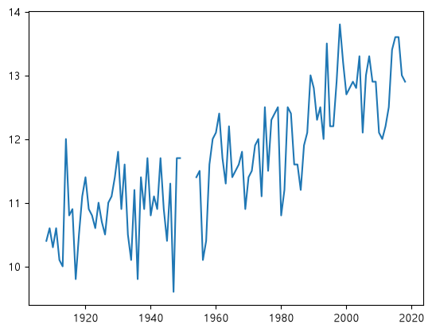

숫자 하나하나는 여전히 표에 있는 그 값이다. 달라진 것은 표현 방식뿐인데, "전체적으로 올라가고
있다"는 판단은 그림이 훨씬 빠르다. 이 장은 이런 그림을 **의도한 대로** 그리는 법을 다룬다 —
matplotlib은 그림의 아주 작은 부분까지 코드로 지정할 수 있는 대신, 지정을 빠뜨리거나 잘못하면
그린 사람도 모르게 다른 그림이 나온다.

### V3.2 한글이 깨지지 않게 — 글꼴 두 줄

위 코드에 이미 넣어 둔 두 줄을 짚고 넘어간다.

```python
plt.rc('font', family='Malgun Gothic')
plt.rc('axes', unicode_minus=False)
```

첫 줄이 없으면 한글 라벨이 네모(`□`)로 깨진다. 윈도우에는 맑은 고딕(Malgun Gothic)이 기본
설치돼 있어 이 한 줄이면 충분하다(맥은 `AppleGothic`).

둘째 줄은 별개의 문제를 고친다. 맑은 고딕에는 음수 기호로 쓰는 유니코드 마이너스(`−`,
U+2212) 글리프가 없어서, 이 줄이 없으면 축 눈금에 음수가 있을 때마다 다음 경고가 뜬다.

```text
UserWarning: Glyph 8722 (\N{MINUS SIGN}) missing from font(s) Malgun Gothic.
```

`unicode_minus=False`를 주면 matplotlib이 유니코드 마이너스 대신 일반 하이픈(`-`)을 써서
경고 없이 넘어간다. 이 두 줄은 **그림을 그리는 모든 장(V3~V6)의 첫 블록**에 넣는다.

### V3.3 그래프 다섯 가지 — 무엇을 보여 주려고 고르는가

matplotlib에는 그래프 종류가 훨씬 많지만, 대부분의 질문은 다섯 가지로 답할 수 있다. 아래
값은 그래프 종류의 쓰임을 보여 주기 위해 만든 예시 값이다(실제 조사 결과가 아니다).

**변화를 본다 — `plot`.** 시간처럼 순서가 있는 값을 잇는다.

```python
# 그림: v3-plot-line
걸음수 = [8200, 10500, 6300, 12000, 9100]
요일 = ['월', '화', '수', '목', '금']
plt.plot(요일, 걸음수, marker='o')
plt.title('요일별 걸음 수 (예시)')
plt.show()
```

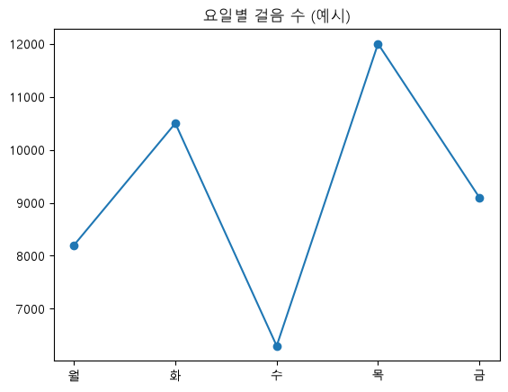

**크기를 비교한다 — `bar` / `barh`.** 범주별 값의 크기를 비교한다. 이름이 길면 가로 막대
(`barh`)가 읽기 편하다.

```python
# 그림: v3-bar
반평균 = [72, 85, 90, 68, 77]
반이름 = ['1반', '2반', '3반', '4반', '5반']
plt.bar(반이름, 반평균)
plt.title('반별 평균 점수 (예시)')
plt.show()
```

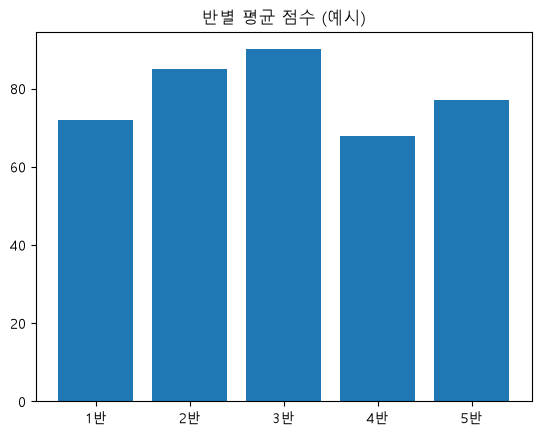

```python
# 그림: v3-barh
plt.barh(반이름, 반평균)
plt.title('반별 평균 점수 — 가로 막대 (예시)')
plt.show()
```

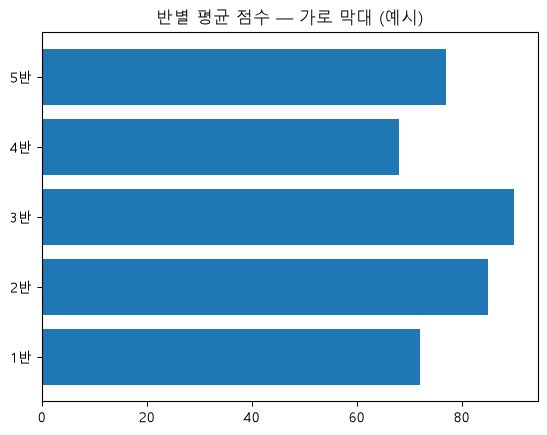

**관계를 본다 — `scatter`.** 두 값이 함께 움직이는지 점으로 흩뿌린다.

```python
# 그림: v3-scatter
공부시간 = [1, 3, 2, 5, 4]
점수 = [65, 75, 70, 92, 88]
plt.scatter(공부시간, 점수)
plt.xlabel('공부 시간(시간)')
plt.ylabel('점수(예시)')
plt.show()
```

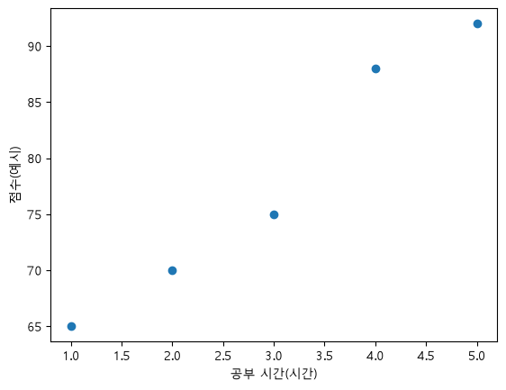

**분포를 본다 — `hist`.** 값을 구간으로 나눠 몇 개씩 있는지 센다.

```python
# 그림: v3-hist
반점수 = [55, 62, 63, 67, 70, 71, 72, 74, 75, 76, 77, 78, 79, 80, 81, 82, 83, 85, 88, 92]
plt.hist(반점수, bins=5)
plt.xlabel('점수(예시)')
plt.ylabel('학생 수')
plt.show()
```

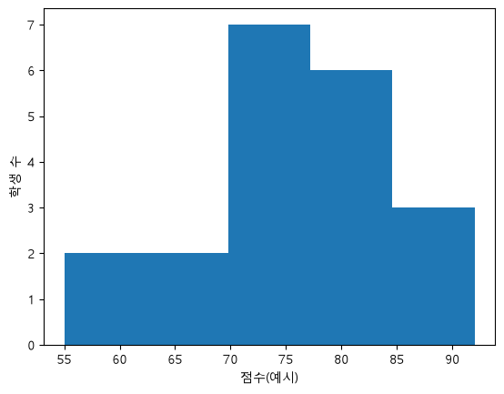

**분포를 요약해서 본다 — `boxplot`.** 히스토그램과 같은 자료를 다섯 수치(최솟값·1사분위·
중앙값·3사분위·최댓값)로 요약한다. 상자 하나로 분포를 압축해서 보여 준다(자세한 읽는 법은
V4.7에서 seaborn으로 다시 다룬다).

```python
# 그림: v3-box
plt.boxplot(반점수)
plt.ylabel('점수(예시)')
plt.show()
```

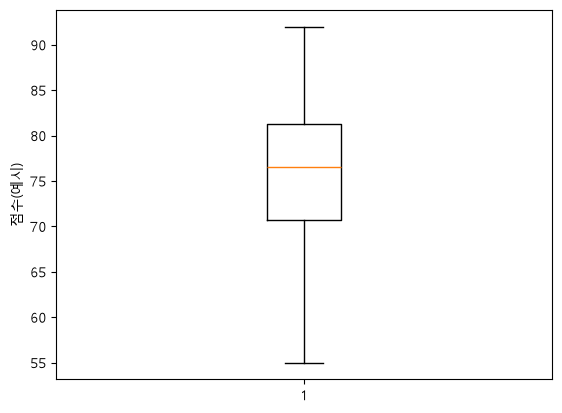

히스토그램은 값이 어떻게 흩어져 있는지 **모양**을 보여 주고, 상자그림은 그 모양을 **숫자 다섯
개**로 압축한다. 여러 반을 한 그림에서 비교하려면 반마다 히스토그램을 그리는 것보다 상자그림을
나란히 놓는 쪽이 훨씬 읽기 쉽다 — 이 비교는 V4에서 실제 데이터로 다시 해 본다.

### V3.4 파이는 언제 쓰나

파이 차트는 **전체에서 차지하는 비율**을 보여 줄 때만 쓴다. 조각이 6개를 넘거나 값이
비슷비슷하면 각도 차이를 눈으로 구분하기 어려워 막대가 낫다.

```python
활동 = ['수면', '학교', '자율학습', '취미', '기타']
시간 = [8, 7, 3, 2, 4]
sum(시간)
# 24
```

```python
# 그림: v3-pie
plt.pie(시간, labels=활동, autopct='%.1f%%')
plt.title('하루 24시간의 쓰임 (예시)')
plt.show()
```

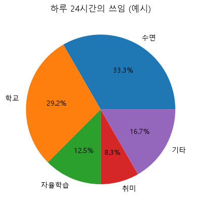

조각 5개, 값도 뚜렷이 다르니 파이가 맞는 선택이다. 만약 조각이 12개(월별 강수량 비율 같은)
거나 두 조각이 24.1%와 24.3%처럼 비슷하다면, 파이 대신 막대로 바꿔야 차이가 보인다.

### V3.5 그림의 해부도 — `Figure`와 `Axes`

matplotlib이 그리는 그림에는 이름 붙은 부분이 있다. 이번에는 실제 데이터로 세 계열(최저·
평균·최고기온)을 한 그림에 겹쳐 그리면서 각 부분을 짚는다. 계열이 둘 이상이면 범례가
필요하고, 색은 웹앱과 같은 역할로 고정한다 — **최저=파랑, 최고=주황, 평균=초록**.

```python
# 그림: v3-anatomy
fig, ax = plt.subplots(figsize=(9, 4))
ax.plot(data['년'], data['최저기온'], color='tab:blue', label='최저기온')
ax.plot(data['년'], data['평균기온'], color='tab:green', label='평균기온')
ax.plot(data['년'], data['최고기온'], color='tab:orange', label='최고기온')
ax.set_title('서울 연도별 기온')     # 제목
ax.set_xlabel('년')                  # 축 이름(가로)
ax.set_ylabel('기온(℃)')             # 축 이름(세로)
ax.set_xlim(1900, 2020)              # 범위
ax.legend()                          # 범례
ax.grid(True, alpha=0.3)             # 격자
plt.show()
```

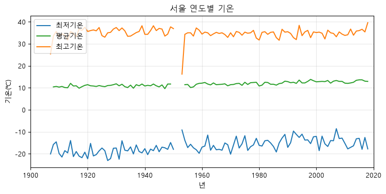

이 그림에서 이름 붙은 부분:

- **`Figure`** — `fig`. 그림 전체, 종이 한 장에 해당한다.
- **`Axes`** — `ax`. 실제로 선이 그려지는 좌표 평면 하나. 그림(`Figure`) 안에 `Axes`가 여러
  개 들어갈 수 있다(V3.8에서 본다).
- **제목** — `ax.set_title(...)`. **축 이름** — `set_xlabel` / `set_ylabel`.
- **범례** — `ax.legend()`. 계열이 둘 이상이면 `label=`을 주고 반드시 붙인다.
- **격자** — `ax.grid(...)`. 값을 정확히 읽는 데 도움을 준다.
- **눈금·범위** — 자동으로 정해지지만 `set_xlim`처럼 직접 지정할 수 있다.

`plt.plot(...)`처럼 `ax` 없이 바로 부르는 방식(V3.3에서 썼다)은 matplotlib이 "현재 그림의
현재 축"에 자동으로 그리는 것이고, `fig, ax = plt.subplots()`는 그 그림과 축을 **이름을 붙여
직접 들고 있는** 방식이다. 다음 두 절이 왜 이름을 붙여 들고 있는 쪽이 안전한지 보여 준다.

### V3.6 ⚠ `plt.figure()`를 두 번 부르면 그림이 두 장 생긴다

옵션을 나눠서 주려다 그림을 두 장 만드는 실수가 흔하다.

```python
# ⚠ 그림이 두 장 생긴다 — 크기를 준 첫 그림은 빈 채로 남는다 (부록 시각화 D-1)
plt.figure(figsize=(20, 3))
plt.figure(dpi=300)
plt.plot([1, 2, 3], [4, 5, 6])
print(plt.get_fignums())
print([plt.figure(n).get_size_inches().tolist() for n in plt.get_fignums()])
```

```text
[1, 2]
[[20.0, 3.0], [6.4, 4.8]]
```

`plt.figure()`는 부를 때마다 **새 그림**을 만든다. 첫 줄이 그림 1번(가로 20인치, 세로
3인치)을 만들고, 둘째 줄이 그림 2번(matplotlib 기본 크기 6.4×4.8인치)을 **새로** 만든다.
그 뒤의 `plt.plot(...)`은 "현재 그림"인 2번에 그려지므로, 크기를 준 1번 그림은 끝까지 텅
비어 있다. 에러도 경고도 없다 — 그림 두 장을 실제로 열어 보지 않으면 알아채기 어렵다.

```python
# 그림: v3-figure-duplicate
plt.figure(figsize=(20, 3))
plt.figure(dpi=300)
plt.plot([1, 2, 3], [4, 5, 6])
plt.show()
```


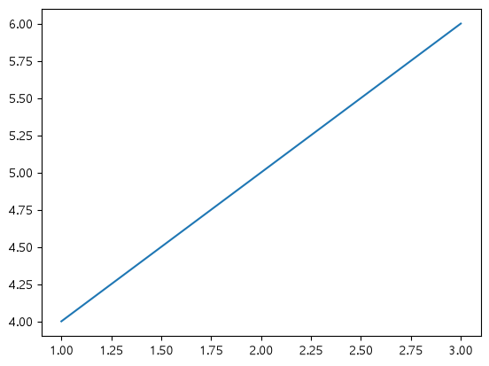

바르게 쓰려면 옵션을 **한 번에** 준다.

```python
# 그림: v3-figure-single
plt.figure(figsize=(20, 3), dpi=300)
plt.plot([1, 2, 3], [4, 5, 6])
plt.show()
```

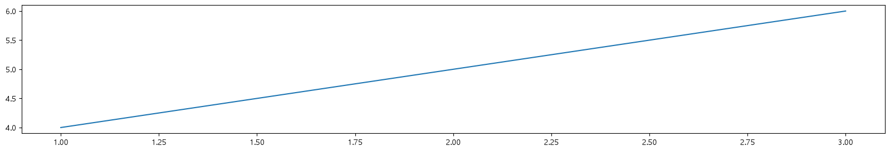

### V3.7 `plt.figure(3, ...)`의 `3`은 무엇인가

`plt.figure()`의 첫 번째 자리 인자를 "하위 그래프 개수"로 착각하기 쉽지만, 이 값은
**그림 번호(`num`)**다.

```python
# ⚠ 3은 하위 그래프 개수가 아니라 그림 번호다. 빈 그림 하나가 생긴다 (부록 시각화 A-3)
plt.figure(3, figsize=(15, 5))
len(plt.gcf().axes)
# 0
```

```python
# 그림: v3-figure-num
plt.figure(3, figsize=(15, 5))
plt.show()
```


`plt.gcf().axes`가 빈 리스트라는 것은 이 그림 안에 좌표 평면이 하나도 없다는 뜻이다. 하위
그래프(subplot) 여러 개를 한 그림에 넣고 싶다면 `plt.figure`가 아니라 다음 절의
`plt.subplots`를 쓴다.

### V3.8 `fig, ax = plt.subplots()` — 그림과 축을 한 번에 이름으로 잡기

`subplots(행, 열)`은 그림 하나와 축 여러 개를 **한 번에** 만들어 배열로 돌려준다. 세 기온
열을 나란히 놓고 `sharey=True`로 세로축 범위를 맞추면 세 그래프의 높낮이를 그대로 비교할 수
있다.

```python
# 그림: v3-subplots-temp
fig, axes = plt.subplots(1, 3, figsize=(12, 3.5), sharey=True)
axes[0].plot(data['년'], data['최저기온'], color='tab:blue')
axes[0].set_title('최저기온')
axes[1].plot(data['년'], data['평균기온'], color='tab:green')
axes[1].set_title('평균기온')
axes[2].plot(data['년'], data['최고기온'], color='tab:orange')
axes[2].set_title('최고기온')
plt.show()
```

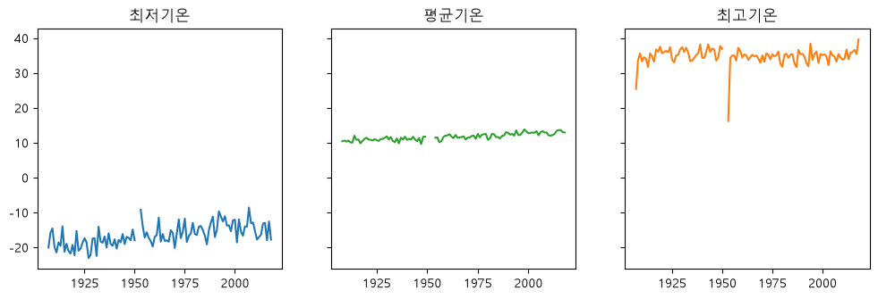

`axes`는 `Axes` 객체 3개짜리 배열이다. `axes[0]`, `axes[1]`, `axes[2]`가 각각 하나의 좌표
평면이고, `fig` 하나가 이 셋을 담는 그림 전체다. `sharey=True`가 없으면 matplotlib이 각
축의 범위를 따로 정해서, 실제로는 최저기온의 변동폭이 더 큰데도 세 그래프가 비슷해 보일 수
있다.

### V3.9 점이 몇 개면 곡선인가

수학 함수를 그릴 때 점을 몇 개 찍느냐가 그래프의 모양을 바꾼다. 반복문으로 점 13개를 찍은
것과, `np.linspace`로 점 1000개를 찍은 것을 나란히 비교한다.

```python
# 그림: v3-linspace-loop
import math
import numpy as np

fig, axes = plt.subplots(1, 2, figsize=(10, 3.5), sharey=True)

xs_loop = list(range(13))
ys_loop = [math.sin(x) for x in xs_loop]
axes[0].plot(xs_loop, ys_loop, marker='o')
axes[0].set_title('반복문 — 점 13개')

xs_dense = np.linspace(0, 12, 1000)
ys_dense = np.sin(xs_dense)
axes[1].plot(xs_dense, ys_dense)
axes[1].set_title('np.linspace — 점 1000개')
plt.show()
```

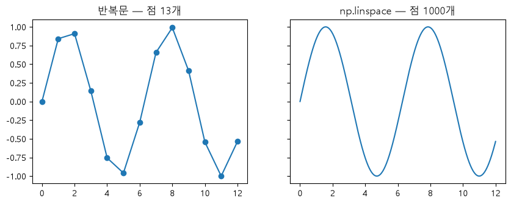

왼쪽은 점과 점 사이를 직선으로 이어서 각져 보이고, 오른쪽은 점 간격이 좁아 곡선처럼 보인다.
matplotlib은 **점을 직선으로 잇는 도구**이지 곡선을 그리는 도구가 아니다 — 곡선처럼 보이게
하려면 점을 촘촘히 찍어야 한다.

### V3.10 ✗ 점 크기에 음수가 섞이면

산점도에서 점 크기(`s=`)로 세 번째 값을 표현할 때, 그 값에 음수가 섞이면 어떻게 될까.
시드를 고정해 재현 가능한 예시를 만든다.

```python
np.random.seed(0)
x = np.random.rand(100)
y = np.random.rand(100)
크기 = np.random.randint(-200, 200, 100)
(크기 < 0).sum()
# 50
```

```python
# ✗ 크기가 음수인 점은 그려지지 않는다. RuntimeWarning만 뜨고 원인은 짐작하기 어렵다 (부록 시각화 D-5)
plt.scatter(x, y, s=크기)
```

```text
RuntimeWarning: invalid value encountered in sqrt
```

matplotlib은 점 크기를 정할 때 넓이의 제곱근을 쓰는데, 음수의 제곱근은 정의되지 않아
`nan`이 되고 그 점은 화면에 그려지지 않는다. 100개 중 50개가 음수였으니 절반이 사라진
셈이다.

```python
# 그림: v3-negative-size
# ✗ 같은 경고가 다시 뜬다. 화면에서 절반이 사라진 모습을 직접 본다
plt.scatter(x, y, s=크기)
plt.title('점 크기에 음수가 섞인 산점도 — 절반이 사라졌다')
plt.show()
```

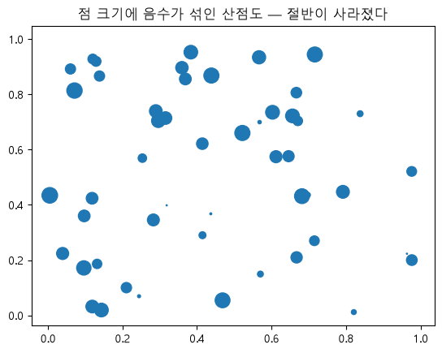

경고 메시지에 "크기"나 "음수"라는 말이 없어서, 코드를 짠 사람이 아니면 원인을 찾기 어렵다.
크기로 쓸 값이 음수를 가질 수 있다면(예: 증감량) 절댓값을 쓰거나 별도로 색으로 부호를 표현
한다.

### V3.11 pandas에서 바로 그리기 — `df.plot()`

`DataFrame`과 `Series`에는 `.plot()` 메서드가 있어 matplotlib을 따로 불러오지 않고도 그릴 수
있다. 반환값은 `Axes`라서, 만든 뒤에 이어서 꾸밀 수 있다.

```python
# 그림: v3-pandas-plot-line
ax = data.plot(x='년', y='평균기온', figsize=(9, 3.5), color='tab:green', legend=False)
ax.set_ylabel('평균기온(℃)')
plt.show()
```

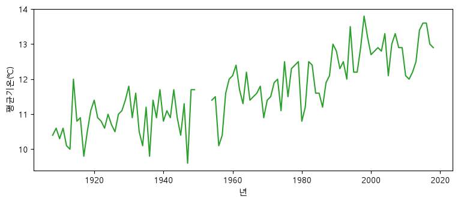

`kind=` 옵션으로 그래프 종류를 바꾼다. 최근 10개 행만 골라 막대로 그려 본다.

```python
# 그림: v3-pandas-plot-bar
최근10 = data.tail(10)
ax = 최근10.plot(x='년', y='평균기온', kind='bar', figsize=(8, 3.5),
                 color='tab:blue', legend=False)
ax.set_ylabel('평균기온(℃)')
plt.show()
```

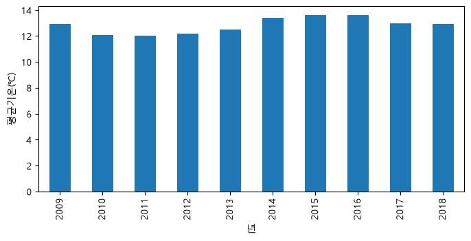

`data.plot(x='년', y='평균기온')`은 결국 `plt.plot(data['년'], data['평균기온'])`을 대신
불러 주는 것뿐이다. 다만 `x=`, `y=`를 열 이름으로 바로 받을 수 있어 코드가 짧아진다.

### V3.12 그림을 저장한다 — `savefig`

화면에 띄우는 대신(또는 띄운 것과 별개로) 파일로 저장하려면 `Figure` 객체의 `savefig`를
쓴다. `dpi`는 해상도, `bbox_inches='tight'`는 여백을 잘라내 준다.

```python
fig, ax = plt.subplots(figsize=(9, 4))
ax.plot(data['년'], data['평균기온'], color='tab:green')
ax.set_title('서울 연도별 평균기온')
fig.savefig('seoul_temp_trend.png', dpi=150, bbox_inches='tight')
```

`plt.savefig(...)`처럼 `plt` 모듈에서 바로 불러도 되지만, `fig.savefig(...)`처럼 `Figure`
객체에서 부르면 **어느 그림을 저장하는지가 명확하다** — 그림이 여러 장 열려 있을 때(V3.6에서
본 실수를 떠올려 보자) 이 차이가 중요해진다.

### V3.13 흔한 실수

- **`plt.figure()`를 옵션 나눠서 두 번 부른다.** 그림이 두 장 생기고, 앞 그림은 빈 채로
  남는다(V3.6). 옵션은 한 번에 준다.
- **`plt.figure(숫자, ...)`의 숫자를 하위 그래프 개수로 착각한다.** 이 숫자는 그림 번호다
  (V3.7). 하위 그래프는 `plt.subplots(행, 열)`로 만든다.
- **`plt.show()` 없이 다음 그림을 이어서 그린다.** 파이썬 스크립트에서는 앞 그림에 선이 계속
  누적된다(주피터는 칸이 끝나면 자동으로 갈무리하지만, `.py` 파일은 그렇지 않다). 그림 하나가
  끝났으면 `plt.show()`나 `plt.close()`로 마무리한다.
- **점 크기·색처럼 값으로 매핑하는 자리에 음수가 섞일 수 있는 값을 그대로 넣는다.** 에러 없이
  일부가 사라진다(V3.10). 매핑 전에 범위를 확인한다.

### 확인 문제

**문제 V3-1.** 6개 조각으로 나뉜 설문 결과가 있는데 각 조각이 15%, 17%, 16%, 18%, 17%, 17%로
비슷하다. 파이 차트와 막대 그래프 중 어느 쪽이 나은가?

<details><summary>답</summary>

막대 그래프다. 파이 차트는 조각의 **각도** 차이로 크기를 비교하는데, 15%와 18%의 각도 차이는
아주 작아서 눈으로 구분하기 어렵다. 막대는 높이로 비교하므로 3%포인트 차이도 뚜렷이 보인다.
조각 수가 많거나(V3.4에서는 6개 이하를 기준으로 들었다) 값이 비슷할 때는 막대가 낫다.

</details>

**문제 V3-2.** 다음 코드를 실행하면 그림이 몇 장 생기는가? 그리고 실제로 선이 그려지는 그림은
몇 번인가?

```text
plt.figure(figsize=(20, 3))
plt.figure(dpi=300)
plt.plot([1, 2, 3], [4, 5, 6])
```

<details><summary>답</summary>

두 장이다(1번, 2번). `plt.figure()`는 부를 때마다 새 그림을 만들고 그 그림을 "현재 그림"으로
만든다. 첫 줄이 1번 그림을, 둘째 줄이 2번 그림을 만들고 2번이 현재 그림이 되므로, 그 뒤의
`plt.plot(...)`은 2번 그림에 그려진다. 1번 그림은 크기(20×3인치)만 가진 채 끝까지 비어
있다(V3.6).

</details>

**문제 V3-3.** `plt.figure(5, figsize=(10, 4))`를 실행한 뒤 `len(plt.gcf().axes)`는 얼마인가?

<details><summary>답</summary>

0이다. 첫 번째 자리의 `5`는 하위 그래프 개수가 아니라 그림 번호이므로, 이 코드는 번호가 5번인
빈 그림 하나를 만들 뿐 축(Axes)은 하나도 만들지 않는다. 하위 그래프가 필요하면
`plt.subplots(행, 열)`을 쓴다(V3.7).

</details>

**문제 V3-4.** `np.random.randint(-200, 200, 100)`으로 만든 값을 산점도의 점 크기(`s=`)로
쓰면, 100개 점 중 몇 개가 화면에 안 보이는가? 왜인가?

<details><summary>답</summary>

값이 음수인 개수만큼 안 보인다(V3.10의 예시에서는 시드를 고정해 50개였다). matplotlib이 점
크기를 계산할 때 넓이의 제곱근을 쓰는데, 음수의 제곱근은 정의되지 않아 `nan`이 되고 `nan`
크기인 점은 그려지지 않기 때문이다. 에러 없이 `RuntimeWarning: invalid value encountered in
sqrt`만 뜬다.

</details>

### 🧪 실습실

> 웹앱 **V3**에서 "그림 해부도"로 제목·축 이름·범례·격자·범위를 하나씩 켜고 끄며 각 부분을
> 만드는 코드 한 줄을 확인해 보라. "점 간격 슬라이더"로 sin 곡선의 점 개수를 직접 늘려 가며
> 언제부터 매끄러운 곡선처럼 보이는지 찾아보라. "현재 그림은 어느 것인가"로 `plt.figure()`를
> 여러 번 부를 때마다 화살표가 어느 그림으로 옮겨 가는지 단계별로 따라가 보라.

---

## V4장. seaborn — 요약해서 그리기

> matplotlib이 점 하나하나의 위치를 직접 지정하는 도구라면, seaborn은 "이 표에서 이 열과 이
> 열의 관계를 보여 줘"라고 말하면 평균과 집계, 색 구분까지 알아서 해 주는 도구다. 이 장을
> 읽으면 seaborn에 표를 건네는 법을 익히고, **막대 하나가 실제로는 수백 개의 행을 요약한
> 것**이라는 사실을 데이터로 직접 확인하고, 셀 것과 나눌 것을 구분해서 쓸 수 있다.

### V4.1 문제 제기 — seaborn은 표를 받는다

matplotlib에서는 `plt.bar(반이름, 반평균)`처럼 x값과 y값을 각각 리스트로 넘겼다. seaborn은
다르다. **표(`DataFrame`) 하나와, 그 표의 열 이름**을 넘긴다.

이 장에서는 서울 일별 기온(`seoul_temp_day.csv`, 기상청 기상자료개방포털, 공공누리 제1유형)을
쓴다. V1의 정리 과정(탭 제거 → 빈 행 제거 → `pd.to_datetime` → `년`/`월` 열)을 다시 한다.

```python
import pandas as pd
pd.set_option('display.max_columns', 30)
pd.set_option('display.width', 200)
pd.set_option('display.max_colwidth', 40)

import matplotlib.pyplot as plt
plt.rc('font', family='Malgun Gothic')
plt.rc('axes', unicode_minus=False)
import seaborn as sns

df = pd.read_csv('seoul_temp_day.csv', encoding='cp949')
df['날짜'] = df['날짜'].str.replace('\t', '', regex=False)
df = df[df['날짜'] != ''].copy()
df['날짜'] = pd.to_datetime(df['날짜'])
df['년'] = df['날짜'].dt.year
df['월'] = df['날짜'].dt.month
df.shape
# (42396, 7)
```

seaborn 함수는 대부분 `data=`, `x=`, `y=`를 **이름으로** 받는다.

```python
# 그림: v4-basic-scatter
sns.scatterplot(data=df, x='최저기온', y='최고기온')
plt.show()
```

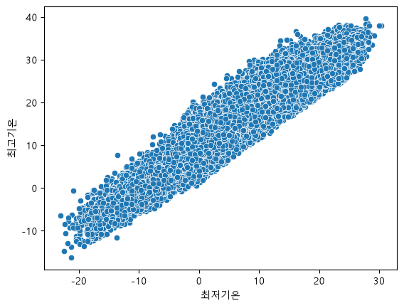

축 이름이 자동으로 `최저기온`, `최고기온`이 된 것도 눈여겨보자 — matplotlib이었다면
`plt.xlabel(...)`을 직접 불러야 했다. 표를 넘기면 이런 것들을 seaborn이 대신 해 준다.

옛날식으로 위치 인자만 넘기면 seaborn 0.12부터 에러가 난다.

```python
# ✗ x, y는 위치 인자로 받지 않는다 (부록 시각화 C-7)
sns.boxplot(df['최저기온'], df['최고기온'])
```

```text
TypeError: boxplot() takes from 0 to 1 positional arguments but 2 were given
```

**이 장부터는 언제나 `data=, x=, y=`를 이름으로 준다.**

### V4.2 ★ barplot — 막대 하나 뒤의 행들

seaborn의 막대그래프는 matplotlib의 막대그래프와 근본적으로 다르다. `plt.bar`는 준 값을
그대로 막대 높이로 쓰지만, `sns.barplot`은 **같은 x값을 가진 행을 모두 모아 평균을 낸 뒤** 그
평균을 막대 높이로 그린다. 최근 5개 연도로 확인해 보자.

```python
recent = df[df['년'] >= 2020]
recent.groupby('년')['평균기온'].agg(평균='mean', 날수='count')
```

```text
             평균   날수
년                   
2020  13.271858  366
2021  13.752055  365
2022  13.296164  365
2023  14.109041  365
2024  14.875410  366
```

2020년 막대 하나는 평균기온 하나가 아니라 **이 366개의 값을 평균 낸 결과**다. 실제로
`sns.barplot`이 그리는 막대 높이가 이 표의 `평균` 열과 같은지 그림으로 확인한다.

```python
# 그림: v4-barplot-years
sns.barplot(data=recent, x='년', y='평균기온')
plt.ylabel('평균기온(℃)')
plt.show()
```

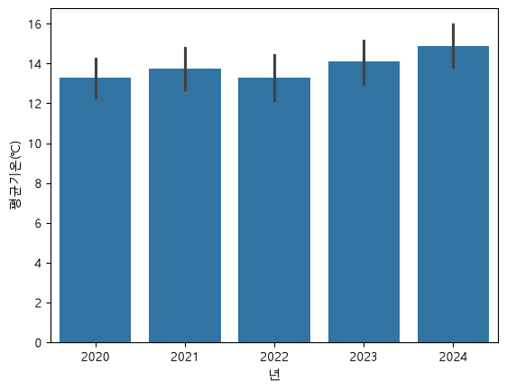

막대 높이는 방금 `groupby`로 구한 `평균` 열의 값과 정확히 같다(2020년 막대는 13.271858).
막대 위의 검은 세로선은 **95% 신뢰구간**이고, 부트스트랩(재표본추출)으로 구하기 때문에
**이 코드를 다시 실행하면 선의 길이가 조금씩 달라진다** — 그래서 이 값은 숫자로 싣지 않는다.
막대 높이(평균)는 실행할 때마다 정확히 같다는 점과 대조된다.

**막대 하나 뒤에 몇 개의 행이 있는지**를 직접 겹쳐서 보면 이 사실이 더 분명해진다. 2020년
한 해의 막대 뒤에 그해 366일의 실제 값을 점으로 겹친다.

```python
# 그림: v4-barplot-behind
year2020 = df[df['년'] == 2020].copy()
year2020['x'] = ''
fig, ax = plt.subplots(figsize=(4, 5))
sns.barplot(data=year2020, x='x', y='평균기온', color='tab:blue', ax=ax)
sns.stripplot(data=year2020, x='x', y='평균기온', color='black', alpha=0.3, size=3, ax=ax)
ax.set_xlabel('2020년')
plt.show()
```

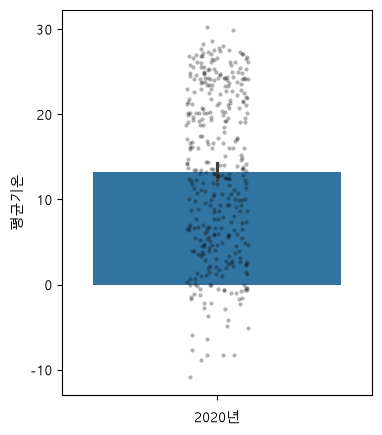

막대는 하나지만 그 뒤에는 366개의 점(행)이 흩어져 있다. **막대그래프를 볼 때는 항상 "이 막대
하나가 몇 개의 행을 요약한 것인가"를 먼저 확인한다** — 뒤에 5개가 있는 평균과 500개가 있는
평균은 신뢰도가 다르다.

### V4.3 신뢰구간 옵션의 이름이 바뀌었다 — `ci` → `errorbar`

원본 자료가 쓰던 `ci=` 옵션은 지금 버전에서 경고가 뜬다.

```python
# ✗ ci 는 없어지는 중이다. errorbar 를 쓰라는 경고가 뜬다 (부록 시각화 C-5)
sns.barplot(data=recent, x='년', y='평균기온', ci='sd')
```

```text
FutureWarning: The `ci` parameter is deprecated. Use `errorbar='sd'` for the same effect.
```

지금은 `errorbar=`를 쓴다. 기본값은 95% 신뢰구간, `'sd'`는 표준편차, `None`은 아예 생략이다.
표준편차와 생략은 부트스트랩을 쓰지 않아 **실행마다 결과가 같다.**

```python
# 그림: v4-barplot-errorbar-compare
fig, axes = plt.subplots(1, 2, figsize=(10, 3.5), sharey=True)
sns.barplot(data=recent, x='년', y='평균기온', errorbar='sd', ax=axes[0])
axes[0].set_title("errorbar='sd' (표준편차)")
sns.barplot(data=recent, x='년', y='평균기온', errorbar=None, ax=axes[1])
axes[1].set_title('errorbar=None (표시 안 함)')
plt.show()
```

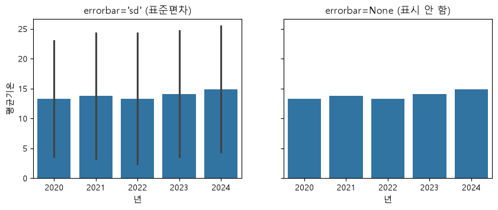

색을 범주마다 다르게 칠하고 싶을 때 `hue`를 지정하지 않고 `palette`만 주는 것도 지금은
경고 대상이다.

```python
# ✗ hue 를 주지 않고 palette 만 주면 경고가 뜬다 (부록 시각화 C-6)
sns.barplot(data=recent, x='년', y='평균기온', palette='dark')
```

```text
FutureWarning: Passing `palette` without assigning `hue` is deprecated and will be removed in v0.14.0. Assign the `x` variable to `hue` and set `legend=False` for the same effect.
```

막대마다 다른 색을 칠하는 것 자체가 문제이기도 하다 — 이 색은 **연도라는 뜻을 전혀 담고
있지 않다.** 색은 뜻이 있을 때만 나눈다(V5에서 다시 다룬다). 뜻 없이 칠할 거라면 한 색으로
충분하다.

### V4.4 셀 것인가 나눌 것인가 — `countplot`과 `histplot`

**히스토그램은 수치형 값을 구간으로 나눠 개수를 센다.** 범주가 이미 몇 가지로 정해져 있는
값의 개수를 셀 때는 `countplot`을 쓴다. 이 둘을 바꿔 쓰면 무슨 일이 생기는지 직접 본다.

```python
df['평균기온'].nunique()
# 489
```

`평균기온`은 연속값이라 서로 다른 값이 489개나 된다. 이걸 그대로 `countplot`에 넣으면 어떻게
될까.

```python
# ⚠ 연속값에 countplot 을 쓰면 막대가 489개 생겨 x축을 읽을 수 없다 (부록 시각화 A-2, D-2)
sns.countplot(data=df, x='평균기온')
```

```python
# 그림: v4-countplot-489
sns.countplot(data=df, x='평균기온')
plt.show()
```

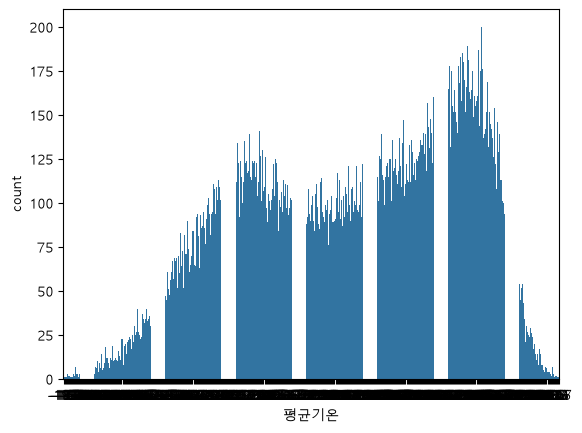

에러도 경고도 없다 — 그림이 그려지긴 하지만 아무 정보도 읽을 수 없을 뿐이다. "어떤 기온이
가장 흔한가"라는 질문에는 값을 구간으로 나누는 `histplot`이 맞는 도구다.

```python
# 그림: v4-histplot-basic
sns.histplot(data=df, x='평균기온', bins=30)
plt.show()
```

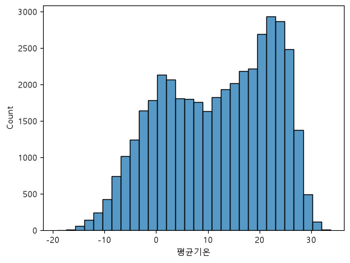

반대로 범주형 값(예: `월`)의 개수를 셀 때는 `countplot`이 맞다.

```python
# 그림: v4-countplot-month
sns.countplot(data=df, x='월')
plt.show()
```

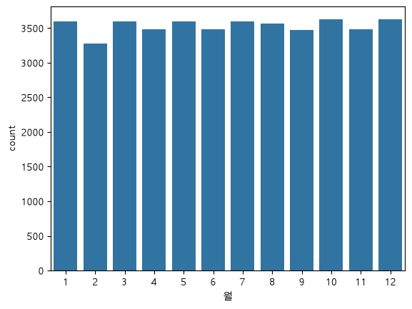

"구간을 나눠야 하면 histplot, 값이 이미 몇 가지로 나뉘어 있으면 countplot" — 둘을 가르는
기준은 이 한 줄이다.

### V4.5 `histplot`의 `bins`

구간을 몇 개로 나누느냐(`bins`)에 따라 같은 데이터가 다른 모양으로 보인다.

```python
# 그림: v4-histplot-bins-compare
fig, axes = plt.subplots(1, 3, figsize=(12, 3.5), sharey=True)
for ax, b in zip(axes, [10, 30, 100]):
    sns.histplot(data=df, x='평균기온', bins=b, ax=ax)
    ax.set_title(f'bins={b}')
plt.show()
```

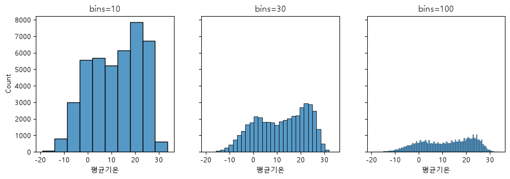

`bins`가 너무 적으면 봉우리 두 개가 하나로 뭉개지고, 너무 많으면 우연한 굴곡까지 다 드러나
전체 모양이 오히려 안 보인다. 정해진 정답은 없고, 몇 가지 값으로 그려 보고 고른다.

### V4.6 분포를 곡선으로 — `kdeplot`, `rugplot`

히스토그램을 매끄러운 곡선으로 보고 싶을 때는 `kdeplot`(커널 밀도 추정)을 쓴다. 원본 자료가
쓰던 `distplot`은 지금도 실행은 되지만 경고가 뜬다. **없어진 것이 아니라 없어질 예정**이라는
점이 중요하다.

```python
# ✗ distplot 은 아직 있지만 없어질 예정이라 경고가 뜬다 — "없어졌다"가 아니다 (부록 시각화 C-3)
sns.distplot(df['평균기온'].dropna())
```

```text
UserWarning: `distplot` is a deprecated function and will be removed in seaborn v0.14.0.
```

지금 쓸 대체 함수는 둘로 나뉜다. 막대로 보려면 `histplot`, 곡선으로 보려면 `kdeplot`, 둘 다
보려면 `histplot(..., kde=True)`.

```python
# 그림: v4-kde-rug
sns.kdeplot(data=df, x='평균기온')
sns.rugplot(data=df, x='평균기온')
plt.show()
```

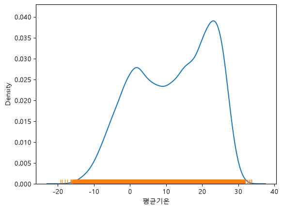

`rugplot`은 각 값의 실제 위치를 x축 위에 짧은 선으로 찍어, 곡선이 뭉뚱그린 지점에 실제로
값이 몇 개나 모여 있는지 보여 준다. 두 함수를 그룹별로 나눠 비교할 때는 `FacetGrid`를 쓴다
(원본은 `FacetGrid.map(sns.distplot, ...)`을 썼는데 이 역시 C-3과 같은 경고 대상이다).

```python
# 그림: v4-kde-rug-facet
겨울여름 = df[df['월'].isin([1, 7])]
g = sns.FacetGrid(겨울여름, col='월')
g.map(sns.kdeplot, '평균기온')
g.map(sns.rugplot, '평균기온')
plt.show()
```

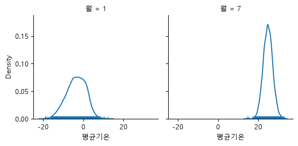

### V4.7 상자그림 읽기 — box · violin · strip

상자그림은 다섯 수치(최솟값·1사분위·중앙값·3사분위·최댓값)로 분포를 요약한다. 8월의
평균기온으로 값을 직접 확인한다.

```python
aug = df[df['월'] == 8]['평균기온'].dropna()
aug.describe()
```

```text
count    3534.000000
mean       25.602066
std         2.331173
min        17.400000
25%        24.100000
50%        25.700000
75%        27.200000
max        33.700000
Name: 평균기온, dtype: float64
```

상자그림의 상자는 1사분위(24.1)에서 3사분위(27.2)까지를 그린다. 수염은 상자에서
1.5×사분위범위(IQR)만큼 뻗고, 그 밖의 값은 점으로 따로 찍는다. **지금 환경(seaborn 0.13.2 +
matplotlib 3.11.1)에서 `sns.boxplot`을 부르면 두 라이브러리의 인자 이름이 어긋나 경고가
뜬다** — 코드가 잘못된 것이 아니라 버전 조합 문제다.

```python
# ✗ 이 환경에서는 boxplot 을 부를 때마다 이 경고가 뜬다 (matplotlib 3.11 의 vert 인자 이름 변경)
sns.boxplot(data=df, x='월', y='평균기온')
```

```text
MatplotlibDeprecationWarning: vert: bool was deprecated in Matplotlib 3.11 and will be removed in 3.13. Use orientation: {'vertical', 'horizontal'} instead.
```

```python
# 그림: v4-box-month
import warnings
warnings.filterwarnings('ignore', message='vert: bool was deprecated')     # 위에서 이미 확인한 경고
sns.boxplot(data=df, x='월', y='평균기온')
plt.show()
```

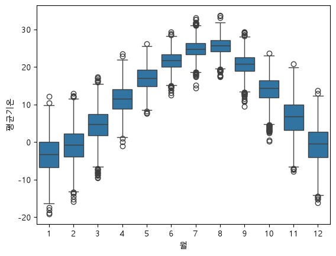

같은 데이터를 violinplot과 stripplot으로도 그려 비교한다. 이 둘은 이 경고를 내지 않는다.

```python
# 그림: v4-violin-month
sns.violinplot(data=df, x='월', y='평균기온')
plt.show()
```

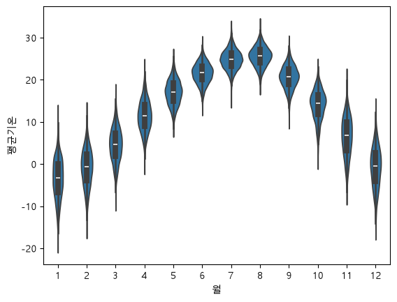

```python
# 그림: v4-strip-month
sns.stripplot(data=df, x='월', y='평균기온', size=2, alpha=0.3)
plt.show()
```

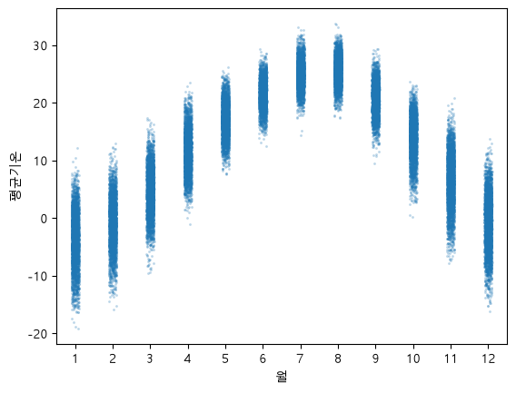

상자그림은 요약이 깔끔한 대신 분포의 모양(봉우리가 하나인지 둘인지 등)을 감춘다. violinplot은
그 모양을 보여 주고, stripplot은 아예 원자료를 그대로 보여 준다. 세 그림을 겹치면 요약과
원자료를 한 번에 볼 수 있다. 앞서 나온 버전 경고는 이미 확인했으니 겹쳐 그릴 때는 걸러낸다.

```python
# 그림: v4-box-strip-overlay
import warnings
warnings.filterwarnings('ignore', message='vert: bool was deprecated')

fig, ax = plt.subplots(figsize=(9, 4))
sns.boxplot(data=df, x='월', y='평균기온', color='lightgray', ax=ax)
sns.stripplot(data=df, x='월', y='평균기온', size=1.5, alpha=0.2, color='black', ax=ax)
plt.show()
```

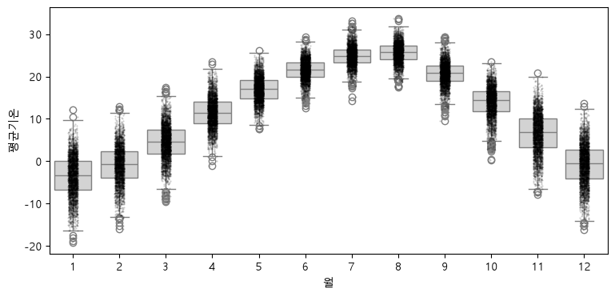

### V4.8 `lineplot`과 미리 집계하기

전체 42,396행을 그대로 `lineplot`에 넘기면 느릴 뿐 아니라, x값(연도)마다 여러 행이 있어
seaborn이 그 값들의 평균과 신뢰구간(띠)까지 계산한다 — 이 띠가 무엇을 뜻하는지 모르고 보면
오해하기 쉽다. `groupby`로 연평균을 미리 낸 것과 비교한다.

```python
# 그림: v4-lineplot-compare
yearly = df.groupby('년')['평균기온'].mean().reset_index()

fig, axes = plt.subplots(1, 2, figsize=(11, 3.5), sharey=True)
sns.lineplot(data=df, x='년', y='평균기온', ax=axes[0])
axes[0].set_title('원본을 그대로 — 연도마다 최대 366행, 회색 띠는 신뢰구간')
sns.lineplot(data=yearly, x='년', y='평균기온', ax=axes[1])
axes[1].set_title('groupby로 연평균을 미리 낸 뒤')
plt.show()
```

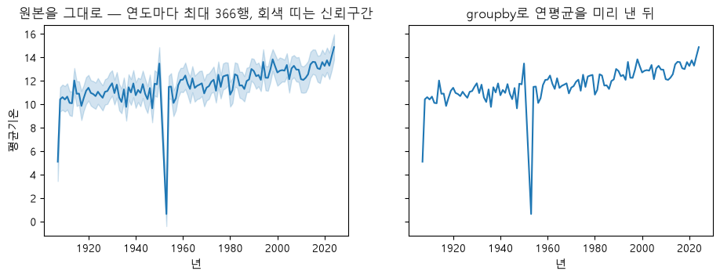

두 그림의 선 모양은 사실상 같다 — 둘 다 결국 연평균을 보여 주기 때문이다. 차이는 왼쪽에만
있는 **회색 띠**다. 저 띠는 "그해 하루하루의 값이 얼마나 흩어져 있었는가"를 나타내는
신뢰구간이지, 연평균의 오차가 아니다. 뜻을 모르고 보면 "선이 두껍다"고만 여기고 지나치기
쉽다. 무엇을 보여 줄지 미리 정했다면(여기서는 "연평균 추세") `groupby`로 그 값만 남기고
그리는 쪽이 더 정직하고 더 빠르다.

### V4.9 관계를 본다 — `scatterplot`

두 수치 열의 관계를 볼 때도 42,396개 점을 그대로 찍으면 점이 서로 겹쳐 밀도를 알 수 없다.
표본을 뽑고 `alpha`(투명도)를 줘서 겹친 정도가 드러나게 한다. 무작위 표본은 시드를 고정한다.

```python
# 그림: v4-scatter-alpha
sample = df.dropna(subset=['최저기온', '최고기온']).sample(2000, random_state=0)
sns.scatterplot(data=sample, x='최저기온', y='최고기온', alpha=0.4)
plt.show()
```

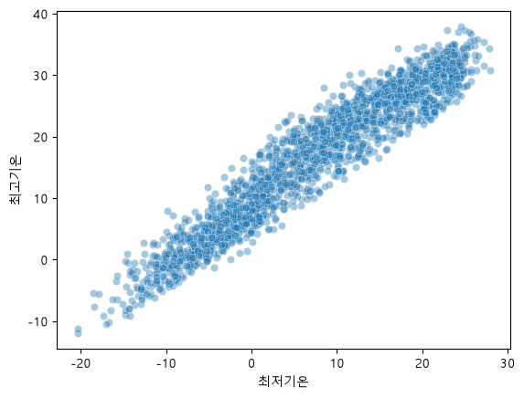

세 번째 값을 색(`hue`)으로 표현할 때, 그 값의 **dtype**이 그림을 바꾼다. `월`은 1~12 사이의
정수라 seaborn이 **연속값**으로 보고 색을 그러데이션으로 칠한다.

```python
# ⚠ 숫자 dtype 인 hue 는 연속값으로 취급되어 범례에 짝수 달만 나온다 (부록 시각화 D-4)
ax = sns.scatterplot(data=sample, x='최저기온', y='최고기온', hue='월', alpha=0.5)
[t.get_text() for t in ax.get_legend().get_texts()]
```

```text
['2', '4', '6', '8', '10', '12']
```

점은 12개 달 전부 제대로 색이 칠해졌지만, **범례에는 짝수 달만 나온다.** seaborn이 12개
범주 대신 색 띠 하나로 표현하면서 대표 눈금만 골라 보여 주기 때문이다. 에러도 경고도 없다.
`월`을 범주로 다루고 싶다면 문자열로 바꾼다.

```python
# 그림: v4-scatter-hue-numeric
fig, axes = plt.subplots(1, 2, figsize=(11, 4))
sns.scatterplot(data=sample, x='최저기온', y='최고기온', hue='월', alpha=0.5, ax=axes[0])
axes[0].set_title("hue='월' (숫자) — 범례에 짝수만")
sns.scatterplot(data=sample, x='최저기온', y='최고기온', hue=sample['월'].astype(str),
                 alpha=0.5, ax=axes[1])
axes[1].set_title("hue를 문자열로 — 범례에 12개 전부")
plt.show()
```

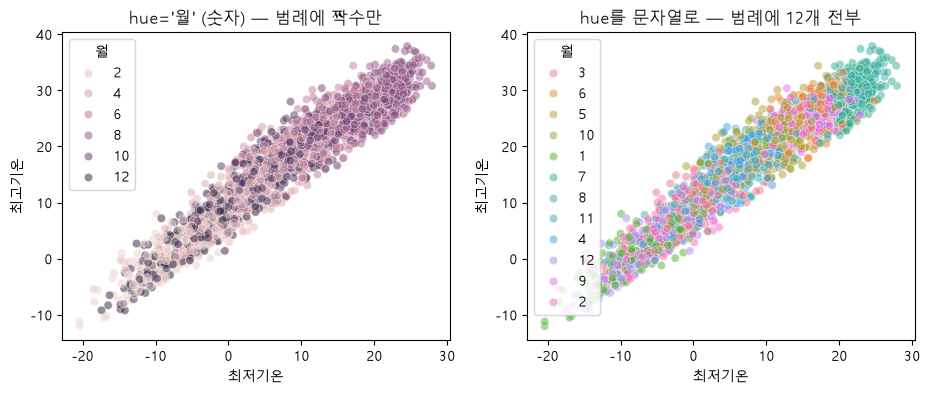

숫자로 저장돼 있다고 해서 항상 "크기를 재는 값"은 아니다. `월`은 순서는 있지만 1과 12가
가깝다는 뜻은 아니므로(12월과 1월은 겨울로 붙어 있다), 애초에 범주로 다루는 쪽이 자연스럽다.

### V4.10 `heatmap` — 상관계수를 색으로

상관계수 표를 색으로 칠하면 숫자를 하나하나 읽지 않고도 강한 관계를 한눈에 찾을 수 있다.
그런데 `corr()`은 문자열 열이 섞여 있으면 계산할 수 없다.

```python
# ✗ 날짜 열이 아직 문자열이면 corr() 이 실패한다 (부록 시각화 C-2)
raw = pd.read_csv('seoul_temp_day.csv', encoding='cp949')
raw.corr()
```

```text
ValueError: could not convert string to float: '\t1907-10-01'
```

지금 쓰는 `df`는 이미 `날짜`를 datetime으로 바꿔 두었지만, `지점`(관측소 번호, 값이 108
하나뿐)까지 포함하면 문제가 남는다. `numeric_only=True`로 숫자 열만 골라도, 값이 한 종류뿐인
열은 상관계수를 정의할 수 없어 그 행과 열이 통째로 `NaN`이 된다.

```python
df[['지점', '평균기온', '최저기온', '최고기온', '년', '월']].corr(numeric_only=True)
```

```text
      지점      평균기온      최저기온      최고기온         년         월
지점   NaN       NaN       NaN       NaN       NaN       NaN
평균기온 NaN  1.000000  0.987406  0.987636  0.083975  0.261068
최저기온 NaN  0.987406  1.000000  0.956321  0.114768  0.260005
최고기온 NaN  0.987636  0.956321  1.000000  0.048276  0.250451
년    NaN  0.083975  0.114768  0.048276  1.000000 -0.004249
월    NaN  0.261068  0.260005  0.250451 -0.004249  1.000000
```

`지점` 값은 이 파일 전체에서 108 하나뿐이라 값이 전혀 변하지 않는다. 상관계수는 "함께
변하는 정도"를 재는데 변하지 않는 값과는 그 정도를 정의할 수 없어 `NaN`이 된다. 히트맵에
빈 줄이 하나 그대로 나오는 것보다, 애초에 뜻 없는 열을 빼는 쪽이 낫다.

```python
# 그림: v4-heatmap-corr
temp_corr = df[['평균기온', '최저기온', '최고기온', '년', '월']].corr(numeric_only=True)
sns.heatmap(temp_corr, annot=True, fmt='.2f', cmap='coolwarm', vmin=-1, vmax=1)
plt.show()
```

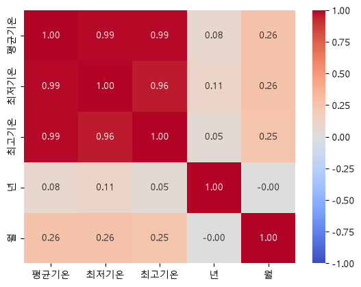

평균·최저·최고기온 세 열은 서로 0.95 이상으로 진하게 칠해진다 — 셋 다 같은 날의 기온을
다른 방식으로 잰 값이니 당연하다. `년`과의 상관(0.05~0.11)이 낮아 보이는 것은 온난화가
없어서가 아니라, **연평균이 아니라 일별 값**으로 계산했기 때문이다(하루하루의 기온은
연도보다 계절의 영향을 훨씬 크게 받는다). 이런 오해는 V5에서 다시 짚는다.

### V4.11 `pairplot` — 한 번에 훑어보기

`pairplot`은 여러 수치 열의 관계를 조합마다 산점도로, 자기 자신과의 관계는 히스토그램으로
그려 한 판에 배열한다. 세 기온 열로 확인한다(표본 2,000행 — 전체를 다 쓰면 그리는 데
시간이 오래 걸린다).

```python
# 그림: v4-pairplot
sns.pairplot(sample[['최저기온', '평균기온', '최고기온']].dropna())
plt.show()
```

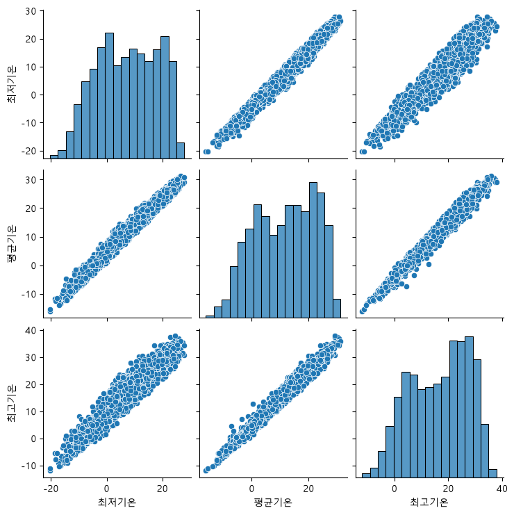

대각선 세 칸은 히스토그램 하나(V4.5), 나머지 여섯 칸은 산점도(V4.9)다. 열이 3개면 칸이 9개,
열이 5개면 칸이 25개가 되므로 열이 많을수록 한 칸의 크기가 작아져 읽기 어려워진다 — 대개
5~6개 열 이하에서 쓴다.

### V4.12 흔한 실수

- **막대그래프의 높이만 보고 뒤에 몇 개의 행이 있는지 확인하지 않는다.** 행 5개의 평균과 행
  500개의 평균이 같은 굵기의 막대로 그려진다(V4.2). 신뢰구간(검은 선)의 길이나 `count()`를
  함께 확인한다.
- **연속값에 `countplot`을 쓴다.** 에러 없이 막대가 수백 개 생겨 아무것도 읽을 수 없다
  (V4.4). 구간을 나눠야 하면 `histplot`이다.
- **`distplot`이 경고를 내는 것을 보고 "없어졌다"고 단정한다.** 지금은 실행된다. 0.14에서
  없어질 예정이라는 경고일 뿐이다(V4.6) — "없어질 것 같다"가 아니라 실제로 실행해 확인한다.
- **숫자로 저장된 범주(`월`, `년`, 우편번호 등)를 그대로 `hue`에 넘긴다.** seaborn이
  연속값으로 오해해 범례가 줄어든다(V4.9). 범주면 `astype(str)`로 명시한다.
- **`corr()`에 값이 하나뿐인 열(`지점` 같은)을 남겨 둔다.** 히트맵에 뜻 없는 `NaN` 줄이
  생긴다(V4.10). 그리기 전에 어떤 열이 실제로 변하는 값인지 확인한다.

### 확인 문제

**문제 V4-1.** 두 연도의 `sns.barplot` 막대 높이가 똑같은데 한쪽은 검은 선(신뢰구간)이
짧고 다른 쪽은 길다. 무엇이 다르다는 뜻인가?

<details><summary>답</summary>

두 해의 **평균**은 같지만 하루하루 값이 흩어진 정도(분산)나 표본 수가 다르다는 뜻이다.
신뢰구간은 평균을 부트스트랩으로 다시 계산했을 때 그 값이 얼마나 흔들리는지를 보여 준다.
값이 고르게 모여 있거나 날수가 많으면 선이 짧고, 값이 들쭉날쭉하거나 날수가 적으면 선이
길어진다. 막대 높이(평균)만 보고 "두 해가 똑같다"고 결론 내리면 이 차이를 놓친다(V4.2).

</details>

**문제 V4-2.** `sns.countplot(data=df, x='평균기온')`을 실행하면 막대가 489개 생긴다. 왜
이런 일이 일어나고, 같은 질문(어느 기온이 흔한가)에 답하려면 어떤 함수를 대신 써야 하는가?

<details><summary>답</summary>

`평균기온`은 소수점 값을 가진 연속값이라 서로 다른 값이 489개나 있다. `countplot`은 값
하나하나를 범주로 보고 막대 하나씩 그리므로 막대가 489개가 된다. 연속값의 분포를 보려면
값을 구간으로 나눠 세는 `histplot(data=df, x='평균기온', bins=30)`을 쓴다(V4.4).

</details>

**문제 V4-3.** `sns.distplot(...)`을 실행하면 `UserWarning`이 뜨지만 그래프는 정상적으로
나온다. "distplot은 seaborn에서 없어졌다"는 말은 정확한가?

<details><summary>답</summary>

정확하지 않다. 지금 버전(0.13.2)에서 `distplot`은 여전히 동작하고, 경고는 "0.14.0에서
없어질 예정"이라고 알릴 뿐이다(V4.6). "없어졌다"와 "없어질 예정이라 경고가 뜬다"는 다른
문장이고, 실제로 실행해 보지 않으면 둘을 구분할 수 없다.

</details>

**문제 V4-4.** `df[['지점', '평균기온', '최저기온']].corr(numeric_only=True)`를 히트맵으로
그렸더니 `지점` 행과 열이 전부 `NaN`(빈 칸)으로 나온다. 원인은 무엇인가?

<details><summary>답</summary>

`지점`은 이 파일 전체에서 108이라는 값 하나뿐이라 전혀 변하지 않는 열이다. 상관계수는 두 열이
함께 변하는 정도를 재는 값인데, 변하지 않는 열과는 그 정도를 정의할 수 없어 `NaN`이 된다
(V4.10). 그리기 전에 값이 실제로 변하는 열인지 확인해서 빼는 것이 낫다.

</details>

### 🧪 실습실

> 웹앱 **V4**에서 "막대 뒤의 행들"로 연도를 하나 골라 막대(평균) 뒤에 그해 365개(또는
> 366개) 점이 흩어진 모습을 직접 확인해 보라. "bins 슬라이더"로 같은 데이터를 histplot과
> countplot(막대 489개)으로 나란히 놓고 비교해 보라. "box · violin · strip"으로 같은 달의
> 데이터를 세 방식으로 바꿔 가며 상자그림의 다섯 수치를 표로 확인해 보라. "hue가 숫자일 때"로
> `월`을 숫자와 문자열로 바꿔 가며 범례가 어떻게 달라지는지 보라.

---

## V5장. 그래프가 거짓말할 때

> 같은 숫자로 다른 인상을 만들 수 있다. 이 장을 읽고 나면 축을 어디서 시작할지, 색을 언제
> 쓸지, 그리고 결측이 그래프에서 어떻게 착시를 만드는지 알아채고 고칠 수 있다.

### V5.1 문제 제기 — 무엇을 보여줄 것인가가 모양을 정한다

서울의 최근 5년 평균기온을 보여 주고 싶다고 하자. 파이 차트로 그려 보면 어떻게 될까.

```python
import pandas as pd
import numpy as np
import matplotlib.pyplot as plt
import seaborn as sns

pd.set_option('display.max_columns', 30)
pd.set_option('display.width', 200)
pd.set_option('display.max_colwidth', 40)
plt.rc('font', family='Malgun Gothic')   # 맥은 'AppleGothic'
plt.rc('axes', unicode_minus=False)

# 출처: 기상청 기상자료개방포털 (공공누리 제1유형)
df = pd.read_csv('seoul_temp_day.csv', encoding='cp949')
df['날짜'] = df['날짜'].str.strip()
df = df[df['날짜'] != ''].copy()
df['날짜'] = pd.to_datetime(df['날짜'])
df['년'] = df['날짜'].dt.year

yearly = df.groupby('년').agg(평균=('평균기온', 'mean'), 날수=('평균기온', 'count'))
print(yearly.loc[2020:2024, '평균'])
```

```text
년
2020    13.271858
2021    13.752055
2022    13.296164
2023    14.109041
2024    14.875410
Name: 평균, dtype: float64
```

```python
# 그림: v5-chart-choice
최근 = yearly.loc[2020:2024, '평균']
최근10 = yearly.loc[2010:2024, '평균']

fig, axes = plt.subplots(1, 2, figsize=(11, 4.5))
axes[0].pie(최근, labels=최근.index, autopct='%1.0f%%')
axes[0].set_title('나쁜 예 — 파이로 그린 기온')
axes[1].plot(최근10.index, 최근10.to_numpy(), marker='o', color='tab:blue')
axes[1].set_ylabel('평균기온(℃)')
axes[1].set_title('좋은 예 — 선으로 그린 추세')
plt.tight_layout()
plt.show()
```

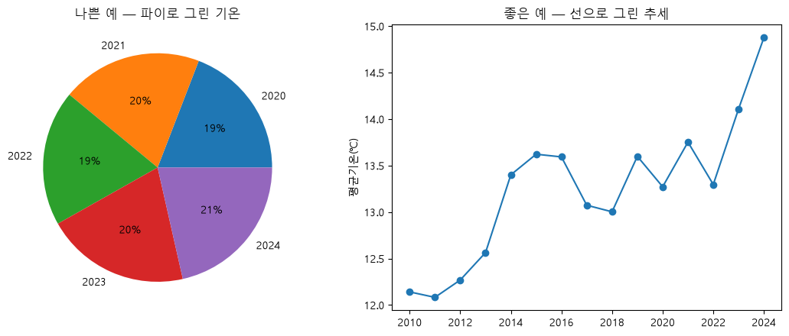

파이 차트는 조각을 다 더하면 100%가 되는 **전체의 몫**을 나타낼 때 쓴다. 다섯 해의 평균기온을
더한 숫자(약 69도)에는 아무 의미가 없다 — "2024년이 전체 기온의 21%를 차지한다"는 문장은
말이 되지 않는다. 그런데도 파이 차트는 그것처럼 보이게 만든다. 반면 시간에 따라 변하는 값은
선 그래프가 자연스럽다. **무엇을 보여 주고 싶은지가 먼저고, 그림 모양은 그다음이다.**

질문의 성격과 그림 모양을 짝지으면 이렇다.

| 보여줄 것 | 그림 |
|:---|:---|
| 크기 비교(항목끼리 누가 더 큰가) | 막대그래프 |
| 시간에 따른 변화 | 선 그래프 |
| 값의 분포(어디에 몰려 있나) | 히스토그램, 상자그림 |
| 두 값의 관계 | 산점도 |
| 전체를 몇 개 조각으로 나눈 몫 | 누적 막대(조각이 6개 이하면 파이도 가능) |
| 숫자 하나 | 그림이 아니라 숫자 그 자체 — 억지로 그리지 않는다 |

이제부터 이 장은 "모양은 맞게 골랐는데도 거짓말하는" 다섯 가지 경우를 하나씩 짚는다.

### V5.2 막대는 0에서 시작한다

2023년과 2024년의 평균기온을 막대로 비교해 보자.

```python
print(yearly.loc[2023, '평균'])
print(yearly.loc[2024, '평균'])
print(yearly.loc[2024, '평균'] - yearly.loc[2023, '평균'])
```

```text
14.109041095890412
14.875409836065574
0.766368740175162
```

두 해의 차이는 0.77℃, 비율로는 5%가 조금 넘는다. 그런데 y축을 어디서 시작하느냐에 따라
이 차이가 완전히 다르게 보인다.

```python
# 그림: v5-bar-from-zero
연도 = ['2023', '2024']
값 = [yearly.loc[2023, '평균'], yearly.loc[2024, '평균']]

fig, axes = plt.subplots(1, 2, figsize=(9, 4.5))
axes[0].bar(연도, 값, color='tab:blue')
axes[0].set_ylim(13.5, 15)
axes[0].set_title('나쁜 예 — 축을 13.5부터')
axes[0].set_ylabel('평균기온(℃)')

axes[1].bar(연도, 값, color='tab:blue')
axes[1].set_ylim(0, 16)
axes[1].set_title('좋은 예 — 0부터')
axes[1].set_ylabel('평균기온(℃)')
plt.tight_layout()
plt.show()
```

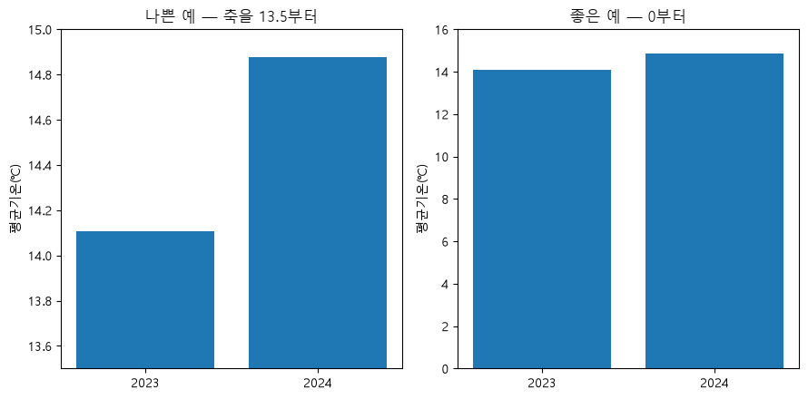

왼쪽 그림에서는 2024년 막대가 2023년보다 몇 배는 커 보인다. 축을 13.5부터 자르면 실제로는
5% 남짓인 차이가 화면에서는 압도적인 차이로 확대된다. 오른쪽처럼 0부터 그리면 두 막대의
키 차이가 실제 비율과 같아진다. **막대그래프는 길이로 크기를 비교하는 그림이라서, 길이의
기준점(0)을 옮기면 비교 자체가 거짓이 된다.** 선 그래프는 사정이 다르다 — 선은 길이가 아니라
기울기로 변화를 보여 주므로, 세부 변화를 보려고 축을 확대해도(V5.1의 오른쪽 그림처럼) 막대와
같은 방식으로 왜곡되지는 않는다.

### V5.3 축은 하나 — 이중 y축 금지

서울의 연평균기온과 연교차(그해의 최고기온 − 최저기온)를 함께 보고 싶다고 하자.
`seoul_temp.csv`는 각 연도의 극값을 담고 있다(여기 최고·최저는 그해의
극값이지 연평균의 최고·최저가 아니다).

```python
ext = pd.read_csv('seoul_temp.csv', encoding='cp949')
ext['연교차'] = ext['최고기온'] - ext['최저기온']
print(ext[['년', '평균기온', '최고기온', '최저기온', '연교차']].tail(3))
```

```text
       년   평균기온  최고기온  최저기온   연교차
109  2016  13.6  36.6 -18.0  54.6
110  2017  13.0  35.4 -12.6  48.0
111  2018  12.9  39.6 -17.8  57.4
```

두 값을 한 그림에 놓고 싶은 유혹이 든다. 왼쪽 축에 평균기온, 오른쪽 축에 연교차를 두면
이렇게 된다.

```python
# 그림: v5-dualaxis-bad
fig, ax1 = plt.subplots(figsize=(9, 4.5))
ax2 = ax1.twinx()
ax1.plot(ext['년'], ext['평균기온'], color='tab:blue', label='평균기온(왼쪽 축)')
ax2.plot(ext['년'], ext['연교차'], color='tab:orange', label='연교차(오른쪽 축)')
ax1.set_ylim(9, 14)
ax2.set_ylim(58, 24)          # 일부러 오른쪽 축을 뒤집어 두 선을 겹쳐 보이게 했다
ax1.set_ylabel('평균기온(℃)')
ax2.set_ylabel('연교차(℃)')
ax1.set_title('나쁜 예 — 두 축의 범위를 맞춰 겹쳐 보이게 함')
fig.legend(loc='upper left', bbox_to_anchor=(0.12, 0.88))
plt.show()
```

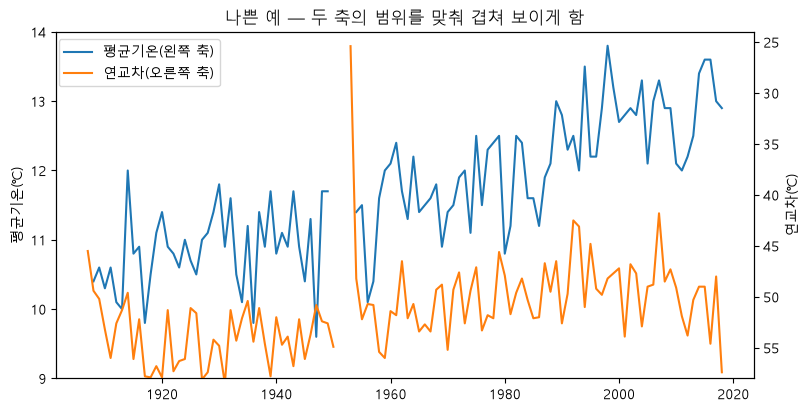

두 선이 거의 나란히 움직이는 것처럼 보인다. 그런데 이 "나란함"은 자료가 아니라 **축의
범위를 내가 골랐기 때문에** 생긴 것이다. 오른쪽 축의 범위를 24~58 대신 0~100으로만 바꿔도
겹치는 모양이 달라진다 — 이중 축 그래프는 그린 사람이 축을 조절해서 원하는 만큼 두 선을
가깝게도, 멀게도 만들 수 있다. **두 값의 단위가 다르면(또는 단위가 같아도 크기 규모가 다르면)
이중 축은 "관계가 있어 보이게" 그릴 자유를 그린 사람에게 준다.** 이건 자료를 보여 주는 게
아니라 자료를 연출하는 것이다.

바로잡는 방법은 두 가지다. 그림을 두 개로 나누거나(각자 자기 축을 가지므로 왜곡이 없다),
두 값을 같은 기준으로 정규화해서 한 축에 올린다. 여기서는 그림을 나눈다.

```python
# 그림: v5-dualaxis-fixed
fig, axes = plt.subplots(2, 1, figsize=(9, 6), sharex=True)
axes[0].plot(ext['년'], ext['평균기온'], color='tab:blue')
axes[0].set_ylabel('평균기온(℃)')
axes[0].set_title('좋은 예 — 그림을 나눈다')
axes[1].plot(ext['년'], ext['연교차'], color='tab:orange')
axes[1].set_ylabel('연교차(℃)')
axes[1].set_xlabel('년')
plt.tight_layout()
plt.show()
```

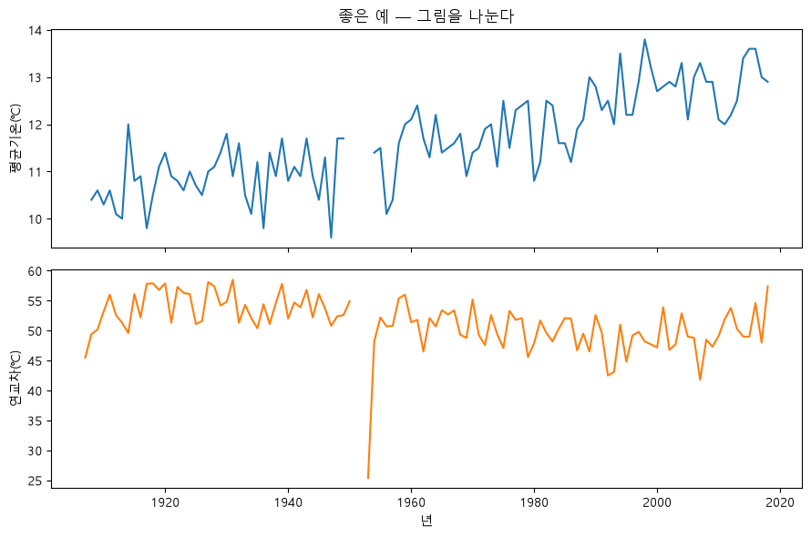

두 그림을 나란히 보면 각 선이 자기 축 안에서 어떻게 움직이는지 왜곡 없이 볼 수 있다. 실제로
두 값의 상관계수는 `ext['평균기온'].corr(ext['연교차'])` ≈ -0.45로 약한 음의 관계가 있지만,
이 관계는 두 그림을 따로 보고 판단할 일이지 이중 축이 대신 "보여 줄" 일이 아니다.

### V5.4 색은 뜻이 있을 때만

17개 시도의 총인구를 막대로 비교해 보자.

```python
# 출처: 행정안전부 주민등록 인구통계
pop = pd.read_csv('korea_pop.csv', encoding='cp949', thousands=',')
sido = pop['행정구역'].str.split(r'\s+\(', regex=True).str[0]
pop = pop.set_index(sido)
pop.index.name = '시도'

totals = pop.loc[pop.index != '전국', '2021년08월_계_총인구수'].sort_values(ascending=False)
print(totals.head(3))
```

```text
시도
경기도      13530519
서울특별시     9550227
부산광역시      3359527
Name: 2021년08월_계_총인구수, dtype: int64
```

```python
# 그림: v5-color-compare
fig, axes = plt.subplots(1, 2, figsize=(11, 4.5))

무지개 = plt.cm.rainbow(np.linspace(0, 1, len(totals)))
axes[0].bar(range(len(totals)), totals.to_numpy(), color=무지개)
axes[0].set_title('나쁜 예 — 무지개색')
axes[0].set_xticks([])

농도 = 0.3 + 0.6 * (totals / totals.max())
단색 = plt.cm.Blues(농도)
axes[1].bar(range(len(totals)), totals.to_numpy(), color=단색)
axes[1].set_title('좋은 예 — 한 색의 진하기')
axes[1].set_xticks([])
plt.tight_layout()
plt.show()
```

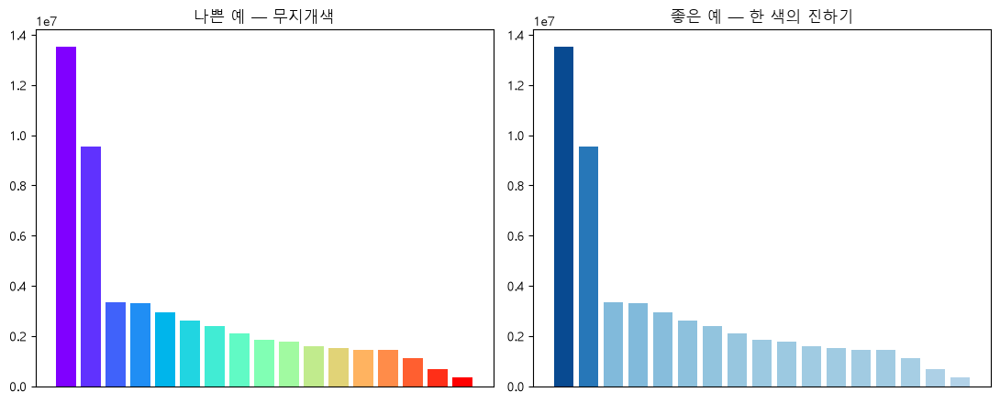

왼쪽 그림의 색은 **크기와 아무 관계가 없다.** 무지개는 그저 막대 순서대로 색상환을 따라간
것이라, 빨간 막대가 큰지 작은지 색만 보고는 알 수 없다 — 오히려 "빨강이 위험, 초록이
안전" 같은 엉뚱한 인상까지 얹는다. 오른쪽 그림은 값이 클수록 색이 진하다. 색이 **크기라는
뜻을 실제로 나르고 있다.** 규칙은 간단하다.

- 크기(magnitude)를 색으로 보이고 싶으면 **한 색조의 진하기**만 쓴다(순차 팔레트).
- 양수·음수처럼 방향이 있는 값은 두 색 + 가운데 회색(발산 팔레트) — V4의 상관계수
  히트맵이 이 경우다.
- 서로 다른 항목을 구분하고 싶으면(범주) 색을 3개까지만 쓴다. 색약인 사람도 구분해야
  하기 때문이다(이 교재의 세 기온 계열 파랑·주황·초록이 그 예다).
- 그 외에는 색을 아예 쓰지 않는 게 낫다. 무지개는 "구분되어 보이지만 아무 뜻도 없는" 색을
  만드는 가장 흔한 방법이라 특히 피한다.

### V5.5 ★ 결측이 만드는 계곡

서울의 연도별 평균기온을 그대로 선으로 그려 보자. `yearly`는 V5.1에서 이미 만들어 두었다.

```python
# 그림: v5-valley-naive
plt.figure(figsize=(10, 4.5))
plt.plot(yearly.index, yearly['평균'], color='tab:blue')
plt.xlabel('년')
plt.ylabel('평균기온(℃)')
plt.title('연도별 평균기온')
plt.show()
```

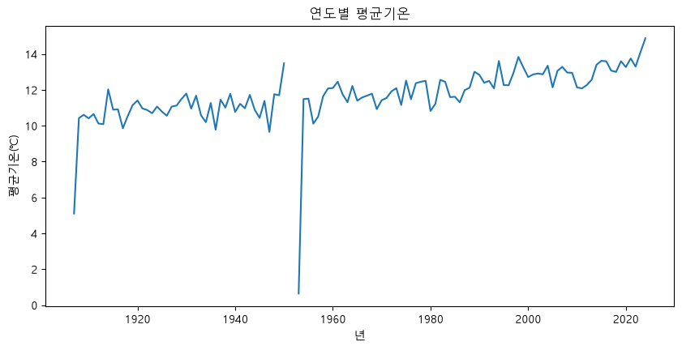

1950년대 초반에 눈에 띄는 계곡이 있다. 어느 해가 가장 추웠는지 확인해 보자.

```python
가장추운해 = yearly['평균'].idxmin()
print(f'{int(가장추운해)}년, 평균기온 {yearly["평균"].min():.2f}℃')
```

```text
1953년, 평균기온 0.64℃
```

서울이 1953년에 영하에 가까운 연평균을 기록했다는 뜻일까. `mean()`은 결측을 조용히 건너뛰고
계산한다 — 몇 개의 값으로 계산했는지部터 같이 봐야 한다.

```python
print(yearly.loc[1949:1954])
```

```text
             평균   날수
년                   
1949  11.700000  365
1950  13.478189  243
1951        NaN    0
1952        NaN    0
1953   0.641935   31
1954  11.487945  365
```

1953년은 날수가 **31일**뿐이다. 1951년과 1952년은 평균기온 값이 하루도 없어서 연평균 자체가
`NaN`이다(줄이 아예 비어 있다 — `NaN`이 아니라 계산할 재료가 없다). `날수`를 평균기온과
나란히 그리면 무슨 일이 있었는지 보인다.

```python
# 그림: v5-valley-with-count
fig, axes = plt.subplots(2, 1, figsize=(10, 6), sharex=True)
axes[0].plot(yearly.index, yearly['평균'], color='tab:blue')
axes[0].set_ylabel('평균기온(℃)')
axes[0].set_title('연평균기온')
axes[1].bar(yearly.index, yearly['날수'], color='tab:blue')
axes[1].axhline(360, color='#d03b3b', linestyle='--', linewidth=1)
axes[1].set_ylabel('날수')
axes[1].set_xlabel('년')
axes[1].set_title('그 해에 평균기온 값이 있는 날수 (빨간 선 = 360일)')
plt.tight_layout()
plt.show()
```

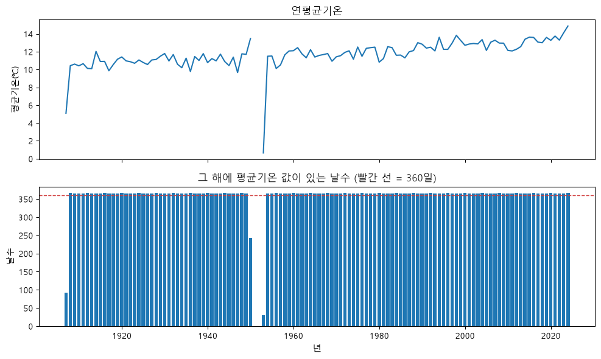

계곡이 있는 자리는 정확히 날수가 뚝 떨어진 자리와 겹친다. 1950~1953년은 한국전쟁 기간이다.
1951년과 1952년 구간을 확대해서 선이 어떻게 끊기는지 보자.

```python
# 그림: v5-valley-zoom
zoom = yearly.loc[1948:1957]
plt.figure(figsize=(9, 4.5))
plt.plot(zoom.index, zoom['평균'], color='tab:blue', marker='o')
for 년, 행 in zoom.iterrows():
    plt.annotate(f"{int(행['날수'])}일", (년, 행['평균']) if pd.notna(행['평균']) else (년, 6),
                 textcoords='offset points', xytext=(0, 8), ha='center', fontsize=8)
plt.ylabel('평균기온(℃)')
plt.xlabel('년')
plt.title('1948~1957년 확대 — 선이 끊긴 자리는 값이 아예 없다')
plt.show()
```

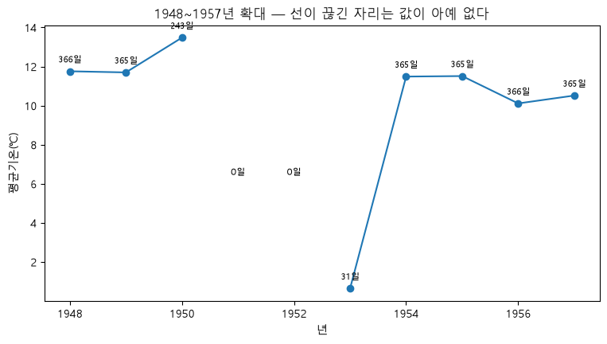

`NaN`이 있는 해는 선이 아래로 처지는 게 아니라 **끊어진다** — matplotlib이 `NaN`을 만나면
그 지점을 건너뛰기 때문이다. 1953년은 끊기지 않고 낮게 찍힌다. 값이 있어서(12월 31일치)
선은 이어지지만, 그 값은 "1년 평균"이 아니라 "12월 한 달 평균"이다. **에러도 경고도 없이,
겨울 한 달의 평균이 연평균이라는 이름을 달고 그래프에 올라간 것이다.**

날수가 충분한 해만 골라서 다시 그려 보자.

```python
valid = yearly[yearly['날수'] >= 360]
새가장추운해 = valid['평균'].idxmin()
print(f'{int(새가장추운해)}년, 평균기온 {valid["평균"].min():.2f}℃')
print(f'제외된 해 수: {len(yearly) - len(valid)}')
```

```text
1947년, 평균기온 9.66℃
제외된 해 수: 5
```

```python
# 그림: v5-valley-fixed
plt.figure(figsize=(10, 4.5))
plt.plot(valid.index, valid['평균'], color='tab:blue')
최저행 = valid.loc[valid['평균'].idxmin()]
plt.scatter([valid['평균'].idxmin()], [최저행['평균']], color='#d03b3b', zorder=3)
plt.annotate('1947년 (가장 추운 해)', (valid['평균'].idxmin(), 최저행['평균']),
             textcoords='offset points', xytext=(10, -12))
plt.ylabel('평균기온(℃)')
plt.xlabel('년')
plt.title('유효 날수 360일 이상인 해만')
plt.show()
```

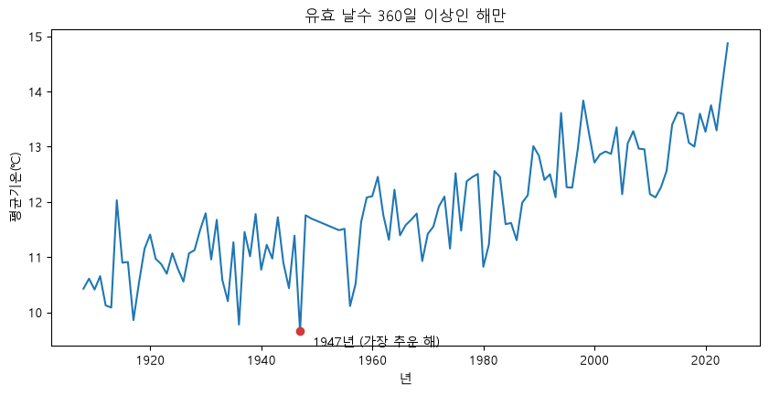

**같은 자료, 같은 함수(`mean()`)인데, 결측을 거르지 않고 계산하느냐에 따라 "가장 추운 해"가
1953년에서 1947년으로 바뀐다.** 어느 쪽도 `mean()`이 틀린 게 아니다 — `mean()`은 있는 값만
정직하게 평균 냈을 뿐이다. 틀린 건 며칠짜리 평균인지 확인하지 않고 "연평균"이라는 이름만
믿은 쪽이다. **연도별로 묶어 평균을 낼 때는 `count()`를 항상 같이 낸다.**

### V5.6 그림이 이상하면 데이터를 의심한다

시·도의 위치와 인구를 산점도로 그리는 예제가 있다. 아래 표는 수업 자료의 그 예제가 쓴
값 그대로다.

```python
옮긴표 = pd.DataFrame({
    '시도': ['서울특별시', '부산광역시', '대구광역시', '인천광역시',
             '대전광역시', '울산광역시', '경기도', '제주특별자치도'],
    '위도': [37.56608, 35.18002, 35.87154, 35.45619,
             36.35060, 35.53975, 37.27511, 33.48939],
    '경도': [126.97806, 129.07498, 128.60181, 126.70594,
             127.37488, 129.31153, 127.00915, 126.50041],
    '인구_표': [9550227, 3359527, 393626, 2938429,
                1454679, 1124459, 13530519, 675883],
})
print(옮긴표)
```

```text
        시도       위도       경도   인구_표
0    서울특별시  37.56608  126.97806   9550227
1    부산광역시  35.18002  129.07498   3359527
2    대구광역시  35.87154  128.60181    393626
3    인천광역시  35.45619  126.70594   2938429
4    대전광역시  36.35060  127.37488   1454679
5    울산광역시  35.53975  129.31153   1124459
6      경기도  37.27511  127.00915  13530519
7  제주특별자치도  33.48939  126.50041    675883
```

```python
# 그림: v5-population-scatter-typo
plt.figure(figsize=(6, 6))
plt.scatter(옮긴표['경도'], 옮긴표['위도'], s=옮긴표['인구_표'] / 10000,
            alpha=0.6, color='tab:blue')
for _, 행 in 옮긴표.iterrows():
    plt.annotate(행['시도'][:2], (행['경도'], 행['위도']), ha='center', va='center', fontsize=8)
plt.xlabel('경도')
plt.ylabel('위도')
plt.title('표를 그대로 옮긴 산점도')
plt.show()
```

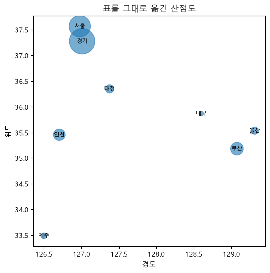

두 가지가 이상하다. **대구**는 원이 제주보다도 작다 — 대구가 인구 240만 가까운 광역시라는
걸 알면 말이 안 된다. **인천**은 위도가 낮아 부산 근처(경상도 해안)에 찍힌다 — 인천이
서해안 도시라는 걸 알면 역시 이상하다. `korea_pop.csv`에서 실제 값을 읽어 대조해 보자.

```python
실제인구 = pop.loc[옮긴표['시도'], '2021년08월_계_총인구수']
비교 = 옮긴표.set_index('시도')[['인구_표']].assign(인구_실제=실제인구.to_numpy())
print(비교)
```

```text
          인구_표   인구_실제
시도                         
서울특별시    9550227   9550227
부산광역시    3359527   3359527
대구광역시     393626   2393626
인천광역시   2938429   2938429
대전광역시   1454679   1454679
울산광역시   1124459   1124459
경기도    13530519  13530519
제주특별자치도  675883    675883
```

대구만 정확히 200만이 차이 난다 — 앞자리 `2`가 하나 빠졌다(393626 vs 2393626). 인구는
전부 CSV와 맞는데 유독 대구만 어긋난다는 것 자체가 "손으로 옮겨 적다 자릿수가 빠졌다"는
가장 흔한 원인을 가리킨다. 위도는 CSV에 없으니(이 파일은 인구만 담고 있다) 손으로 옮겨
적을 때 실수가 있었는지는 다른 방법으로 확인해야 한다 — 인천은 서울(37.57)·경기도(37.28)와
가까운 위도여야 자연스러운데 표의 값(35.46)은 부산(35.18)과 비슷하다. 실제 인천의 위도는
37.456 부근으로 알려져 있다 — 앞의 두 자리(37)가 부산과 비슷한 값(35)으로 잘못 옮겨진
것으로 보인다. 두 값을 바로잡아 다시 그리면 이렇다.

```python
# 그림: v5-population-scatter-real
고친표 = 옮긴표.copy()
고친표.loc[고친표['시도'] == '대구광역시', '인구_표'] = int(pop.loc['대구광역시', '2021년08월_계_총인구수'])
고친표.loc[고친표['시도'] == '인천광역시', '위도'] = 37.456
고친표 = 고친표.rename(columns={'인구_표': '인구'})

plt.figure(figsize=(6, 6))
plt.scatter(고친표['경도'], 고친표['위도'], s=고친표['인구'] / 10000, alpha=0.6, color='tab:blue')
for _, 행 in 고친표.iterrows():
    plt.annotate(행['시도'][:2], (행['경도'], 행['위도']), ha='center', va='center', fontsize=8)
plt.xlabel('경도')
plt.ylabel('위도')
plt.title('바로잡은 산점도')
plt.show()
```

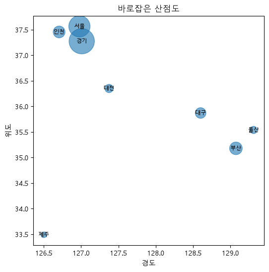

대구 원이 제 크기를 찾고, 인천이 서울·경기 근처로 올라온다. **숫자를 손으로 옮겨 적는
순간마다 이런 실수가 들어갈 수 있다.** 그림이 상식과 어긋나면 — 잘 아는 도시가 이상한
자리에 있다면 — 코드보다 자료 자체를 의심하는 것이 먼저다.

### V5.7 피라미드의 음수 눈금

남녀 인구를 한 그림에서 비교하는 인구 피라미드는 관례적으로 남자를 오른쪽(양수), 여자를
왼쪽(음수)으로 그린다. 제주의 나이별 인구로 그려 보자.

```python
남열 = pop.filter(regex=r'_남_\d+세|_남_100세 이상').columns
여열 = pop.filter(regex=r'_여_\d+세|_여_100세 이상').columns
나이 = [c.split('_')[-1] for c in 남열]

남 = pop.loc['제주특별자치도', 남열].to_numpy()
여 = pop.loc['제주특별자치도', 여열].to_numpy()
print(len(나이), 나이[0], 나이[-1])
```

```text
101 0세 100세 이상
```

```python
# 그림: v5-pyramid
y = np.arange(len(나이))
fig, axes = plt.subplots(1, 2, figsize=(10, 6), sharey=True)

axes[0].barh(y, 남, color='tab:blue', label='남')
axes[0].barh(y, -여, color='tab:orange', label='여')
axes[0].set_yticks(y[::10])
axes[0].set_yticklabels([나이[i] for i in y[::10]])
axes[0].set_title('나쁜 예 — 눈금이 음수')
axes[0].legend()

axes[1].barh(y, 남, color='tab:blue', label='남')
axes[1].barh(y, -여, color='tab:orange', label='여')
틱 = axes[1].get_xticks()
axes[1].set_xticks(틱)
axes[1].set_xticklabels([f'{abs(int(t)):,}' for t in 틱])
axes[1].set_title('좋은 예 — 절댓값 눈금')
axes[1].legend()
plt.tight_layout()
plt.show()
```

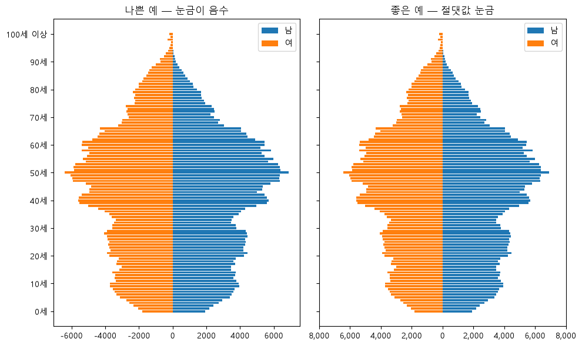

왼쪽 그림의 x축에는 `-8000`, `-6000`처럼 **음수 인구**가 찍혀 있다. 사람 수는 음수가 될 수
없으니 이건 자료가 아니라 "왼쪽으로 그리기 위해 부호를 뒤집었다"는 그리기 방식의 흔적일
뿐이다. 그런데 눈금에 그 흔적이 그대로 남으면 읽는 사람이 착각한다. 오른쪽처럼 눈금 값을
절댓값 문자열로 바꾸면 막대의 방향(왼쪽=여자, 오른쪽=남자)은 그대로 유지하면서 눈금은
사실대로 보인다. `matplotlib.ticker.FuncFormatter(lambda x, pos: f'{abs(int(x)):,}')`를
`ax.xaxis.set_major_formatter`에 넣어도 같은 효과를 낸다 — 눈금이 다시 그려질 때마다
자동으로 절댓값으로 바뀐다는 점이 다르다.

```python
남녀차 = pd.Series(남 - 여, index=나이)
print(f"남-여 합계: {남녀차.sum()}")
print(f"남이 가장 앞서는 나이: {남녀차.idxmax()} (+{남녀차.max()})")
print(f"여가 가장 앞서는 나이: {남녀차.idxmin()} ({남녀차.min()})")
```

```text
남-여 합계: 2041
남이 가장 앞서는 나이: 55세 (+666)
여가 가장 앞서는 나이: 88세 (-861)
```

### V5.8 점검표

그림을 내보내기 전에 다섯 가지를 확인한다.

- **제목이 주장인가, 사실인가.** "역대 최저"처럼 제목이 결론을 대신 내리고 있지 않은가.
- **축은 0부터인가.** 막대그래프인데 축이 잘려 있다면 이유를 설명할 수 있어야 한다.
- **단위가 적혀 있는가.** ℃인지 mm인지 없이는 숫자가 뜻을 잃는다.
- **결측을 확인했는가.** 평균·합계를 낸 값 옆에 몇 개로 낸 값인지(`count()`) 같이 적었는가.
- **색에 뜻이 있는가, 그리고 표로도 볼 수 있는가.** 툴팁이나 색이 유일한 정보 통로가 되면
  안 된다 — 숫자로도 확인할 길을 남긴다.

### V5.9 흔한 실수

**연도별 평균을 그대로 믿는다.** V5.5에서 본 것처럼 `groupby('년')['x'].mean()`은 며칠로
낸 평균인지 말해 주지 않는다. `count()`를 항상 같이 낸다.

**"두 값을 한눈에 보고 싶다"는 이유만으로 이중 축을 쓴다.** 두 선이 겹쳐 보이는 건 자료의
성질이 아니라 축 범위를 고른 사람의 선택이다. 그림을 나누거나 정규화한다.

```python
# ⚠ 에러도 경고도 없다. 그런데 전체 평균에서 전쟁 기간 두 해가 조용히 빠진다
print(yearly['평균'].count())
print(yearly['평균'].mean())
```

```text
116
11.694081898132573
```

`yearly`는 1907~2024년, 118개 행이 있는데 `count()`는 116을 센다. 1951년과 1952년은
평균기온 값 자체가 `NaN`이라 애초에 `날수` 표에서만 빈 줄로 보였고, 여기서는 평균 계산
대상에서 자동으로 빠진다. `mean()`은 항상 옳게 계산하지만, **몇 개를 빼고 계산했는지는
스스로 확인해야 한다** — 이 장 전체를 관통하는 문장이다.

### 확인 문제

**문제 V5-1.** 두 도시의 최근 5년 평균기온을 막대그래프로 비교하는데, 차이가 0.3℃뿐이라
"그래프가 밋밋해 보인다"는 이유로 y축을 12에서 시작했다. 무엇이 문제인가?

<details><summary>답</summary>

막대그래프는 막대의 길이(0부터 잰 높이)로 크기를 비교하는 그림이다. 축을 12에서 시작하면
실제로는 작은 차이(0.3℃)가 화면에서는 훨씬 큰 차이로 보인다 — 두 막대의 높이 비율이 실제
값의 비율과 달라진다. 차이가 작다는 사실 자체를 숨기지 않고 그대로 보여 주는 것이 맞고,
정 강조하고 싶으면 두 막대 위에 실제 값(숫자)을 적어 준다.

</details>

**문제 V5-2.** 연도별 평균기온과 강수량을 이중 y축 그래프로 그렸더니 두 선이 거의 겹쳐
보였다. 이 그림만으로 "기온이 오르면 강수량도 는다"고 결론 내려도 되는가?

<details><summary>답</summary>

안 된다. 이중 y축에서는 각 축의 범위를 그리는 사람이 따로 정하므로, 두 선이 겹쳐 보이도록
범위를 고르는 것이 항상 가능하다 — 실제 상관관계가 약해도 축만 조절하면 겹쳐 보이게 만들
수 있다. 관계를 판단하려면 그림을 두 개로 나눠 각자의 축에서 추세를 보거나, 상관계수처럼
축과 무관한 수치로 확인해야 한다.

</details>

**문제 V5-3.** `yearly.groupby('년')['평균기온'].mean()`으로 구한 "가장 추운 해"가 1953년이라고
보고서에 썼다. 이 결론에서 무엇을 더 확인해야 하는가?

<details><summary>답</summary>

그 해의 평균을 며칠로 계산했는지(`count()`)를 확인해야 한다. 1953년은 실제로 12월 한 달
(31일)치 값만 있어서 "연평균"이 아니라 "12월 평균"에 가깝다. 날수가 충분한 해만 놓고 다시
계산하면 가장 추운 해는 1947년으로 바뀐다. `mean()`은 있는 값만으로 정직하게 계산하지만,
몇 개의 값으로 계산했는지는 별도로 확인해야 한다.

</details>

**문제 V5-4.** 인구 피라미드에서 여자 쪽 막대를 `-여성인구`로 그렸더니 x축 눈금에 `-50000`
같은 값이 찍혔다. 이 눈금을 그대로 보고서에 실어도 되는가? 안 된다면 어떻게 고치는가?

<details><summary>답</summary>

안 된다. 인구는 음수가 될 수 없으므로 `-50000`은 사실이 아니라 "왼쪽 방향으로 그리기 위해
부호만 뒤집었다"는 그리기 방식의 흔적이다. 막대의 방향(왼쪽 = 여자)은 그대로 두고, 눈금
라벨만 절댓값으로 바꾼다 — `ax.set_xticklabels`에 `abs()`를 적용한 문자열을 넣거나
`matplotlib.ticker.FuncFormatter`로 눈금이 그려질 때마다 절댓값으로 바꾸게 한다.

</details>

### 🧪 실습실
> 웹앱 **V5**에서 **y축 자르기** 시뮬레이터로 축 시작값을 슬라이더로 옮기며 막대 높이의
> "보이는 비율"과 "실제 비율"이 얼마나 벌어지는지 확인해 보라. **결측의 계곡** 시뮬레이터는
> 연평균 선과 날수 막대를 나란히 두고 "날수 360일 미만인 해 빼기"를 토글로 켜고 끌 수 있다.
> **인구 피라미드** 시뮬레이터에서는 시도를 바꿔 가며 눈금을 절댓값으로 켜고 끌 수 있다.

---

## V6장. EDA 실습 — 부산 강수량 118년

> 지금까지 배운 것을 혼자 써서 처음 보는 자료를 끝까지 탐색한다. 이 장을 읽고 나면 결측을
> 판단하는 절차, 시계열·그룹으로 요약하는 방법, 그리고 본 것을 세 줄로 정리하는 습관을
> 갖게 된다.

### V6.1 문제 제기 — 63.8%가 비어 있는 자료

부산의 일별 강수량 자료를 불러온다.

```python
import pandas as pd
import numpy as np
import matplotlib.pyplot as plt
import seaborn as sns

pd.set_option('display.max_columns', 30)
pd.set_option('display.width', 200)
pd.set_option('display.max_colwidth', 40)
plt.rc('font', family='Malgun Gothic')   # 맥은 'AppleGothic'
plt.rc('axes', unicode_minus=False)

# 출처: 기상청 기상자료개방포털 (공공누리 제1유형)
rain = pd.read_csv('busan_rain_day.csv', encoding='cp949')
print(rain.shape)
print(rain['강수량'].isna().sum())
print(rain['강수량'].isna().mean())
```

```text
(43100, 3)
27477
0.6375174013921113
```

118년치 43,100일 중 27,477일(63.8%)이 결측이다. 절반이 훨씬 넘는다. "그냥 결측인 행을
지우면 되지 않을까" — 해 보자.

```python
# ⚠ 에러도 경고도 없다. 그런데 데이터의 3분의 2 가까이가 사라진다
지운뒤 = rain.dropna()
print(지운뒤.shape)
```

```text
(15623, 3)
```

43,100행이 15,623행으로 준다. 지운 게 정말 "쓸모없는 빈 자리"인지, 아니면 다른 뜻을 가진
값인지 먼저 판단해야 한다 — 이 장의 ②가 그 판단을 다룬다. 그전에 자료를 한 번 훑어보자.

### V6.2 ① 불러오기·기본 확인

```python
print(rain.head(3))
print(rain.tail(3))
```

```text
          날짜   지점  강수량
0  1907-01-01  159  NaN
1  1907-01-02  159  NaN
2  1907-01-03  159  0.0
              날짜   지점  강수량
43097  2024-12-29  159  NaN
43098  2024-12-30  159  NaN
43099  2024-12-31  159  NaN
```

`train.csv`나 `seoul_temp_day.csv`와 달리 이 파일은 탭도, 빈 행도 없다. 날짜가
문자열이라는 것과 `지점`이 처음부터 정수(159, 부산)라는 것만 확인하고 바로 다음으로 간다.

```python
rain.info()
```

```text
<class 'pandas.DataFrame'>
RangeIndex: 43100 entries, 0 to 43099
Data columns (total 3 columns):
 #   Column  Non-Null Count  Dtype  
---  ------  --------------  -----  
 0   날짜      43100 non-null  str    
 1   지점      43100 non-null  int64  
 2   강수량     15623 non-null  float64
dtypes: float64(1), int64(1), str(1)
memory usage: 1010.3 KB
```

`강수량`만 결측이 있다는 것을 `info()`가 한 번에 보여 준다. 날짜를 다룰 수 있게 바꾼다.

```python
rain['날짜'] = pd.to_datetime(rain['날짜'])
rain['년'] = rain['날짜'].dt.year
rain['월'] = rain['날짜'].dt.month
print(rain['년'].min(), rain['년'].max())
```

```text
1907 2024
```

### V6.3 ② ★ 결측은 무엇인가

결측이 63.8%나 되면 그 뜻부터 판단해야 한다. 후보는 두 가지다 — 관측 장비가 고장 나서
기록을 못 한 **관측 공백**이거나, 비가 안 와서 적을 값이 없어 **비워 둔 것**이거나.
둘 중 어느 쪽인지 증거를 모은다.

**증거 ① — 결측 비율이 해마다 고르다.** 관측 공백이라면 특정 시기(장비 고장 기간)에
몰려 있어야 자연스럽다.

```python
연도별결측률 = rain.groupby('년')['강수량'].apply(lambda s: s.isna().mean())
print(연도별결측률.describe())
```

```text
count    118.000000
mean       0.637521
std        0.042071
min        0.452055
25%        0.608219
50%        0.636986
75%        0.663251
max        0.742466
Name: 강수량, dtype: float64
```

118개 해 전부 결측 비율이 45~74% 사이에 있다. 어느 한 해가 통째로 비어 있지도, 통째로 채워져
있지도 않다 — 118년 동안 고르게 반복되는 패턴이다.

**증거 ② — 결측 비율이 달마다 다르고, 그 차이가 강수량과 반대로 움직인다.**

```python
월별결측률 = rain.groupby('월')['강수량'].apply(lambda s: s.isna().mean())
월별평균 = rain.groupby('월')['강수량'].mean()
print(pd.DataFrame({'결측률': 월별결측률.round(3), '평균강수량': 월별평균.round(1)}))
```

```text
      결측률  평균강수량
월               
1   0.756    4.4
2   0.710    5.5
3   0.654    7.7
4   0.610   11.7
5   0.621   12.1
6   0.536   14.6
7   0.449   16.6
8   0.544   14.5
9   0.553   13.7
10  0.729    8.3
11  0.723    6.3
12  0.767    4.3
```

```python
# 그림: v6-missing-vs-rain
fig, axes = plt.subplots(2, 1, figsize=(8, 6), sharex=True)
axes[0].bar(월별결측률.index, 월별결측률.to_numpy(), color='tab:blue')
axes[0].set_ylabel('결측 비율')
axes[0].set_title('월별 결측 비율')
axes[1].bar(월별평균.index, 월별평균.to_numpy(), color='tab:blue')
axes[1].set_ylabel('평균 강수량(mm)')
axes[1].set_xlabel('월')
axes[1].set_title('월별 평균 강수량 (결측을 뺀 mean())')
plt.tight_layout()
plt.show()
```

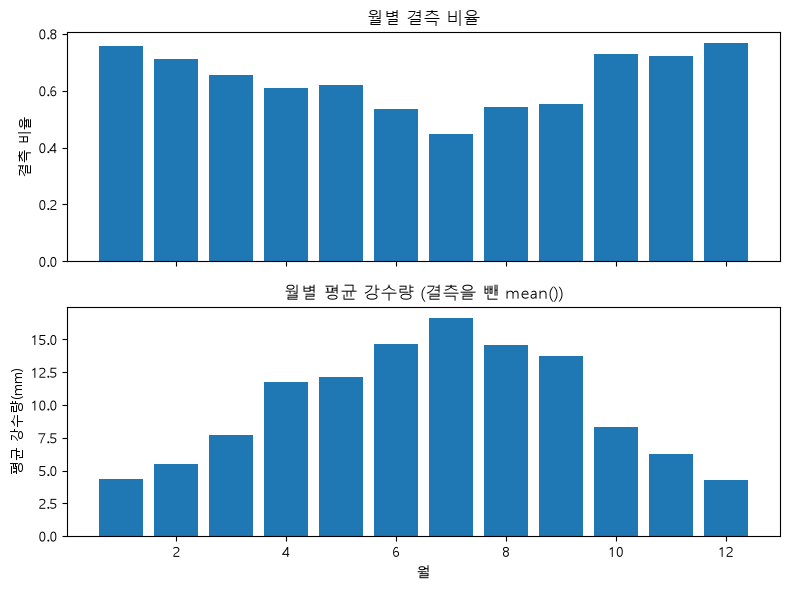

비가 가장 많이 오는 7월(16.6mm)이 결측이 가장 적고(44.9%), 비가 가장 적은 12월·1월이
결측이 가장 많다(76% 안팎). **관측 장비가 계절을 가려 가며 고장 났다고 보기는 어렵다.**
반대로 "비가 안 온 날은 적을 값이 없어서 빈칸으로 남긴다"는 관례라면 이 패턴이 정확히
설명된다.

**증거 ③ — `0.0`이라는 값이 따로 있다.**

```python
print((rain['강수량'] == 0.0).sum())
print((rain['강수량'] > 0).sum())
```

```text
3792
11831
```

관측 장비가 "비가 0mm 왔다"는 것과 "기록이 없다"는 것을 구분해서 남긴다는 뜻이다. 만약
결측이 전부 "비가 0mm"였다면 `0.0`이라는 값이 따로 있을 이유가 없다. 세 증거를 합치면:
**이 결측은 관측 공백이 아니라 "비가 오지 않아 적지 않은 날"로 읽는 것이 합리적이다.**

이 판단에 따라 숫자가 달라진다. 합계와 평균을 두 가지 방법으로 비교해 보자.

```python
합계_원본 = rain['강수량'].sum()
합계_0채움 = rain['강수량'].fillna(0).sum()
평균_원본 = rain['강수량'].mean()
평균_0채움 = rain['강수량'].fillna(0).mean()
print(f'합계: {합계_원본:.1f}mm (원본) vs {합계_0채움:.1f}mm (0으로 채움)')
print(f'평균: {평균_원본:.3f}mm (원본) vs {평균_0채움:.3f}mm (0으로 채움)')
print(f'평균의 비율: {평균_원본 / 평균_0채움:.2f}배')
```

```text
합계: 173518.3mm (원본) vs 173518.3mm (0으로 채움)
평균: 11.107mm (원본) vs 4.026mm (0으로 채움)
평균의 비율: 2.76배
```

**합계는 조금도 바뀌지 않는다** — `sum()`은 애초에 `NaN`을 0처럼 취급하고 더하기 때문이다
(합칠 값이 없으면 더할 게 없을 뿐이다). 그런데 **평균은 2.76배 차이가 난다** — 나누는
분모(날수)가 15,623일(비가 왔거나 기록이 있는 날만)인지 43,100일(전체 날)인지가 완전히
다르기 때문이다. "부산의 일평균 강수량"이라는 말 한마디에도 어느 분모를 썼는지가 숨어 있다.
이 판단은 pandas가 대신 내려 주지 않는다.

### V6.4 ③ 단일 변수 살펴보기 — 비 온 날의 분포

전체가 아니라 실제로 비가 온 날(강수량 > 0)만 놓고 분포를 본다.

```python
rainy = rain[rain['강수량'] > 0]['강수량']
print(rainy.describe())
```

```text
count    11831.000000
mean        14.666410
std         25.237762
min          0.100000
25%          1.000000
50%          4.900000
75%         17.500000
max         439.000000
Name: 강수량, dtype: float64
```

평균(14.7mm)이 중앙값(4.9mm)보다 훨씬 크다 — 적은 비가 대부분이고, 아주 많이 오는 날이
드물게 섞여 평균을 끌어올린다는 뜻이다. 히스토그램으로 확인한다.

```python
# 그림: v6-rainy-dist
fig, axes = plt.subplots(1, 2, figsize=(10, 4.5))
axes[0].hist(rainy, bins=40, color='tab:blue')
axes[0].set_xlabel('강수량(mm)')
axes[0].set_title('그대로')
axes[1].hist(rainy, bins=40, color='tab:blue')
axes[1].set_yscale('log')
axes[1].set_xlabel('강수량(mm)')
axes[1].set_title('y축을 로그로')
plt.tight_layout()
plt.show()
```

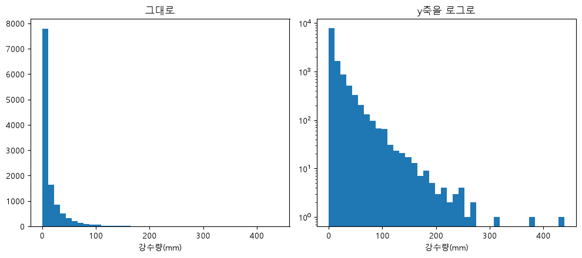

왼쪽 그림에서는 10mm를 넘는 날이 거의 안 보일 만큼 눌려 있다. y축을 로그로 바꾸면(오른쪽)
빈도가 낮은 큰 값들도 눈에 들어온다 — 대부분의 비는 약하게 오고, 아주 많이 오는 날은 수는
적어도 분명히 존재한다는 것이 드러난다.

### V6.5 ④ 시계열과 그룹으로 요약하기

한 해의 강수량 합계를 구할 때는 `min_count=1`을 준다 — 그 해가 (있을 리는 없지만) 전부
결측이면 `0`이 아니라 `NaN`으로 남기기 위해서다.

```python
연강수량 = rain.groupby('년')['강수량'].sum(min_count=1)
print(f'최대: {연강수량.idxmax()}년 {연강수량.max():.1f}mm')
print(f'최소: {연강수량.idxmin()}년 {연강수량.min():.1f}mm')
print(f'평년(1991~2020) 평균: {연강수량.loc[1991:2020].mean():.1f}mm')
```

```text
최대: 1999년 2396.7mm
최소: 1929년 772.7mm
평년(1991~2020) 평균: 1576.7mm
```

```python
# 그림: v6-annual-rain
plt.figure(figsize=(10, 4.5))
plt.plot(연강수량.index, 연강수량.to_numpy(), color='tab:blue')
plt.axhline(연강수량.loc[1991:2020].mean(), color='#898781', linestyle='--', linewidth=1,
            label='평년(1991~2020)')
plt.scatter([연강수량.idxmax()], [연강수량.max()], color='#1baf7a', zorder=3, label='최대(1999)')
plt.scatter([연강수량.idxmin()], [연강수량.min()], color='#d03b3b', zorder=3, label='최소(1929)')
plt.ylabel('연강수량(mm)')
plt.xlabel('년')
plt.legend()
plt.title('부산 연강수량 118년')
plt.show()
```

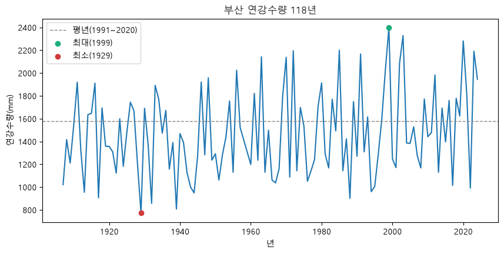

가장 비가 많이 온 해와 적게 온 해의 차이는 3배가 넘는다. 이제 월별로 묶어 어느 달에 비가
몰리는지 본다. 이번에는 `min_count`를 주지 않는다 — 한 달이 통째로 결측인 경우(예:
1987년 12월)가 실제로 있고, 그런 달은 "그 달은 0mm"로 보는 것이 이 절의 목적(계절 패턴)에
맞기 때문이다.

```python
연도별월합계 = rain.groupby(['년', '월'])['강수량'].sum().reset_index()
월별평균2 = 연도별월합계.groupby('월')['강수량'].mean()
print(월별평균2.round(1))
```

```text
월
1     32.9
2     44.8
3     82.9
4    137.1
5    142.0
6    203.4
7    284.3
8    205.7
9    184.3
10    69.9
11    52.3
12    30.9
Name: 강수량, dtype: float64
```

```python
# 그림: v6-monthly-rain
plt.figure(figsize=(9, 4.5))
색 = ['tab:orange' if m == 월별평균2.idxmax() else 'tab:blue' for m in 월별평균2.index]
plt.bar(월별평균2.index, 월별평균2.to_numpy(), color=색)
plt.ylabel('월 강수량 평균(mm)')
plt.xlabel('월')
plt.title('월별 평균 강수량 (해마다 월 합계를 낸 뒤 평균)')
plt.show()
```

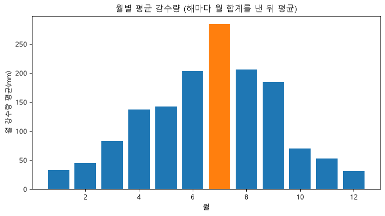

7월(284.3mm)이 가장 많고 12월(30.9mm)이 가장 적다 — 장마와 태풍이 겹치는 여름에 강수가
집중된다는 사실이 숫자로 드러난다. 가장 비가 많이 온 날도 확인해 보자.

```python
최다일 = rain.loc[rain['강수량'].idxmax()]
print(최다일[['날짜', '강수량']])
```

```text
날짜     1991-08-23 00:00:00
강수량                   439.0
Name: 30915, dtype: object
```

하루 만에 439.0mm — 이 날 무슨 기상 현상이 있었는지는 이 표만으로는 알 수 없다. 날짜와
숫자 이상을 알고 싶다면 다른 자료를 찾아봐야 한다.

### V6.6 ⑤ 시각화 — seaborn으로 다시 그리기

118개 해를 막대로 다 그리면 x축 글자가 겹쳐 읽을 수 없다. 최근 30년만 미리 집계해서
그린다(전체 흐름은 앞의 선 그래프에서 이미 보았다).

```python
# 그림: v6-sns-barplot
최근30 = 연강수량.loc[1995:2024].reset_index()
최근30.columns = ['년', '강수량']
plt.figure(figsize=(11, 4.5))
sns.barplot(data=최근30, x='년', y='강수량', color='tab:blue')
plt.xticks(rotation=90)
plt.title('최근 30년 연강수량 (미리 집계한 값을 그린다)')
plt.show()
```

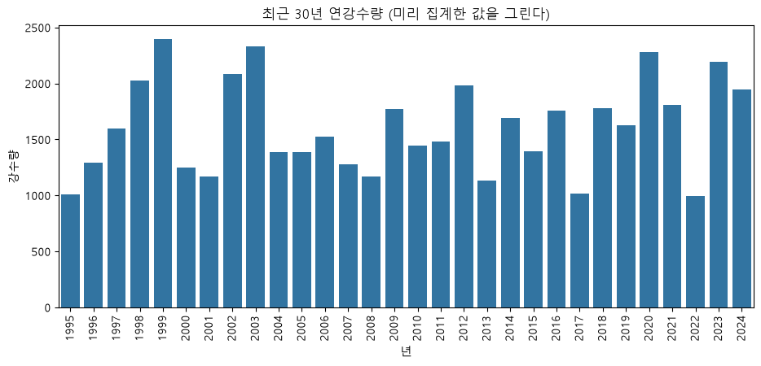

`sns.pointplot`으로 월별 평균과 해마다의 흩어진 정도(오차 막대)를 함께 본다.

```python
# 그림: v6-sns-pointplot
plt.figure(figsize=(9, 4.5))
sns.pointplot(data=연도별월합계, x='월', y='강수량', color='tab:blue')
plt.ylabel('월 강수량(mm)')
plt.title('월별 평균과 해마다의 흩어짐(오차 막대)')
plt.show()
```

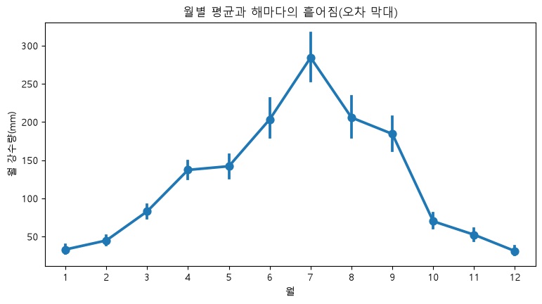

7월 근처의 오차 막대가 가장 길다 — 평균만 큰 게 아니라 **해마다 편차도 크다**(장마·태풍이
드는 해와 아닌 해의 차이). 월별 분포를 상자그림으로도 본다. 이번에는 비 온 날의 실제 값만
쓴다.

```python
# 그림: v6-sns-boxplot
# ✗ 경고가 뜬다. matplotlib 3.11 이 boxplot 의 옛 매개변수(vert)를 없애는 중이고
#   seaborn 0.13.2 는 아직 그 이름을 쓴다 — 그림 자체는 정상이다 (부록 시각화 C-10)
plt.figure(figsize=(9, 4.5))
sns.boxplot(data=rain[rain['강수량'] > 0], x='월', y='강수량', color='tab:blue')
plt.ylabel('강수량(mm)')
plt.title('월별 강수량 분포 (비 온 날만)')
plt.show()
```

```text
MatplotlibDeprecationWarning: vert: bool was deprecated in Matplotlib 3.11 and
will be removed in 3.13. Use orientation: {'vertical', 'horizontal'} instead.
```

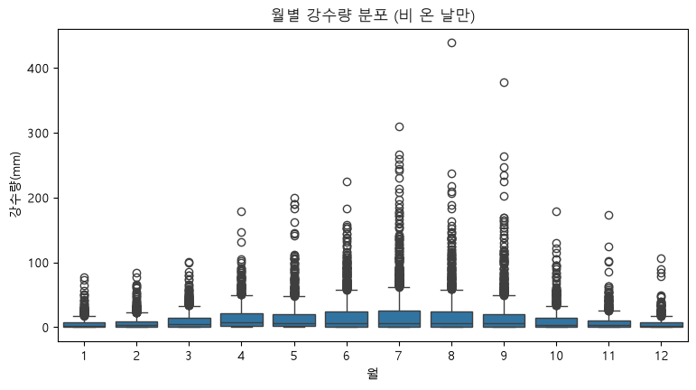

이 경고는 코드가 틀려서가 아니라 matplotlib과 seaborn의 지금 버전 조합 때문에 뜬다 —
seaborn 안쪽 코드가 matplotlib이 없애는 중인 옛 이름(`vert`)을 아직 쓰고 있어서다(부록 시각화
C-10). 학생이 고칠 수 있는 부분이 아니고 그림도 정상적으로 그려진다. 상자 위쪽 수염 밖으로
점이 많이 튀는 달일수록 극단적인 폭우가 잦다는 뜻이다. 이 경고는 상자그림을 부를 때마다
뜨므로, 이제부터는 그 문구 하나만 걸러서 조용히 만든다 — 경고 전체를 끄는 것과는 다르다.

마지막으로 계절별로 나눠 각 계절 안에서 강수량이 어떻게 흩어져 있는지 한 번에 비교한다.
`catplot`은 범주마다 작은 그림을 나란히 그려 준다 — 12개 달 대신 4개 계절로 묶어 한눈에
비교한다.

```python
def 계절(월):
    if 월 in (3, 4, 5):
        return '봄'
    if 월 in (6, 7, 8):
        return '여름'
    if 월 in (9, 10, 11):
        return '가을'
    return '겨울'

rain_계절 = rain[rain['강수량'] > 0].copy()
rain_계절['계절'] = rain_계절['월'].apply(계절)
```

```python
# 그림: v6-sns-catplot
import warnings
warnings.filterwarnings('ignore', message='vert: bool was deprecated')  # 부록 시각화 C-10
g = sns.catplot(data=rain_계절, x='강수량', col='계절', kind='box',
                 col_order=['봄', '여름', '가을', '겨울'], color='tab:blue', height=3.2)
g.figure.suptitle('계절별 강수량 분포 (비 온 날만)', y=1.05)
plt.show()
```

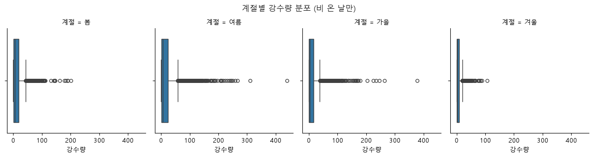

여름 상자가 가장 오른쪽까지 늘어져 있다 — 여름에 강한 비가 가장 자주, 가장 세게 온다는
것을 계절 네 개로 압축해서 보여 준다.

극값도 따로 짚어 보자.

```python
# 그림: v6-top-extreme-days
상위10 = rain.nlargest(10, '강수량')[['날짜', '강수량']].sort_values('강수량')
plt.figure(figsize=(8, 4.5))
plt.barh(상위10['날짜'].dt.strftime('%Y-%m-%d'), 상위10['강수량'], color='tab:blue')
plt.xlabel('강수량(mm)')
plt.title('일강수량 상위 10일 (118년 중)')
plt.show()
```

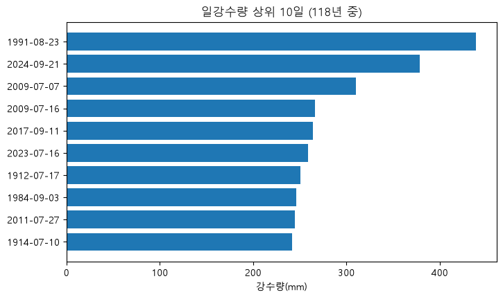

### V6.7 ⑥ 통찰 정리

지금까지 본 것을 세 줄로 정리한다. 아래는 예시일 뿐이다 — 실제로는 자기가 직접 확인한
것만 자기 말로 쓴다.

1. 부산 강수량 자료는 63.8%가 결측이지만, 해마다 고르게 나타나고 비가 잦은 달일수록
   결측이 적다 — "비가 안 와서 비워 둔 것"으로 판단했다.
2. 그래서 연강수량 합계는 결측 처리 방식과 관계없이 그대로지만, 일평균은 결측을 0으로
   볼 때와 아닐 때가 2.76배 차이 난다.
3. 가장 비가 많이 온 해(1999, 2396.7mm)와 적게 온 해(1929, 772.7mm)가 3배 넘게 차이
   난다는 것은 확인했지만, 그 차이를 만든 개별 기상 현상이 무엇인지는 이 표만으로는
   알 수 없다.

### V6.8 흔한 실수

**결측 비율만 보고 바로 지운다.** 63.8%라는 숫자만 보면 "거의 못 쓰는 자료"로 보이지만,
그 결측이 무엇을 뜻하는지 확인하면(V6.3의 세 증거) 오히려 지우지 않고 그대로 쓰는 게 맞는
경우도 있다.

**`sum()`에 `min_count`를 안 준다.** 기본값(`min_count=0`)은 그 그룹이 전부 결측이어도
`0`을 돌려준다 — "0mm 확실"과 "그 기간은 기록이 아예 없음"이 구별되지 않는다.

```python
연도별월합계2 = rain.groupby(['년', '월'])['강수량'].sum()
연도별월합계3 = rain.groupby(['년', '월'])['강수량'].sum(min_count=1)
print(연도별월합계2.loc[(1987, 12)])
print(연도별월합계3.loc[(1987, 12)])
```

```text
0.0
nan
```

1987년 12월은 하루도 강수량 기록이 없는 달이다. `min_count`가 없는 `sum()`은 이걸 "비가
0mm"로 둔갑시킨다. **그 기간에 정말 관측이 있었는지 확실하지 않다면 `min_count=1`을 쓴다.**

**표본 크기를 다르게 두고 두 값을 비교한다.** V6.4에서 본 것처럼 "평균 강수량"이라는
말 한마디에도 분모가 15,623일(비 온 날만)인지 43,100일(전체 날)인지가 숨어 있다. 값을
발표할 때는 분모가 무엇인지도 함께 말한다.

### 확인 문제

**문제 V6-1.** `rain['강수량'].isna().sum()`이 27,477이라는 걸 보고 "관측 장비가 자주
고장 났다"고 결론 내렸다. 이 결론에 반박할 증거를 이 장에서 찾아 두 가지 이상 말하라.

<details><summary>답</summary>

두 가지 이상: ① 결측 비율이 118년 내내 45~74% 사이에서 고르게 나타난다 — 장비 고장이라면
특정 시기에 몰려야 자연스러운데 그렇지 않다. ② 결측 비율이 비가 많이 오는 달(7월, 44.9%)에
낮고 적게 오는 달(12월·1월, 76% 안팎)에 높다 — 강수량과 반대로 움직이는 패턴은 장비 고장이
아니라 "비가 안 와서 적지 않았다"는 설명과 맞아떨어진다. ③ 결측과 별도로 `0.0`이라는 값이
3,792일 있다 — 장비가 "비가 0mm 왔다"와 "기록이 없다"를 구분해서 남긴다는 뜻이다.

</details>

**문제 V6-2.** 연강수량의 합계는 결측을 0으로 채우든 안 채우든 똑같은데, 일평균은 왜
2.76배나 차이가 나는가?

<details><summary>답</summary>

`sum()`은 더할 값이 없으면(결측) 그냥 더하지 않을 뿐이라서 결측을 0으로 채우든 안 채우든
합계 자체는 바뀌지 않는다. 반면 평균은 합계를 "며칠로 나누는가"에 따라 달라진다. 결측을
빼고 계산하면 분모가 15,623일(강수량 값이 있는 날)이고, 결측을 0으로 채우면 분모가
43,100일(전체 날)이 된다 — 분모가 거의 3배 차이 나므로 평균도 그만큼 달라진다.

</details>

**문제 V6-3.** `rain.groupby(['년', '월'])['강수량'].sum()`(min_count 없이)과
`sum(min_count=1)`의 결과가 다른 딱 한 자리가 있다. 왜 그 자리에서만 다른가?

<details><summary>답</summary>

1987년 12월이다. 이 달은 하루도 강수량 값이 없는(전부 결측인) 유일한 달이다.
`min_count`가 없는 기본 `sum()`은 더할 값이 하나도 없어도 `0.0`을 돌려주는데,
`min_count=1`을 주면 "적어도 하나는 값이 있어야 진짜 합계로 인정한다"는 뜻이 되어 이
달만 `NaN`으로 남는다. 다른 달·해는 결측이 섞여 있어도 값이 하나 이상은 있어서 두 방식의
결과가 같다.

</details>

### 🧪 실습실
> 웹앱 **V6**에서 **결측 판단 실험실**의 "결측 = 0" 토글을 켜고 꺼 보며 합계·평균·중앙값·
> 날수가 어떻게 따로 움직이는지 확인해 보라. **연·월 집계 탐색기**로 연도·월·계절을 바꿔
> 가며 강수량 합계 막대를 직접 만들어 보고, **극값 찾기**로 상위 며칠·몇 해가 전체 그림을
> 얼마나 좌우하는지 살펴보라.

<!-- 2부 끝 -->

---

## 부록. 원본에서 바로잡은 점

이 부록은 원본 강의 자료(pandas 1.1.5 / 1.3.4 기준, 2020~2021년 제작)와 지금 환경(pandas 3.0.5) 사이의 차이를 정리한 참조표다. 예전 자료나 인터넷에서 옛날 pandas 코드를 보다가 지금 환경에서 막혔을 때 찾아보라고 만들었다. 세 종류로 나눈다 — **개념 자체가 틀렸던 것(A)**, **개념은 맞지만 버전이 올라가며 출력이나 동작이 바뀐 것(B)**, **없어졌을 거라고 오해하기 쉽지만 실제로는 여전히 동작하는 것(C)**.

### A. 사실을 바로잡은 것

**A-1. "Series는 `numpy.ndarray`의 자식 클래스다" — 틀렸다.**

원본 자료 세 곳이 이렇게 설명한다. 실제로 확인하면 다르다.

| 옛 설명 | 지금 사실 |
|:---|:---|
| Series는 ndarray를 상속한 하위 클래스다 | `issubclass(pd.Series, np.ndarray)`는 `False`다 |
| ndarray에 기능이 좀 더 붙은 것뿐이다 | Series는 ndarray를 **내부에 담고 있을 뿐**이다(합성) |

Series에서 진짜 넘파이 배열이 필요하면 `.values`나 `.to_numpy()`로 꺼내야 한다. 상속이라고 믿으면 인덱스 정렬(6장)처럼 ndarray에는 없는 동작을 설명할 방법이 없다(1장, 3장에서 자세히 다뤘다).

**A-2. "`drop()`은 view에서만 삭제한다" — 틀렸다.**

원본은 "`del`과 달리 `drop`은 가상으로만 삭제(view에서만 삭제)한다"고 적었다. pandas에서 "view(뷰)"는 **메모리를 공유한다**는 뜻의 구체적인 기술 용어다.

| 옛 표현 | 지금 사실 |
|:---|:---|
| drop은 view에서만 지운다 | `drop()`은 **복사본**을 반환한다. 원본과 메모리를 공유하지 않는다(`np.shares_memory`로 확인하면 `False`) |

이 오해를 그대로 외우면 "뷰"라는 단어의 뜻 자체를 거꾸로 배우게 된다(4장, 7장).

**A-3. "얕은 복사"와 "뷰"는 같은 말이 아니다.**

`Numpy 얇은 복사.pdf`는 두 용어를 섞어 쓴다. 이 교재는 셋을 분리해서 가르친다.

| 용어 | 뜻 |
|:---|:---|
| 뷰(view) | 새 객체지만 데이터는 원본과 **공유**한다 |
| (얕은) 복사(copy) | 데이터를 통째로 새로 만든다. **독립**이다 |
| Copy-on-Write | 평소엔 공유하다가 **쓰는 순간에만** 복사한다(pandas 3.0 기본) |

넘파이 슬라이싱은 뷰이고, pandas 3.0의 슬라이싱은 Copy-on-Write다 — "메모리를 공유한다"와 "써도 반영된다"는 서로 다른 이야기라는 것이 7장의 핵심이다.

**A-4. 중복 인덱스가 왜 행을 늘리는지 설명하지 않는다.**

원본은 인덱스에 `'e'`가 두 번 들어간 예제를 보여주면서 "양쪽에 있는 것끼리 연산하고 없으면 NaN"이라고만 적는다. 결과에 `'e'`가 두 줄이 되는 이유(중복된 라벨끼리는 곱집합으로 짝지어진다)는 원본에 없다. 이 교재는 이 예제를 인덱스 정렬 장(6장)의 핵심 예제로 승격했다.

**A-5. `describe`를 괄호 없이 호출한 출력이 노트북에 남아 있다.**

원본 노트북에 `data.describe`(괄호 없음)라는 코드가 있는데, 화면에는 통계표가 그대로 떠 있다. `describe`는 메서드이므로 괄호 없이 쓰면 `<bound method ...>` 객체가 나와야 정상이다. 화면의 표는 **이전에 괄호를 붙여 실행했던 결과가 남아 있는 것**이다. "노트북의 출력은 지금 이 셀의 코드가 아니라 실행 순서의 결과"라는 사실 자체가 2장과 13장의 주제다.

**A-6. 파일명·변수명의 단순한 오타.**

| 옛 코드 | 지금 코드 | 무엇이 문제였나 |
|:---|:---|:---|
| `pd.read_csv('abalron.csv')` | `pd.read_csv('abalone.csv')` | 파일명 오타 |
| `pd.read_csv('titanic_train.csv')` | `pd.read_csv('train.csv')` | 실제 파일명과 다름 |
| `dict = {'col1': [1, 11], ...}` | `col_dict = {...}` | `dict`는 파이썬 내장 타입 이름이다. 변수로 덮어쓰면 이후 `dict(...)` 호출이 `TypeError`로 죽는다 |
| `!kaggle datasets download ...` | 로컬 파일을 직접 읽는다 | 인증 토큰이 없으면 `401 Unauthorized`. 이 교재는 로컬 파일 읽기로 통일했다 |

**A-7. `abalone.csv`의 영문 컬럼 이름 — `KeyError`.**

원본 머신러닝 노트북들은 `df['Whole weight']`, `df['Shucked weight']`처럼 영문 이름으로 접근한다. 이 저장소의 `abalone.csv`는 컬럼이 한글(`길이, 직경, 두께, 전체무게, 내장무게, 껍질무게, 나이테, 순살무게`)이라 그대로 실행하면 `KeyError`가 난다(14.10절에서 직접 재현했다). 새 데이터를 받으면 컬럼 이름부터 확인하는 습관이 이래서 필요하다.

### B. 버전이 달라진 것

옛 자료의 **출력**을 그대로 베끼면 지금 환경과 어긋나는 항목들이다. 개념은 그대로지만 화면에 보이는 글자가 다르다.

| 항목 | 옛 출력(pandas 1.x) | 지금 출력(pandas 3.0.5) |
|:---|:---|:---|
| 문자열 컬럼 dtype | `object` | **`str`** |
| `info()`의 dtypes 줄 | `object(6)` | `str(6)` |
| `memory usage` | `141.2+ KB` (`+` 있음) | `141.2 KB` (`+` 없음) |
| `value_counts()`의 이름 | `Name: Pclass` | `Name: count` |
| `reset_index()` 컬럼 이름 | `['index', 'Pclass']` | `['Pclass', 'count']` |

세 번째 줄(`reset_index`)은 특히 조심해야 한다. 원본은 `rename(columns={'index':'Pclass', 'Pclass':'Pclass_count'})`로 컬럼 이름을 고치는데, 지금 pandas는 애초에 `'index'`라는 컬럼을 만들지 않는다. 이 코드를 그대로 실행하면 `'index':'Pclass'`는 조용히 무시되지만 `'Pclass':'Pclass_count'`는 실제로 존재하는 컬럼이라 그대로 적용되어, 등급 라벨이 든 컬럼 이름이 `Pclass_count`로 바뀌는 **의도와 반대되는 결과**가 나온다(4장에서 `# ⚠`로 다뤘다).

다음 두 항목은 에러 메시지 자체가 달라졌거나 새로 생겼다.

```text
t.corr()                        # 문자열 컬럼이 섞이면 (10장의 train.csv 예제)
# 옛날: 문자열 컬럼을 조용히 빼고 계산했다
# 지금: ValueError: could not convert string to float: 'Braund, Mr. Owen Harris'
#       해결: t.corr(numeric_only=True)

pd.read_csv('housing.data', sep='\s+', header=None)
# 옛날: 경고 없이 동작했다
# 지금: SyntaxWarning: invalid escape sequence '\s' (동작은 한다)
#       해결: sep=r'\s+'
```

마지막으로, seaborn은 이 환경에 **설치되어 있지 않다.** 원본의 `sns.distplot(...)`, `sns.boxplot(위치 인자)`는 재현할 수 없다. 이 교재의 시각화는 전부 matplotlib만 쓴다.

### C. 여전히 동작하는 것 — 없어졌다고 오해하기 쉬운 것

아래 코드들은 "지금은 안 되는 옛날 문법"처럼 보이지만, 실제로 pandas 3.0.5에서 실행하면 전부 문제없이 돈다. 실행해 보지 않고 "없어졌겠지"라고 넘겨짚으면 안 된다는 것을 보여주는 항목들이다.

| 코드 | 실행 결과 |
|:---|:---|
| `df.groupby('g').agg(np.mean)` | 동작한다 |
| `df.groupby('g')['v'].agg([np.mean, np.max, np.min, np.std])` | 동작한다(컬럼명은 `mean`, `max`, `min`, `std`) |
| `df.groupby('g')['v'].agg([max, min])` (파이썬 내장 함수) | 동작한다 |
| `s.replace(np.nan, 'C001')` | 동작한다 |
| `d.hist('mag', bins=30)` (컬럼명을 위치 인자로) | 동작한다 |

이 교재는 문서에서 권장하는 형태(`agg('mean')`, `agg(['max', 'min'])`)를 기본으로 쓰지만, 넘파이 함수나 파이썬 내장 함수를 그대로 넘겨도 된다는 것은 알아 두면 옛 코드를 읽을 때 도움이 된다.

**여전히 원본이 맞는 것도 있다.** `agg()`에 넘기는 딕셔너리에 같은 컬럼 이름을 키로 두 번 쓰면(`{'Age': 'max', 'Age': 'mean'}`), `groupby`가 문제를 일으키기 전에 **파이썬 딕셔너리 리터럴 자체가** 나중 값으로 덮어써 버린다(11장). 이건 pandas의 문제가 아니라 파이썬 언어 자체의 규칙이므로 버전이 바뀌어도 그대로다.

<!-- 2부 부록 시작 -->
### 2부 · 데이터 시각화에서 바로잡은 것

2부의 원본 자료(시각화 노트북과 수업용 PDF)를 지금 환경(pandas 3.0.5 · matplotlib 3.11.1 · seaborn 0.13.2)에서
돌려 보고 찾은 것이다. 본문의 `(부록 시각화 D-7)` 같은 표시가 이 절의 항목을 가리킨다.
번호 앞 글자의 뜻은 1부와 같다 — **A 사실**, **B 뷰·복사**, **C 버전**, **D 조용한 오류**.

#### A. 사실을 바로잡은 것

**시각화 A-1. 서울 기온 파일은 1907년 1월 1일이 아니라 10월 1일부터다.**
다운로드 안내에는 1월 1일부터라고 적혀 있지만 파일은 10월 1일에 시작한다(부산 파일은 1월 1일이 맞다).
그래서 1907년은 석 달치 평균이 된다. 기간은 안내문을 믿지 말고 `df['날짜'].min()`, `.max()` 로 직접 확인한다(V1).

**시각화 A-2. 히스토그램은 범주형이 아니라 수치형 데이터를 위한 그림이다.**
히스토그램은 수치를 **구간으로 나눠** 센다. 이미 몇 가지로 나뉜 값을 세는 것은 `countplot` 이다(V4).

**시각화 A-3. `plt.figure(3, figsize=(15, 5))` 의 3 은 하위 그래프 개수가 아니라 그림 번호다.**
실행하면 3번 그림이 하나 생길 뿐 축은 0개다. 하위 그래프는 `plt.subplots(1, 3, ...)` 로 만든다(V3).

**시각화 A-4. 시·도 인구 산점도 예제의 숫자 두 개가 잘못 옮겨져 있다.**
대구 인구는 앞자리 2 가 빠졌고, 인천 위도는 37 이 35 로 적혀 부산 근처에 찍힌다. 에러는 나지 않는다.
숫자는 손으로 옮기지 말고 파일에서 읽는다(V5.6).

**시각화 A-5. barplot 의 막대 끝 검은 선은 이제 `ci` 가 아니라 `errorbar` 로 정한다.**
막대 = 평균, 선 = 95% 신뢰구간이라는 설명은 맞다. 다만 이 구간은 부트스트랩으로 구하므로
**실행할 때마다 조금씩 다르다**(V4).

#### B. 뷰·복사 함정

**시각화 B-1. `df['평균기온'].fillna(0, inplace=True)` 는 아무것도 바꾸지 않는다.**
꺼낸 조각을 고치고 그 조각은 버려진다. `ChainedAssignmentError` 는 예외가 아니라 경고라서
노트북은 끝까지 돌고, 그 뒤 그래프는 결측이 남은 채로 그려진다.
`df['평균기온'] = df['평균기온'].fillna(0)` 처럼 **대입**한다(1부 7장, V1).

#### C. 버전이 달라진 것

**시각화 C-1. `fillna(method='bfill')` 은 `TypeError` 다.** `df.bfill()` / `df.ffill()` 을 쓴다.
서울 파일은 `bfill()` 을 해도 맨 끝 빈 행 때문에 결측이 남는다(V1).

**시각화 C-2. 문자열 열이 섞인 표에 `corr()` 을 부르면 `ValueError` 다.**
`corr(numeric_only=True)` 로 숫자 열만 쓴다. 값이 하나뿐인 열(`지점`)은 상관계수가 전부 `NaN` 이 된다(V4).

**시각화 C-3. `sns.distplot` 은 없어지지 않았다 — 경고가 뜰 뿐이다.**
seaborn 0.14 에서 없어질 예정이라는 경고다. 막대는 `histplot`, 곡선은 `kdeplot` 으로 바꾼다(V4).

**시각화 C-4. `FacetGrid.map(sns.distplot, ..., hist=False, rug=True)` 도 같은 경고다.**
`g.map(sns.kdeplot, ...)` 과 `g.map(sns.rugplot, ...)` 을 두 번 부른다(V4).

**시각화 C-5. `barplot(ci='sd')` 는 경고가 뜬다.** `errorbar='sd'` 로 쓴다. 끄려면 `errorbar=None`(V4).

**시각화 C-6. `hue` 없이 `palette` 만 주면 경고가 뜬다.**
게다가 뜻 없이 막대마다 다른 색을 칠한 것이다. 색은 `hue` 로 **뜻이 있을 때만** 나눈다(V4, V5.4).

**시각화 C-7. seaborn 에 x, y 를 위치로 넘기면 `TypeError` 다.**
`sns.boxplot(data=df, x='열', y='열')` 처럼 **이름으로** 준다(V4).

**시각화 C-8. 코랩 전용 코드는 쓰지 않는다.**
파일 업로드 도우미, 글꼴 설치 명령 대신 파일을 같은 폴더에 두고, 글꼴은 `plt.rc('font', family='Malgun Gothic')`
한 줄로 정한다(V3).

**시각화 C-10. `sns.boxplot` 은 부를 때마다 matplotlib 경고가 뜬다 — 우리 코드 탓이 아니다.**
seaborn 이 matplotlib 에 옛 인자(`vert`)를 넘겨서 생긴다. 그림은 맞다. 그 문구 하나만 걸러 둔다
— 경고 전체를 끄지 않는다(V4, V6).

#### D. 조용한 오류 — 에러도 경고도 없는데 틀리는 것

**시각화 D-1. `plt.figure(figsize=...)` 다음 `plt.figure(dpi=...)` 는 그림을 두 장 만든다.**
크기를 준 첫 그림은 빈 채로 남고 선은 기본 크기 그림에 그려진다. 옵션은 한 번에 준다(V3).

**시각화 D-2. 연속값에 `countplot` 을 쓰면 서로 다른 값마다 막대가 생긴다.**
서울 평균기온이면 막대가 수백 개라 x축을 읽을 수 없다. `histplot(bins=...)` 을 쓴다(V4).

**시각화 D-3. 문자열로 남은 연도를 `'2010'` 과 비교하면 우연히 맞는다.**
네 자리끼리라서 맞을 뿐 `'999' > '2010'` 은 `True` 다. 연도를 숫자로 바꾼 뒤 같은 셀을 다시 돌리면
`TypeError` — 실행 순서에 따라 되고 안 되는 코드다(1부 13장, V1).

**시각화 D-4. 숫자인 `hue='월'` 은 범례에 짝수 달만 보인다.**
seaborn 이 연속값으로 보고 색 띠를 쓰기 때문이다. 범주로 쓰려면 문자로 바꾼다(V4).

**시각화 D-5. 산점도 점 크기에 음수가 섞이면 그 점들이 조용히 사라진다.**
`RuntimeWarning: invalid value encountered in sqrt` 만 뜨고 원인은 짐작하기 어렵다(V3).

**시각화 D-6. ★ "서울에서 가장 추운 해는 1953년" 은 결측이 만든 착시다.**
1953년은 12월 한 달만 값이 있어 겨울 한 달의 평균이 연평균이 된다. 연도별로 묶을 때 `count()` 를
**함께** 내서 몇 날로 만든 평균인지 본다(V5.5).

**시각화 D-7. 서울 기온 파일의 마지막 행은 비어 있다.**
그래서 `지점` 이 `float64` 로 읽히고, 탭만 지우면 빈 문자열이 남아 날짜가 `NaT` 가 되며,
아무것도 안 하고 `pd.to_datetime` 을 부르면 `ValueError` 로 멈춘다. 읽자마자 `tail()` 을 본다(V1).

**시각화 D-8. 인구 파일을 `thousands=','` 없이 읽으면 숫자 열이 전부 문자열이다.**
`sum()` 이 더하기가 아니라 글자 이어붙이기가 된다(V2).

**시각화 D-9. `df.iloc[0, 106:207]` 은 맞지만 부서지기 쉽다.**
열이 하나만 늘어도 조용히 다른 열을 집는다. `filter(regex=...)` 로 **이름으로** 고른다(V2).
<!-- 2부 부록 끝 -->

### 이 교재를 만들 때 쓴 버전

| 도구 | 버전 |
|:---|:---|
| Python | 3.13.12 |
| pandas | 3.0.5 |
| numpy | 2.5.1 |
| scikit-learn | 1.9.0 |
| matplotlib | 3.11.1 |
| seaborn | 0.13.2 (2부) |

교재의 모든 코드 블록은 이 조합으로 실제 실행해 확인했다. 다른 버전에서 값이나 경고 문구가 다르게 나온다면, 이 표와 버전을 먼저 비교한다.

---

<!-- 연습 정답 시작 -->
## 연습 문제 정답 — 타이타닉에서 꺼내기

풀이 코드의 출력은 **원본 `train.csv`** 에서 실행한 결과다. 합성본(`titanic-synthetic.csv`)으로 풀었다면
각 풀이 아래의 **합성본** 줄과 비교한다. 두 벌 모두 이 책을 만들 때 실제로 실행해서 얻은 값이다.

**문제 1.** `Name`, `Sex`, `Age` 세 열만 꺼낸 표를 만들고 `shape` 를 출력하라.

```python
sub = t[['Name', 'Sex', 'Age']]
print(sub.shape)
```

```text
(891, 3)
```

합성본: `(891, 3)`

열을 하나만 꺼내면(`t['Name']`) Series, 리스트로 꺼내면(`t[['Name']]`) 열이 하나인 DataFrame 이다(4장).

**문제 2.** 여자 승객(`Sex` 가 `'female'`)만 꺼내라. 몇 명인가?

```python
women = t[t['Sex'] == 'female']
print(len(women))
```

```text
314
```

합성본: `320`

`t['Sex'] == 'female'` 은 행마다 True/False 인 Series 다. 그것을 `t[...]` 에 넣으면 True 인 행만 남는다.

**문제 3.** 1등석(`Pclass` 가 1) 승객만 꺼내라. 몇 명이고, 그중 생존자는 몇 명인가?

```python
first = t[t['Pclass'] == 1]
print(len(first), first['Survived'].sum())
```

```text
216 136
```

합성본: `196 78`

`Survived` 는 0 과 1 이라 합이 곧 생존자 수이고, 평균이 곧 생존율이다.

**문제 4.** 나이가 60세 이상인 승객을 꺼내라. 몇 명인가? 나이가 비어 있는 승객은 이 결과에 들어가는가?

```python
old = t[t['Age'] >= 60]
print(len(old))
print(old['Age'].isna().sum())
```

```text
26
0
```

합성본: `8` · `0`

결측과의 비교는 언제나 False 다. 그래서 나이를 모르는 승객은 **조용히** 빠진다 — 에러도 경고도 없다(8장).

**문제 5.** **위치로** 11번째부터 20번째 행(10개)을 꺼내라. 꺼낸 행 수와 그 안의 생존자 수를 출력하라.

```python
rows = t.iloc[10:20]
print(len(rows), rows['Survived'].sum())
```

```text
10 5
```

합성본: `10 6`

`iloc[10:20]` 은 위치 10~19, 곧 10개다. 파이썬 리스트 슬라이스와 같은 규칙이다(5장).

**문제 6.** 1등석 **여자** 승객만 꺼내라. 몇 명인가?

```python
fw = t[(t['Pclass'] == 1) & (t['Sex'] == 'female')]
print(len(fw))
```

```text
94
```

합성본: `75`

파이썬의 `and` 는 쓸 수 없다 — Series 전체가 참인지 한 번에 묻게 되어 에러가 난다. 괄호를 빼면 아래처럼 된다.

```python
# ✗ 괄호를 빼면 & 가 == 보다 먼저 계산된다
t[t['Pclass'] == 1 & t['Sex'] == 'female']
```

```text
TypeError: unsupported operand type(s) for &: 'int' and 'StringArray'
```

**문제 7.** 승선항(`Embarked`)이 `'C'` 또는 `'Q'` 인 승객은 몇 명인가?

```python
cq = t[t['Embarked'].isin(['C', 'Q'])]
print(len(cq))
```

```text
245
```

합성본: `253`

`isin` 은 목록에 든 값이면 True 다. 승선항이 비어 있는 승객은 어느 쪽에도 들지 않는다.

**문제 8.** 요금(`Fare`)이 10 이상 30 이하인 승객은 몇 명인가?

```python
mid = t[t['Fare'].between(10, 30)]
print(len(mid))
```

```text
321
```

합성본: `436`

`between` 은 기본으로 **양 끝을 포함**한다(`inclusive='both'`). `(t['Fare'] >= 10) & (t['Fare'] <= 30)` 과 같다.

**문제 9.** 나이가 **비어 있는** 승객만 꺼내라. 몇 명이고, 그중 생존자는 몇 명인가?

```python
unknown = t[t['Age'].isna()]
print(len(unknown), unknown['Survived'].sum())
```

```text
177 52
```

합성본: `177 64`

`t['Age'] == float('nan')` 은 전부 False 다 — NaN 은 자기 자신과도 같지 않다. 결측은 `isna()` 로만 찾는다(8장).

**문제 10.** 3등석 **남자** 승객의 평균 나이를 소수 둘째 자리까지 구하라. `loc` 로 행과 열을 한 번에 골라라.

```python
age3m = t.loc[(t['Pclass'] == 3) & (t['Sex'] == 'male'), 'Age']
print(round(age3m.mean(), 2))
```

```text
26.51
```

합성본: `29.16`

`mean()` 은 결측을 건너뛰고 평균을 낸다. 몇 명으로 낸 평균인지는 `age3m.count()` 로 함께 본다(V5 에서 다시 본다).

**문제 11.** 이름에 `Mr.` 가 들어간 승객은 몇 명인가? `str.contains` 에 `regex=False` 를 줄 때와 주지 않을 때를 비교하라.

```python
print(t['Name'].str.contains('Mr.', regex=False).sum())
print(t['Name'].str.contains('Mr.').sum())
```

```text
517
647
```

합성본: `571` · `743`

`regex=False` 를 빼면 `Mr.` 가 "Mr + 아무 글자" 로 읽혀 **`Mrs`** 까지 걸린다. 에러가 나지 않아 알아채기 어렵다. 글자 그대로 찾을 때는 `regex=False` 를 준다.

**문제 12.** 객실 번호(`Cabin`)가 **있는** 승객과 **없는** 승객의 생존율을 각각 소수 셋째 자리까지 구하라.

```python
has = t[t['Cabin'].notna()]
no = t[t['Cabin'].isna()]
print(round(has['Survived'].mean(), 3), round(no['Survived'].mean(), 3))
```

```text
0.667 0.3
```

합성본: `0.392 0.378`

원본에서는 두 생존율이 크게 다르다. 결측이 **그 자체로 정보**일 때가 있다 — 객실 번호가 남아 있는 승객은 대개 상위 등급 승객이었다. 그래서 이 열의 결측을 지우거나 아무 값으로 채우기 전에 먼저 이렇게 나눠 본다. **합성본에서는 두 값이 거의 같다** — 합성본은 결측 **개수**만 원본과 맞추고 자리는 무작위로 골랐기 때문이다. 합성 데이터로는 이런 발견을 할 수 없다는 것도 함께 기억하자.

**문제 13.** 요금이 200 이상인 승객만 꺼내 `Pclass`, `Fare`, `Survived` 세 열을 **요금이 높은 순**으로 정렬하라. 몇 명이고, 그중 생존자는 몇 명인가?

```python
rich = t.loc[t['Fare'] >= 200, ['Pclass', 'Fare', 'Survived']].sort_values('Fare', ascending=False)
print(len(rich), rich['Survived'].sum())
```

```text
20 14
```

합성본: `11 4`

행 조건과 열 목록을 `loc` 하나에 넣었다. 정렬은 꺼낸 **뒤에** 한다 — 891행 전체를 정렬할 필요가 없다(10장).

**문제 14.** 혼자 탄 승객(`SibSp` 와 `Parch` 가 모두 0)의 `Survived`, `Fare` 두 열만 꺼낸 표의 `shape` 와 생존율(소수 셋째 자리)을 구하라.

```python
alone = t.loc[(t['SibSp'] == 0) & (t['Parch'] == 0), ['Survived', 'Fare']]
print(alone.shape)
print(round(alone['Survived'].mean(), 3))
```

```text
(537, 2)
0.304
```

합성본: `(446, 2)` · `0.399`

`SibSp + Parch == 0` 으로 써도 같다. 조건 하나로 줄일 수 있으면 읽기 쉽다.

**문제 15.** ★ `t2 = t.set_index('PassengerId')` 로 인덱스를 승객 번호로 바꾼 뒤, `t2.loc[1:5]` 와 `t2.iloc[1:5]` 가 각각 **몇 행**이고 **첫 행의 승객 번호**가 무엇인지 구하라.

```python
t2 = t.set_index('PassengerId')
a = t2.loc[1:5]
b = t2.iloc[1:5]
print(len(a), a.index[0])
print(len(b), b.index[0])
```

```text
5 1
4 2
```

합성본: `5 1` · `4 2`

`loc[1:5]` 은 **승객 번호** 1~5 — 라벨 슬라이스라 끝(5)을 **포함**한다. `iloc[1:5]` 는 **위치** 1~4 — 끝을 포함하지 않고, 위치 1 은 승객 번호 2 다. 같은 `1:5` 가 다른 행을 가리킨다(5장).

### 이 문제에서 가져갈 것

- **결측은 조건에서 조용히 빠진다**(문제 4, 9, 12). 결과 행 수가 예상보다 적으면 결측부터 의심한다.
- **`loc` 과 `iloc` 은 같은 `1:5` 로 다른 행을 꺼낸다**(문제 15). 인덱스가 0, 1, 2… 일 때만 우연히 비슷해 보인다.
- **에러가 나지 않았다고 맞은 것이 아니다**(문제 11). `regex` 기본값 하나로 결과가 백 명 넘게 달라진다.
<!-- 연습 정답 끝 -->
